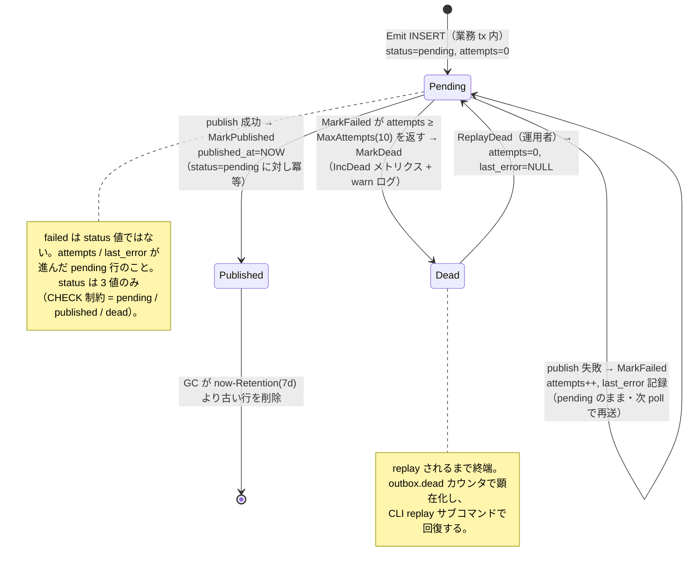
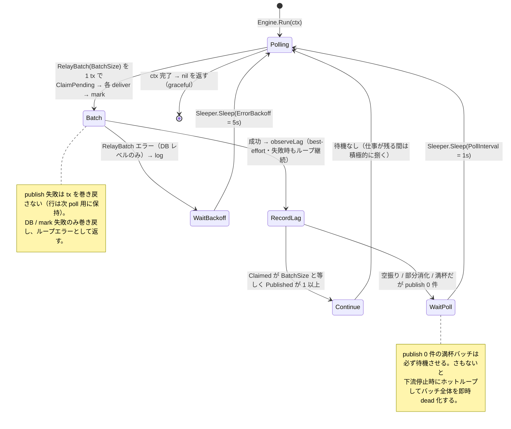
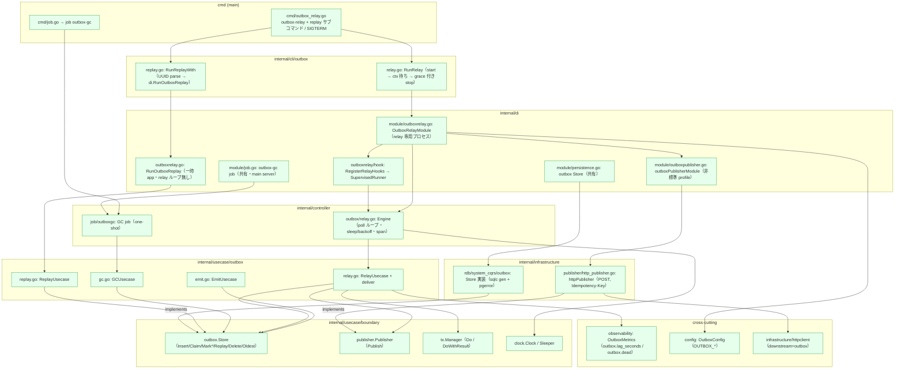
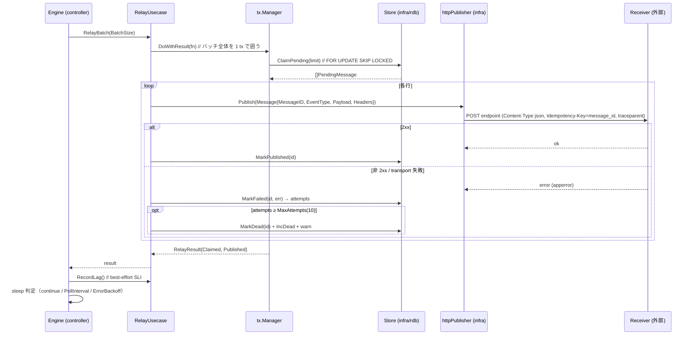
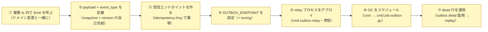

# Outbox サブシステム設計リファレンス

[Outbox Store README（日本語）](../../../internal/usecase/boundary/outbox/README.ja.md) | English: [outbox.md](../../design/outbox.md)

本書は transactional outbox サブシステムの **役割論・状態遷移・実装箇所・integrator が書く箇所・用語** を、実装を精査して 1 枚にまとめた参照資料です。各パッケージの概要は README、採用判断は outbox ADR（[ADR-0042](../adr/0042-transactional-outbox.ja.md) 以降）を参照。

---

## 1. 役割論（なにが・なんのために）

transactional outbox は **dual-write 異常の排除** のために存在します。ドメイン状態を変更し、かつ外部へ通知する必要があるとき、「DB への書き込み」と「外部エンドポイントへの publish」は別々の失敗点です。commit 後に publish すれば lost し、commit 前に publish すれば phantom になる。outbox は「publish する意図」を **ドメイン変更と同一 DB トランザクション** に畳み込み（outbox 行を 1 行 INSERT）、その後に別の **relay** が **at-least-once** で非同期送出します。

サブシステムは、決して同じ呼吸で走らない 2 つの半身に分かれます。

- **emit** — 同期。呼び出し側の業務 tx 内。イベントを 1 行として記録する。
- **relay / gc / replay** — 非同期。専用の常駐プロセス内。行を捌き・刈り・回復する。

責務分担（誰がなにを持つか）:

| コンポーネント | 層 | 責務 | 持たないもの |
| --- | --- | --- | --- |
| **EmitUsecase**（`emit.go`） | usecase | 呼び出し側 tx 内で 1 行 INSERT、`traceparent` を headers へ capture | tx 制御（呼び出し側が持つ）・送出 |
| **RelayUsecase**（`relay.go`） | usecase | バッチ単位で claim → publish → mark（`published` / attempts++ / `dead`）を 1 tx で・lag 記録 | ループ周期・broker 詳細 |
| **GCUsecase** / **ReplayUsecase**（`gc.go` / `replay.go`） | usecase | 古い `published` 行の剪定 / `dead` 行を `pending` へ戻す | スケジューリング・CLI パース |
| **Store** / **Publisher** / **tx.Manager** | usecase/boundary | seam: 永続化ポート / 送出ポート / トランザクションポート | 実装 |
| **Engine**（`controller/outbox/relay.go`） | controller | poll ループの統括: 周期・sleep/backoff・ctx 完了での drain・span | claim/publish/mark の業務（usecase へ委譲） |
| **outbox-gc job**（`controller/job/outboxgc`） | controller | 外部スケジューラ向けの one-shot GC 入口 | ループ自体（daemon ではなく cron） |
| **httpPublisher**（`infrastructure/publisher`） | infrastructure | `Publisher` の HTTP 実装: POST + `Idempotency-Key` + 非標準 client profile | retry（poll ループが retry 本体） |
| **outbox store**（`infrastructure/rdb/system_cqrs/outbox`） | infrastructure | sqlc gen + `pgerror.NormalizeError` 上の `Store` 実装 | 業務判断 |
| **DI / cli / cmd** | di / cli / cmd(main) | relay プロセスの合成 / サブコマンド / ライフサイクル | 業務ロジック |
| **OutboxConfig** | config | relay チューニング（`OUTBOX_*`） | broker/endpoint の内部 |

設計上の不変条件:

- **dual-write 回避**: `Emit` はドメイン変更と同じ `tx.Manager.Do` の **中で** 呼ばれるため、業務 tx が巻き戻れば outbox 行も破棄される — lost も phantom も起きない。
- **at-least-once / retry-by-poll**: publish 失敗は巻き戻さない。行は `pending` のまま `attempts++` され、*次 poll が retry 本体*。よって transport 層 retry は二重化を避けるため無効（`MaxAttempts=1`、D10）。
- **多インスタンス安全**: `ClaimPending` は `FOR UPDATE SKIP LOCKED` を用い、claim→publish→mark 全体を 1 tx で回すため、行ロックは送出が確定するまで保持される — 2 つの relay が同一行を publish しない。
- **受信側冪等**: 各行は INSERT 時採番の安定 `message_id` を持ち、HTTP `Idempotency-Key` として伝搬。送出側 at-least-once を受信側 dedup で実効 exactly-once 化する。
- **trace 継続**: `Emit` は現在 span の `traceparent` を `headers` へ capture し、publisher が再生するため受信側が起点 trace に繋がる。

---

## 2. 状態遷移

### 2.1 outbox 行ライフサイクル（`status` 列: `pending` / `published` / `dead`）

### 2.2 relay poll ループ（`Engine.Run` + `RelayUsecase.RelayBatch`）

---

## 3. 実装箇所（アーキテクチャ上のどこに在り、どう働くか）

### 3.1 パッケージ配置と依存方向

> 緑 = サブシステムが提供。依存は内向き: `controller`/`infrastructure` → `usecase`/`boundary`、逆は無い。relay の非標準 HTTP profile（`MaxAttempts=1`・`PropagateTrace=false`・`AllowPrivateNetwork=false`）は `outboxPublisherModule` が寄与し、これは **`OutboxRelayModule` の中に入れ子** にしてあるため他プロセスへ漏れない。

### 3.2 バッチ単位のアクション列（relay プロセス）

---

## 4. integrator が書く箇所（サブシステムが提供しない部分）

サブシステムは **機構一式** を同梱します: emit/relay/gc/replay の各 usecase、RDB `Store`、HTTP `Publisher`、relay `Engine`、GC job、DI 結線、`outbox-relay` / `replay` / `job outbox-gc` の各入口。既定ではイベントは流れません — integrator が両端（生産する呼び出しと消費するエンドポイント）を結線し、プロセスを運用します。

| # | 必要な実装 | 箇所 / やり方 | 参照 |
| --- | --- | --- | --- |
| ① | ドメイン書き込みと同じ `tx.Manager.Do` の中で `EmitUsecase.Emit` を呼ぶ | 集約を変更する usecase | `emit.go` `EmitInput` |
| ② | `EventType`（`+version`）を選び、**自己完結 snapshot** payload を marshal。`Headers` に `Authorization`/`Cookie` を入れない（そのまま外部送出される） | `Emit` の呼び出し側 | `EmitInput.Payload` / `.Headers` doc |
| ③ | **`Idempotency-Key`（= `message_id`）で dedup** し、永続受理時のみ 2xx を返す受信エンドポイント | 外部サービス | `httpPublisher.Publish` |
| ④ | `OUTBOX_ENDPOINT`（必須。空/不正 URL は relay が起動拒否）+ 任意の `OUTBOX_POLL_INTERVAL` / `OUTBOX_ERROR_BACKOFF` / `OUTBOX_BATCH_SIZE` | `env/` & IaC | `OutboxConfig` 既定値 |
| ⑤ | `cmd outbox-relay` を常駐プロセスとして起動（SIGTERM まで常駐・stop で drain） | デプロイ / IaC | `cmd/outbox_relay.go` |
| ⑥ | `cmd job outbox-gc [--batch-size=N]` をスケジュール（k8s CronJob / cron）し retention 超過の `published` 行を剪定 | スケジューラ | `controller/job/outboxgc` |
| ⑦ | `outbox.dead` カウンタ / `outbox.lag_seconds` ゲージで alert し `outbox-relay replay [--message-id=<uuid>]` で回復 | runbook | `cmd outbox-relay replay` |

> relay・GC・replay は共有 infra 結線を再利用し、非標準 HTTP publisher profile を持つのは常駐 relay プロセスだけ。GC job は main server の job group に在るため `cmd job outbox-gc` は同一バイナリから使える — 単独では走らない。

---

## 5. 用語

| 用語 | 意味 |
| --- | --- |
| **transactional outbox** | 「publish する意図」をドメイン変更と同一 tx の DB 行として記録し、非同期に送出するパターン。dual-write 異常を回避する。 |
| **emit** | 同期側の半身: `EmitUsecase.Emit` が呼び出し側の業務 tx 内で 1 行 INSERT する（`internal/usecase/outbox/emit.go`）。 |
| **relay** | 非同期側の半身: pending 行を claim・publish・mark する常駐 `Engine` poll ループ（`controller/outbox` + `usecase/outbox/relay.go`）。 |
| **Store** | outbox テーブルの永続化ポート（`usecase/boundary/outbox`）。`infrastructure/rdb/system_cqrs/outbox` で sqlc gen 上に実装。 |
| **Publisher** | 送出ポート（`usecase/boundary/publisher`）。HTTP 実装が `OUTBOX_ENDPOINT` へ POST する。 |
| **status** | 行のライフサイクル列 — 厳密に `pending` / `published` / `dead`（CHECK 制約）。`failed` という status は無く、publish 失敗は `pending` のまま。 |
| **attempts / last_error** | publish 試行回数と直近失敗理由。`MarkFailed` が両方を進める。`attempts ≥ MaxAttempts` まで行は `pending`。 |
| **MaxAttempts** | 行を `dead` にするまでの publish 試行回数（`DefaultMaxAttempts = 10`）。 |
| **dead** | `MaxAttempts` を使い切った行。運用者が replay するまで終端。`outbox.dead` で計上。 |
| **replay** | `dead` 行を `pending` へ戻す（`attempts=0`・`last_error=NULL`）。`ReplayUsecase` / `outbox-relay replay [--message-id]`。 |
| **GC（SweepPublished）** | `Retention`（`DefaultRetention = 7d`）より古い `published` 行を `DefaultGCBatchSize = 10000` 件ずつ削除。`cmd job outbox-gc` で実行。 |
| **message_id** | 行ごとの安定 UUID（INSERT 時採番）。受信側 dedup 用に HTTP `Idempotency-Key` として伝搬。 |
| **traceparent** | W3C trace context。emit 時に `headers` へ capture し publisher が再生するため、受信側が起点 trace に繋がる。 |
| **FOR UPDATE SKIP LOCKED** | 多インスタンス relay を安全にする claim 機構 — ロック中の行は保持 tx が確定するまで他インスタンスがスキップする。 |
| **retry-by-poll** | relay の at-least-once 機構: publish 失敗は `pending` のまま残し、次 poll で再送する。二重化回避のため transport retry は無効（`MaxAttempts=1`、D10）。 |
| **PollInterval / ErrorBackoff** | 進捗なし poll の後の待機（`OUTBOX_POLL_INTERVAL = 1s`）/ DB レベルの `RelayBatch` エラー後の待機（`OUTBOX_ERROR_BACKOFF = 5s`）。満杯だが publish 0 件のバッチは必ず待機させる。 |
| **BatchSize** | 1 poll で claim する行数（`OUTBOX_BATCH_SIZE = 100`。≤ 0 なら `DefaultBatchSize = 100` へ clamp）。 |
| **outbox.lag_seconds / outbox.dead** | サブシステム固有 SLI（meter `go-boilerplate/outbox`）: 最古 pending 行の経過秒数 / dead 化した行数。publish の latency/error は `httpclient` downstream=`outbox` 計装が賄う。 |
| **SupervisedRunner** | relay ループを OnStart で起動し OnStop で cancel + drain するライフサイクルヘルパ（`di/lifecycle`）。 |
| **OutboxRelayModule** | relay 専用プロセスの fx module。`outboxPublisherModule` を入れ子にして非標準 HTTP profile が他へ漏れないようにする。 |
