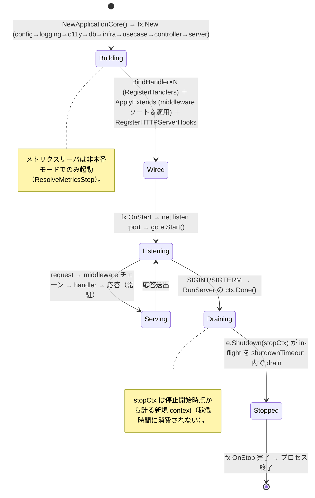
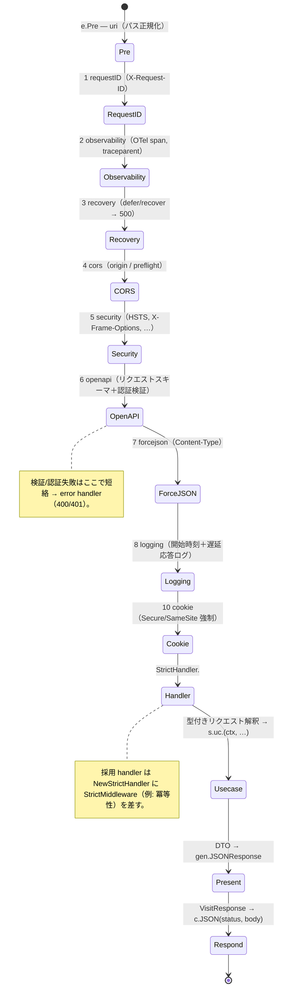
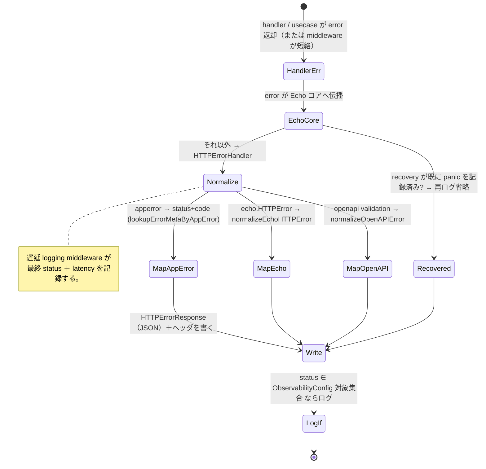
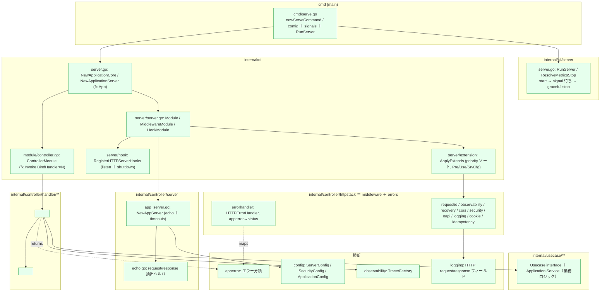
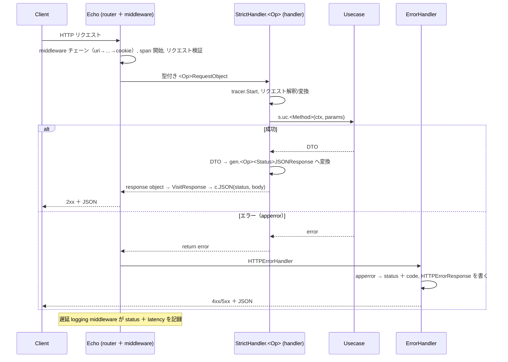
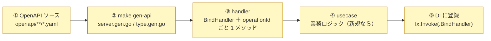

# REST サブシステム設計リファレンス

[Controller README（日本語）](../../../internal/controller/README.ja.md) | English: [rest.md](../../design/rest.md)

本書は REST（HTTP）scaffold の **役割論・状態遷移・実装箇所・integrator が書く箇所・用語** を、実装を精査して 1 枚にまとめた参照資料です。handler 実装の詳細は [handler README（日本語）](../../../internal/controller/handler/README.ja.md)、非同期 / CLI の兄弟は [worker.ja.md](worker.ja.md)・[job.ja.md](job.ja.md) を参照。

---

## 1. 役割論（なにが・なんのために）

REST は **「request-in driving adapter」、Usecase 層への同期 HTTP 入口**であり、worker（message-in）・job（command-in）が手本とした元祖の同格。Echo サーバが transport、handler は HTTP I/O を usecase 呼び出しへ橋渡しする薄いテンプレート。**業務ロジックはすべて usecase 層に留まる**——handler は bind し、usecase を 1 メソッド呼び、応答を整形するだけ。

責務の分担（誰が何を持つか）:

| 構成要素 | 層 | 責務 | 持たないもの |
| --- | --- | --- | --- |
| **Echo サーバ**（`server.NewAppServer`） | controller | TCP リスナ / read·write·idle タイムアウト / 生成 `RegisterHandlers` によるルート表 | 業務ロジック・middleware 方針 |
| **middleware チェーン**（`httpstack/*`） | controller | 固定順の横断関心事：uri(pre) → requestID → observability → recovery → cors → security → openapi → forcejson → logging → cookie | 業務ロジック |
| **handler**（`controller/handler/**`） | controller | 型付きリクエスト解釈（`StrictHandler`）→ usecase を**1 メソッド**呼ぶ → DTO → `gen` 応答へ変換 | 業務ロジック・永続化・tx |
| **error handler**（`httpstack/errorhandler`） | controller | `apperror` / Echo / OpenAPI エラー → HTTP ステータス＋コード、統一エラーボディ | 業務方針 |
| **usecase** | usecase | **すべての**業務ロジック・トランザクション境界・ドメインオーケストレーション・エラー方針 | HTTP・フレームワーク・表現 |
| **DI server ＋ hook**（`di/server`） | di | Echo ＋ 順序付き middleware（priority）＋ lifecycle（listen / graceful shutdown）の合成 | 業務ロジック |
| **ServerConfig** | config | host / port / read-header·read·write·idle タイムアウト | 業務ロジック |

設計原則（不変）:

- **Contract-first。** ルート・リクエスト・レスポンス型は OpenAPI から生成（`make gen-api`）し、handler は生成された `StrictServerInterface` を実装する。handler・usecase は契約に先行してはならない。
- **薄い handler。** handler はテンプレート（bind → usecase → present）で、業務ロジックを持たず **infrastructure を import しない**（depguard `maintain_a_sound_controller`）。
- **priority による順序付き middleware。** 各 middleware は `*_di.go` に整数 priority を宣言し、extension エンジンが `Pre`/`Use` を決定的にソート・適用する。チェーン順は呼び出し位置ではなくデータ。

---

## 2. 状態遷移図

### 2.1 サーバライフサイクル（`cli/server.RunServer` ＋ fx ＋ signal）

### 2.2 リクエスト 1 件の流れ（middleware 順 → handler → usecase → present）

### 2.3 エラー経路（`apperror` → HTTP）

---

## 3. 実装箇所（このアーキテクチャ上のどこに・どう作用するか）

### 3.1 パッケージ配置と依存方向

> 依存方向は内向き（`controller→usecase`）。handler は自身の生成 `gen` パッケージと usecase interface のみに依存し、infrastructure を import しない。middleware 順序は DI extension エンジンが所有し、handler は持たない。

### 3.2 リクエスト 1 件の作用シーケンス

---

## 4. integrator が実装する箇所（contract-first のエンドポイント手順）

scaffold は **サーバ起動・順序付き middleware チェーン・error handler・DI 配線・`scaffold-*` スキル**を提供する。エンドポイント追加は contract-first 順（OpenAPI 変更が handler/usecase コードに先行する）に従う。

| # | 必要な実装 | 置き場 | 参考 |
| --- | --- | --- | --- |
| ① | OpenAPI ソースにパス / operation / スキーマを定義し再 bundle | `openapi/**/*.yaml` → `openapi/openapi.gen.yaml` | 既存パス |
| ② | サーバ interface ＋ 型を再生成 | `make gen-api` → `internal/controller/handler/<path>/gen/` | — |
| ③ | `BindHandler(echo, tracerFactory, usecase, …)` ＋ `operationId` ごと 1 メソッド（tracer span → 解釈 → usecase → 応答）を実装 | `internal/controller/handler/<path>/*_handler.go` | `scaffold-controller`, `v1/users` |
| ④ | usecase メソッドを実装（無ければ）、domain → DTO へ写像 | `internal/usecase/<feature>/` | `scaffold-usecase` |
| ⑤ | handler を配線：`fx.Invoke(<pkg>.BindHandler)` | `internal/di/module/controller.go` | 既存の invoke |

> `scaffold-endpoint` オーケストレータ（または各層の `scaffold-*` スキル）で spec から domain → infra → usecase → controller を生成できる。新しい横断 middleware は `internal/di/server/extension/` 配下に priority 定数付きの `*_di.go` として追加すると、エンジンがチェーンへソートして組み込む。

---

## 5. 用語集

| 用語 | 意味 |
| --- | --- |
| **driving adapter** | usecase 層を駆動する入口。REST（HTTP）が同期、[worker](worker.ja.md)（キュー）・[job](job.ja.md)（CLI）が兄弟。 |
| **Echo** | HTTP フレームワーク。`server.NewAppServer(ServerConfig)` が timeouts 付きの `*echo.Echo` を構築し、ルートは生成コードが登録。 |
| **ServerInterface / StrictServerInterface** | OpenAPI 生成のルート interface / その強型（request-object, response-object）版。handler は strict 版を実装。 |
| **RegisterHandlers / NewStrictHandler** | 生成関数：Echo にルート登録 / strict handler を `StrictMiddlewareFunc` スライス（例: 冪等性）で包む。 |
| **BindHandler** | handler パッケージのコンストラクタ：`server{}`（tracer ＋ usecase）を作り `RegisterHandlers(e, NewStrictHandler(...))` を呼ぶ。`fx.Invoke` で配線。 |
| **handler / `server{}`** | `operationId` ごと 1 メソッドの薄い controller 型：tracer span → リクエスト解釈 → usecase 1 メソッド → DTO → `gen` 応答へ変換。 |
| **presenter** | DTO → `gen.<Op><Status>JSONResponse` 変換。handler メソッド内にインラインで実装。 |
| **middleware (Use) / Pre** | priority 順に適用される per-request 横断関数（`Use`）と、ルーティング前に走る `Pre`（パス正規化）。 |
| **priority** | 各 middleware の `*_di.go` の整数で extension エンジンがソート（uri-pre 1; requestID 1, observability 2, recovery 3, cors 4, security 5, openapi 6, forcejson 7, logging 8, cookie 10）。 |
| **extension エンジン**（`ApplyExtends`） | `Pre`/`Use`/`SrvCfg` provider を集約し priority でソートして Echo に適用。非 middleware の構成器（IP extractor, error handler）も適用。 |
| **error handler** | Echo に設定する `HTTPErrorHandler`。`apperror` / `echo.HTTPError` / OpenAPI 検証エラーを統一 `HTTPErrorResponse`（status ＋ code 写像付き）へ正規化。 |
| **apperror** | フレームワーク非依存のエラー分類。error handler が HTTP ステータスへ写像（例 `ErrConflict`→409, `ErrValidation`→422, `ErrInvalidArgument`→400）。 |
| **graceful shutdown** | SIGINT/SIGTERM で `RunServer` が受付停止し `e.Shutdown(stopCtx)` で in-flight を `shutdownTimeout` 内に drain（停止開始時点から計る）。 |
| **lifecycle / Registrar** | fx フックの seam：`RegisterHTTPServerHooks` が OnStart（listen ＋ serve）と OnStop（shutdown）を登録。 |
| **ServerConfig** | host / port / read-header / read / write / idle タイムアウト（`SERVER_*`）。`NewAppServer` に注入。 |
| **冪等性 middleware** | 採用 handler が非冪等書き込みを安全にするために差す `StrictMiddleware` スロット。[idempotency.ja.md](idempotency.ja.md) 参照。 |
