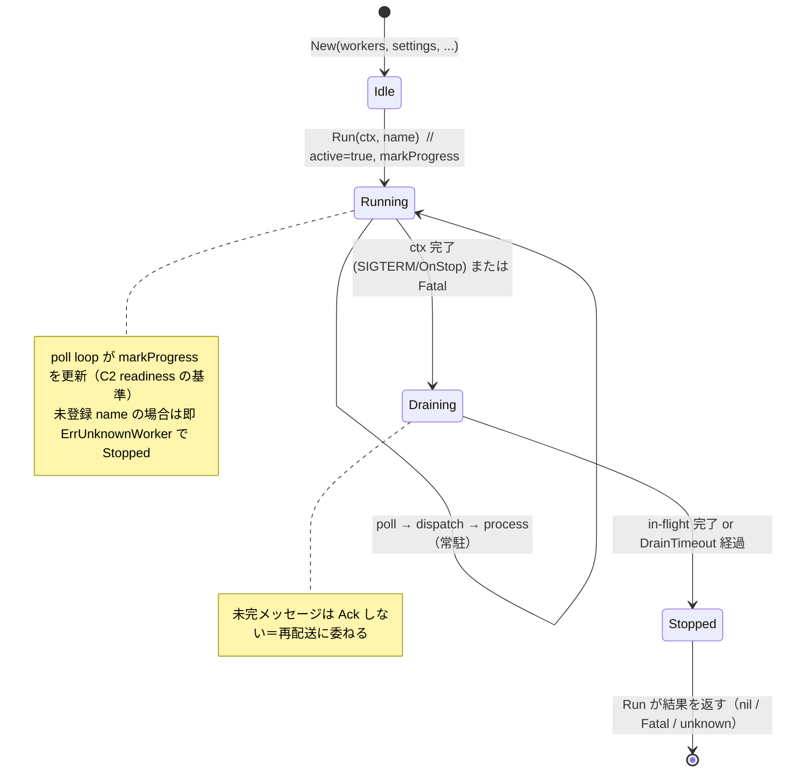
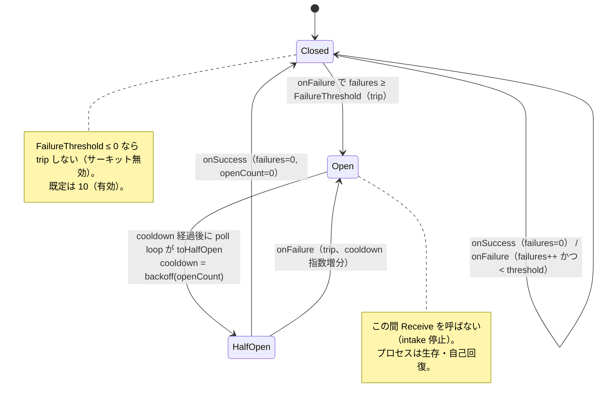
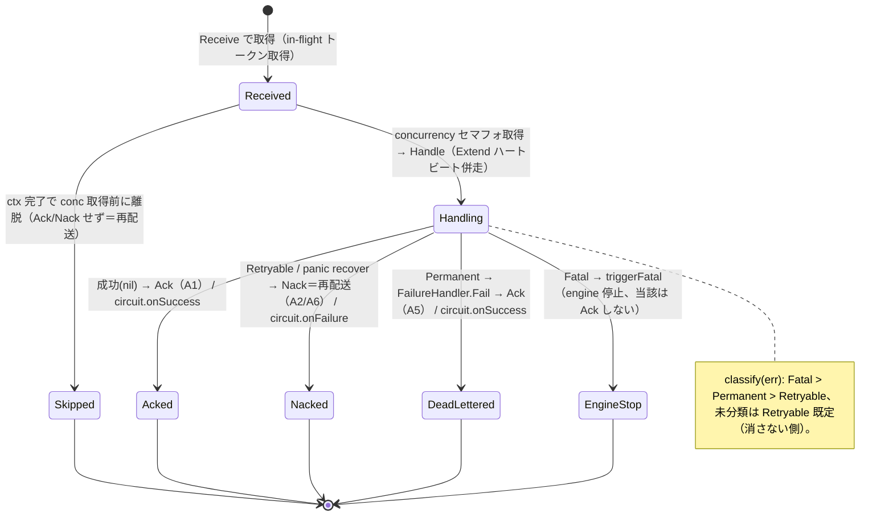
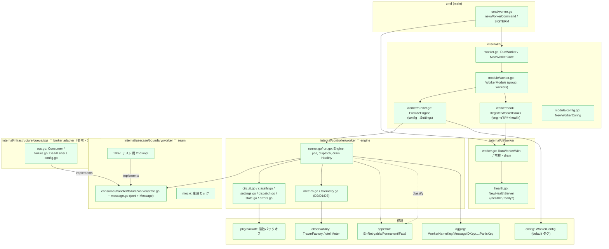
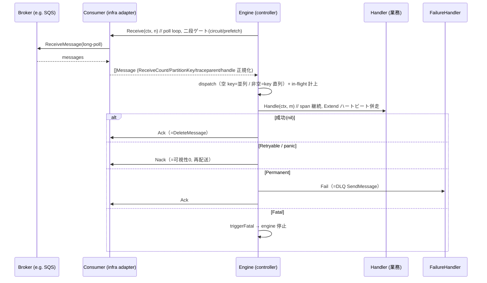
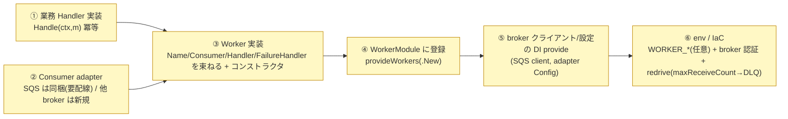

# Worker サブシステム設計リファレンス

[Worker README（日本語）](../../../internal/controller/worker/README.ja.md) | English: [worker.md](../../design/worker.md)

本書は worker scaffold の **役割論・状態遷移・実装箇所・integrator が書く箇所・用語** を、実装を精査して 1 枚にまとめた参照資料です。概要は README、採用判断は worker ADR（[ADR-0047](../adr/0047-broker-agnostic-worker-scaffold.ja.md) 以降）を参照。

---

## 1. 役割論（なにが・なんのために）

worker は **HTTP handler と同格の「message-in driving adapter」**。新しいアーキテクチャ層ではなく、**キュー経由で Usecase 層に入るもう 1 つの入口**。HTTP が「同期リクエストを受ける口」なら worker は「pull-ack キューからメッセージを受ける口」。

責務の分担（誰が何を持つか）:

| 構成要素 | 層 | 責務 | 持たないもの |
| --- | --- | --- | --- |
| **engine**（`Engine`） | controller | transport のオーケストレーション：poll / 並列・順序制御 / Ack-Nack 規律 / サーキット / drain / O11Y | 業務ロジック・broker 固有知識 |
| **seam**（`Consumer`/`Handler`/`FailureHandler`/`Worker`/`State`） | usecase/boundary | engine と外界（broker adapter・業務）の契約 | 実装 |
| **Handler**（業務処理） | integrator が実装（usecase を呼ぶ） | メッセージ 1 件の業務処理（**冪等**） | ack/nack/再送制御（engine の責務） |
| **Consumer / FailureHandler**（broker adapter） | infrastructure | broker 固有 API ↔ broker 非依存 `Message` の変換 | 業務ロジック・並行制御 |
| **DI / cli / cmd** | di / cli / cmd(main) | 合成・サブコマンド・lifecycle・health listener | 業務ロジック |
| **WorkerConfig** | config | engine-core の設定（broker 非依存） | broker 固有設定（adapter 側） |

設計原則（不変）: **engine は seam のみに依存し broker 実装を import しない**（depguard で機械担保）。これにより engine は **fake に対して完成**し、実 broker 無しで全不変条件をテストできる。

---

## 2. 状態遷移図

### 2.1 engine ライフサイクル（`Engine.Run` / `run.loop` / `run.drain`）

### 2.2 サーキットブレーカ（`circuit.go`、B4）

- **信号**: `onFailure` = handler の Retryable 失敗 ＋ poll エラー / `onSuccess` = handler 成功 ＋ Permanent 退避完了。
- AIMD は不採用。cooldown は `pkg/backoff` の指数バックオフ（既定 1s→30s 上限）。

### 2.3 メッセージ処理（`run.process` / `run.handleResult`、A1/A2/A5/A6）

---

## 3. 実装箇所（このアーキテクチャ上のどこに・どう作用するか）

### 3.1 パッケージ配置と依存方向

> 緑＝本プロジェクトの実装済み。依存方向は常に内向き（`controller→usecase/boundary`、`infrastructure→usecase/boundary`）。`controller`(engine) は `infrastructure` を import しない（depguard `maintain_a_sound_controller`）。

### 3.2 メッセージ 1 件の作用シーケンス（実 broker 配線時）

---

## 4. integrator が実装する箇所（本プロジェクトが用意しない部分）

本プロジェクトは **engine・seam・fake・SQS 参考 adapter・配線雛形** を提供する。実際に 1 つの worker を本番で動かすには、利用側が次を用意する（既定では登録 worker 0 件）。

| # | 必要な実装 | 置き場（推奨） | 参考 |
| --- | --- | --- | --- |
| ① | 業務 `Handler`（冪等、usecase を呼ぶ） | `internal/controller/worker/<name>/` | `worker.Handler` IF |
| ② | `Consumer`(+`FailureHandler`) adapter | SQS は `infrastructure/queue/sqs` を配線 / 他は新規 package | `sqs.NewConsumer` / `NewDeadLetter` |
| ③ | `Worker`（Name/Consumer/Handler/FailureHandler を返す）+ `New(...)` | `internal/controller/worker/<name>/` | `worker.Worker` IF |
| ④ | `WorkerModule()` の `provideWorkers(...)` に コンストラクタ追加 | `internal/di/module/worker.go` | `provideJobs` と同形 |
| ⑤ | broker クライアント・adapter `Config` の `fx.Provide` | `internal/di/...` | `sqs.Config` |
| ⑥ | env（`WORKER_*` は既定あり・上書き任意）／broker 認証／DLQ・redrive(IaC) | `env/` ・IaC | `CONSUMER_QUEUE_*` / `WorkerConfig` 既定 |

> `CONSUMER_QUEUE_*` が指すのは *the* consumer キューではなく *a* consumer キューであり、同梱する 1 つの worker に合わせた大きさになっている。別のキューを消費する 2 つ目の worker には、worker 名を含む独自の接頭辞（`<WORKER_NAME>_QUEUE_*`）を与えること。既存のものを兼用しない。`WORKER_*` は engine-core 設定でありプロセス単位・broker 非依存なので共有のままでよい。

<!-- sample-api:begin -->
> ①〜⑥ すべての実例が、削除可能なサンプル群の一部として同梱されている。`internal/controller/worker/withdrawalarchive` が outbox の emit する退会イベントを消費し、オブジェクトストレージへ証跡を書き出す。`make setup-remove-sample-api` はそれを削除し、`provideWorkers()` を再び空へ戻す。
<!-- sample-api:end -->

> ブローカー adapter を配線すると、その SDK はバイナリに入る。`serve` / `worker` / `outbox-relay` は同一バイナリのため、リンクをキューを消費する役割へ絞ることはできない。したがって分離は**結合**で定義する。具体的なブローカーを名指すのは、その adapter のパッケージと、それを選ぶ配線だけである（E3、[ADR-0050](../adr/0050-broker-sdk-isolation-measured-as-coupling.ja.md)）。

---

## 5. 用語集

| 用語 | 意味 |
| --- | --- |
| **seam** | engine と外界（broker adapter・業務 Handler）の境界となる port 群。`internal/usecase/boundary/worker`。 |
| **port** | seam を構成する interface：`Consumer` / `Handler` / `FailureHandler` / `Worker` / `State`。 |
| **Message** | broker 非依存のメッセージ封筒（`ID`/`Body`/`Attributes`/`ReceiveCount`/`PartitionKey`）。 |
| **PartitionKey** | 同一 key を直列化する正規化キー（空＝並列）。adapter が broker 値（SQS の MessageGroupId 等）を詰める。 |
| **ReceiveCount** | 再配送回数。poison 検出（A7）に使用。 |
| **予約キー（`_receipt_handle`）** | broker 固有の handle/lease を `Attributes` に隔離する `_` 接頭辞のキー。engine は解釈せず素通し。 |
| **`event_type` 属性** | adapter がイベント種別を載せる `Attributes` のキー。`Handler` が本文を復元する前に、そのメッセージが自分宛かを判断できるようにする。サンプル固有ではなく seam の恒久的な語彙 — 1 つのキューに複数種別が流れるのは pull-ack モデルの性質であって同梱例の都合ではないため、seam の他の要素と同じく `make setup-remove-sample-api` の後も残る。 |
| **engine** | 選択された worker を pull-ack で実行する driving adapter（`controller/worker.Engine`）。 |
| **poll loop** | `Receive` を回す単一 goroutine。circuit と prefetch の二段ゲートを持つ。 |
| **dispatch** | 受信メッセージを処理単位へ振り分ける。空 key＝並列、非空＝per-key 直列。 |
| **in-flight / prefetch（`MaxInFlight`）** | 受信済み・未確定（Ack/Nack 前）の上限。捌ける以上に Receive しない（B2）。 |
| **concurrency（`Concurrency`）** | 同時に `Handle` を実行する上限（B1）。 |
| **circuit breaker** | 下流失敗継続時に intake を止める 3 状態機械（Closed/Open/HalfOpen、B4）。 |
| **cooldown** | Open でいる時間。`pkg/backoff` の指数バックオフで trip ごとに伸長。 |
| **Ack / Nack / Extend** | 確定削除 / 再配送へ戻す / lease（可視性）延長。Consumer port のメソッド。 |
| **Retryable / Permanent / Fatal** | エラー分類 sentinel（`apperror`）。Nack 再配送 / FailureHandler 退避→Ack / engine 停止。 |
| **FailureHandler / DeadLetter / DLQ** | 永久失敗の退避 seam / その SQS 実装 / dead-letter queue。 |
| **redrive** | SQS が `maxReceiveCount` 超で自動的に DLQ へ送る IaC 設定。app の一般経路は FailureHandler。 |
| **drain（`DrainTimeout`）** | 停止時に in-flight を期限まで待つ。未完は Ack しない＝再配送。 |
| **readiness / liveness / health listener** | `/readyz`（`Healthy()`＝進捗が `ProgressStaleAfter` 内）/ `/healthz` を出す plain net/http。 |
| **Settings** | engine-core の挙動設定（engine-local struct）。`config.WorkerConfig` から DI でマッピング。 |
| **WorkerConfig** | engine-core 設定（broker 非依存、`WORKER_*`・`default` タグ付き）。broker 固有は adapter `Config`。 |
| **traceparent / 継続** | W3C trace context。`Message.Attributes` から `Extract` して span を継続（D1）。 |
| **E1/E2/E3** | engine が infra を import しない / fake のみで engine green / 具体的なブローカーの知識が、その adapter のパッケージとそれを選ぶ配線だけに閉じている（core の `*.go` も core のドキュメントも broker adapter を名指さない。[ADR-0050](../adr/0050-broker-sdk-isolation-measured-as-coupling.ja.md)）。 |
