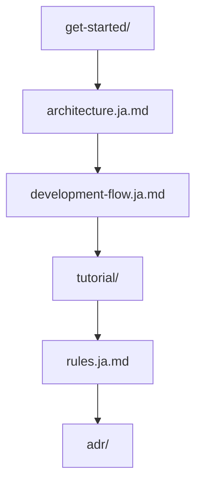
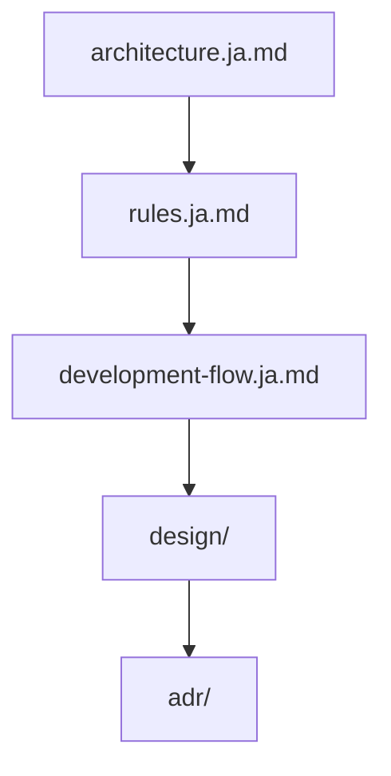
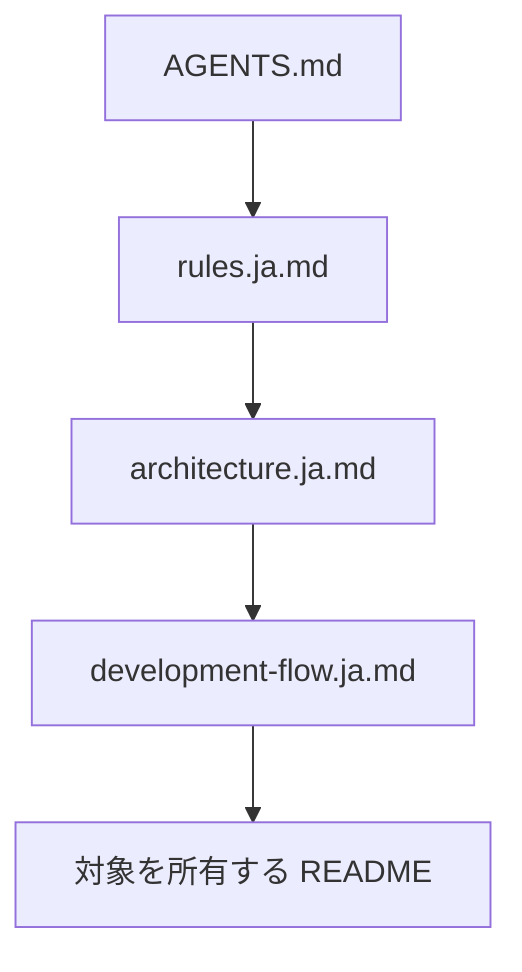
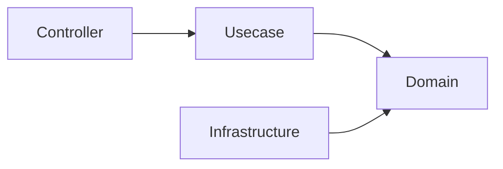
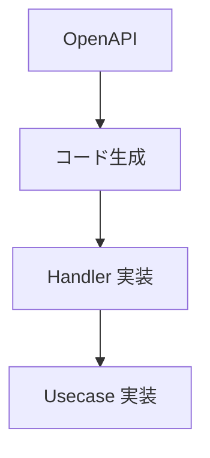
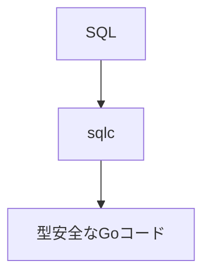
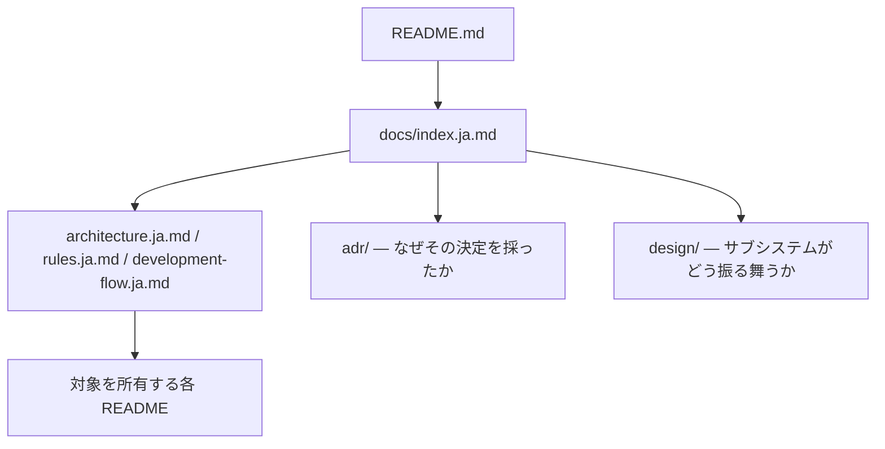

# ドキュメント

[English](../index.md) | 日本語

このディレクトリには、このプロジェクトのアーキテクチャおよび開発に関するドキュメントが含まれています。

これらのドキュメントでは、このプロジェクトで採用されている **設計思想、アーキテクチャルール、開発フロー** を説明しています。

ドキュメントは **人間の開発者** と **AIエージェント** の両方を対象としています。

## ドキュメント一覧

### ルート直下のドキュメント

|ドキュメント|説明|
|--------|--------|
|[architecture.ja.md](architecture.ja.md)|システム全体のアーキテクチャとレイヤ責務|
|[rules.ja.md](rules.ja.md)|破ってはいけないアーキテクチャルール|
|[development-flow.ja.md](development-flow.ja.md)|標準的な開発フロー|
|[testing-conventions.ja.md](testing-conventions.ja.md)|テストの構造・命名・アサーション・カバレッジ例外|
|[decisions.ja.md](decisions.ja.md)|リダイレクトのみ — 決定ログは `adr/` へ移動済み|

### セクション

|セクション|説明|
|--------|--------|
|[adr/](adr/README.ja.md)|アーキテクチャ決定記録（ADR）— 1 決定 1 レコード。技術選定の根拠|
|[design/](design/README.ja.md)|サブシステム設計リファレンス — rest / worker / job / outbox / idempotency / observability / auth / security / context-map / agent-environment|
|[get-started/](get-started/setup-repository.ja.md)|開発を始める前に一度だけ行うセットアップ|
|[tutorial/](tutorial/build-user-feature.ja.md)|実例 — 1 つの機能を端から端まで作る|
|[spec/](../spec/glossary.md)|機能仕様と業務語彙の用語集|
|[project/](project/scope.ja.md)|スコープ・対象外・メンテナンス方針・バージョニング|
|[reference/](reference/dependencies.ja.md)|コードに追随する目録（直接依存の一覧など）|
|[maintenance/](maintenance/docs-structure.ja.md)|運用 runbook — ドキュメント構造・ローカル環境・DB worktree プール・アップグレード|
|[deployment/](deployment/github-page.ja.md)|デプロイ手順|

正本は `docs/` 直下の英語版で、このディレクトリはその構造を写した対訳です。`spec/` は日本語で書かれた
正本なので対訳を持ちません。残る `openapi/` `godoc/` `coverage/` `db-schema/` `portal/` は読むための
ドキュメントではなく生成物です。この構造を生成可能に保つための規則は
[maintenance/docs-structure.ja.md](maintenance/docs-structure.ja.md) にあります。

## 推奨読書順

### 新しく参加する開発者

### メンテナ / コントリビューター

### AIエージェント

## 主要コンセプト

このプロジェクトは、いくつかの重要な設計原則に基づいて構築されています。

### Onion Architecture

システムは以下のレイヤ構造に従っています。

依存関係は常に **内側のレイヤへ向かう** 必要があります。

### OpenAPI-first 開発

API契約は **OpenAPI** によって定義されます。

実装は必ず契約定義に従って行われます。

### SQL-first データアクセス

データアクセスは ORM ではなく **SQLを中心に設計**されています。

### 構造的安全性（Structural Safety）

このプロジェクトでは **慣習よりも構造による安全性** を重視しています。

暗黙のルールや人のレビューに依存するのではなく、以下によって安全性を担保します。

- レイヤ分離
- コード生成
- CIチェック
- Lintルール

## AI支援開発

このプロジェクトは **AI支援開発ツールと安全に連携できるよう設計**されています。

アーキテクチャ違反を防ぐために、意図的に制約が設けられています。

AIエージェントはコード生成を行う前に、必ず以下のドキュメントを参照してください。

- [`AGENTS.md`](../../AGENTS.md) — 何に触れてよく、どう振る舞うべきかを定める運用契約
- [`rules.ja.md`](rules.ja.md)
- [`architecture.ja.md`](architecture.ja.md)
- 変更対象のコードに最も近い `README.md`

これらの指示・機械的ゲート・独立レビューがどう噛み合うかは
[design/agent-environment.ja.md](design/agent-environment.ja.md) が説明します。

## 他ドキュメントとの関係

ドキュメントの全体構造は以下の通りです。

`README.md` はプロジェクトの概要を説明し、`docs/` には詳細な設計ドキュメントが、各パッケージの
`README.md` にはそのパッケージに閉じた契約が格納されています。

## コントリビューションガイド

このプロジェクトに変更を加える場合は、以下のルールに従ってください。

1. `rules.ja.md` に定義されたアーキテクチャルールを遵守する  
2. `development-flow.ja.md` に記載された開発フローに従う  
3. `architecture.ja.md` に記載された構造と整合性を保つ  

アーキテクチャ変更が必要な場合は、関連するドキュメントも更新してください。

## このプロジェクトの思想

このプロジェクトは、バックエンド開発を **安全で保守しやすいもの** にすることを目的としています。

特定の「唯一の正しいアーキテクチャ」を強制するものではなく、  
チームが必要に応じて拡張・調整できる **構造化されたベースライン** を提供します。
