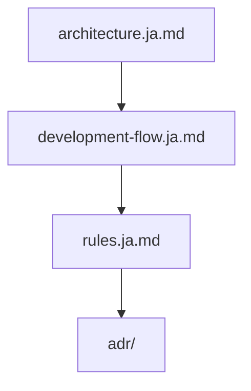
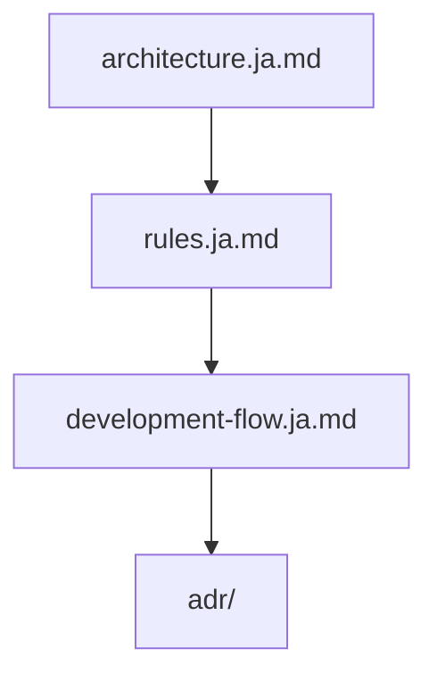
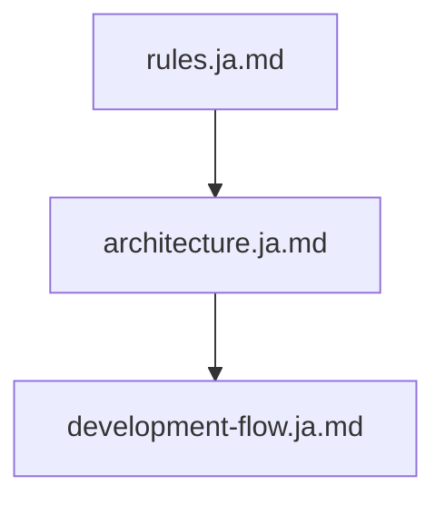
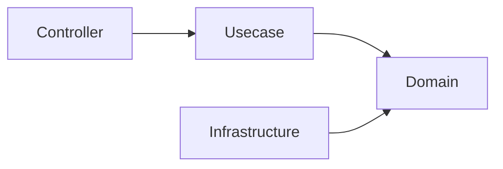
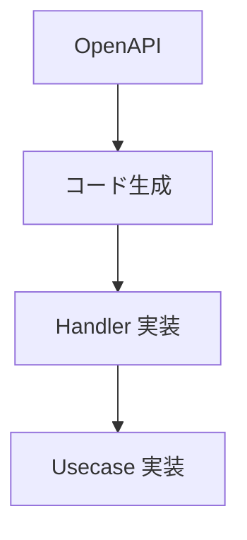
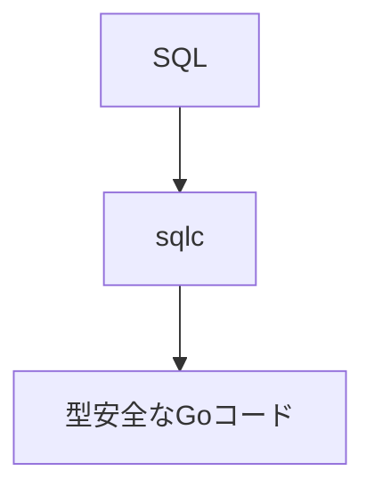
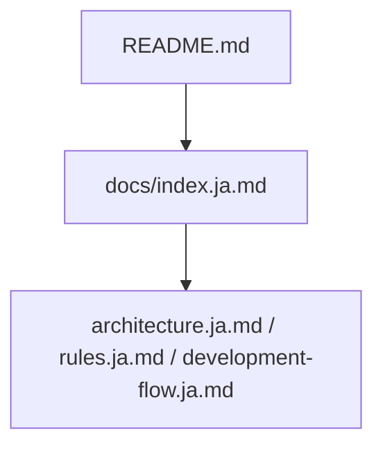

# ドキュメント

[English](../index.md) | 日本語

このディレクトリには、このプロジェクトのアーキテクチャおよび開発に関するドキュメントが含まれています。

これらのドキュメントでは、このプロジェクトで採用されている **設計思想、アーキテクチャルール、開発フロー** を説明しています。

ドキュメントは **人間の開発者** と **AIエージェント** の両方を対象としています。

## ドキュメント一覧

|ドキュメント|説明|
|--------|--------|
|[architecture.ja.md](architecture.ja.md)|システム全体のアーキテクチャとレイヤ責務|
|[rules.ja.md](rules.ja.md)|破ってはいけないアーキテクチャルール|
|[development-flow.ja.md](development-flow.ja.md)|標準的な開発フロー|
|[adr/](adr/README.ja.md)|アーキテクチャ決定記録（ADR）— 技術選定および設計判断の背景|

## 推奨読書順

### 新しく参加する開発者

### メンテナ / コントリビューター

### AIエージェント

## 主要コンセプト

このプロジェクトは、いくつかの重要な設計原則に基づいて構築されています。

### Onion Architecture

システムは以下のレイヤ構造に従っています。

依存関係は常に **内側のレイヤへ向かう** 必要があります。

### OpenAPI-first 開発

API契約は **OpenAPI** によって定義されます。

実装は必ず契約定義に従って行われます。

### SQL-first データアクセス

データアクセスは ORM ではなく **SQLを中心に設計**されています。

### 構造的安全性（Structural Safety）

このプロジェクトでは **慣習よりも構造による安全性** を重視しています。

暗黙のルールや人のレビューに依存するのではなく、以下によって安全性を担保します。

- レイヤ分離
- コード生成
- CIチェック
- Lintルール

## AI支援開発

このプロジェクトは **AI支援開発ツールと安全に連携できるよう設計**されています。

アーキテクチャ違反を防ぐために、意図的に制約が設けられています。

AIエージェントはコード生成を行う前に、必ず以下のドキュメントを参照してください。

- `rules.ja.md`
- `architecture.ja.md`

## 他ドキュメントとの関係

ドキュメントの全体構造は以下の通りです。

`README.md` はプロジェクトの概要を説明し、  
`docs/` ディレクトリには詳細な設計ドキュメントが格納されています。

## コントリビューションガイド

このプロジェクトに変更を加える場合は、以下のルールに従ってください。

1. `rules.ja.md` に定義されたアーキテクチャルールを遵守する  
2. `development-flow.ja.md` に記載された開発フローに従う  
3. `architecture.ja.md` に記載された構造と整合性を保つ  

アーキテクチャ変更が必要な場合は、関連するドキュメントも更新してください。

## このプロジェクトの思想

このプロジェクトは **安全で保守しやすいバックエンドの出発点** を提供することを目的としています。

特定の「唯一の正しいアーキテクチャ」を強制するものではなく、  
チームが必要に応じて拡張・調整できる **構造化されたベースライン** を提供します。
