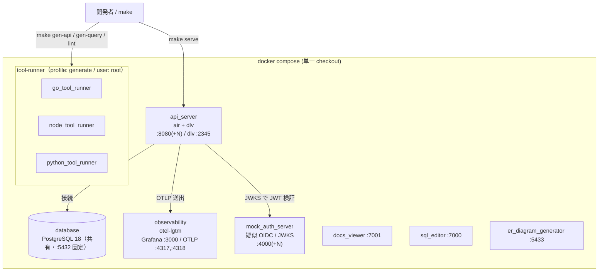
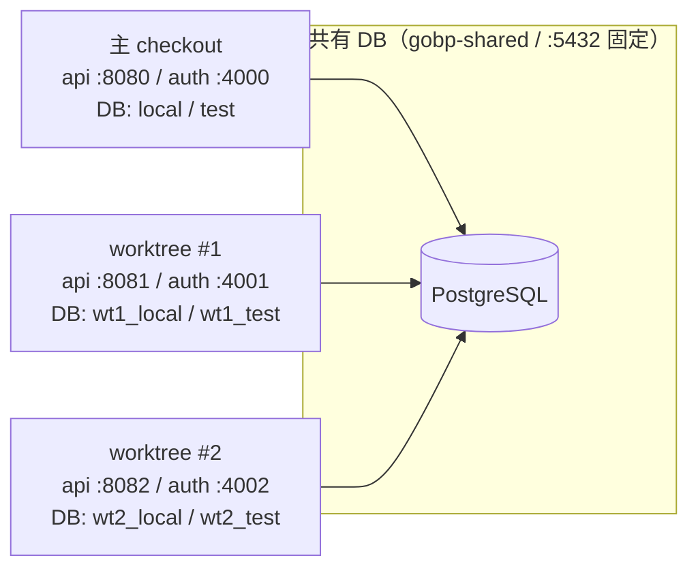

# Local Development Environment

English: [local-environment.md](../../maintenance/local-environment.md)

ローカル開発を構成する **Docker コンテナ群・ホットリロード（air）・コード生成 runner・
`make serve` の worktree スロットリング** を 1 枚で俯瞰するための地図。各要素の詳細は
既存の正本ドキュメントへリンクするに留め、ここでは**全体像と役割分担**だけを示す（重複再掲を避け、
ドリフトを防ぐ）。

- make ターゲットの一覧 → [`.makefiles/README.md`](../../../.makefiles/README.md)
- 生成物 / root 所有 / DB 落ち等の詰まり所 → `repo-ops` スキル
- worktree × DB スロットプールの詳細 → [db-worktree-pool.md](../../maintenance/db-worktree-pool.md)
- o11y の送出配線 → [observability.ja.md](../design/observability.ja.md)、認証（疑似 OIDC）→ [auth.ja.md](../design/auth.ja.md)

## 全体像

## コンテナ群

| サービス | 由来 | ホストポート | 役割 |
| --- | --- | --- | --- |
| `api_server` | build `docker/server/Dockerfile` | `${API_HOST_PORT:-8080}:8080`（内部は常に 8080）+ dlv `:2345` | アプリ本体。dev target は **air** で起動しホットリロード＋delve デバッグ |
| `database` | `postgres:18.3-bookworm` | `5432` 固定 | 全 worktree 共有の**単一**インスタンス（並列化は DB 名で行う。下記スロットリング参照） |
| `observability` | `grafana/otel-lgtm` | `3000`（Grafana UI）/ `4317`（OTLP gRPC）/ `4318`（OTLP HTTP）/ `3200`（Tempo API） | traces / metrics / logs の受け皿。profile: `development` |
| `mock_auth_server` | build `docker/mock-auth-server/Dockerfile` | `${MOCK_AUTH_HOST_PORT:-4000}:4000`（内部 4000） | 疑似 OIDC 認証サーバー（JWT テストプロバイダ）。RS 側の JWKS 検証相手 |
| `docs_viewer` | build `docker/document/Dockerfile` | `7001:80` | 開発用ドキュメントビューア |
| `sql_editor` | `sosedoff/pgweb` | `7000:8081` | ブラウザ DB クライアント |
| `er_diagram_generator` | `schemaspy/schemaspy` | `5433:3000` | ER 図生成 |
| `go_tool_runner` / `node_tool_runner` / `python_tool_runner` | build `docker/tools/Dockerfile`（各 target） | なし（exec 実行） | コード生成・lint 等のツールボックス。**`user: root`**・profile: `generate`・リポジトリを `.:/app` にバインド |

> `docs_viewer` / `sql_editor` は API スロット帯（8080–8087）との衝突回避で **7000 番台へ退避**済み。

## ホットリロード（air + delve）

`api_server` の dev target は `CMD ["air", "-c", ".air.toml"]`。[`.air.toml`](../../../.air.toml) が
`internal` / `cmd` / `pkg` 配下の `.go` 変更を監視し、`go build`（`-gcflags='all=-N -l'` でデバッグ情報を保持）
→ `tmp/main` を生成 → **delve**（`dlv --listen=:2345 --headless … exec --continue`）で `serve` を起動する。
ソース保存で自動再ビルド・再起動され、`:2345` に IDE のリモートデバッガをアタッチできる。

## コード生成 runner（tool-runner）

`make gen-api` / `gen-query` / `lint` などは、ホストの Go/Node/Python に依存せず
**tool-runner コンテナ内で実行**される（`docker/tools/Dockerfile` の go / node / python target）。
リポジトリを `.:/app` にバインドし、コンテナ内 **root** で走るため、生成物がホスト側で root 所有になり
`git` が触れなくなる等の典型的な詰まりがある。**具体的な復旧コマンドは `repo-ops` スキルを参照**
（ここでは再掲しない）。ターゲット一覧は [`.makefiles/README.md`](../../../.makefiles/README.md)。

## server + API スロットリング（worktree 並列）

複数の git worktree（および主 checkout）が **単一の共有 Postgres（ホスト 5432 固定）** を衝突なく
並列利用するための仕組み。**分離軸は「別ポートの DB」ではなく「共有 DB 内のデータベース名」**で、
`make serve` の app とツール系ホストポートだけをスロット番号 `N` でずらす。

- **DB ポートは `5432` 固定**（`5432+N` ではない）。スロット `N` は DB 名 `wt<N>_local` / `wt<N>_test` で分離。
- `API_HOST_PORT = 8080+N`（`make serve` の並列化用）、`MOCK_AUTH_HOST_PORT = 4000+N`。
- worktree の app は `docker-compose.pool.yaml` で `gobp-wt-N` プロジェクトに分離起動され、`DB_HOST: host.docker.internal` 経由で共有 DB の自スロット DB へ繋ぐ。
- リース・ブートストラップ・`make db-acquire` / `db-release` 等の**全詳細は正本の [db-worktree-pool.md](../../maintenance/db-worktree-pool.md) を参照**。

## 関連ドキュメント

| 目的 | 参照先 |
| --- | --- |
| make ターゲット一覧 | [`.makefiles/README.md`](../../../.makefiles/README.md) |
| worktree × DB スロットプール（正本） | [db-worktree-pool.md](../../maintenance/db-worktree-pool.md) |
| 生成物 / root 所有 / DB 落ちの復旧手順 | `repo-ops` スキル |
| Observability の送出配線 | [observability.ja.md](../design/observability.ja.md) |
| 認証（疑似 OIDC / JWKS） | [auth.ja.md](../design/auth.ja.md) |
