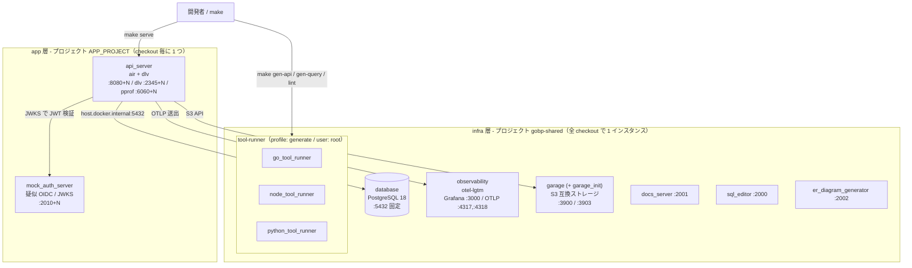
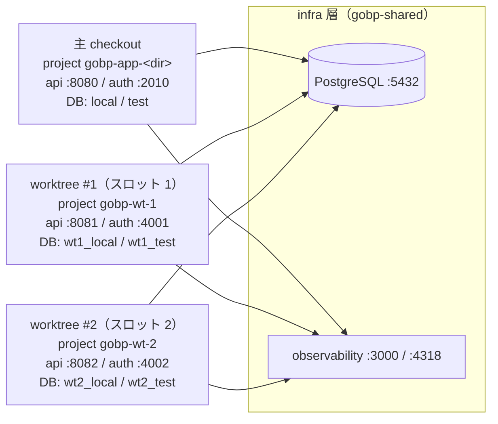

# Local Development Environment

English: [local-environment.md](../../maintenance/local-environment.md)

ローカル開発を構成する **docker compose の 2 層構成（共有インフラ / checkout 毎の app）・
ホットリロード（air）・コード生成 runner・`make serve` の worktree スロットリング** を 1 枚で
俯瞰するための地図。各要素の詳細は既存の正本ドキュメントへリンクするに留め、ここでは
**全体像と役割分担**だけを示す（重複再掲を避け、ドリフトを防ぐ）。

- make ターゲットの一覧 → [`.makefiles/README.md`](../../../.makefiles/README.ja.md)
- 生成物 / root 所有 / DB 落ち等の詰まり所 → `repo-ops` スキル
- worktree × DB スロットプールの詳細 → [db-worktree-pool.ja.md](db-worktree-pool.ja.md)
- o11y の送出配線 → [observability.ja.md](../design/observability.ja.md)、認証（疑似 OIDC）→ [auth.ja.md](../design/auth.ja.md)

## 全体像



## compose の 2 層構成（infra / app）

compose のサービスは 2 層に分かれており、主 checkout と任意個の worktree が同時に `make serve`
できる。以下の変数は [`.makefiles/docker/compose.mk`](../../../.makefiles/docker/compose.mk) で定義する。

| 層 | compose プロジェクト | サービス | ライフサイクル |
| --- | --- | --- | --- |
| **infra** | `INFRA_PROJECT` = `gobp-shared`（固定名） | `database` / `observability` / `garage`（+ `garage_init`）— 固定ポートでしか動けないもの全て | `make infra-up` で起動。`make serve` / `job` / `worker` / `outbox-relay` が冒頭で冪等に呼ぶ。`make infra-down` は**全 checkout に影響する**停止 |
| **app** | `APP_PROJECT` = DB スロット保持時は `gobp-wt-N`、未取得なら `gobp-app-<ディレクトリ名>` | `api_server` / `mock_auth_server` | `make serve` で起動。`make serve-stop` は**この checkout の app だけ**を停止 |

- app 層は `docker compose -p $(APP_PROJECT) -f docker-compose.yaml -f docker-compose.attach.yaml --profile development` で起動する。
  [`docker-compose.attach.yaml`](../../../docker-compose.attach.yaml) はスロット保持時だけでなく**常に**重ねられ、
  `DB_HOST` / `OBS_OTLP_ENDPOINT` / `OBJECT_STORAGE_ENDPOINT` / `AUTH_ISSUER` を実行時 env で上書きして
  共有インフラを `host.docker.internal` 経由で参照させる（`internal/config` の loader は実行時 env を
  `env/.env` より優先する）。
- app 層のホスト公開ポートは全てスロット番号 `N` で相対化される: API `8080+N` / mock 認証 `2010+N` /
  dlv `2345+N` / pprof `6060+N`（スロット未取得なら `8080` / `2010` / `2345` / `6060`）。
  コンテナ内部のポートは動かない。
- observability は **全 checkout で共有**。稼働中の全 app の traces / metrics / logs が
  `http://localhost:3000` の 1 つの Grafana に集まる。
- DB ツーリング（`make db-migrate-*` / `db-seed` / `db-drop-tables` / `gen-query` 等、
  `docker compose run --rm *_tool_runner` と `docker compose exec database` の呼び出し）はプロジェクト名を
  明示しない。`compose.mk` が `COMPOSE_PROJECT_NAME` の既定を `gobp-shared` に置くため、これらは infra 層の
  ネットワークで動く。補助サービス（`docs_server` / `sql_editor` / `er_diagram_generator`）も同じプロジェクトに属する。

## コンテナ群

| サービス | 層 | 由来 | ホストポート | 役割 |
| --- | --- | --- | --- | --- |
| `api_server` | app | build `docker/server/Dockerfile` | `${API_HOST_PORT:-8080}:8080` / dlv `${DLV_HOST_PORT:-2345}:2345` / pprof `${PPROF_HOST_PORT:-6060}:6060`（内部ポートは固定） | アプリ本体。dev target は **air** で起動しホットリロード＋delve デバッグ |
| `mock_auth_server` | app | build `docker/mock-auth-server/Dockerfile` | `${MOCK_AUTH_HOST_PORT:-2010}:4000`（内部 4000） | 疑似 OIDC 認証サーバー（JWT テストプロバイダ）。RS 側の JWKS 検証相手 |
| `database` | infra | `postgres:18.4-trixie` | `5432` 固定 | 全 checkout 共有の**単一**インスタンス（並列化は DB 名で行う。下記スロットリング参照） |
| `observability` | infra | `grafana/otel-lgtm` | `3000`（Grafana UI）/ `4317`（OTLP gRPC）/ `4318`（OTLP HTTP）/ `3200`（Tempo API） | 全 checkout の traces / metrics / logs の受け皿。profile: `development` |
| `garage` | infra | `dxflrs/garage` | `3900`（S3 API）/ `3902`（Web API） | ローカル開発用の S3 互換オブジェクトストレージ（テストは in-process の gofakes3 を使う）。Web API はオブジェクトを匿名配信する — [`docker/README.md`](../../../docker/README.md) 参照 |
| `garage_init` | infra | build `docker/garage/Dockerfile` | なし（one-shot） | garage のレイアウト / バケット / アクセスキー / 公開配信の許可の冪等プロビジョニング |
| `elasticmq` | infra | `softwaremill/elasticmq-native` | `9324`（SQS API） | 開発用の SQS 互換ブローカー（テストは in-process の fake）。全 checkout で共有され、スロット単位に隔離**できない** — [`db-worktree-pool.ja.md`](db-worktree-pool.ja.md) 参照 |
| `docs_server` | infra | build `docker/document/Dockerfile` | `2001:80` | 開発時に `docs/` を配信する |
| `sql_editor` | infra | `sosedoff/pgweb` | `2000:8081` | ブラウザ DB クライアント |
| `er_diagram_generator` | infra | `schemaspy/schemaspy` | `2002:3000` | ER 図生成 |
| `go_tool_runner` / `node_tool_runner` / `python_tool_runner` | infra | build `docker/tools/Dockerfile`（各 target） | なし（run/exec 実行） | コード生成・lint 等のツールボックス。**`user: root`**・profile: `generate`・リポジトリを `.:/app` にバインド |

### ホスト公開ポートの採番

ホスト公開ポートは 1 つの規則で決める。

> **そのサービスにデファクトの番号があるならそれを使う。無い（＝番号が恣意的になる）ものは
> `2000` 番台に連番で置く。**

`5432` / `8080+N` / `2345+N` / `6060+N` / `4317` / `4318` / `3000` / `3200` / `3900` / `3902` /
`9324` は PostgreSQL・Delve・Go pprof・OpenTelemetry・Grafana・Tempo・garage・elasticmq の
上流既定なので、読者が期待する位置に置いたままにする。`sql_editor` / `docs_server` /
`er_diagram_generator` / `mock_auth_server` にはその番号が無い（pgweb・nginx・schemaspy が固定して
いるのは*コンテナ内部*の 8081 / 80 / 3000 だけで、しかも pgweb の 8081 は API スロット帯（`8080+N`）
の内側に入る）。よって `2000` / `2001` / `2002` / `2010+N` を占める。

`2000` 番台を選んだのは、macOS でも Windows でも実際に LISTEN しているものが無いため。この帯に
登録されている名前（`callbook` / `dectalk` / `troff` / `xinupageserver` …）は現行 OS に実装を持たない
死んだプロトコルで、macOS の AirPlay レシーバーが実際に握っている `5000` / `7000` とは性質が違う。
**`2048` を超えないこと — `2049` は NFS。**

サービスを追加するときは、固定ポートなら `2003`–`2009`、スロット毎の帯が要るなら `2030` 以降。

### `database` のベース OS 変更後に出る collation version mismatch

`pg_data` はコンテナより長生きするため、`database` イメージのベース OS が変わって glibc が入れ替わると、
既存の全データベースが collation version mismatch を報告する。PostgreSQL は `CREATE DATABASE` 時点の
glibc collation version を記録しており、稼働中の OS と食い違うと文句を言う:

```txt
WARNING:  database "local" has a collation version mismatch
DETAIL:  The database was created using collation version 2.36, but the operating system provides version 2.41.
```

既存データベースへの接続は警告で済むが、食い違った `template1` に対する `CREATE DATABASE` は
ハードエラーになる:

```txt
ERROR: template database "template1" has a collation version mismatch (SQLSTATE XX000)
```

したがって落ちるのはデータベースを作る経路だけである — `wt<N>` のデータベースが未作成のスロットに
対する `make slot-acquire` と、使い捨てデータベースを作る `internal/cli/dbslot` のテストが該当する。
作成済みスロットの再取得や `make db-*-reinit` は、既存データベース内のテーブルを触るだけなので通る。
ただしその警告は無視してよいノイズではない。まだ致命的でないだけで、同じインデックス並び順の
食い違いを指している。

したがってデータベースの作り直しは回避策にならないし、そもそも警告も消えない。`CREATE DATABASE` は
`datcollversion` を `template1` から複製し、その `template1` 自体が古い値を持つためである。
共有インスタンス内の全データベースを `template1` 込みで一度 reindex し、記録を更新する:

```sh
docker exec gobp-shared-database-1 bash -c 'for db in $(psql -U postgres -Atc "select datname from pg_database where datallowconn"); do psql -U postgres -q -d "$db" -c "REINDEX DATABASE \"$db\";" -c "ALTER DATABASE \"$db\" REFRESH COLLATION VERSION;"; done'
```

refresh を正当化するのが reindex である。テキストインデックスの並び順は旧 collation で構築されており、
再構築せずに記録だけ更新すれば食い違いを隠すだけになる。ローカルのデータ量なら数秒で終わる。CI は
毎回空ボリュームから `database` service container を起動するため影響を受けない。

これが二度刺さるのは共有インスタンスだからである。ある checkout が新しい `database` イメージを、別の
checkout がまだ古いイメージを使っている間は、最後に `make infra-up` した側がコンテナを握り、ボリューム
に記録された collation version もそれに追従する。つまり食い違いが逆向きに再発し、もう一度 refresh が
要る。全 checkout が同じ `database` イメージに揃うまでは、他の checkout が共有インフラを起動するたびに
上のコマンドを再実行することになる。

`garage` も同じシーソーに乗っており、しかもより派手に、より静かに壊れる。新しいサーバーがメタデータ
ボリュームをその場で移行すると、古いメジャーはそれを読めなくなる:

```txt
Error: Internal error: Remote error: Unable to decode entry of bucket_v2
```

compose の healthcheck はこれを捕まえられない。実行しているのは `garage status` で、これはノードの
生存を見るだけでテーブルが読めるかは見ないため、**healthy** のままノードが立ち上がり、全バケット
参照が失敗して後から S3 エラーとして露見する。さらに悪いことに、`garage_init` はその失敗を
「バケット未作成」と解釈して新しいバケットを作り、それまでのオブジェクトを孤児にする。新しい
イメージへ戻せば読めるようになるが、作り直されたバケットは空のままなので `make db-local-seed` で
再投入する。

ここに惜しいものは何もない（`storage/seed/` から投入される開発専用のオブジェクトストレージ）ため、
実務上の指針はボリュームを守ることではなく、全 checkout を同じ `garage` イメージへ揃えることである。
それがまだ叶わず、かつボリュームの中身を取り戻したい場合に限り、共有インフラの持ち主が変わる前に
スナップショットを取る:

```sh
docker compose -p gobp-shared exec garage /garage -c /etc/garage.toml meta snapshot --all
```

## ホットリロード（air + delve）

`api_server` の dev target は `CMD ["air", "-c", ".air.toml"]`。[`.air.toml`](../../../.air.toml) が
`internal` / `cmd` / `pkg` 配下の `.go` 変更を監視し、`go build`（`-gcflags='all=-N -l'` でデバッグ情報を保持）
→ `tmp/main` を生成 → **delve**（`dlv --listen=:2345 --headless … exec --continue`）で `serve` を起動する。
ソース保存で自動再ビルド・再起動され、公開された dlv ポート（`2345+N`）に IDE のリモートデバッガをアタッチできる。

## コード生成 runner（tool-runner）

`make gen-api` / `gen-query` / `lint` などは、ホストの Go/Node/Python に依存せず
**tool-runner コンテナ内で実行**される（`docker/tools/Dockerfile` の go / node / python target）。
リポジトリを `.:/app` にバインドし、コンテナ内 **root** で走るため、生成物がホスト側で root 所有になり
`git` が触れなくなる等の典型的な詰まりがある。**具体的な復旧コマンドは `repo-ops` スキルを参照**
（ここでは再掲しない）。ターゲット一覧は [`.makefiles/README.md`](../../../.makefiles/README.ja.md)。

### イメージビルドはホストの GitHub トークンを借りる

tool-runner イメージも `api_server` のツーリングイメージも、ツールの解決に `mise` を使い、`mise` は GitHub Releases API を読む。未認証の呼び出しは **IP あたり毎時 60 回**が上限で、`mise install` は毎回 `mise.toml` 全体を解決し直すため、1 回のビルドにすら足りない。結果としてビルドは `403 Forbidden` で落ち、しかも試行のたびに回復したばかりの割当を使い切るので、リセット時刻が retry のたびに先送りされる。

`make` はトークンを解決し（すでに設定済みの `GITHUB_TOKEN` を優先し、無ければ `gh auth token`）、**BuildKit secret** としてビルドへ渡す。これで上限が毎時 5,000 回に上がる。secret は `mise install` のレイヤにだけマウントされるため、トークンはイメージレイヤにも `docker history` にも実行中のコンテナにも届かない。`gh` も `GITHUB_TOKEN` も無い環境で壊れることはない — 未認証の呼び出しにフォールバックし、レイヤがキャッシュされているか毎時の割当を使い切っていない限りはそれで足りる。

## server + API スロットリング（worktree 並列）

複数の git worktree（および主 checkout）が **単一の共有インフラ** を衝突なく並列利用するための仕組み。
**分離軸は「別ポートの DB」ではなく「共有 DB 内のデータベース名」**で、app 層のホストポートだけを
スロット番号 `N` でずらす。



- **DB ポートは `5432` 固定**（`5432+N` ではない）。スロット `N` は DB 名 `wt<N>_local` / `wt<N>_test` で分離。
- `API_HOST_PORT = 8080+N`、`MOCK_AUTH_HOST_PORT = 2010+N`、`DLV_HOST_PORT = 2345+N`、`PPROF_HOST_PORT = 6060+N`。
- スロットを取らない checkout は既定の DB 名（`local` / `test`）と既定ポートのまま動くため、
  スロット取得は**並列作業のための opt-in** に留まる。
- リース・ブートストラップ・`make slot-acquire` / `slot-free` / `slot-release` 等の**全詳細は正本の [db-worktree-pool.ja.md](db-worktree-pool.ja.md) を参照**。

## 関連ドキュメント

| 目的 | 参照先 |
| --- | --- |
| make ターゲット一覧 | [`.makefiles/README.md`](../../../.makefiles/README.ja.md) |
| worktree × DB スロットプール（正本） | [db-worktree-pool.ja.md](db-worktree-pool.ja.md) |
| 生成物 / root 所有 / DB 落ちの復旧手順 | `repo-ops` スキル |
| Observability の送出配線 | [observability.ja.md](../design/observability.ja.md) |
| 認証（疑似 OIDC / JWKS） | [auth.ja.md](../design/auth.ja.md) |
