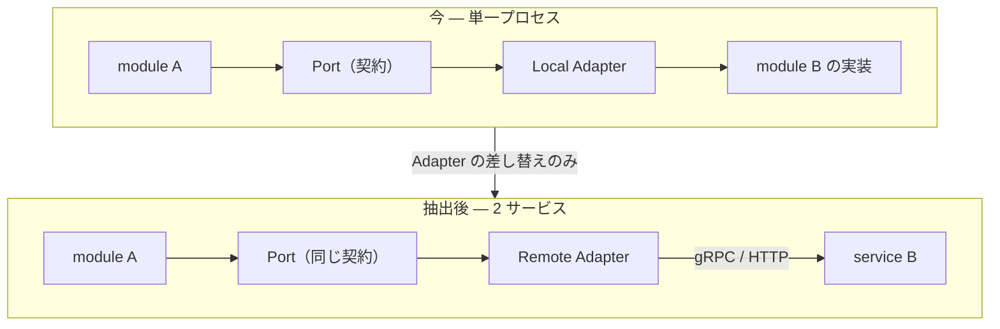
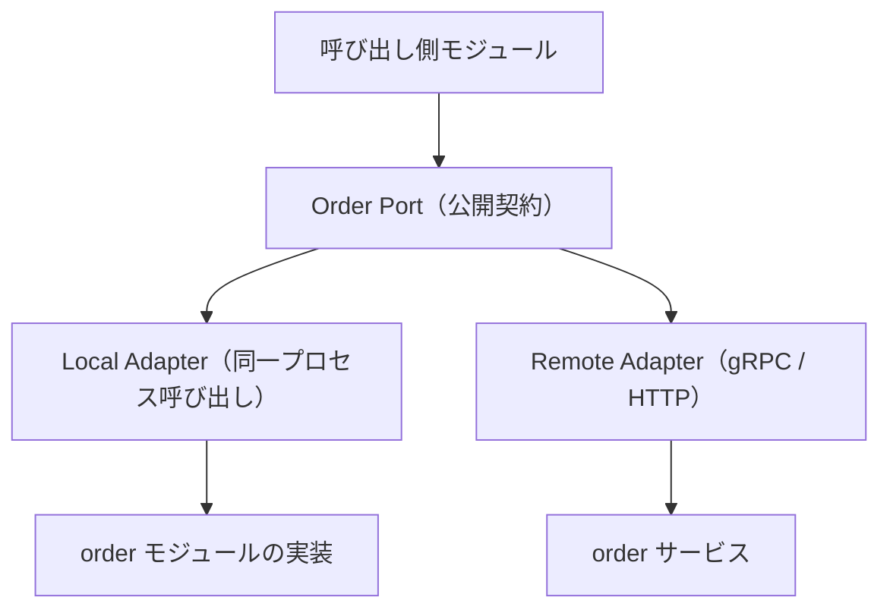
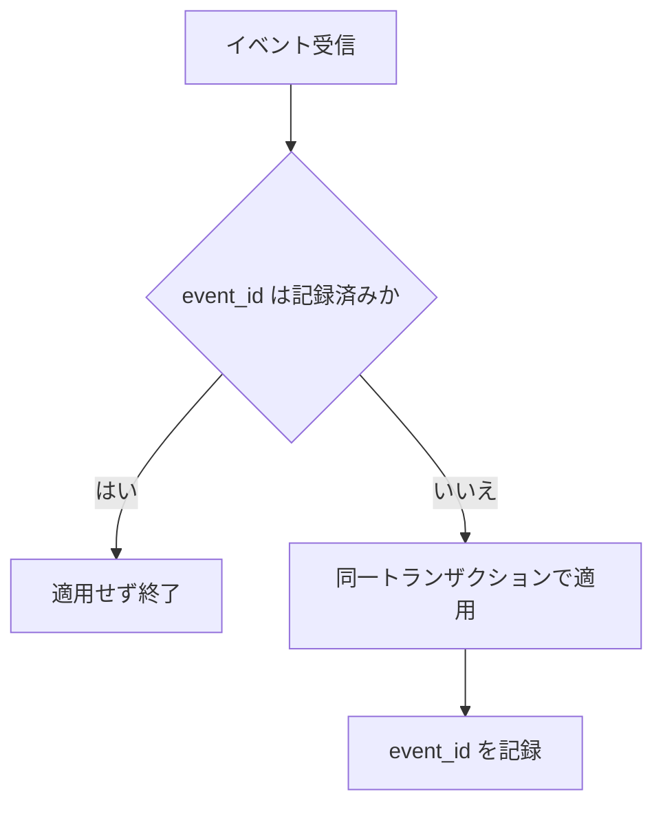
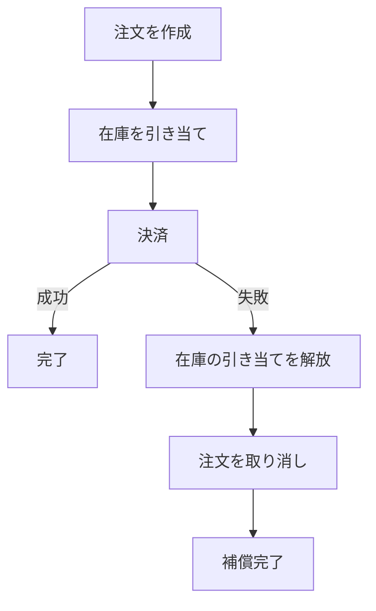

# 分散対応アーキテクチャ（v3 要件）

[English](../../plan/distributed-ready-architecture.md) | 日本語

v3 の線が答えようとしている問いは 1 つです。**モジュラーモノリスを維持したまま、境界を越えた瞬間に
分散システムとして振る舞えるか。**

マイクロサービス化を前提にはしません。前提にした時点で、初期開発の速度と、境界がまだ確定していない
段階での作り直しやすさを失うためです。目指すのは次の一文です。

> Modular Monolith First, Distributed Ready Architecture

基本方針:

- 開発初期はモジュラーモノリスとして高速に開発できる
- モジュール境界は暗黙ではなく明示される
- 分散化は全体ではなく、必要な境界のみを後から選べる
- 同一プロセス通信とサービス間通信を同一の契約で扱う
- 分散環境に特有の失敗を、例外ではなく前提として扱う

## この線が変えるもの、変えないもの

変えないのはオニオンアーキテクチャの層構造と、単一プロセスで開発を始められることです。変えるのは
**モジュールが他のモジュールを直接参照することをやめ、契約（Port）を経由させる**という 1 点で、
分散化はその契約の裏側にある Adapter を差し替える操作に還元されます。



呼び出し側のコードは、どちらの図でも変わりません。これが成立している限り、分散化は設計変更ではなく
配置の選択になります。

## 境界を宣言する

### Module Boundary Layer

モジュール間の依存を直接参照から契約経由へ変え、後からのサービス分離を可能にします。



必要なもの:

- Module Interface の定義と Module Contract
- Port / Adapter 構造
- 依存方向の制約
- モジュールの公開 API と内部 API の境界制御

**どこで切ってよいかは、この層が新しく決める問いではありません。** 集約が設計単位であることは
[domain の README](../../../internal/domain/README.ja.md) が、集約境界を越える操作の置き場は
[ADR-0031（commandservice-atomicity-criterion）](../adr/0031-commandservice-atomicity-criterion.ja.md)
が既に定めています。ここで足すのは、その基準を分離境界の判断へ読み替えたときの 2 点だけです。

- **整合性の要求は拒否権であって、選定基準ではありません。** 同時に成り立たねばならない不変条件を
  跨いで切ることはできません。ただしこれが決めるのは「切ってはいけない場所」だけです。切る理由は
  別の軸 — 変更頻度の差、チーム所有、負荷特性の非対称、障害隔離の要求 — から来ます。拒否権だけを
  基準にすると、利得が無いのに往復だけが増える分割を許します。
- **読み取りだけの条件も同じ拒否権を持ちます。** 他の集約を読んで可否を決める guard は書き込みを
  跨がないため書き込みの原子性基準に掛かりませんが、READ COMMITTED では読んだ条件が保持されません。
  **「書き込みが跨がない」ことは、安全に切れることの証明にはなりません。**

### Internal Communication Layer

同一プロセス通信と分散通信を、呼び出し側から見て透過的に切り替えます。

| Transport | 用途 | 呼び出しの実体 |
| --- | --- | --- |
| Local | 同一プロセス | 関数呼び出し |
| HTTP | サービス分離後（既存資産との接続） | HTTP リクエスト |
| gRPC | サービス分離後（内部通信の既定） | gRPC 呼び出し |

必要なもの:

- Transport Interface と、その上に載る 3 実装
- Request / Response DTO
- Transport 間で意味を保つ Error Mapping

### Contract Management

モジュール間・サービス間の契約を、破壊的変更を検出できる形で維持します。

必要なもの:

- OpenAPI Contract / gRPC Proto Contract / Event Schema Contract
- API バージョニングと Breaking Change Detection
- Contract Test

対象は Request・Response・Error・Event Payload の 4 つで、いずれも「片側だけ更新できてしまう」
ことが事故になる面です。

### Database Boundary Support

Database per Module への段階的な移行を可能にします。データベースを分けるかどうかは後で決められる
一方、**誰がどのテーブルを所有するか**は先に決まっていなければ後から分けられません。

必要なもの:

- モジュール単位のスキーマと Migration Boundary
- DB Ownership Rule
- モジュールを跨ぐクエリの制御
- Read Model パターン

## 非同期の一貫性を保つ

### Domain Event Foundation

分散環境における非同期連携の基盤です。

```json
{
  "event_id": "…",
  "event_type": "OrderCreated.v1",
  "aggregate_id": "…",
  "occurred_at": "…",
  "payload": {}
}
```

必要なもの:

- Domain Event の定義と Event Envelope
- Event Versioning
- Event Publisher / Consumer / Handler
- リトライ処理と Dead Letter Queue

### Outbox Pattern Enhancement

DB 更新とイベント発行の整合性を保証します（v2 で導入済みの Transactional Outbox を、モジュール間
イベントを運ぶ経路として拡張します）。

必要なもの:

- Outbox テーブルと Publisher Worker
- 配信ステータス管理とリトライ管理
- 失敗からの復旧手段

### Inbox Pattern

受信側でイベントの重複処理を防ぎます。Outbox が保証するのは「最低 1 回届く」ことであり、
**同じイベントが 2 回届く**前提の受け口が対になって初めて実質的な exactly-once になります。



必要なもの:

- 受信イベントの管理と Event ID の保存
- 重複検出

### Idempotency Layer

分散環境におけるリトライ耐性を、API・Command・Event Handler の 3 面に対して提供します。

必要なもの:

- Idempotency Key とリクエストの重複排除
- レスポンスキャッシュ
- 操作ステータスの管理

### Saga / Distributed Transaction

境界を跨いだ業務トランザクションを、2 相コミットではなく補償で扱います。



必要なもの:

- Saga State Machine と Coordinator
- 補償アクション
- タイムアウト処理と失敗からの復旧

## 参照を分離する

### Query Separation Layer

分散環境では、複数モジュールを跨ぐ結合クエリが書けなくなります。その制約を、参照側の構造で解決
します。

必要なもの:

- Query Service と Read Model
- Projection / Materialized View
- v2 で導入した軽量 CQRS の延長線としての位置づけ

## 分散を観測する

### Distributed Context Management

1 つのリクエストが複数のプロセスを跨いだあとも追跡可能であることを保証します。

必要なもの:

- Trace ID / Correlation ID / Request ID
- コンテキストの伝播
- W3C Trace Context 対応

### Distributed Logging

複数サービスにまたがる処理を、ログ側から再構成できるようにします。

必須フィールド:

| フィールド | 意味 |
| --- | --- |
| `service` | どのサービスが出したか |
| `module` | サービス内のどのモジュールか |
| `trace_id` | どのリクエストに属するか |
| `span_id` | その中のどの処理か |
| `event` | 何が起きたか |

必要なもの:

- 構造化ログとトレース連携
- イベントログ

## 失敗を前提に通信する

### Resilience Layer

ネットワーク障害を前提とした通信制御です。同一プロセス呼び出しでは考えなくてよかった失敗が、
境界を越えた瞬間にすべて発生し得ます。

必要なもの:

- タイムアウト、リトライ、指数バックオフ、ジッター
- Circuit Breaker、Bulkhead、Rate Limit

### Service Discovery Support

サービス化後の接続先管理を、実行環境に縛られない形で扱います。

必要なもの:

- Service Resolver Interface
- DNS Discovery、Kubernetes Service、クラウドの Discovery への対応

### Configuration Management

複数モジュール・複数サービスの設定を、境界ごとに分離した形で管理します。

必要なもの:

- Module Config / Service Config
- Secret Provider Interface
- 環境分離と Dynamic Config への対応

## 信頼境界を張る

### Authentication / Authorization Boundary

サービス間の認証・認可です。単一プロセスでは呼び出し規約で足りていたものが、境界を越えると
**呼び出し元が誰かを証明する**必要のある問題に変わります。

必要なもの:

- Service Identity と Service-to-Service Authentication
- JWT 検証と JWKS
- 権限の伝播

### Distributed Security

分散環境でのセキュリティ境界です。

必要なもの:

- mTLS を採り得る余地
- Credential Rotation と Secret Injection
- Network Policy への対応

## 検証と移行

### Distributed Testing

分散構成での品質保証です。

必要なもの:

- Contract Test
- 統合テスト環境と複数モジュールにまたがるテスト
- イベントのテストと、障害シナリオのテスト

### Migration Support

モジュラーモノリスから段階的に分散化するための手段です。この線の成果物が実際に使えるかどうかは、
最終的にここで決まります。

必要なもの:

- Strangler パターンへの対応
- Module Extraction と Adapter Swap
- トラフィックのルーティングと Feature Flag

### Documentation / AI Context

複雑化した境界を、人間と AI の双方が読める状態に保ちます。

必要なもの:

- Module Map と Dependency Graph
- Contract Documentation と Event Catalog
- ADR と境界ルール

## 優先度と影響範囲

3 段は難易度ではなく**取り返しのつきやすさ**で分けています。コアに置いたものは、後から入れると既存の
呼び出し側をすべて書き換えることになるものです。追加候補は、必要になった時点で足しても既存の構造を
壊さないものです。

「現状」列は現在の実装との突き合わせで、**既存**＝ v2 までに入っており拡張で足りるもの、**一部**＝
土台はあるが分散前提では不足するもの、**新規**＝置き場所ごと無いものを表します。

### v3 コア（必須）

| 項目 | 目的 | 影響層 | 現状 |
| --- | --- | --- | --- |
| Module Boundary Layer | モジュール間の直接参照をやめ、境界を宣言に変える | `internal/**` の配置そのもの、`internal/architest`、depguard 設定 | 新規（レイヤ境界は既にあるが、モジュール境界は無い） |
| Port / Adapter | 契約の裏で実装を差し替えられる座を作る | `internal/usecase/boundary/**`（Port）、`internal/infrastructure/**`（Adapter）、`internal/di/module/**`（選択） | 一部（外部依存には既にこの形。モジュール間には無い） |
| Contract Management | 契約の破壊的変更を検出可能にする | `openapi/**`、新設の proto、`.github/workflows/**` | 一部（OpenAPI は既にあるが、モジュール間契約と互換検査は無い） |
| Internal Communication Layer | 同一プロセスと分散を同一契約で扱う | `internal/infrastructure/**`（transport 実装）、`internal/controller/**`（受け口）、`internal/apperror` と `pkg/xerrors`（Error Mapping） | 新規 |
| Domain Event | 非同期連携の単位と語彙を定める | `internal/domain/**`（イベント定義）、`internal/usecase/boundary/publisher`、`internal/infrastructure/queue/**`、`database/migrations` | 一部（`publisher.Message` が種別 + version・dedup キー・`traceparent` 伝搬を既に持つ。domain 側のイベント定義とカタログが無い） |
| Outbox | DB 更新とイベント発行の整合を保証する | `internal/usecase/outbox`、`internal/controller/outbox`、`database/**` | 既存（モジュール間イベントを運ぶ経路として拡張） |
| Inbox | 受信側で重複適用を防ぐ | 新設の受信側 usecase、`internal/controller/worker`、`internal/controller/httpstack/idempotency`、`database/migrations` | 一部（HTTP 受信は `Idempotency-Key` 経路で重複排除される。受信イベントとしての記録が無い） |
| Idempotency | リトライ耐性を API 以外にも広げる | `internal/usecase/idempotency`、`internal/usecase/boundary/idempotency`、`internal/controller/httpstack/idempotency` | 一部（API 面は既存。Command と Event Handler 面が未対応） |
| Distributed Context | 1 リクエストをプロセスを跨いで追跡可能にする | `internal/observability`、`internal/logging`、`internal/controller/httpstack`、transport 実装 | 一部（`service.name` と `traceparent` 伝搬は既存。`module` 軸が無い） |
| Contract Test | 契約の食い違いを CI で止める | `internal/integration`、`.github/workflows/**` | 新規 |

### v3 追加候補

| 項目 | 目的 | 影響層 | 現状 |
| --- | --- | --- | --- |
| Saga | 境界を跨ぐ業務トランザクションを補償で扱う | `internal/domain/**`（状態機械）、`internal/usecase/**`（コーディネータ）、`database/migrations` | 新規 |
| CQRS Read Model | 分散後に書けなくなる結合参照を構造で解く | `internal/usecase/boundary/**`、`internal/infrastructure/rdb`、`database/dml/query_service` | 一部（軽量 CQRS は既存。Projection と Read Model の更新機構が無い） |
| Database Boundary | Database per Module へ段階的に移れるようにする | `database/migrations`、`database/dml/**`、`sqlc.yaml`、`internal/infrastructure/rdb` | 新規（現在は単一スキーマ・単一所有） |
| Circuit Breaker | 落ちている相手への呼び出しを早く諦める | `pkg/**`（`retry` / `backoff` の隣）、`internal/observability`（外向き transport）、`internal/infrastructure/webapi/**` | 新規（timeout / retry / backoff は既存） |
| Service Discovery | 接続先解決を実行環境に縛られない形で持つ | 新設の boundary、`internal/infrastructure/**`、`internal/config` | 新規 |
| Service Authentication | 呼び出し元が誰かを境界越しに証明する | `internal/usecase/boundary/auth` と `authz`、`internal/infrastructure/auth`、`internal/controller/httpstack` | 一部（利用者の認証・認可は既存。サービス自身の identity が無い） |

### system-boilerplate の担当（この線の範囲外）

| 項目 | 目的 | このリポジトリでの接点 |
| --- | --- | --- |
| Kubernetes / デプロイパターン | 実行基盤とデプロイ方式を決める | `docker/**` と `.github/workflows/deploy-app.yaml` の骨組みまで |
| Service Mesh / mTLS | 通信経路の暗号化と認証をインフラ側で担う | アプリ側は「採り得る余地」を残すのみ（Distributed Security 参照） |
| Dynamic Config | 再起動なしの設定変更を提供する | `internal/config` は immutable / fail-fast のままにする |
| Chaos Engineering | 障害注入で耐性を実証する | 障害シナリオテスト（Distributed Testing）までがこの線の担当 |

境界の引き方は 1 つの原則です。**アプリケーションが自分のコードで表現しなければならないものはこの線、
実行基盤が提供するものは system-boilerplate**。両方で扱うと、どちらが正なのか分からない設定が残ります。

## 到達点

v3 が提供するのは「マイクロサービス用テンプレート」ではありません。**モジュラーモノリスを維持
しながら、必要な部分だけを純分散化できるアーキテクチャ基盤**です。

分散化しないという選択が最後まで有効であり続けること、そして分散化を選んだときに設計をやり直さずに
済むこと。その両方が同時に成り立っている状態を、この線の完了とします。
