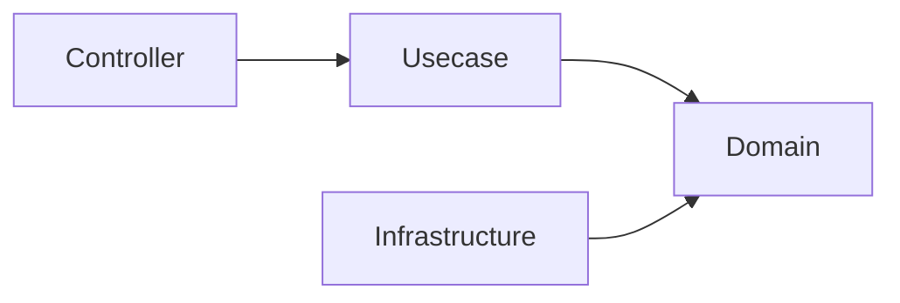
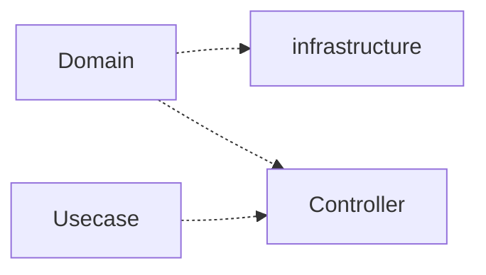
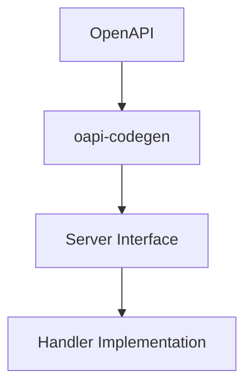
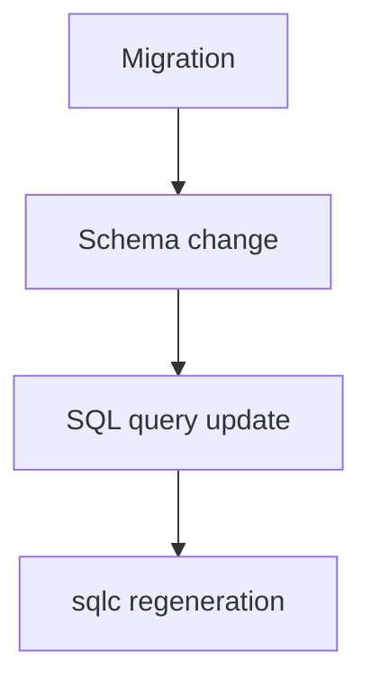

# アーキテクチャルール

このドキュメントは、このプロジェクトにおける **破ってはいけないアーキテクチャルール** を定義します。

これらのルールは **人間の開発者** と **AIエージェント** の両方が必ず遵守する必要があります。

これらのルールに違反すると、システムのアーキテクチャ整合性が損なわれる可能性があります。

## レイヤ依存ルール

依存関係は常に **内側のレイヤへ向かう** 必要があります。

### 許可される依存



### 禁止される依存



**domain レイヤは常に最も独立したレイヤである必要があります。**

### ドメイン語彙（lexicon）

domain パッケージは他の集約を import してはなりません（depguard が `internal/domain/` を拒否します）。
複数の集約から使われる業務意味論を持つ値オブジェクトのうち、`pkg/` が業務ロジックを禁じているために
そちらへ置けないものは、**ドメイン語彙**
[`internal/domain/lexicon`](../../internal/domain/lexicon/README.ja.md) に置きます。ここは全ての domain
パッケージが import してよい場所です（depguard が `internal/domain/lexicon` を許可します）。

配置は **`pkg/` を先に判定**します。あちらの基準は機械強制ですが lexicon の基準は散文であり、散文の
基準がリンタの引く境界を越えて型を押し込むことはできないためです。`pkg/` で落ちたことは lexicon の
根拠になりません。どちらも満たさない型は所有する集約に残します。入場基準は意図的に狭く（値オブジェクト /
2 集約以上で使用 / 業務意味論を持つ / 共同所有の判断。詳細はその README）、名前が入場時の問いを
表しています——これは業務の語か。根拠: [ADR-0034](adr/0034-domain-lexicon.ja.md)。

### ドメインサービス

domain 内部を横断してよい経路は lexicon だけではありません。どのエンティティ・値オブジェクトの責務でも
ないルールは **`internal/domain/service/<name>/`** に置き、このパスは集約の import を許す専用の depguard
ルールを持ちます。緩めるのはこの一辺だけで、それ以外の domain の deny（フレームワーク /
infrastructure / usecase / controller / ファイルシステム / プロセス / 環境変数）は同ルールへ一字一句
再掲されています。ここのサービスは I/O を持たず、Repository も `context.Context` も受け取りません。
Usecase が読み込み済みの状態を受け取り、導出した値またはドメインのエラーを返します。

**入場の可否は責務で決まり、ルールがいくつの集約に届くかでは決まりません。** 集約に跨ることは、操作が
どのエンティティのものでもなくなる一つの経路であって、そうであることの定義ではありません。単一の集約から
取った *集合* についての問いもまた、メソッドの置き先となるエンティティを持ちません。どちらも同じパスに
置くので、配置の問いは一度だけ問われ一度だけ答えられます。

2 つの例外は別々の問いに答えるものであり、互換ではありません。lexicon が受け入れるのは複数の集約が
話す **値オブジェクト** であり、ドメインサービスが持つのはどのエンティティも所有できない **ルール** です。
1 つのエンティティに収まるルールはそのエンティティへ置き、2 つの集約を読んで並べるだけなら写像であり
Usecase に留まります。入場基準と現在の占有者は
[`internal/domain/README.ja.md`](../../internal/domain/README.ja.md) の「Domain Service を
どこに置くか」を参照してください。

### 理由

このルールにより、ドメインモデルがフレームワークやインフラストラクチャに依存することを防ぎます。

これらの境界はドキュメント上の取り決めに留まらず、**CI の `golangci-lint` depguard で強制**されます。禁止された cross-layer import（例: `domain` が `infrastructure` を import、`pkg/` が `internal/` を import）はビルドを失敗させます。

## Usecase 依存ルール

Usecase は Infrastructure に直接依存してはなりません。

- 依存は必ず Boundary（interface）を通す
- Infrastructure 実装は DI によって注入される

```txt
Usecase → Boundary(interface) → Infrastructure
```

## 生成コードルール

一部のファイルは **自動生成されるコード** です。

これらのファイルは **手動で編集してはいけません**。

### 生成コードの例

例：

- OpenAPI から生成されたサーバコード
- sqlc によって生成されたクエリバインディング
- mock 生成ファイル

### ルール

生成コードは常に **ソース定義から完全に再生成できる状態**である必要があります。

生成コードを変更する必要がある場合は、  
**生成元の定義を変更してください。**

例：

|生成コード|ソース|
|---|---|
|OpenAPI server code|OpenAPI specification|
|SQL bindings|SQL query files|
|Mocks|Interface definitions|

## OpenAPI-first

API の変更は必ず **OpenAPI 定義から開始**します。



### OpenAPI-first ルール

- API 契約を定義する前に handler を実装してはいけません
- 生成された API インターフェースを手動で編集してはいけません
- Echo に登録するルートは spec の operation と 1:1 で対応しなければならず、例外のための許可リストは持ちません（`internal/architest` の `TestRouteSpecParity` が機械検証します）。HTTP スタックの一部は挙動を spec から解決するため、spec に無いルートはテストが緑のまま実行時の挙動だけを変えます。ハンドラを書くうえで何を意味するかは [handler ガイド](../../internal/controller/handler/README.ja.md#すべてのルートは-openapi-に存在しなければならない)を参照してください。
- `BindHandler` を宣言するハンドラパッケージは `ControllerModule()` の `fx.Invoke` に列挙されていなければならず、`RegisterHandlers` が生成されているパッケージはそれを実装する `BindHandler` を持たなければなりません（`internal/architest` の `TestBindHandlerDIParity` が機械検証します）。`TestRouteSpecParity` が読むのは生成されたルート登録で、これは DI へ配線したかどうかに関わらず `make gen-api` が spec から作るため、この検証が無いと配線漏れはテストが緑のまま実行時に 404 を返します。

OpenAPI 定義は **APIの唯一のソース（Single Source of Truth）** です。

## データベースマイグレーション

データベーススキーマの変更は、厳格なマイグレーションルールに従う必要があります。

### マイグレーションルール

- 既存の migration ファイルを **変更してはいけません**
- migration は **append-only（追記のみ）** です
- スキーマ変更は必ず **migration から開始**します

### 典型的なフロー



これにより、データベースの履歴を常に再現可能に保つことができます。

## Domain レイヤ制約

Domain レイヤは **純粋かつ独立した状態** を保つ必要があります。

Domain レイヤでは以下の処理を **行ってはいけません**。

### Domain で禁止されること

- 外部 I/O
- データベースアクセス
- 環境変数の取得
- フレームワーク依存
- ログ出力
- HTTP ロジック

### Domain で許可されるもの

- Entity
- Value Object
- Domain Service
- ビジネスルール
- Repository インターフェース

上の 2 つのリストは、ドメインに何を**含めてよいか**を定めるものである。ドメインは同時に、自分が
所有するものを**欠いていてもいけない**。**業務語彙で名前を持つ条件は、ドメインに述語として存在
しなければならない。** SQL・handler・job はその条件を**実行**してよいが、いずれも**著作**しては
ならない。条件がこれに該当するのは、業務を知る者がそれを業務についての言明だと認める場合であり、
単に絞り込みに現れるからではない。ID 一致・ページネーション・並び順・外部キー結合は機構であり
対象外。判別と根拠は [`internal/domain/README.md`](../../internal/domain/README.ja.md) の
Query and Aggregate 節を参照。

## Context 伝搬ルール

- context.Context は必ず下位レイヤへ伝搬する
- 新規に context を生成してはいけない（例: context.Background）

## Infrastructure 実装ルール

Infrastructure コンポーネントは  
**Domain のインターフェースを実装する役割**を持ちます。

ルール：

- Infrastructure にドメインロジックを書いてはいけません
- Infrastructure は domain インターフェースに依存します
- Infrastructure は外部システムにアクセスできます

例：

- database adapter
- 外部 API クライアント
- repository 実装

## Repository / QueryService ルール

- Repository は Aggregate の永続化と、単一 Aggregate の単純な読み取りを扱う
  （ID 取得、および Aggregate 自身の属性による単純なフィルタ・一覧・件数取得）。
- QueryService は Aggregate を横断する読み取り、または高い検索複雑性を要する読み取りを扱う
  （複数テーブル結合・集計・キーワード/全文検索・専用 read model）＝CQRS の読み取り側。

禁止：

- Repository に Aggregate 横断や集計・結合のクエリを書くこと
- QueryService にドメインロジックを書くこと
- 業務語彙で名前を持つ条件をクエリで著作すること — `WHERE` 句はその条件の**実行**であって定義ではない
  （[Domain レイヤ制約](#domain-レイヤ制約)を参照）

境界の明確化（よくある誤読）：

- **「多数の行を返す」ことは「Aggregate 横断」ではない。** 1 つのテーブルの全行を列挙することは
  単一 Aggregate の `一覧` であり Repository に留まる。
  <!-- 撤去後にこの箇所へ自分の例を置くための指針。
       目的: 行数の多さが集約横断の証拠だと読まれやすいため、単一テーブル全件の具体例が要る。
       意義: 効くのは「1 つのテーブルに閉じていること」であって、返る行数ではない。
       書き方: 全件取得が自然な参照マスタを 1 つ選び、SELECT 文の形で示す。 -->
  <!-- sample-api:begin -->
  例: `SELECT * FROM prefectures ORDER BY code`。
  <!-- sample-api:end -->
  「Aggregate 横断」とは *異なる* Aggregate を結合・またぐことであり、1 つの Aggregate の複数行を返すことではない。
- **「レスポンスが DTO である」ことは QueryService のトリガではない。** あらゆる読み取りは最終的にレスポンス
  DTO へ写像される。読み取りを QueryService へ移すのは、full Aggregate として再構築するのが無駄になる
  自然な形（重い Aggregate・結合・ページング）であって、API が DTO を返すという事実そのものではない。
- Repository の読み取りは **ID 取得に限定されない**：Aggregate 自身の属性による単純なフィルタ・一覧・件数取得
  （無フィルタの全件一覧を含む）は Repository に属する。
- **Repository / QueryService の判別はストレージ非依存。** 基準はエンジン（RDB か NoSQL か）でも手法
  （全文検索か）でもなく、*読み取り先が何か*：Aggregate 自身の正本（system of record）の状態で full Aggregate を
  再構成できるなら Repository、正本から派生した写像 / read model（検索インデックス・別の検索ストア・非正規化 /
  生成された検索列・Aggregate 横断の JOIN view）で Aggregate を再構成できないなら QueryService。document ストアを
  Aggregate の正本として使う場合は全文検索を備えていても Repository、その正本から構築した Elasticsearch
  インデックスは派生写像なので QueryService。
- **「keyword / 全文検索 = QueryService」は典型例であって規則ではない。** Aggregate *自身* の列への素の `ILIKE`
  は単一 Aggregate の Repository フィルタ。全文検索が QueryService になるのは、派生した検索射影（検索インデックス・
  検索ストア・非正規化 / 生成された検索列）を読む場合に限る。
- **別 Aggregate のフィールド解決は JOIN ではなく Usecase で行う。** 一覧に関連 Aggregate のデータ（例: 名称）を
  付与するには、その Aggregate 自身の Repository（`FindByIDs`）で一括取得し Usecase 層でキー突合する。各読み取りは
  単一 Aggregate の Repository read のまま保つ。平坦化した view を返す Aggregate 横断 SQL JOIN は Repository read
  ではなく QueryService の read model。

## DTO / 型境界ルール

- OpenAPI の型を Usecase に渡してはいけない
- Controller で DTO に変換すること
- Domain は OpenAPI 型を知らない

### 境界の型変換

- フレームワーク/生成型（例: OpenAPI `openapi_types.UUID`）→ ドメイン型の変換は、**その型を所有する層にのみ**置く。HTTP では Controller の専用ヘルパー `internal/controller/conv` 経由とする。他層は生成/フレームワーク型を import しないため、依存方向で変換用途が境界に構造的に限定される。
- 利便性のために共有パッケージ（`pkg/`）へ**検証バイパスの公開コンストラクタを足さない**。バイパス入口は利用方針が時間とともに形骸化し、コードベース全体で乱用される。既存の検証済みコンストラクタ（`New` / `Parse`）を再利用すること。

## Infrastructure 型漏洩禁止

- sqlc の生成型を Usecase / Domain に渡してはいけない
- 必ず Domain Entity または DTO に変換する

## 関数シグネチャルール

層非依存。コンストラクタ・振る舞いメソッド・usecase 関数・ヘルパーのいずれにも適用する。

**同型の引数を 2 つ以上取る**関数は、呼び出し側で入れ替えてもコンパイラにも lint にも検出されない。
これらの引数を値構造体へ束ね、各呼び出し側にどの引数へ渡しているかを明示させること。検査を
コンパイラに委ねられるわけではない（正しいフィールド名に誤った値を与えたリテラルは同型である以上
コンパイルを通る）が、隣接する同型引数を入れ替えてしまう位置依存の束縛は消えるため、残るのは
レビューで見える名前付きの誤りだけになる。呼び出し側はフィールド名付きで書くこと。フィールド名を
省いた複合リテラルは、ここで消したはずの順序依存をそのまま呼び戻す。

**適用する場合**。トリガーは 1 つのシグネチャに同型の引数が 2 つ以上あること。型は解決後で比較し、
同じ string を包む名前付き型どうしでも型が異なれば別物として扱う。そのうえで、取り違えが検出され
ないまま残る確度を次の観点で測る。

- **省略可能／ポインタの引数** — どちらも `nil` が正当なため、実行時に取り違えを弾く検査がない。
- **自由書式の値** — もう一方の引数の値を弾く検証が存在しない。
- **位置で機械的に流し込む呼び出し側** — DB 行からエンティティを再構築する Repository、seed など、
  意味ではなく列順で引数を埋めるコード。
- **引数が隣接している** — 離れた引数より隣どうしの方が入れ替わりやすい。

**適用しない場合**。

- **全引数の型が相異なる。** 入れ替えはコンパイラが弾くため位置引数のままでよい。これが通常の
  ケースであり、反射的に構造体化するルールではない。
- **入れ替えが構築を通過できない。** 入れ替えた値を不変条件が弾くため、誤りは伝播せず fail fast する。
- **単に引数が多いだけ。** 引数の個数は判断基準ではない。

**対処の選択**。引数自体に不変条件を持たせるべきなら型を相異なるものにする（引数ごとの VO 化）。
副次的に取り違えリスクも消える。VO 化しても不変条件が増えず、値が本当に素のプリミティブなら構造体へ
束ねる。いずれの場合も、同型の引数へ**異なる値**を渡して各値を検証するテストで対応づけを固定する。
フィールド名があっても誤った代入は書けるため、永続化境界でも同様に固定すること。

層ごとの適用: `internal/domain/README.md`（エンティティの属性構造体）、
`internal/usecase/README.md`（usecase 入力の Params DTO 構造体）。

## パッケージ / ディレクトリ命名ルール

- Go のパッケージ識別子は小文字 1 語で **アンダースコア禁止**（staticcheck ST1003）。
- 多語アグリゲートは次の 2 形式のいずれか：
  - **コンテキストによるネスト** — 1 つの境界づけられたコンテキストが複数のサブアグリゲート / マスタを
    束ねる場合、コンテキストディレクトリ配下にネストする：`internal/<layer>/<context>/<sub>/`（package `<sub>`）。
    例: `internal/domain/product/category`（package `category`）、`internal/domain/product/status`（package `status`）。
  - **連結** — 束ねるコンテキストを持たない単独の多語アグリゲートは 1 語に連結する
    （例: `useridentity`、`exchangerate`）。既存の連結パッケージは現状維持とし、コンテキストに 2 つ目の
    サブアグリゲートが加わった時点でネストを優先する。
- データベース DML と sqlc 生成物のディレクトリは、Go パッケージ構成とは独立に、**テーブル名準拠の snake_case**
  を用いる（`product_category`、`user_identity`）。
- Controller ハンドラのディレクトリは Go パッケージ構成ではなく **HTTP リソース（route）名**に一致させる。
  <!-- 撤去後にこの箇所へ自分の例を置くための指針。
       目的: ルート名と Go パッケージ名がずれる実例が無いと、規則が空文に見える。
       意義: ずれる典型は複数形とハイフンで、Go 側の単数・アンダースコアと形が違う点にある。
       書き方: 実在するルートを 1〜2 個、バッククォートで挙げる。 -->
  <!-- sample-api:begin -->
  例: `product-categories`、`prefectures`。
  <!-- sample-api:end -->
- 型名は同名パッケージ内でもアグリゲート名詞を保持してよい（`category.Category`、`prefecture.Prefecture`）。

## レイヤ責務ルール

各レイヤには明確な責務があります。

### Controller

責務：

- HTTP トランスポート
- リクエストバリデーション
- エラー変換

Controller に **ビジネスロジックを書いてはいけません**。

### Usecase

責務：

- アプリケーションワークフロー
- トランザクション境界
- ドメインロジックの調整

Usecase は **直接 Infrastructure に依存することを避けるべき**です。

### トランザクションルール

- トランザクションは Usecase 層でのみ開始する
- Infrastructure / Repository はトランザクションを開始してはいけない

## エラーハンドリングルール

- エラーを黙って握り潰さない。各エラーは「処理する」「`apperror` / `xerrors` でラップして伝播する」「**論理的に到達不能**で発生＝前提崩壊を意味するなら `panic` でラウドに通知する」のいずれかでなければならない。
- 「起き得ない失敗」は構造的に起こせなくするのを優先する。境界で値の有効性が既に保証される場合（例: echo で検証済みの path パラメータ）、防御的な `error` 戻りをスタックに引き回さず、**到達不能エラーで `panic` するヘルパー**経由で変換する。そのヘルパーは `Must` 系の明示的な命名にし、panic 経路を単体テストする。
- 理由: 到達不能な `if err != nil { return err }` はデッドコードであり、テスト不能・カバレッジ低下・意図の隠蔽を招く。`panic` は不変条件を文書化し、前提が破られたら確実に気づける。
- **関数本体の中で組み立てた `xerrors.New(...)` を返さない。** package-level のセンチネル（`var errXxx = xerrors.New("...")`）として宣言し、動的な文脈は `xerrors.Wrap(errXxx, ctx)` で付与する。その場で生成したエラーは `errors.Is` から辿れないため、呼び出し側が分岐できず、テストはメッセージ文字列一致に追い込まれる — 一語の文言変更でテストが壊れ、逆に別のエラーでも通ってしまう。`internal/architest`（`TestNoInlineXerrorsNew`）で機械検証しており、allowlist は持たない。`_test.go` は対象外 — テストが注入用のアドホックなエラーを作るのは正当な用法。
- `apperror` センチネルを元エラーに付与する場合は `pkg/xerrors` を使う。元エラーを文字列へ潰す `Wrap(sentinel, err.Error())` より、型・スタックを chain に残して `Is` / `As` で辿れる `Join(sentinel, err)` を優先する。例外は2つ: 機密（クエリ・userinfo を含む URL 等）を含みうるエラーへの **redact** ルールと、**意図的な型消去** ルール — `Wrap` による潰しは意図的なこともある（元の型を chain から消す）ため、既存の正規化器を `Join` へ変える前に、その型に**マッチしないこと**に依存する下流の `Is` / `As` 述語（例: `*pgconn.PgError` の SQLSTATE を見る tx リトライ述語）をすべて確認する。完全な方針は [`pkg/xerrors/README.md`](../../pkg/xerrors/README.ja.md) を参照。
- レスポンスで動的なエラー `code` / `details` を返す場合は、エラー発生箇所で `apperror.Meta` を付与する（`apperror.WithMeta` / `WithDetails`）。`Meta` は HTTP ステータスを運ばず、ステータスはセンチネル分類のみで解決する。`Details` には公開して安全な識別子のみ（例: 不正フィールド名）を入れ、理由文や入力値そのものを入れてはならない。理由はラップしたエラーメッセージ側に残し、ログ専用とする。理由: [ADR-0043](adr/0043-error-metadata-code-message-details.ja.md)。
- クライアントへ `details` を返すのは**エンドポイントごとの opt-in かつ fail-closed**。error レスポンスが `details` を運ぶのは、その operation が OpenAPI で `ErrorResponseWithDetails` スキーマを宣言している場合のみ（唯一の opt-in スイッチ）。opt-in していない operation では `errorhandler` が wire から `details` を落とす（`Meta` に details を付けるだけでは不十分）。ログには完全な `details` を残す。理由: [ADR-0044](adr/0044-error-details-opt-in-gate.ja.md)。

## コメントルール

コメントの権威は **godoc の慣習** — Go のデファクト標準 — であり、独自の分類ではない。
巨大な upstream（<https://go.dev/doc/comment>）を fetch せず、その要約ローカルミラー
（[`godoc-comment-conventions.ja.md`](maintenance/godoc-comment-conventions.ja.md)、canonical は `docs/maintenance/godoc-comment-conventions.md`）を読む。

- **doc コメント（export 宣言・パッケージ doc）は godoc の慣習に従う。** godoc は doc コメントを **API 利用者**向けにレンダリングするので、doc コメントは **呼び出し側が依拠する契約** — その宣言が何をするか、入出力・エラーの意味 — を `Name` 前置の完全な文で述べる。その契約が必要十分な内容であり、それ以上は書かない。
- **godoc が要求しないものはノイズ** — 利用者の役に立たないので書かない:
  - **How / 実装手段** — コードが語る。NG `// ReadFile は os.ReadFile を呼び出して…`；OK `// ReadFile は name のファイル内容全体を読み込んで返す`。
  - **どこから呼ばれるか** — 組織構造に結合した呼び出し元 / 登録場所メモ: `// 〜の登録は di 層が担う`。
  - **変更履歴 / 開発の経緯** — 移行履歴、障害の後日談、「なぜ移行したか」、`// テスト容易性のため` — これらは腐るので PR / commit ログに置く。
  - **言い換え / トートロジー** — `// 内部表現は [16]byte`、`// User は User です`；または下のコードが既に条件を満たしている解決済みの `// TODO:` / `// FIXME:` 残置（未解決の正当な TODO は対象外）。
- **分量そのものがコストである。** コメントはコードを読むたびに読み返されるため、1 行ずつは正当化できても長さは認知負荷を上げる。契約を最小の語数で述べ、そこで止める。肥大化の大半は 2 つの癖から生まれる: **repo 全体の根拠**を、それに従う宣言のたびに書き下すこと（根拠はここに一度だけ書き、コードは黙らせる — 複写せずリンクする）と、読者が既に知っている**言語機能の仕組みをナレーション**すること。シグネチャが既に与えている事実へ辿り着くために読者が読み進めねばならないコメントは、差し引きで損失である。
- **慣用的なコードに説明は要らない。** API を組み立てる定型面 — エンティティのコンストラクタ、Params / 属性構造体、Repository の行→エンティティ変換、handler の bind → usecase → response、検証フィールドの列挙 — は慣習であり、このコードベースに馴染んだ読者は何をしているか既に分かる。書くのは慣習から**外れた**箇所、または慣習では表現できない事柄だけ。これは**抑制であって根絶ではない**: export 宣言は `Name` 前置の契約を依然として持ち、真に非自明な Why も残る。逆にコードが慣用から離れるほど（回避策、意図的な逸脱、外部から課された制約）、コメントは書く価値を得る。
- **正確が最優先。** 実挙動と食い違う/陳腐化した doc コメントは無コメントより有害＝最優先の指摘。
- **非自明な Why は、godoc が必須としないが本 repo が残す唯一の追加** — コードからは読み取れない判断の理由（load-bearing 制約 / 意図）。OK: `// upstream がバースト時にレート制限するため 3 回までリトライする`、`runtime.Caller` のスキップ段数の警告（「このヘルパーを抽出するな — スキップ段数がずれる」）。真に非自明な場合のみ書く。
- **Why を捏造しない。** Why を残すのは、非自明**かつ**検証可能な場合（コード・設計文書・設定から根拠を示せる場合）のみ。根拠を示せない理由付けは推測であり、もっともらしい推測は沈黙より悪い — コメントは権威あるものとして読まれるため、誤った Why は以後の読者すべてをミスリードし、説明対象のコードより長く生き残る。防御的な分岐やマジックナンバーに理由が必要そうに見えても、それを特定できないならコメントは書かず、レビューでその欠落を指摘する。検証できる部分だけを書き写すのも解決ではない — それは**言い換え**に戻る。
- **Why には管轄があり、コードが常にその管轄とは限らない。** Why を残す価値があるかの判断と、それを**ここに**置くかの判断は別問題。godoc の面は **API 利用者**向けの契約であって設計判断を論じる場ではない — したがって**却下した選択肢**の理由、**脅威モデル**の考察、**アーキ全体の方針**は `docs/adr/` / `docs/design/**` / パッケージ README の持ち物であり、コードに残すのは**作用のある残滓**だけ: この宣言を編集する人が破ってはならない 1〜2 文と、所有文書へのリンク。ここを誤ると二重に失敗する — コメントに置かれた設計論はその判断を所有する文書から見えないため気づかれずにドリフトし、契約を読みに来た呼び出し側は毎回その議論を読み飛ばさねばならない。したがって判定基準は「この Why は非自明か？」**ではなく**（たいてい非自明であり、だからこそ量だけを根拠にした主張は決して勝てない）、**その判断を覆す人はどの文書の更新を義務づけられるか？** である。その文書に書き、リンクする。正直な答えが「文書は無い — その制約はこの呼び出し箇所にしか存在しない」（`runtime.Caller` のスキップ段数、upstream のバグ回避）である場合、コードが**まさに**管轄であり、コメントはそのまま残す。
- **移設は投棄ではない — 各移設先には受け入れ基準があり、コードもまた正当な移設先である。** コメントから文章を追い出しても、その**種類**の知識を所有する場所に着地しなければ意味がない。何でも受け入れる文書は何も答えない文書である。コメントの内側から見るとどちらも「設計上の理由」に見えるため、誤配送になりやすい 2 つを名指しする: **ライブラリや API の固有の挙動**（このドライバは Y のとき X を返す、この SDK はあの環境変数を読む）は選択肢の中から選んだ決定ではなく、呼び出す対象の性質であり、依存を更新すれば変わる — その管轄は呼び出し箇所のコメントである。**業務知識・ドメイン知識**（そのルールが何を意味するか、なぜそのステータス遷移になるか）は `docs/spec/**` の持ち物であり、そこが挙動を仕様として定め最新に保つ場所である。`docs/adr/` が受け取るのは **持続的な帰結を伴う選択肢間の決定**、または意図的な除外だけ — [`docs/adr/README.md`](../adr/README.md) の *What belongs here* 表が規範であり、それに従う。どの移設先にも当てはまらないなら、それはコードが最初から正しい置き場所だったという証拠である。無理に住所を与えず、そのまま残す。
- **関数内コメントは godoc の管轄外。** **非自明 かつ 無いと不明** な時のみ書く。上記のノイズ一覧はそのまま適用され、非自明な Why が主な正当ケース。
- **言語スコープ**: godoc は Go のみを統べるが、この内容基準は**言語非依存** — 非 Go（shell, `.mjs` / `.jsx`, Dockerfile, Makefile, SQL, YAML）にも等しく適用する。非 Go は**高リスク**で対象外ではない: `revive` は Go しか見ないため、非 Go では `comment-reviewer` レビューが唯一のチェックになる。同基準で扱う — How ナレーション・経緯・言い換えは NG、非自明な Why は残す。
- **強制の分担**: `revive` の `exported` ルールは export 宣言の doc コメントの **有無**と **`Name` 前置の形式**しか保証しない。この **内容**ルール（godoc 準拠の契約 + 非自明な Why + ノイズなし）は意味的で lint 不能 — レビューで強制する: `impl-review` が専用の `comment-reviewer` agent を fan-out し、良いコメントの**検証**と ノイズの**検出**を行い、確定した指摘を自動修正する。このゲートは **diff スコープ**であり、既にツリーにあるものを再検査しない — 流入チェックだけで流出経路が無い。蓄積した在庫は `comment-sweep` スキルが別途一掃する。上記の管轄の判定基準をパッケージ / レイヤ / リポジトリ単位で適用し、文書が管轄を持つ内容を移設する。

## ドキュメントルール

ソースコードコメント（*コメントルール* 参照）ではなく、独立した **ドキュメント散文** — `README*` / `docs/**` / ガイド — に適用する。これは **内容**の基準で、lint ではなくレビュー（`doc-reviewer` agent）で強制する。*コメントルール* から転用できる原則（正確性 / 有意性 / 経緯排除）は適用するが、差分として docs は What・Why・How のいずれも **歓迎**する。

- **正確**: 散文が実体（記述対象のコード・ファイル・コマンド・フラグ・API）と一致すること。コードから**乖離**した doc（削除済みシンボル、リネームされたファイル、変わったフラグ）は**最優先**の指摘 — 自信ありげに誤った doc は、無い doc より誤誘導する。散文を信じず、実コード/ファイルと突き合わせて検証する。
- **どちらが誤りかは、その文書が何をする文書かで決まる。** *記述する*文書——パッケージ README、コマンドリファレンス、ガイド——はコードに合わせて直す。*統べる*文書——`docs/rules.md`・`docs/architecture.md`・`docs/adr/**`——は違う。そちらはコードが満たすべき意図を述べているのだから、食い違いはコード側の欠陥である可能性が同じだけある。食い違いは報告すること。統べる文書を「作られたもの」に合わせて変えるのは、このリポジトリのアーキテクトまたはテックリードの判断であって、ドリフトの修正ではない。
- **有意**: 自明を超えて情報を与えること。見出しやディレクトリ名の単なる言い換えのような埋め草は不可。
- **経緯排除**: 恒久 doc に開発の経緯を語らない。移行履歴・障害の後日談・「なぜ X から乗り換えたか」は release note（`.github/release/`）/ PR / commit ログに置き、常に真であるべき README には置かない。
- **冗長な言い換え排除**: 隣接する正典 doc やコードが既に述べていることを逐語的に複製しない。**リンク**で参照する。
- **What / Why / How すべて歓迎**: コードコメントと異なり、docs は **Why**（設計意図・根拠＝`docs/adr/` や設計セクションの役割）と **How**（使い方・チュートリアル・実行手順）を*書くべき*。これらは指摘対象ではない。
- この内容ルールの対象外（別ツールが担当）: ディスク上のファイルとの構造ドリフト（`sync-readme`）、portal 掲載価値のキュレーション（`readme-review`）。

## テストと完了の定義（Definition of Done）

> テストの具体的な *どう書くか*（構造・`正常系`/`異常系` の命名・`t.Parallel()`・`require` vs `assert`・table-driven `for` ループ禁止・mock 方針・カバレッジ例外のガバナンス）は [`testing-conventions.ja.md`](testing-conventions.ja.md) にある。本節は非交渉の *完了の定義* のみを定める。

- テストは**各層の実装と同居**させ、層ごとに検証する — その層のテストを書き、次へ進む前に `make test`（カバレッジ付き）を回す。テストを最終ステップにまとめないこと。先送りはカバレッジ不足を終盤まで隠す。
- 変更が「完了」とは、コンパイルが通ることではなく、**テスト済みでカバレッジ基準を満たす**こと（新規/変更パッケージ > 90%、handler はおおむね 100%）。`go build` の成功は完了の signal では**ない**。
- 「コンパイル可 ≠ 完了」は配線にも適用する: DI グラフの正しさは **runtime**（アプリが起動し `[Fx] RUNNING` に到達する）で検証する。ビルドや unit テストだけでは不十分。
- 意図的に到達不能な防御分岐（あり得ない `switch` の default、失敗し得ない前提を守る `panic`、強制困難なインフラのエラー経路）は未カバーで許容する — テストを歪めて到達させるのではなく、アサーションとして残す。
- テスト環境は `make db-init` 実行済みを前提とする: local/test 両 DB を migrate **かつ seed** する。`make serve` の後にまず `make db-init` を走らせること。seed を伴わない `db-*-migrate-up` 単体では DB 依存テストが落ちる。
- mock した unit / integration テストに加え、`make serve` の実アプリに `curl` で新エンドポイントを smoke 検証する: mock は実 DI グラフ・実 DB・end-to-end 配線を通らない。構造化 observability ログ（`docker compose logs api_server` — 層ごとの span + logging DB driver が出力する実 SQL）を durable な検証エビデンスとして扱い、再確認は再実行せずログを読む。
- 破壊的なランタイム検証（dev DB に対する `POST` / `PUT` / `PATCH` / `DELETE`）は、非破壊な代替が無い場合は事前にユーザー確認する。検証後は `make db-init` で復元する。

## AIエージェントルール

AI が生成するコードも、すべてのアーキテクチャルールに従う必要があります。

AI エージェントは以下を守る必要があります。

- レイヤ境界を守る
- OpenAPI-first 開発を遵守する
- SQL ファイルを契約として扱う
- 生成コードを編集しない

コード生成を行う前に、AI エージェントは以下のドキュメントを参照してください。

- `architecture.ja.md`
- `development-flow.ja.md`

## ツールチェイン実行ルール

ツールのバージョンは `mise.toml`（単一の真実源）に固定され、コンテナ化された tool-runner 内で
実行することで、マシン間の再現性を保ちます。

- ツール実行（lint / format / codegen / doc 生成 / commit-message lint 等）は、tool-runner
  （`go_tool_runner` / `node_tool_runner` / `python_tool_runner`）内で走る `make` ターゲット経由で
  行います。
- 自動化（lefthook フック・CI・skill）は、これらのツールを必ず `make` ターゲット経由で実行し、
  ホスト上でツールを直接実行（例: `mise exec <tool> -- …` や素のツール binary）してコンテナを
  バイパスしてはなりません。再現性を壊し、ホスト固有のツール状態に依存するためです。
- `-ci` ターゲットが bare-metal 実行の正規経路です（CI ランナーやコンテナ内でツールを直接実行）。
  ホストの `mise` はバージョン供給（`make install-tools`・Quick Start）専用です。単発の人手による
  診断（バージョン確認等）はツール実行ではないため対象外です。
- **ランナーイメージに載せられないツールはホストで実行し、`make install-tools` が供給を担います。**
  tool-runner イメージは Alpine のため、上流が musl ビルドを配布していないツールは載せられません。
  `golangci-lint` と `zizmor` がホスト解決なのはこの理由によります。この場合の再現性はイメージでは
  なく `mise.toml` の pin だけが担保することになり、その分弱いので、上流のパッケージングがコンテナ
  経路を残していない場合に限る最後の手段です。コンテナ起動の遅さを回避する近道として使ってはいけません。
  該当ターゲットは素の `command not found` ではなく、インストール導線を出して失敗させること。

## Summary

これらのルールは以下を実現するために存在します。

- アーキテクチャ整合性の維持
- 保守しやすいコード構造
- 再現可能なビルド
- 人間とAIの安全な協働
