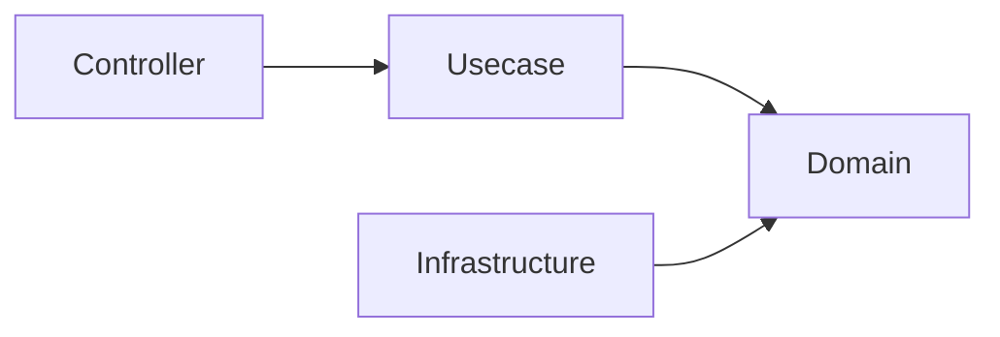
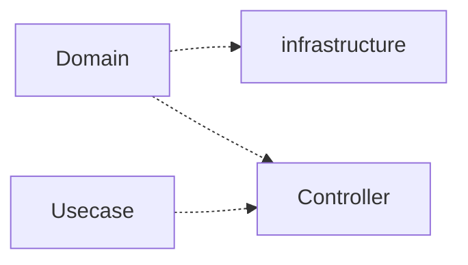
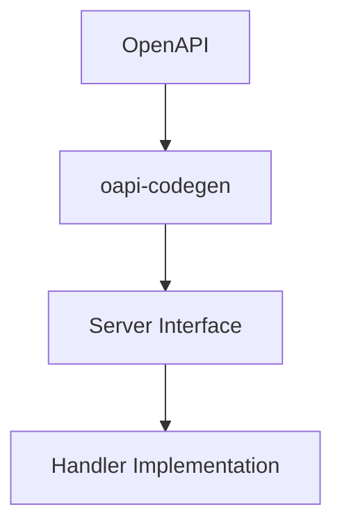
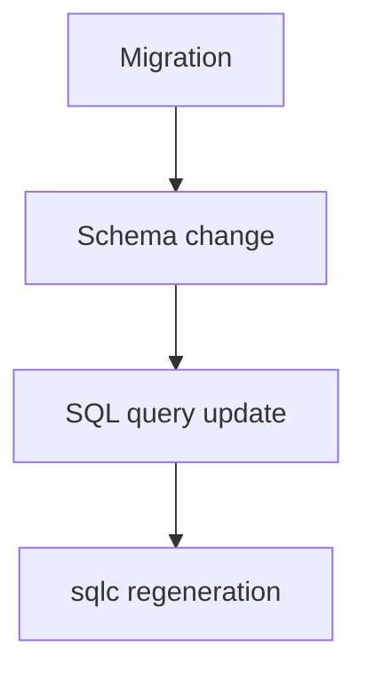

# アーキテクチャルール

このドキュメントは、このプロジェクトにおける **破ってはいけないアーキテクチャルール** を定義します。

これらのルールは **人間の開発者** と **AIエージェント** の両方が必ず遵守する必要があります。

これらのルールに違反すると、システムのアーキテクチャ整合性が損なわれる可能性があります。

## レイヤ依存ルール

依存関係は常に **内側のレイヤへ向かう** 必要があります。

### 許可される依存



### 禁止される依存



**domain レイヤは常に最も独立したレイヤである必要があります。**

### 理由

このルールにより、ドメインモデルがフレームワークやインフラストラクチャに依存することを防ぎます。

これらの境界はドキュメント上の取り決めに留まらず、**CI の `golangci-lint` depguard で強制**されます。禁止された cross-layer import（例: `domain` が `infrastructure` を import、`pkg/` が `internal/` を import）はビルドを失敗させます。

## Usecase 依存ルール

Usecase は Infrastructure に直接依存してはなりません。

- 依存は必ず Boundary（interface）を通す
- Infrastructure 実装は DI によって注入される

```txt
Usecase → Boundary(interface) → Infrastructure
```

## 生成コードルール

一部のファイルは **自動生成されるコード** です。

これらのファイルは **手動で編集してはいけません**。

### 生成コードの例

例：

- OpenAPI から生成されたサーバコード
- sqlc によって生成されたクエリバインディング
- mock 生成ファイル

### ルール

生成コードは常に **ソース定義から完全に再生成できる状態**である必要があります。

生成コードを変更する必要がある場合は、  
**生成元の定義を変更してください。**

例：

|生成コード|ソース|
|---|---|
|OpenAPI server code|OpenAPI specification|
|SQL bindings|SQL query files|
|Mocks|Interface definitions|

## OpenAPI-first

API の変更は必ず **OpenAPI 定義から開始**します。



### OpenAPI-first ルール

- API 契約を定義する前に handler を実装してはいけません
- 生成された API インターフェースを手動で編集してはいけません

OpenAPI 定義は **APIの唯一のソース（Single Source of Truth）** です。

## データベースマイグレーション

データベーススキーマの変更は、厳格なマイグレーションルールに従う必要があります。

### マイグレーションルール

- 既存の migration ファイルを **変更してはいけません**
- migration は **append-only（追記のみ）** です
- スキーマ変更は必ず **migration から開始**します

### 典型的なフロー



これにより、データベースの履歴を常に再現可能に保つことができます。

## Domain レイヤ制約

Domain レイヤは **純粋かつ独立した状態** を保つ必要があります。

Domain レイヤでは以下の処理を **行ってはいけません**。

### Domain で禁止されること

- 外部 I/O
- データベースアクセス
- 環境変数の取得
- フレームワーク依存
- ログ出力
- HTTP ロジック

### Domain で許可されるもの

- Entity
- Value Object
- Domain Service
- ビジネスルール
- Repository インターフェース

## Context 伝搬ルール

- context.Context は必ず下位レイヤへ伝搬する
- 新規に context を生成してはいけない（例: context.Background）

## Infrastructure 実装ルール

Infrastructure コンポーネントは  
**Domain のインターフェースを実装する役割**を持ちます。

ルール：

- Infrastructure にドメインロジックを書いてはいけません
- Infrastructure は domain インターフェースに依存します
- Infrastructure は外部システムにアクセスできます

例：

- database adapter
- 外部 API クライアント
- repository 実装

## Repository / QueryService ルール

- Repository は Aggregate の永続化と、単一 Aggregate の単純な読み取りを扱う
  （ID 取得、および Aggregate 自身の属性による単純なフィルタ・一覧・件数取得）。
- QueryService は Aggregate を横断する読み取り、または高い検索複雑性を要する読み取りを扱う
  （複数テーブル結合・集計・キーワード/全文検索・専用 read model）＝CQRS の読み取り側。

禁止：

- Repository に Aggregate 横断や集計・結合のクエリを書くこと
- QueryService にドメインロジックを書くこと

## DTO / 型境界ルール

- OpenAPI の型を Usecase に渡してはいけない
- Controller で DTO に変換すること
- Domain は OpenAPI 型を知らない

### 境界の型変換

- フレームワーク/生成型（例: OpenAPI `openapi_types.UUID`）→ ドメイン型の変換は、**その型を所有する層にのみ**置く。HTTP では Controller の専用ヘルパー `internal/controller/conv` 経由とする。他層は生成/フレームワーク型を import しないため、依存方向で変換用途が境界に構造的に限定される。
- 利便性のために共有パッケージ（`pkg/`）へ**検証バイパスの公開コンストラクタを足さない**。バイパス入口は利用方針が時間とともに形骸化し、コードベース全体で乱用される。既存の検証済みコンストラクタ（`New` / `Parse`）を再利用すること。

## Infrastructure 型漏洩禁止

- sqlc の生成型を Usecase / Domain に渡してはいけない
- 必ず Domain Entity または DTO に変換する

## レイヤ責務ルール

各レイヤには明確な責務があります。

### Controller

責務：

- HTTP トランスポート
- リクエストバリデーション
- エラー変換

Controller に **ビジネスロジックを書いてはいけません**。

### Usecase

責務：

- アプリケーションワークフロー
- トランザクション境界
- ドメインロジックの調整

Usecase は **直接 Infrastructure に依存することを避けるべき**です。

### トランザクションルール

- トランザクションは Usecase 層でのみ開始する
- Infrastructure / Repository はトランザクションを開始してはいけない

## エラーハンドリングルール

- エラーを黙って握り潰さない。各エラーは「処理する」「`apperror` / `xerrors` でラップして伝播する」「**論理的に到達不能**で発生＝前提崩壊を意味するなら `panic` でラウドに通知する」のいずれかでなければならない。
- 「起き得ない失敗」は構造的に起こせなくするのを優先する。境界で値の有効性が既に保証される場合（例: echo で検証済みの path パラメータ）、防御的な `error` 戻りをスタックに引き回さず、**到達不能エラーで `panic` するヘルパー**経由で変換する。そのヘルパーは `Must` 系の明示的な命名にし、panic 経路を単体テストする。
- 理由: 到達不能な `if err != nil { return err }` はデッドコードであり、テスト不能・カバレッジ低下・意図の隠蔽を招く。`panic` は不変条件を文書化し、前提が破られたら確実に気づける。
- `apperror` センチネルを元エラーに付与する場合は `pkg/xerrors` を使う。元エラーを文字列へ潰す `Wrap(sentinel, err.Error())` より、型・スタックを chain に残して `Is` / `As` で辿れる `Join(sentinel, err)` を優先する。例外は2つ: 機密（クエリ・userinfo を含む URL 等）を含みうるエラーへの **redact** ルールと、**意図的な型消去** ルール — `Wrap` による潰しは意図的なこともある（元の型を chain から消す）ため、既存の正規化器を `Join` へ変える前に、その型に**マッチしないこと**に依存する下流の `Is` / `As` 述語（例: `*pgconn.PgError` の SQLSTATE を見る tx リトライ述語）をすべて確認する。完全な方針は [`pkg/xerrors/README.md`](../../pkg/xerrors/README.md) を参照。
- レスポンスで動的なエラー `code` / `details` を返す場合は、エラー発生箇所で `apperror.Meta` を付与する（`apperror.WithMeta` / `WithDetails`）。`Meta` は HTTP ステータスを運ばず、ステータスはセンチネル分類のみで解決する。`Details` には公開して安全な識別子のみ（例: 不正フィールド名）を入れ、理由文や入力値そのものを入れてはならない。理由はラップしたエラーメッセージ側に残し、ログ専用とする。理由: [ADR-0040](adr/0040-error-metadata-code-message-details.ja.md)。
- クライアントへ `details` を返すのは**エンドポイントごとの opt-in かつ fail-closed**。error レスポンスが `details` を運ぶのは、その operation が OpenAPI で `ErrorResponseWithDetails` スキーマを宣言している場合のみ（唯一の opt-in スイッチ）。opt-in していない operation では `errorhandler` が wire から `details` を落とす（`Meta` に details を付けるだけでは不十分）。ログには完全な `details` を残す。理由: [ADR-0041](adr/0041-error-details-opt-in-gate.ja.md)。

## コメントルール

コメントの権威は **godoc の慣習** — Go のデファクト標準 — であり、独自の分類ではない。
巨大な upstream（<https://go.dev/doc/comment>）を fetch せず、その要約ローカルミラー
（[`godoc-comment-conventions.ja.md`](maintenance/godoc-comment-conventions.ja.md)、canonical は `docs/maintenance/godoc-comment-conventions.md`）を読む。

- **doc コメント（export 宣言・パッケージ doc）は godoc の慣習に従う。** godoc は doc コメントを **API 利用者**向けにレンダリングするので、doc コメントは **呼び出し側が依拠する契約** — その宣言が何をするか、入出力・エラーの意味 — を `Name` 前置の完全な文で述べる。その契約が必要十分な内容であり、それ以上は書かない。
- **godoc が要求しないものはノイズ** — 利用者の役に立たないので書かない:
  - **How / 実装手段** — コードが語る。NG `// ReadFile は os.ReadFile を呼び出して…`；OK `// ReadFile は name のファイル内容全体を読み込んで返す`。
  - **どこから呼ばれるか** — 組織構造に結合した呼び出し元 / 登録場所メモ: `// 〜の登録は di 層が担う`。
  - **変更履歴 / 開発の経緯** — 移行履歴、障害の後日談、「なぜ移行したか」、`// テスト容易性のため` — これらは腐るので PR / commit ログに置く。
  - **言い換え / トートロジー** — `// 内部表現は [16]byte`、`// User は User です`；または下のコードが既に条件を満たしている解決済みの `// TODO:` / `// FIXME:` 残置（未解決の正当な TODO は対象外）。
- **正確が最優先。** 実挙動と食い違う/陳腐化した doc コメントは無コメントより有害＝最優先の指摘。
- **非自明な Why は、godoc が必須としないが本 repo が残す唯一の追加** — コードからは読み取れない判断の理由（load-bearing 制約 / 意図）。OK: `// upstream がバースト時にレート制限するため 3 回までリトライする`、`runtime.Caller` のスキップ段数の警告（「このヘルパーを抽出するな — スキップ段数がずれる」）。真に非自明な場合のみ書く。
- **関数内コメントは godoc の管轄外。** **非自明 かつ 無いと不明** な時のみ書く。上記のノイズ一覧はそのまま適用され、非自明な Why が主な正当ケース。
- **言語スコープ**: godoc は Go のみを統べるが、この内容基準は**言語非依存** — 非 Go（shell, `.mjs` / `.jsx`, Dockerfile, Makefile, SQL, YAML）にも等しく適用する。非 Go は**高リスク**で対象外ではない: `revive` は Go しか見ないため、非 Go では `comment-reviewer` レビューが唯一のチェックになる。同基準で扱う — How ナレーション・経緯・言い換えは NG、非自明な Why は残す。
- **強制の分担**: `revive` の `exported` ルールは export 宣言の doc コメントの **有無**と **`Name` 前置の形式**しか保証しない。この **内容**ルール（godoc 準拠の契約 + 非自明な Why + ノイズなし）は意味的で lint 不能 — レビューで強制する: `impl-review` が専用の `comment-reviewer` agent を fan-out し、良いコメントの**検証**と ノイズの**検出**を行い、確定した指摘を自動修正する。

## ドキュメントルール

ソースコードコメント（*コメントルール* 参照）ではなく、独立した **ドキュメント散文** — `README*` / `docs/**` / ガイド — に適用する。これは **内容**の基準で、lint ではなくレビュー（`doc-reviewer` agent）で強制する。*コメントルール* から転用できる原則（正確性 / 有意性 / 経緯排除）は適用するが、差分として docs は What・Why・How のいずれも **歓迎**する。

- **正確**: 散文が実体（記述対象のコード・ファイル・コマンド・フラグ・API）と一致すること。コードから**乖離**した doc（削除済みシンボル、リネームされたファイル、変わったフラグ）は**最優先**の指摘 — 自信ありげに誤った doc は、無い doc より誤誘導する。散文を信じず、実コード/ファイルと突き合わせて検証する。
- **有意**: 自明を超えて情報を与えること。見出しやディレクトリ名の単なる言い換えのような埋め草は不可。
- **経緯排除**: 恒久 doc に開発の経緯を語らない。移行履歴・障害の後日談・「なぜ X から乗り換えたか」は release note（`.github/release/`）/ PR / commit ログに置き、常に真であるべき README には置かない。
- **冗長な言い換え排除**: 隣接する正典 doc やコードが既に述べていることを逐語的に複製しない。**リンク**で参照する。
- **What / Why / How すべて歓迎**: コードコメントと異なり、docs は **Why**（設計意図・根拠＝`docs/adr/` や設計セクションの役割）と **How**（使い方・チュートリアル・実行手順）を*書くべき*。これらは指摘対象ではない。
- この内容ルールの対象外（別ツールが担当）: ディスク上のファイルとの構造ドリフト（`sync-readme`）、portal 掲載価値のキュレーション（`readme-review`）。

## テストと完了の定義（Definition of Done）

> テストの具体的な *どう書くか*（構造・`正常系`/`異常系` の命名・`t.Parallel()`・`require` vs `assert`・table-driven `for` ループ禁止・mock 方針・カバレッジ例外のガバナンス）は [`testing-conventions.ja.md`](testing-conventions.ja.md) にある。本節は非交渉の *完了の定義* のみを定める。

- テストは**各層の実装と同居**させ、層ごとに検証する — その層のテストを書き、次へ進む前に `make test`（カバレッジ付き）を回す。テストを最終ステップにまとめないこと。先送りはカバレッジ不足を終盤まで隠す。
- 変更が「完了」とは、コンパイルが通ることではなく、**テスト済みでカバレッジ基準を満たす**こと（新規/変更パッケージ > 90%、handler はおおむね 100%）。`go build` の成功は完了の signal では**ない**。
- 「コンパイル可 ≠ 完了」は配線にも適用する: DI グラフの正しさは **runtime**（アプリが起動し `[Fx] RUNNING` に到達する）で検証する。ビルドや unit テストだけでは不十分。
- 意図的に到達不能な防御分岐（あり得ない `switch` の default、失敗し得ない前提を守る `panic`、強制困難なインフラのエラー経路）は未カバーで許容する — テストを歪めて到達させるのではなく、アサーションとして残す。
- テスト環境は `make db-init` 実行済みを前提とする: local/test 両 DB を migrate **かつ seed** する。`make serve` の後にまず `make db-init` を走らせること。seed を伴わない `db-*-migrate-up` 単体では DB 依存テストが落ちる。
- mock した unit / integration テストに加え、`make serve` の実アプリに `curl` で新エンドポイントを smoke 検証する: mock は実 DI グラフ・実 DB・end-to-end 配線を通らない。構造化 observability ログ（`docker compose logs api_server` — 層ごとの span + logging DB driver が出力する実 SQL）を durable な検証エビデンスとして扱い、再確認は再実行せずログを読む。
- 破壊的なランタイム検証（dev DB に対する `POST` / `PUT` / `PATCH` / `DELETE`）は、非破壊な代替が無い場合は事前にユーザー確認する。検証後は `make db-init` で復元する。

## AIエージェントルール

AI が生成するコードも、すべてのアーキテクチャルールに従う必要があります。

AI エージェントは以下を守る必要があります。

- レイヤ境界を守る
- OpenAPI-first 開発を遵守する
- SQL ファイルを契約として扱う
- 生成コードを編集しない

コード生成を行う前に、AI エージェントは以下のドキュメントを参照してください。

- `architecture.ja.md`
- `development-flow.ja.md`

## ツールチェイン実行ルール

ツールのバージョンは `mise.toml`（単一の真実源）に固定され、コンテナ化された tool-runner 内で
実行することで、マシン間の再現性を保ちます。

- ツール実行（lint / format / codegen / doc 生成 / commit-message lint 等）は、tool-runner
  （`go_tool_runner` / `node_tool_runner` / `python_tool_runner`）内で走る `make` ターゲット経由で
  行います。
- 自動化（lefthook フック・CI・skill）は、これらのツールを必ず `make` ターゲット経由で実行し、
  ホスト上でツールを直接実行（例: `mise exec <tool> -- …` や素のツール binary）してコンテナを
  バイパスしてはなりません。再現性を壊し、ホスト固有のツール状態に依存するためです。
- `-ci` ターゲットが bare-metal 実行の正規経路です（CI ランナーやコンテナ内でツールを直接実行）。
  ホストの `mise` はバージョン供給（`make install-tools`・Quick Start）専用です。単発の人手による
  診断（バージョン確認等）はツール実行ではないため対象外です。

## Summary

これらのルールは以下を実現するために存在します。

- アーキテクチャ整合性の維持
- 保守しやすいコード構造
- 再現可能なビルド
- 人間とAIの安全な協働
