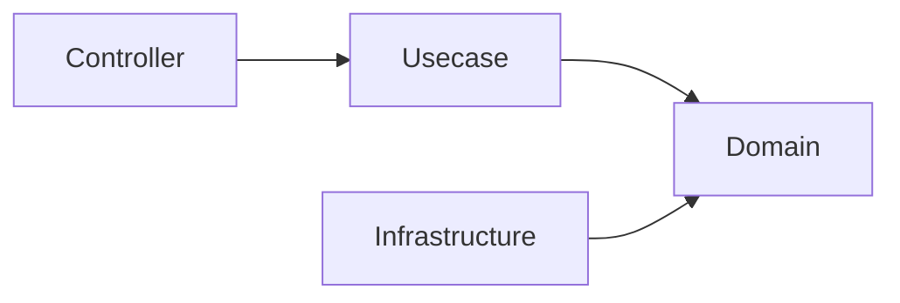
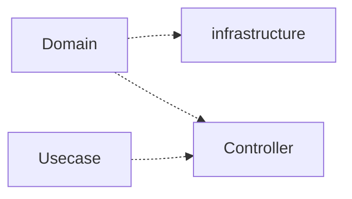
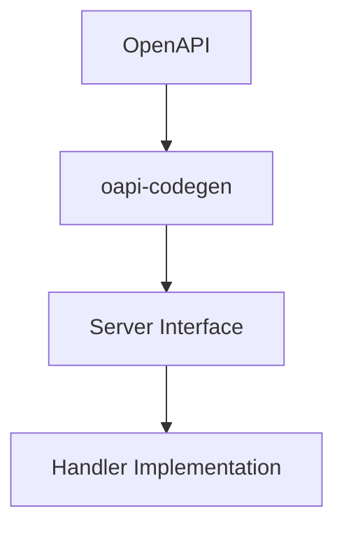
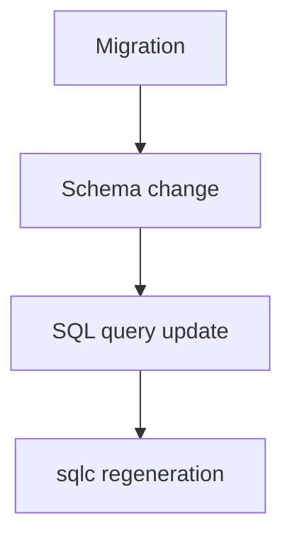

# アーキテクチャルール

このドキュメントは、このプロジェクトにおける **破ってはいけないアーキテクチャルール** を定義します。

これらのルールは **人間の開発者** と **AIエージェント** の両方が必ず遵守する必要があります。

これらのルールに違反すると、システムのアーキテクチャ整合性が損なわれる可能性があります。

## レイヤ依存ルール

依存関係は常に **内側のレイヤへ向かう** 必要があります。

### 許可される依存



### 禁止される依存



**domain レイヤは常に最も独立したレイヤである必要があります。**

### 理由

このルールにより、ドメインモデルがフレームワークやインフラストラクチャに依存することを防ぎます。

## Usecase 依存ルール

Usecase は Infrastructure に直接依存してはなりません。

- 依存は必ず Boundary（interface）を通す
- Infrastructure 実装は DI によって注入される

```txt
Usecase → Boundary(interface) → Infrastructure
```

## 生成コードルール

一部のファイルは **自動生成されるコード** です。

これらのファイルは **手動で編集してはいけません**。

### 生成コードの例

例：

- OpenAPI から生成されたサーバコード
- sqlc によって生成されたクエリバインディング
- mock 生成ファイル

### ルール

生成コードは常に **ソース定義から完全に再生成できる状態**である必要があります。

生成コードを変更する必要がある場合は、  
**生成元の定義を変更してください。**

例：

|生成コード|ソース|
|---|---|
|OpenAPI server code|OpenAPI specification|
|SQL bindings|SQL query files|
|Mocks|Interface definitions|

## OpenAPI-first

API の変更は必ず **OpenAPI 定義から開始**します。



### OpenAPI-first ルール

- API 契約を定義する前に handler を実装してはいけません
- 生成された API インターフェースを手動で編集してはいけません

OpenAPI 定義は **APIの唯一のソース（Single Source of Truth）** です。

## データベースマイグレーション

データベーススキーマの変更は、厳格なマイグレーションルールに従う必要があります。

### マイグレーションルール

- 既存の migration ファイルを **変更してはいけません**
- migration は **append-only（追記のみ）** です
- スキーマ変更は必ず **migration から開始**します

### 典型的なフロー



これにより、データベースの履歴を常に再現可能に保つことができます。

## Domain レイヤ制約

Domain レイヤは **純粋かつ独立した状態** を保つ必要があります。

Domain レイヤでは以下の処理を **行ってはいけません**。

### Domain で禁止されること

- 外部 I/O
- データベースアクセス
- 環境変数の取得
- フレームワーク依存
- ログ出力
- HTTP ロジック

### Domain で許可されるもの

- Entity
- Value Object
- Domain Service
- ビジネスルール
- Repository インターフェース

## Context 伝搬ルール

- context.Context は必ず下位レイヤへ伝搬する
- 新規に context を生成してはいけない（例: context.Background）

## Infrastructure 実装ルール

Infrastructure コンポーネントは  
**Domain のインターフェースを実装する役割**を持ちます。

ルール：

- Infrastructure にドメインロジックを書いてはいけません
- Infrastructure は domain インターフェースに依存します
- Infrastructure は外部システムにアクセスできます

例：

- database adapter
- 外部 API クライアント
- repository 実装

## Repository / QueryService ルール

- Repository は Aggregate 永続化のみを扱う
- 検索・一覧取得は QueryService に実装する

禁止：

- Repository に検索ロジックを書くこと
- QueryService にドメインロジックを書くこと

## DTO / 型境界ルール

- OpenAPI の型を Usecase に渡してはいけない
- Controller で DTO に変換すること
- Domain は OpenAPI 型を知らない

## Infrastructure 型漏洩禁止

- sqlc の生成型を Usecase / Domain に渡してはいけない
- 必ず Domain Entity または DTO に変換する

## レイヤ責務ルール

各レイヤには明確な責務があります。

### Controller

責務：

- HTTP トランスポート
- リクエストバリデーション
- エラー変換

Controller に **ビジネスロジックを書いてはいけません**。

### Usecase

責務：

- アプリケーションワークフロー
- トランザクション境界
- ドメインロジックの調整

Usecase は **直接 Infrastructure に依存することを避けるべき**です。

### トランザクションルール

- トランザクションは Usecase 層でのみ開始する
- Infrastructure / Repository はトランザクションを開始してはいけない

## AIエージェントルール

AI が生成するコードも、すべてのアーキテクチャルールに従う必要があります。

AI エージェントは以下を守る必要があります。

- レイヤ境界を守る
- OpenAPI-first 開発を遵守する
- SQL ファイルを契約として扱う
- 生成コードを編集しない

コード生成を行う前に、AI エージェントは以下のドキュメントを参照してください。

- `architecture.ja.md`
- `development-flow.ja.md`

## Summary

これらのルールは以下を実現するために存在します。

- アーキテクチャ整合性の維持
- 保守しやすいコード構造
- 再現可能なビルド
- 人間とAIの安全な協働
