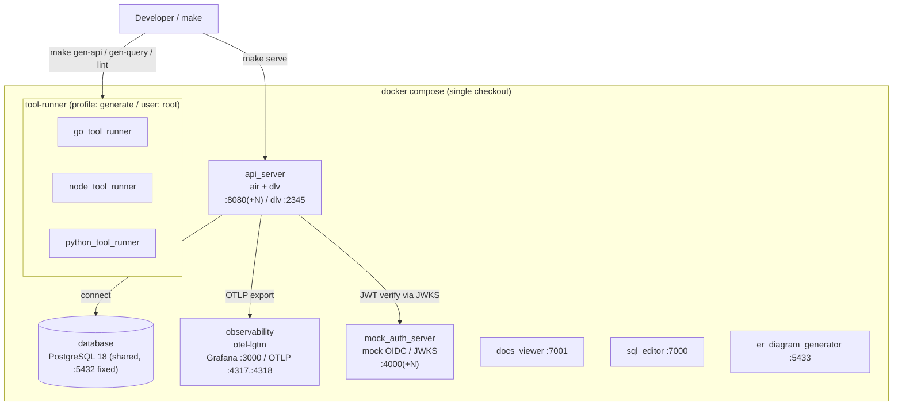
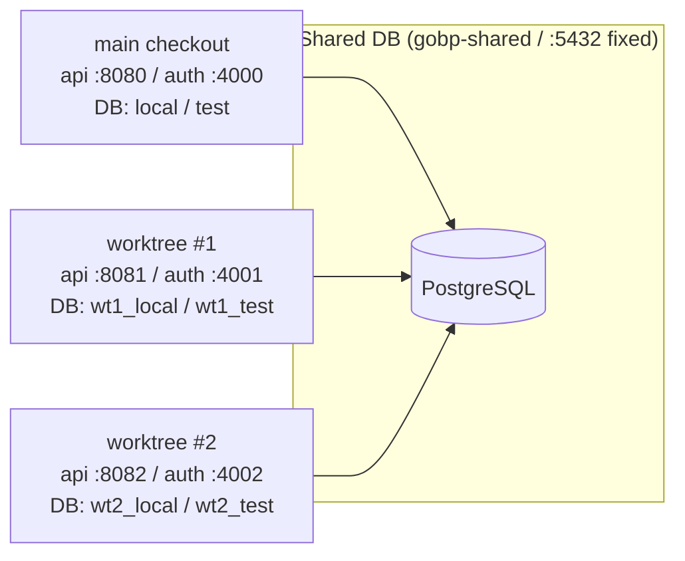

# Local Development Environment

日本語: [local-environment.ja.md](../ja/maintenance/local-environment.ja.md)

A single-page map of what makes up local development — the **Docker containers, hot reload
(air), code-generation runners, and the worktree slot ring behind `make serve`**. This page
only shows the **overall topology and division of responsibility**; the details of each part
are linked to their canonical documents rather than restated here (to avoid duplication and
drift).

- Full list of make targets → [`.makefiles/README.md`](../../.makefiles/README.md)
- Generated-artifact / root-owned / DB-down gotchas → the `repo-ops` skill
- worktree × DB slot pool details → [db-worktree-pool.md](db-worktree-pool.md)
- o11y export wiring → [design/observability.md](../design/observability.md); authentication (mock OIDC) → [design/auth.md](../design/auth.md)

## Overview

## Containers

| Service | Origin | Host port | Role |
| --- | --- | --- | --- |
| `api_server` | build `docker/server/Dockerfile` | `${API_HOST_PORT:-8080}:8080` (internal always 8080) + dlv `:2345` | The app itself. The dev target starts via **air** for hot reload + delve debugging |
| `database` | `postgres:18.3-bookworm` | `5432` fixed | A **single** instance shared by all worktrees (parallelism is by DB name — see the slot ring below) |
| `observability` | `grafana/otel-lgtm` | `3000` (Grafana UI) / `4317` (OTLP gRPC) / `4318` (OTLP HTTP) / `3200` (Tempo API) | Sink for traces / metrics / logs. profile: `development` |
| `mock_auth_server` | build `docker/mock-auth-server/Dockerfile` | `${MOCK_AUTH_HOST_PORT:-4000}:4000` (internal 4000) | Mock OIDC auth server (JWT test provider); the JWKS-verification counterpart of the RS side |
| `docs_viewer` | build `docker/document/Dockerfile` | `7001:80` | Development documentation viewer |
| `sql_editor` | `sosedoff/pgweb` | `7000:8081` | Browser DB client |
| `er_diagram_generator` | `schemaspy/schemaspy` | `5433:3000` | ER diagram generation |
| `go_tool_runner` / `node_tool_runner` / `python_tool_runner` | build `docker/tools/Dockerfile` (per target) | none (exec) | Toolboxes for code generation / lint. **`user: root`**, profile: `generate`, repo bind-mounted at `.:/app` |

> `docs_viewer` / `sql_editor` are moved to the **7000 range** to avoid colliding with the API slot band (8080–8087).

## Hot reload (air + delve)

The dev target of `api_server` runs `CMD ["air", "-c", ".air.toml"]`. [`.air.toml`](../../.air.toml)
watches `.go` changes under `internal` / `cmd` / `pkg`, runs `go build` (`-gcflags='all=-N -l'`
to keep debug info) → produces `tmp/main` → launches `serve` under **delve**
(`dlv --listen=:2345 --headless … exec --continue`). Saving a source file auto-rebuilds and
restarts, and you can attach an IDE remote debugger to `:2345`.

## Code-generation runners (tool-runner)

`make gen-api` / `gen-query` / `lint` and friends run **inside tool-runner containers**, not
against the host's Go/Node/Python (the go / node / python targets of `docker/tools/Dockerfile`).
The repo is bind-mounted at `.:/app` and the process runs as **root** inside the container, so a
common gotcha is that generated artifacts become root-owned on the host and `git` can no longer
touch them. **See the `repo-ops` skill for the exact recovery commands** (not restated here).
Target list: [`.makefiles/README.md`](../../.makefiles/README.md).

## server + API slot ring (worktree parallelism)

The mechanism that lets multiple git worktrees (and the main checkout) use a **single shared
Postgres (host 5432, fixed)** in parallel without collision. The **separation axis is "a database
name inside the shared DB", not "a DB on a different port"**; only the `make serve` app and tool
host ports are shifted by the slot number `N`.

- The **DB port is fixed at `5432`** (not `5432+N`). Slot `N` is separated by DB name `wt<N>_local` / `wt<N>_test`.
- `API_HOST_PORT = 8080+N` (to parallelize `make serve`), `MOCK_AUTH_HOST_PORT = 4000+N`.
- A worktree's app is started in isolation as the `gobp-wt-N` project via `docker-compose.pool.yaml`, connecting to its own slot DB in the shared instance through `DB_HOST: host.docker.internal`.
- **All details — leasing, bootstrap, `make db-acquire` / `db-release`, etc. — are in the canonical [db-worktree-pool.md](db-worktree-pool.md).**

## Related documents

| Purpose | Reference |
| --- | --- |
| Make target list | [`.makefiles/README.md`](../../.makefiles/README.md) |
| worktree × DB slot pool (canonical) | [db-worktree-pool.md](db-worktree-pool.md) |
| Generated-artifact / root-owned / DB-down recovery | the `repo-ops` skill |
| Observability export wiring | [design/observability.md](../design/observability.md) |
| Authentication (mock OIDC / JWKS) | [design/auth.md](../design/auth.md) |
