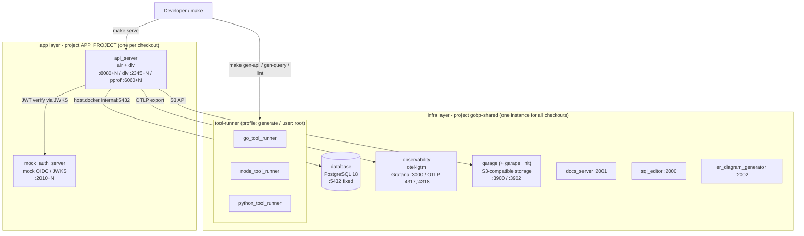
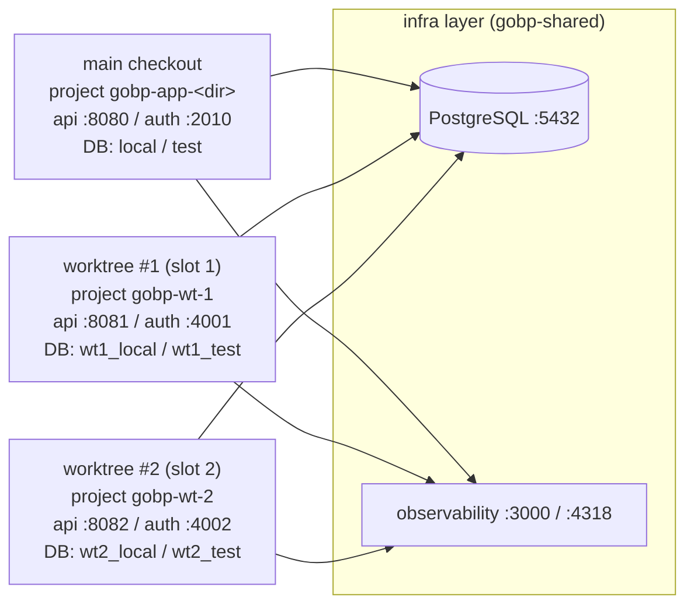

# Local Development Environment

日本語: [local-environment.ja.md](local-environment.ja.md)

A single-page map of what makes up local development — the **two-layer docker compose model
(shared infra / per-checkout app), hot reload (air), code-generation runners, and the worktree
slot ring behind `make serve`**. This page only shows the **overall topology and division of
responsibility**; the details of each part are linked to their canonical documents rather than
restated here (to avoid duplication and drift).

- Full list of make targets → [`.makefiles/README.md`](../../.makefiles/README.md)
- Generated-artifact / root-owned / DB-down gotchas → the `repo-ops` skill
- worktree × DB slot pool details → [db-worktree-pool.md](db-worktree-pool.md)
- o11y export wiring → [design/observability.md](../design/observability.md); authentication (mock OIDC) → [design/auth.md](../design/auth.md)

## Overview



## Compose layering (infra / app)

Compose services are split into two layers so that the main checkout and any number of
worktrees can `make serve` at the same time. The variables below are defined in
[`.makefiles/docker/compose.mk`](../../.makefiles/docker/compose.mk).

| Layer | compose project | Services | Lifecycle |
| --- | --- | --- | --- |
| **infra** | `INFRA_PROJECT` = `gobp-shared` (fixed name) | `database` / `observability` / `garage` (+ `garage_init`) — everything that can only run on a fixed port | `make infra-up` starts it; `make serve` / `job` / `worker` / `outbox-relay` call it idempotently first. `make infra-down` stops it **for every checkout** |
| **app** | `APP_PROJECT` = `gobp-wt-N` while a DB slot is held, otherwise `gobp-app-<directory name>` | `api_server` / `mock_auth_server` | `make serve` starts it; `make serve-stop` stops **only this checkout's** app |

- The app layer is started as `docker compose -p $(APP_PROJECT) -f docker-compose.yaml -f docker-compose.attach.yaml --profile development`.
  [`docker-compose.attach.yaml`](../../docker-compose.attach.yaml) is **always** overlaid (not only when a slot is held), and it repoints
  the app at the shared infra via `host.docker.internal` by overriding `DB_HOST` / `OBS_OTLP_ENDPOINT` /
  `OBJECT_STORAGE_ENDPOINT` / `AUTH_ISSUER` as runtime env — `internal/config`'s loader gives runtime env
  priority over `env/.env`.
- Every app-layer host port is relative to the slot number `N`: API `8080+N` / mock auth `2010+N` /
  dlv `2345+N` / pprof `6060+N` (plain `8080` / `2010` / `2345` / `6060` when no slot is held). The
  container-internal ports never move.
- Observability is **shared across checkouts**: the traces / metrics / logs of every running app land in
  the single Grafana at `http://localhost:3000`.
- DB tooling (`make db-migrate-*` / `db-seed` / `db-drop-tables` / `gen-query`, i.e. the
  `docker compose run --rm *_tool_runner` and `docker compose exec database` calls) leaves the project name
  implicit; `compose.mk` defaults `COMPOSE_PROJECT_NAME` to `gobp-shared` so those containers join the infra
  network. The auxiliary services (`docs_server` / `sql_editor` / `er_diagram_generator`) live in the same
  project.

## Containers

| Service | Layer | Origin | Host port | Role |
| --- | --- | --- | --- | --- |
| `api_server` | app | build `docker/server/Dockerfile` | `${API_HOST_PORT:-8080}:8080` / dlv `${DLV_HOST_PORT:-2345}:2345` / pprof `${PPROF_HOST_PORT:-6060}:6060` (internal ports fixed) | The app itself. The dev target starts via **air** for hot reload + delve debugging |
| `mock_auth_server` | app | image `ghcr.io/navikt/mock-oauth2-server` (config: `docker/mock-auth-server/config.json`) | `${MOCK_AUTH_HOST_PORT:-2010}:4000` (internal 4000) | Mock OIDC provider; the JWKS-verification counterpart of the RS side |
| `database` | infra | `postgres:18.4-trixie` | `5432` fixed | A **single** instance shared by all checkouts (parallelism is by DB name — see the slot ring below) |
| `observability` | infra | `grafana/otel-lgtm` | `3000` (Grafana UI) / `4317` (OTLP gRPC) / `4318` (OTLP HTTP) / `3200` (Tempo API) | Sink for traces / metrics / logs of every checkout. profile: `development` |
| `garage` | infra | `dxflrs/garage` | `3900` (S3 API) / `3902` (Web API) | S3-compatible object storage for local development (tests use in-process gofakes3 instead). The Web API delivers objects anonymously — see [`docker/README.md`](../../docker/README.md) |
| `garage_init` | infra | build `docker/garage/Dockerfile` | none (one-shot) | Idempotent provisioning of the garage layout / bucket / access key / website access |
| `elasticmq` | infra | `softwaremill/elasticmq-native` | `9324` (SQS API) | SQS-compatible broker for local development (tests use an in-process fake). Shared across checkouts and **cannot** be isolated per slot — see [`db-worktree-pool.md`](db-worktree-pool.md) |
| `docs_server` | infra | build `docker/document/Dockerfile` | `2001:80` | Serves `docs/` for local development |
| `sql_editor` | infra | `sosedoff/pgweb` | `2000:8081` | Browser DB client |
| `er_diagram_generator` | infra | `schemaspy/schemaspy` | `2002:3000` | ER diagram generation |
| `go_tool_runner` / `node_tool_runner` / `python_tool_runner` | infra | build `docker/tools/Dockerfile` (per target) | none (run/exec) | Toolboxes for code generation / lint. **`user: root`**, profile: `generate`, repo bind-mounted at `.:/app` |

### Host port allocation

A host port is chosen by one rule:

> **If the service has a de-facto port, use it. If it has none — that is, the number would be
> arbitrary — put it in the `2000` range as a contiguous block.**

`5432` / `8080+N` / `2345+N` / `6060+N` / `4317` / `4318` / `3000` / `3200` / `3900` / `3902` /
`9324` are the upstream defaults of PostgreSQL, Delve, Go pprof, OpenTelemetry, Grafana, Tempo,
garage and elasticmq, so they stay where a reader already expects them. `sql_editor`,
`docs_server`, `er_diagram_generator` and `mock_auth_server` have no such number — pgweb, nginx and
schemaspy only fix their *container-internal* ports (8081 / 80 / 3000), and pgweb's 8081 falls inside
the API slot band (`8080+N`) anyway — so they occupy `2000`, `2001`, `2002` and `2010+N`.

The `2000` range was picked because nothing actually listens there on macOS or Windows. The names
registered in it (`callbook`, `dectalk`, `troff`, `xinupageserver` …) are dead protocols with no
implementation on any current OS, unlike `5000` and `7000`, which the macOS AirPlay receiver holds
for real. **Do not go past `2048`: `2049` is NFS.**

Adding a service: `2003`–`2009` for a fixed port, `2030+` for one that needs a per-slot range.

### Collation version mismatch after a `database` base-OS change

`pg_data` outlives the container, so a `database` image whose base OS carries a different glibc
makes every existing database report a collation version mismatch — PostgreSQL records the glibc
collation version at `CREATE DATABASE` time and complains once the running OS disagrees:

```txt
WARNING:  database "local" has a collation version mismatch
DETAIL:  The database was created using collation version 2.36, but the operating system provides version 2.41.
```

Connecting to an existing database only warns, but `CREATE DATABASE` against a mismatched
`template1` is a hard error:

```txt
ERROR: template database "template1" has a collation version mismatch (SQLSTATE XX000)
```

So only the paths that create a database fail — `make slot-acquire` on a slot whose `wt<N>` databases
do not exist yet, and the `internal/cli/dbslot` tests, which create throwaway databases. Re-acquiring
an already-provisioned slot and `make db-*-reinit` keep working, since they only touch tables inside
existing databases. Their warning is not noise to ignore, though: it is the same index-ordering
disagreement, just not yet fatal.

Recreating the databases is therefore not a workaround, and would not clear the warning anyway:
`CREATE DATABASE` copies `datcollversion` from `template1`, which carries the old value too.
Reindex and refresh every database in the shared instance once, `template1` included:

```sh
docker exec gobp-shared-database-1 bash -c 'for db in $(psql -U postgres -Atc "select datname from pg_database where datallowconn"); do psql -U postgres -q -d "$db" -c "REINDEX DATABASE \"$db\";" -c "ALTER DATABASE \"$db\" REFRESH COLLATION VERSION;"; done'
```

The reindex is what makes the refresh honest — text index ordering was built under the old
collation, so refreshing the recorded version without rebuilding would simply hide the
disagreement. On a local dataset this takes seconds. CI is unaffected: its `database` service
container starts from an empty volume every run.

The shared instance is what makes this bite twice. While one checkout runs the new `database`
image and another still runs the old one, whichever ran `make infra-up` last owns the container,
and the volume's recorded collation version follows it — so the mismatch reappears in the other
direction and has to be refreshed again. Until every checkout is on the same `database` image,
expect to re-run the command above after another checkout brings the shared infra up.

`garage` sits on the same seesaw, and it fails harder and more quietly. A newer server migrates the
metadata volume in place, and the older major then cannot read what it wrote:

```txt
Error: Internal error: Remote error: Unable to decode entry of bucket_v2
```

The compose healthcheck does not catch this — it runs `garage status`, which reports node liveness,
not table readability, so the node comes up **healthy** while every bucket lookup fails and the
breakage surfaces later as S3 errors. Worse, `garage_init` reads that failure as "no bucket yet" and
creates a fresh one, orphaning whatever objects the bucket held. Moving back to the newer image
restores decodability, but the re-created bucket stays empty — re-seed it with `make db-local-seed`.

Nothing here is precious (dev-only object storage, seeded from `storage/seed/`), so the practical
rule is to get every checkout onto the same `garage` image rather than to defend the volume. When
that is not yet possible and the volume holds something you want back, snapshot before letting the
shared infra change hands:

```sh
docker compose -p gobp-shared exec garage /garage -c /etc/garage.toml meta snapshot --all
```

## Hot reload (air + delve)

The dev target of `api_server` runs `CMD ["air", "-c", ".air.toml"]`. [`.air.toml`](../../.air.toml)
watches `.go` changes under `internal` / `cmd` / `pkg`, runs `go build` (`-gcflags='all=-N -l'`
to keep debug info) → produces `tmp/main` → launches `serve` under **delve**
(`dlv --listen=:2345 --headless … exec --continue`). Saving a source file auto-rebuilds and
restarts, and you can attach an IDE remote debugger to the published dlv port (`2345+N`).

## Code-generation runners (tool-runner)

`make gen-api` / `gen-query` / `lint` and friends run **inside tool-runner containers**, not
against the host's Go/Node/Python (the go / node / python targets of `docker/tools/Dockerfile`).
The repo is bind-mounted at `.:/app` and the process runs as **root** inside the container, so a
common gotcha is that generated artifacts become root-owned on the host and `git` can no longer
touch them. **See the `repo-ops` skill for the exact recovery commands** (not restated here).
Target list: [`.makefiles/README.md`](../../.makefiles/README.md).

### Image builds borrow the host's GitHub token

Both the tool-runner image and the `api_server` tooling image resolve their tools with `mise`, which
reads the GitHub Releases API. Unauthenticated calls are capped at **60 per hour per IP** — less than a
single build needs, since every `mise install` re-resolves the whole `mise.toml`. The build therefore
fails with `403 Forbidden`, and because each attempt exhausts the fresh quota, the reset window just
moves forward on every retry.

`make` resolves a token (an already-set `GITHUB_TOKEN` first, otherwise `gh auth token`) and hands it to
the build as a **BuildKit secret**, which raises the ceiling to 5,000 per hour. The secret is mounted
only for the `mise install` layer, so the token reaches neither an image layer, nor `docker history`,
nor the running container. Without `gh` and without `GITHUB_TOKEN` nothing breaks: the build falls back
to unauthenticated calls, which suffices while the layer is cached or the hourly budget is unspent.

## server + API slot ring (worktree parallelism)

The mechanism that lets multiple git worktrees (and the main checkout) use the **single shared
infra** in parallel without collision. The **separation axis is "a database name inside the shared
DB", not "a DB on a different port"**; only the app-layer host ports are shifted by the slot number `N`.



- The **DB port is fixed at `5432`** (not `5432+N`). Slot `N` is separated by DB name `wt<N>_local` / `wt<N>_test`.
- `API_HOST_PORT = 8080+N`, `MOCK_AUTH_HOST_PORT = 2010+N`, `DLV_HOST_PORT = 2345+N`, `PPROF_HOST_PORT = 6060+N`.
- A checkout that never acquires a slot keeps the default DB names (`local` / `test`) and the default ports,
  so acquiring a slot is an **opt-in for parallel work** rather than a prerequisite.
- **All details — leasing, bootstrap, `make slot-acquire` / `slot-free` / `slot-release`, etc. — are in the canonical [db-worktree-pool.md](db-worktree-pool.md).**

## Related documents

| Purpose | Reference |
| --- | --- |
| Make target list | [`.makefiles/README.md`](../../.makefiles/README.md) |
| worktree × DB slot pool (canonical) | [db-worktree-pool.md](db-worktree-pool.md) |
| Generated-artifact / root-owned / DB-down recovery | the `repo-ops` skill |
| Observability export wiring | [design/observability.md](../design/observability.md) |
| Authentication (mock OIDC / JWKS) | [design/auth.md](../design/auth.md) |
