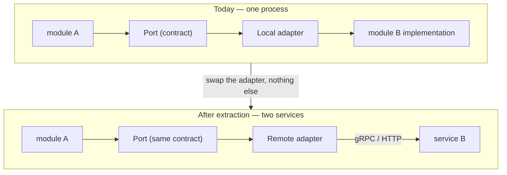
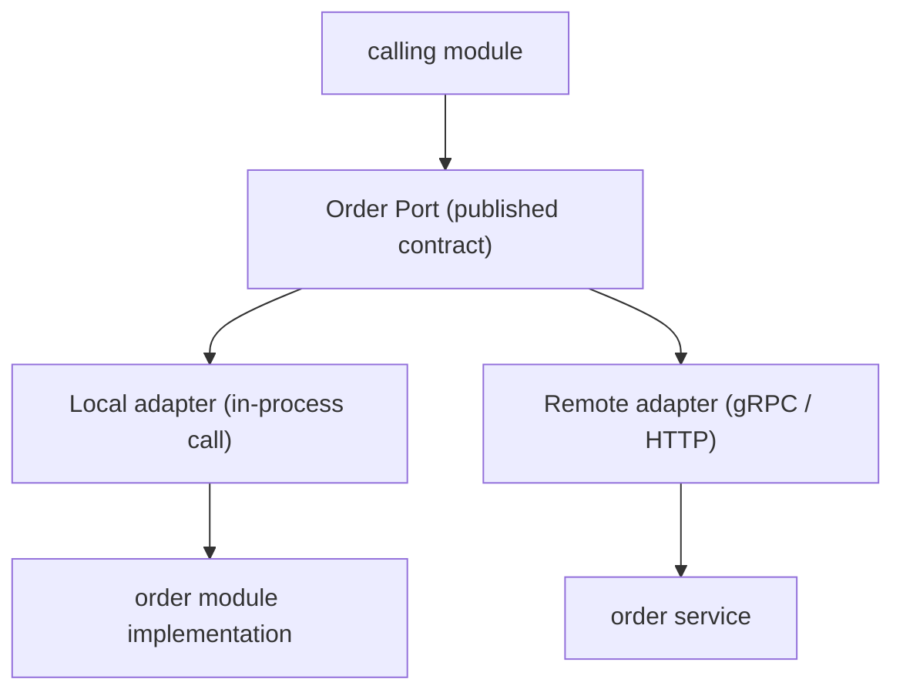
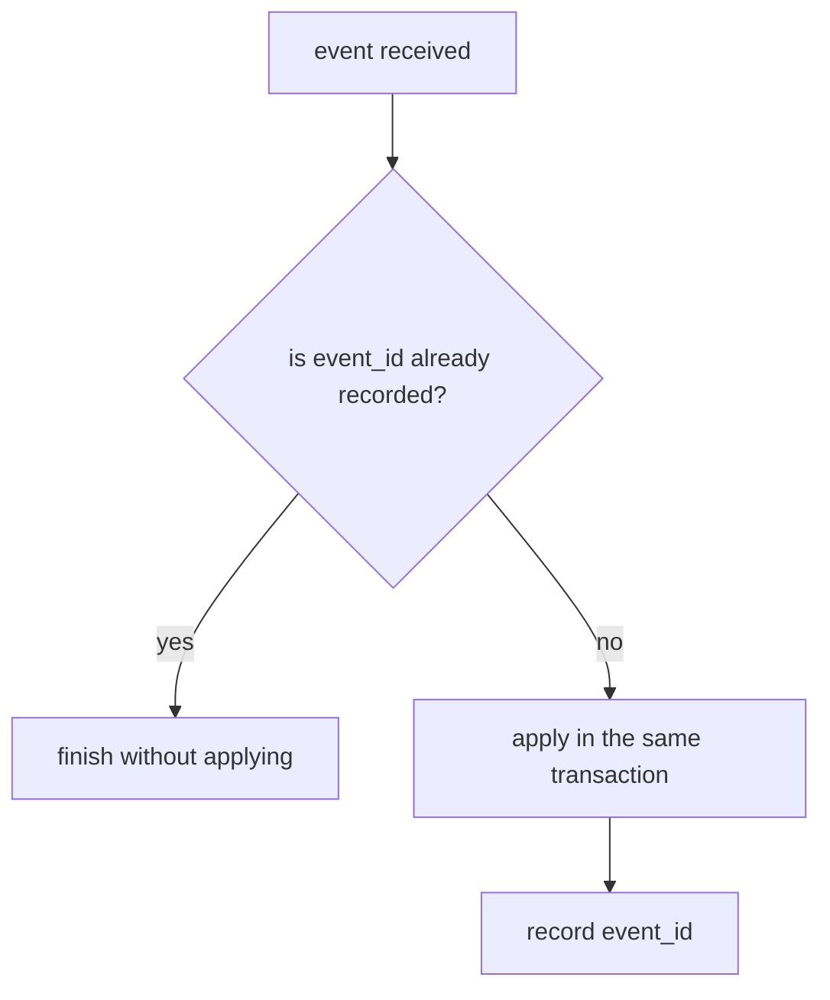
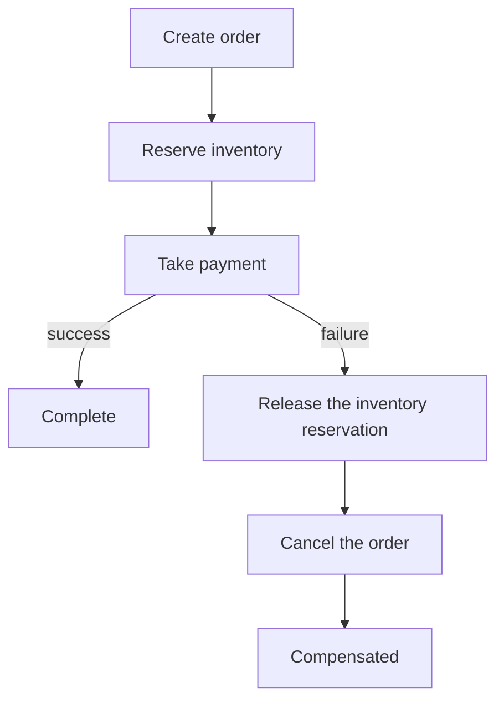

# Distributed Ready Architecture (v3 requirements)

English | [日本語](distributed-ready-architecture.ja.md)

The v3 line is trying to answer one question. **Can a modular monolith stay a modular monolith, and
still behave as a distributed system the moment a boundary is crossed?**

Becoming microservices is not the premise. Taking that premise costs the speed of early development
and the freedom to redraw a boundary that has not settled yet. What is aimed at is one sentence:

> Modular Monolith First, Distributed Ready Architecture

Principles:

- Early development runs at the speed of a modular monolith
- Module boundaries are declared, not implied
- Distribution is chosen per boundary and later, never for the whole system up front
- In-process calls and service-to-service calls are expressed by the same contract
- The failures specific to a distributed environment are treated as the normal case, not the exception

## What this line changes, and what it does not

What does not change is the onion layering, and the fact that development starts in a single
process. What changes is one thing: **a module stops referring to another module directly and goes
through a contract (a Port)** — which reduces distribution to swapping the adapter behind that
contract.



The calling code is identical in both halves of the diagram. For as long as that holds, distributing
a boundary is a deployment choice rather than a design change.

## Declaring the boundaries

### Module Boundary Layer

Turns inter-module dependencies from direct references into contracts, so a module can later be
extracted into a service.



Required:

- Module interface definition and module contract
- Port / adapter structure
- Dependency-direction constraints
- A boundary between a module's published API and its internal one

**Where a boundary may be cut is not a new question this layer decides.** That the aggregate is the
design unit is settled by the [domain README](../../internal/domain/README.md), and where an
operation crossing an aggregate boundary belongs is settled by
[ADR-0032 (commandservice-atomicity-criterion)](../adr/0032-commandservice-atomicity-criterion.md).
What this line adds is only what those criteria mean once they are read as an extraction decision.

- **A consistency requirement is a veto, not a selection criterion.** Invariants that must hold at
  the same instant cannot be cut through. But that decides only where a cut is *forbidden*; the
  reason to cut comes from elsewhere — divergent rates of change, team ownership, asymmetric load,
  a fault-isolation requirement. Running on the veto alone permits splits that add round trips and
  buy nothing.
- **A condition that is only read carries the same veto.** A guard that reads another aggregate to
  decide whether an operation is allowed writes nothing, so a write-atomicity criterion never fires
  on it — yet under READ COMMITTED the condition it read is not held. **"No write crosses the
  boundary" is not proof that the boundary is safe to cut.**

### Internal Communication Layer

Switches between in-process and distributed communication transparently from the caller's side.

| Transport | Used for | What the call actually is |
| --- | --- | --- |
| Local | Same process | A function call |
| HTTP | After extraction (interop with existing systems) | An HTTP request |
| gRPC | After extraction (default for internal traffic) | A gRPC call |

Required:

- A transport interface with those three implementations behind it
- Request / response DTOs
- Error mapping that preserves meaning across transports

### Contract Management

Keeps inter-module and inter-service contracts in a form where a breaking change is detected rather
than discovered.

Required:

- OpenAPI contract / gRPC proto contract / event schema contract
- API versioning and breaking-change detection
- Contract tests

The subjects are request, response, error and event payload — each a surface where "one side can be
updated alone" is the shape the incident takes.

### Database Boundary Support

Enables a staged move toward database-per-module. Whether the databases are actually split can be
decided later; **who owns which table** cannot — a boundary that was never assigned cannot be cut
afterwards.

Required:

- Per-module schema and migration boundary
- DB ownership rules
- Control over cross-module queries
- The read-model pattern

## Keeping asynchronous work consistent

### Domain Event Foundation

The substrate for asynchronous collaboration across boundaries.

```json
{
  "event_id": "…",
  "event_type": "OrderCreated.v1",
  "aggregate_id": "…",
  "occurred_at": "…",
  "payload": {}
}
```

Required:

- Domain event definitions and an event envelope
- Event versioning
- Event publisher / consumer / handler
- Retry handling and a dead letter queue

### Outbox Pattern Enhancement

Guarantees that a database update and the event it announces agree. The transactional outbox
introduced in v2 is extended into the path that carries inter-module events.

Required:

- Outbox table and publisher worker
- Delivery-status and retry management
- A recovery route for failures

### Inbox Pattern

Stops a duplicated event from being applied twice on the receiving side. What an outbox guarantees is
*at least once*; a receiver built on the assumption that **the same event will arrive again** is the
other half that makes the pair behave as exactly-once.



Required:

- Received-event management and event-ID storage
- Duplicate detection

### Idempotency Layer

Provides retry tolerance across the three surfaces that need it: API, command, and event handler.

Required:

- Idempotency keys and request deduplication
- Response caching
- Operation-status management

### Saga / Distributed Transaction

Handles a business transaction that spans boundaries through compensation rather than two-phase
commit.



Required:

- Saga state machine and coordinator
- Compensating actions
- Timeout handling and failure recovery

## Separating reads

### Query Separation Layer

Once boundaries are distributed, a join across several modules can no longer be written. That
constraint is answered structurally on the read side.

Required:

- Query service and read model
- Projections / materialized views
- Positioned as the continuation of the lightweight CQRS introduced in v2

## Observing what is distributed

### Distributed Context Management

Keeps a single request traceable after it has crossed process boundaries.

Required:

- Trace ID / correlation ID / request ID
- Context propagation
- W3C Trace Context support

### Distributed Logging

Makes a flow that spans services reconstructable from the logs alone.

Required fields:

| Field | Meaning |
| --- | --- |
| `service` | Which service emitted it |
| `module` | Which module inside that service |
| `trace_id` | Which request it belongs to |
| `span_id` | Which step within it |
| `event` | What happened |

Required:

- Structured logging with trace integration
- Event logging

## Communicating on the assumption of failure

### Resilience Layer

Communication control that assumes the network fails. Every failure an in-process call never had to
consider becomes possible the moment the boundary is crossed.

Required:

- Timeout, retry, exponential backoff, jitter
- Circuit breaker, bulkhead, rate limit

### Service Discovery Support

Manages where a service actually is, without binding the answer to one runtime.

Required:

- A service resolver interface
- DNS discovery, Kubernetes services, and cloud discovery behind it

### Configuration Management

Manages configuration for several modules and services, split along the same boundaries.

Required:

- Module config and service config
- A secret-provider interface
- Environment separation and dynamic configuration support

## Drawing the trust boundaries

### Authentication / Authorization Boundary

Service-to-service authentication and authorization. What a calling convention was enough for inside
one process becomes, across a boundary, the problem of **proving who the caller is**.

Required:

- Service identity and service-to-service authentication
- JWT validation and JWKS
- Permission propagation

### Distributed Security

The security boundary of a distributed deployment.

Required:

- Room to adopt mTLS
- Credential rotation and secret injection
- Network-policy support

## Verifying and migrating

### Distributed Testing

Quality assurance for a distributed configuration.

Required:

- Contract tests
- An integration-test environment, and tests spanning several modules
- Event tests and failure-scenario tests

### Migration Support

The means of distributing a modular monolith in stages. Whether everything else in this line is
actually usable is decided here.

Required:

- Support for the strangler pattern
- Module extraction and adapter swap
- Traffic routing and feature flags

### Documentation / AI Context

Keeps boundaries that have grown complex readable by humans and agents alike.

Required:

- Module map and dependency graph
- Contract documentation and event catalog
- ADRs and boundary rules

## Priority and blast radius

The three tiers are separated by **how recoverable a late decision is**, not by difficulty. What sits
in the core is what would force every existing call site to be rewritten if it were added afterwards.
The candidates are what can be added when the need appears without disturbing the structure already
there.

The *Today* column is the comparison against the current implementation: **present** means it exists
as of v2 and extension is enough, **partial** means the substrate is there but falls short once
boundaries are distributed, and **absent** means there is not yet a place for it.

### v3 core (required)

| Item | Purpose | Layers affected | Today |
| --- | --- | --- | --- |
| Module Boundary Layer | Stop direct inter-module references; make the boundary a declaration | The layout of `internal/**` itself, `internal/architest`, the depguard configuration | Absent (layer boundaries exist; module boundaries do not) |
| Port / Adapter | Create the seat where an implementation can be swapped behind a contract | `internal/usecase/boundary/**` (ports), `internal/infrastructure/**` (adapters), `internal/di/module/**` (selection) | Partial (already the shape for external dependencies, not between modules) |
| Contract Management | Make a breaking change to a contract detectable | `openapi/**`, new proto definitions, `.github/workflows/**` | Partial (OpenAPI exists; inter-module contracts and compatibility checks do not) |
| Internal Communication Layer | Express in-process and distributed calls with one contract | `internal/infrastructure/**` (transports), `internal/controller/**` (receiving side), `internal/apperror` and `pkg/xerrors` (error mapping) | Absent |
| Domain Event | Fix the unit and vocabulary of asynchronous collaboration | `internal/domain/**` (event definitions), `internal/usecase/boundary/publisher`, `internal/infrastructure/queue/**`, `database/migrations` | Partial (`publisher.Message` already carries type + version, a dedup key, and `traceparent`; the domain-side definitions and a catalog do not exist) |
| Outbox | Guarantee that a DB update and its event agree | `internal/usecase/outbox`, `internal/controller/outbox`, `database/**` | Present (extended into the path carrying inter-module events) |
| Inbox | Stop a duplicated event from being applied twice | A new receiving-side usecase, `internal/controller/worker`, `internal/controller/httpstack/idempotency`, `database/migrations` | Partial (HTTP delivery is deduplicated through `Idempotency-Key`; nothing records it as a received event) |
| Idempotency | Extend retry tolerance beyond the API surface | `internal/usecase/idempotency`, `internal/usecase/boundary/idempotency`, `internal/controller/httpstack/idempotency` | Partial (API surface exists; command and event-handler surfaces do not) |
| Distributed Context | Keep one request traceable across processes | `internal/observability`, `internal/logging`, `internal/controller/httpstack`, the transport implementations | Partial (`service.name` and `traceparent` propagation exist; the `module` axis does not) |
| Contract Test | Stop a contract mismatch in CI | `internal/integration`, `.github/workflows/**` | Absent |

### v3 candidates

| Item | Purpose | Layers affected | Today |
| --- | --- | --- | --- |
| Saga | Handle a cross-boundary business transaction by compensation | `internal/domain/**` (state machine), `internal/usecase/**` (coordinator), `database/migrations` | Absent |
| CQRS Read Model | Answer structurally the joins that distribution takes away | `internal/usecase/boundary/**`, `internal/infrastructure/rdb`, `database/dml/query_service` | Partial (lightweight CQRS exists; there is no maintained projection / read model) |
| Database Boundary | Allow a staged move to database-per-module | `database/migrations`, `database/dml/**`, `sqlc.yaml`, `internal/infrastructure/rdb` | Absent (one schema, one owner today) |
| Circuit Breaker | Give up early on a dependency that is down | `pkg/**` (beside `retry` / `backoff`), `internal/observability` (outbound transport), `internal/infrastructure/webapi/**` | Absent (timeout / retry / backoff exist) |
| Service Discovery | Resolve where a service is, without binding to one runtime | A new boundary, `internal/infrastructure/**`, `internal/config` | Absent |
| Service Authentication | Prove who the caller is across a boundary | `internal/usecase/boundary/auth` and `authz`, `internal/infrastructure/auth`, `internal/controller/httpstack` | Partial (end-user authn / authz exist; the service's own identity does not) |

### Owned by system-boilerplate (outside this line)

| Item | Purpose | Contact point in this repository |
| --- | --- | --- |
| Kubernetes / deployment patterns | Decide the runtime platform and how it is deployed | Only the skeletons in `docker/**` and `.github/workflows/deploy-app.yaml` |
| Service mesh / mTLS | Encrypt and authenticate the transport at the infrastructure layer | The application only leaves room to adopt it (see *Distributed Security*) |
| Dynamic config | Change configuration without a restart | `internal/config` stays immutable and fail-fast |
| Chaos engineering | Prove resilience by injecting failure | This line stops at failure-scenario tests (see *Distributed Testing*) |

The dividing rule is one sentence: **what the application has to express in its own code belongs to
this line; what the runtime platform supplies belongs to system-boilerplate.** Anything handled in
both places leaves a setting whose authoritative side nobody can name.

## Where this line is finished

What v3 offers is not a microservice template. It is **an architectural substrate that keeps a
modular monolith intact while allowing exactly the parts that need it to become genuinely
distributed**.

Choosing not to distribute has to remain valid all the way through, and choosing to distribute has
to cost no redesign. This line is complete when both hold at the same time.
