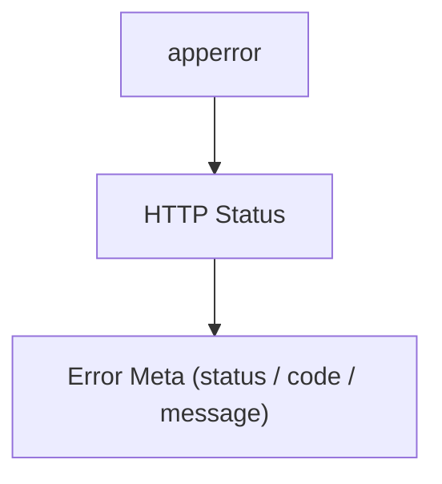
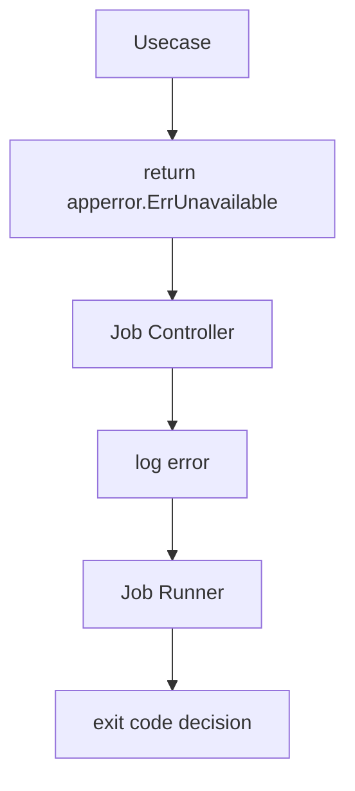
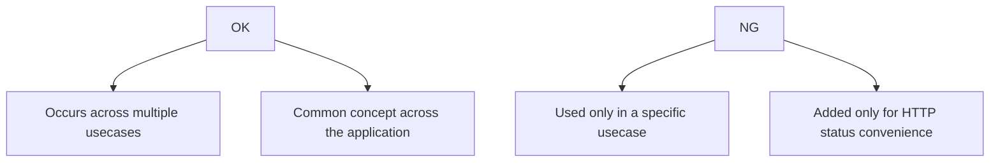

# app error

English | [日本語](README.ja.md)

The `apperror` package defines **application-wide error classifications independent of layers**.

This package can be referenced from **all layers of Domain / Usecase / Controller / Infrastructure**,  
and provides **base errors for classifying errors that occur within the application in a protocol-independent manner**.

HTTP status codes and API response formats are not handled here.  
Those are **converted in the Controller layer**.

## Basic Policy

- Can be referenced from Domain / Usecase / Controller / Infra
- Defines only **application-wide base error categories**
- Does not include HTTP status or response formats
- Designed with classification using `xerrors.Is` / `xerrors.As` as a premise

Examples

- `ErrInvalidArgument`
- `ErrNotFound`
- `ErrConflict`

## Usage Rules

When returning errors, it is recommended to **always wrap them with an apperror base category**.

Reason

- Enables error classification via `xerrors.Is`
- Allows conversion to HTTP status in the Controller layer
- Preserves the original error for logging / tracing

## Recommended Error Wrapping Pattern

Errors should **always be wrapped with a base error**.

```go
// Wrap domain error with app error category
if err != nil {
    return xerrors.Wrap(apperror.ErrConflict, "failed to create user")
}
```

In the Controller layer, classification is performed using `xerrors.Is`.

```go
// Map app error to HTTP status
if xerrors.Is(err, apperror.ErrNotFound) {
    return lookupErrorMetaByHTTPStatus(http.StatusNotFound)
}
```

## Infra Error Translation

In the Infrastructure layer, it is recommended to **convert external dependency errors into apperror**.

Reason

- To convert DB / external API errors into application vocabulary
- To eliminate the need for upper layers to know DB-dependent errors

Example

```go
// Translate database error to application error
if xerrors.As(err, &sql.ErrNoRows) {
    switch pgErr.Code {
        case "23505": // unique constraint violation
            return xerrors.Wrap(apperror.ErrConflict, err.Error())
    default:
        return xerrors.Wrap(apperror.ErrInternal, err.Error())
    }
}
```

This conversion is typically performed in:

- Repository
- Infra Adapter

## HTTP Error Mapping (Controller Layer)

The `apperror` package **does not know HTTP**.

Conversion to HTTP status codes is the **responsibility of the Controller layer**.

In this project, the Controller’s `errorhandler` middleware performs the following two-step conversion.



Example

```go
case xerrors.Is(err, apperror.ErrNotFound):
    return lookupErrorMetaByHTTPStatus(http.StatusNotFound)
```

`lookupErrorMetaByHTTPStatus` returns **HTTP error metadata** that contains:

- HTTP Status
- Error Code
- Message

This provides the following benefits:

- Domain / Usecase remain HTTP-independent
- Error messages are centrally managed in the Controller
- Domain does not need to be changed when API specifications change

## Error Handling in Job / CLI

`apperror` can be used not only for HTTP but also for **Job / CLI Controller**.

In job execution, it is typically:

- Output error to logs
- Exit code is determined by the Runner



## When Adding New Error Categories

It is recommended to **not add new error categories casually**.

Criteria



When adding, document the following in README:

- Background
- Use cases
- HTTP status mapping

## Mapping Table

| app error 定義 | Meaning / Usage | HTTP Status |
| -------------- | ----------- | ----------- |
| `ErrInvalidArgument` | Invalid argument (syntactically valid but semantically invalid) | 400 Bad Request |
| `ErrUnauthenticated` | Authentication failure (such as not logged in) | 401 Unauthorized |
| `ErrPermissionDenied` | Insufficient permissions | 403 Forbidden |
| `ErrNotFound` | Target does not exist | 404 Not Found |
| `ErrConflict` | Conflict (unique constraint violation, concurrent update conflict, etc.) | 409 Conflict |
| `ErrValidation` | Domain / Usecase validation failure | 422 Unprocessable Entity |
| `ErrTooManyRequests` | Too many requests (request throttling, upstream API throttling propagation, etc.) | 429 Too Many Requests |
| `ErrInternal` | Unexpected internal error | 500 Internal Server Error |
| `ErrUnimplemented` | Not implemented / unsupported feature | 501 Not Implemented |
| `ErrUnavailable` | Temporary unavailability (external dependency failure, etc.) | 503 Service Unavailable |
