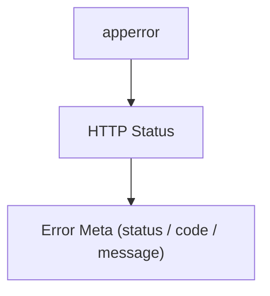
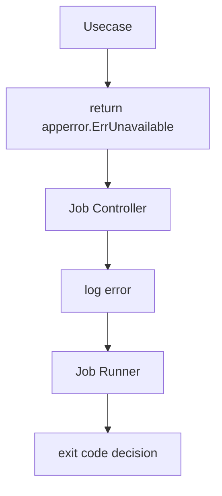
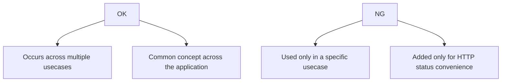

# app error

English | [日本語](README.ja.md)

The `apperror` package defines **application-wide error classifications independent of layers**.

This package can be referenced from **all layers of Domain / Usecase / Controller / Infrastructure**,  
and provides **base errors for classifying errors that occur within the application in a protocol-independent manner**.

HTTP status codes and API response formats are not handled here.  
Those are **converted in the Controller layer**.

## Basic Policy

- Can be referenced from Domain / Usecase / Controller / Infra
- Defines only **application-wide base error categories**
- Does not include HTTP status or response formats
- Designed with classification using `xerrors.Is` / `xerrors.As` as a premise

Examples

- `ErrInvalidArgument`
- `ErrNotFound`
- `ErrConflict`

## Usage Rules

When returning errors, it is recommended to **always wrap them with an apperror base category**.

Reason

- Enables error classification via `xerrors.Is`
- Allows conversion to HTTP status in the Controller layer
- Preserves the original error for logging / tracing

## Recommended Error Wrapping Pattern

Errors should **always be wrapped with a base error**.

```go
// Wrap domain error with app error category
if err != nil {
    return xerrors.Wrap(apperror.ErrConflict, "failed to create user")
}
```

In the Controller layer, classification is performed using `xerrors.Is`.

```go
// Map app error to HTTP status
if xerrors.Is(err, apperror.ErrNotFound) {
    return lookupErrorMetaByHTTPStatus(http.StatusNotFound)
}
```

## Infra Error Translation

In the Infrastructure layer, it is recommended to **convert external dependency errors into apperror**.

Reason

- To convert DB / external API errors into application vocabulary
- To eliminate the need for upper layers to know DB-dependent errors

Example

```go
// Translate database error to application error
if xerrors.As(err, &sql.ErrNoRows) {
    switch pgErr.Code {
        case "23505": // unique constraint violation
            return xerrors.Wrap(apperror.ErrConflict, err.Error())
    default:
        return xerrors.Wrap(apperror.ErrInternal, err.Error())
    }
}
```

This conversion is typically performed in:

- Repository
- Infra Adapter

## HTTP Error Mapping (Controller Layer)

The `apperror` package **does not know HTTP**.

Conversion to HTTP status codes is the **responsibility of the Controller layer**.

In this project, the Controller’s `errorhandler` middleware performs the following two-step conversion.



Example

```go
case xerrors.Is(err, apperror.ErrNotFound):
    return lookupErrorMetaByHTTPStatus(http.StatusNotFound)
```

`lookupErrorMetaByHTTPStatus` returns **HTTP error metadata** that contains:

- HTTP Status
- Error Code
- Message

This provides the following benefits:

- Domain / Usecase remain HTTP-independent
- Error messages are centrally managed in the Controller
- Domain does not need to be changed when API specifications change

## Error Metadata (`Meta`)

`Meta` / `WithMeta` / `WithDetails` / `MetaFrom` let the error-raising site attach **dynamic, protocol-neutral response metadata** on top of the sentinel classification.

```go
// Attach the identifiers of the invalid fields (domain layer)
return apperror.WithDetails(xerrors.Join(errs...), "firstName", "email")

// Extract at the transport edge (controller layer)
if meta, ok := apperror.MetaFrom(err); ok { ... }
```

Rules:

- **`Meta` never carries an HTTP status.** The status is resolved solely from the sentinel classification; to change the status, change the sentinel. This keeps the decision of [ADR-0038](../../docs/adr/0038-apperror-protocol-agnostic-errors.md) intact (see [ADR-0039](../../docs/adr/0039-error-metadata-code-message-details.md)).
- All fields are optional. Empty fields fall back to the controller's default `code` / `message` for the resolved status.
- `Message` is a user-facing message whose source of truth is the controller catalog. **Domain / Usecase should leave it empty** and set `Code` / `Details` only.
- `Details` values are exposed verbatim in the API response. Put **public-safe identifiers only** (e.g., invalid field names) — never reason texts or raw input values. Reason texts belong in the wrapped error message, which stays log-only.
- When `WithMeta` is applied multiple times in a chain, **the outermost one wins** (`MetaFrom` uses `xerrors.As`). Re-wrapping is the intended way for an upper layer to override.
- `WithMeta` decorates, it does not classify: `xerrors.Is` / `IsAppError` still see the wrapped sentinel(s), including all branches of a `xerrors.Join`.

### How it works: a wrapper, not a mutation

`WithMeta` does **not** put anything into the sentinels — they are shared package
variables, so storing request-scoped data in them would leak across requests. Instead
it wraps the whole error chain in a `MetaError` that holds the original error inside:

```go
type MetaError struct {
    meta Meta  // request-scoped payload
    err  error // the original chain, sentinels included
}

func (e *MetaError) Unwrap() error { return e.err }
```

The method **must** be named `Unwrap() error` — that is the standard library's chain
contract, not a stylistic choice: `errors.Is` / `errors.As` (and therefore
`xerrors.Is` / `As`) look for exactly this signature (or `Unwrap() []error` for joins)
to traverse a chain. Renaming it would make the wrapper opaque and break the 422
classification.

Note the division of labor: `Unwrap` only peels **one layer** — it returns the inner
chain as-is, not the sentinel. Reaching the sentinel is `errors.Is`'s job, which calls
`Unwrap` recursively while walking the chain. Each wrapper type implements "remove my
own wrapping"; the traversal logic lives once, in the standard library.

## Error Handling in Job / CLI

`apperror` can be used not only for HTTP but also for **Job / CLI Controller**.

In job execution, it is typically:

- Output error to logs
- Exit code is determined by the Runner



## When Adding New Error Categories

It is recommended to **not add new error categories casually**.

Criteria



When adding, document the following in README:

- Background
- Use cases
- HTTP status mapping

## Mapping Table

| app error 定義 | Meaning / Usage | HTTP Status |
| -------------- | ----------- | ----------- |
| `ErrInvalidArgument` | Invalid argument (syntactically valid but semantically invalid) | 400 Bad Request |
| `ErrUnauthenticated` | Authentication failure (such as not logged in) | 401 Unauthorized |
| `ErrPermissionDenied` | Insufficient permissions | 403 Forbidden |
| `ErrNotFound` | Target does not exist | 404 Not Found |
| `ErrConflict` | Conflict (unique constraint violation, concurrent update conflict, etc.) | 409 Conflict |
| `ErrValidation` | Domain / Usecase validation failure | 422 Unprocessable Entity |
| `ErrTooManyRequests` | Too many requests (request throttling, upstream API throttling propagation, etc.) | 429 Too Many Requests |
| `ErrCanceled` | Client cancelled / disconnected the request | 499 Client Closed Request |
| `ErrInternal` | Unexpected internal error | 500 Internal Server Error |
| `ErrUnimplemented` | Not implemented / unsupported feature | 501 Not Implemented |
| `ErrUnavailable` | Temporary unavailability (external dependency failure, etc.) | 503 Service Unavailable |

## Classification Helper (`IsAppError`)

`IsAppError(err error) bool` reports whether `err` matches any of the HTTP-taxonomy sentinels listed in the mapping table above.

- Matching uses `xerrors.Is`, so wrapped errors (`xerrors.Wrap(apperror.ErrConflict, ...)`) are detected as well.
- The worker classification sentinels (`ErrRetryable` / `ErrPermanent` / `ErrFatal`, see below) are intentionally **not** covered by `IsAppError`.
- `nil` returns `false`.

```go
// True: sentinel itself or an error wrapping it
apperror.IsAppError(apperror.ErrNotFound)                        // true
apperror.IsAppError(xerrors.Wrap(apperror.ErrConflict, "dup"))   // true

// False: non-app error, nil, or a worker sentinel
apperror.IsAppError(xerrors.New("generic"))                      // false
apperror.IsAppError(nil)                                         // false
apperror.IsAppError(apperror.ErrRetryable)                       // false
```

## Worker Classification Sentinels

Separately from the HTTP taxonomy above, the package defines three sentinels used by the message-processing worker `engine` to classify the errors returned by a `Handler` and change its behavior accordingly.

| Sentinel | Meaning | engine behavior |
| -------- | ------- | --------------- |
| `ErrRetryable` | Transient failure | Nack and redeliver |
| `ErrPermanent` | Permanent failure | Move to `FailureHandler`, then Ack |
| `ErrFatal` | Process cannot continue | Drain and stop the engine |

These are **not** part of the HTTP error taxonomy: they have no HTTP status mapping and are excluded from `IsAppError`.
