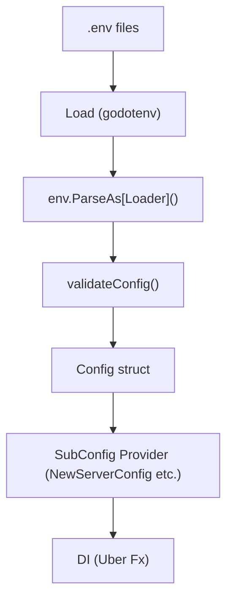

# `Config` Package

This directory defines configuration files used across the entire application.

## Implementation

This package is responsible for reading application settings from environment variables and providing them as typed structures across the entire application. The main implementation flow is as follows.

- Environment variables are parsed into a `Loader` (including a test `Loader`) and values are loaded using `env.ParseAs[Loader]()` (implementation files: `loader.go` / `envspec.go`).
- The loaded values in `Loader` are converted into a `Config` type, and validation (`validateConfig()`) is performed internally as needed (implementation files: `config.go`, `model.go`).
- The generated `*Config` is treated as immutable (no setters exposed) and is injected into the application via a setup function (`SetUpConfig`) for registering into the DI container (DI related: `internal/di/module/config.go`).

Design points:

- Configuration is loaded collectively at initialization and values are not changed during runtime (treated as immutable).
- Missing required values are detected in `validateConfig()`, and startup failure (explicit error return) is triggered to prevent running in an invalid state.
- Testing helpers and mocks (`config_testing_mock.go`, `config_testing_setter.go`) are provided to allow substituting environment variables and verifying the behavior of `New()` in test environments.

## Config Loading Flow

The configuration loading flow at application startup is as follows.



### Responsibilities of Each Step

- **Load()**
  - Loads `env/.env` and `env/.env.<ENV>` and sets environment variables.

- **env.ParseAs[Loader]**
  - Maps environment variables into the `Loader` struct defined in `envspec.go`.

- **validateConfig()**
  - Validates port ranges, CIDR, timeout values, etc.
  - Returns an error at startup if there is invalid configuration.

- **Config struct**
  - Converts `Loader` values into internal structures (`model.go`).
  - Treated as an **immutable configuration object** that cannot be modified externally.

- **SubConfig Provider**
  - Through functions such as `NewServerConfig` and `NewDatabaseConfig`
  - Injects only the necessary configuration into each component.

- **DI (Uber Fx)**
  - Registered via `fx.Provide` in `internal/di/module/config.go`
  - Used across the entire application.

## Design Principles

This Config package is implemented based on the following design principles.

- **Configuration is immutable**
  - Configuration is loaded only once at startup and is not changed during runtime.

- **Configuration is loaded only at startup**
  - Initialized in the order `.env → Loader → validateConfig() → Config`.

- **Domain / Usecase must not depend on environment variables**
  - Interpretation of environment variables is confined to the Config layer.

- **Use typed SubConfig providers to obtain configuration**
  - Through providers such as `NewServerConfig` and `NewDatabaseConfig`,
    only the necessary configuration is passed to each component.

This minimizes configuration dependency in the application and improves testability and maintainability.

## Main Libraries Used

- `github.com/caarlos0/env/v11` — Used to map environment variables to structs (tag-based, e.g., `env:"KEY,required"`).
- Since the Uber Fx pattern is adopted for DI registration, configuration values are injected via `fx.Provide` (DI implementation: `internal/di/module/config.go`).
- In tests, assertion libraries such as `testify/require` are used together with project-internal `config_testing_*` helpers to reliably verify environment-variable-based behavior.

## Importance

The following describes importance and expected impact in real-world operations.

### Production Importance

- Level: High
  - Reason: Values essential for operation such as database connection information, authentication information for external services, listening ports, CORS settings, and security settings (HSTS, etc.) are provided via environment variables, so failure to read them correctly leads to startup failure or critical issues.
  - Countermeasure: Required fields should be validated by `validateConfig()` before startup, and an explicit error should be returned when missing.

### Development / Test Importance

- Level: High (however can be substituted with defaults or mocks)
  - Reason: In tests, behavior is verified by setting specific ENV values, so environment variable management is important. Since test helpers are available within the project, reproducibility can be achieved in CI and local tests by combining with `t.Setenv`.
  - Example: Use `config_testing_setter.go` to inject test configuration and verify that `New()` binds correctly.

### Impact if Disabled

- Impact range: Minor to critical (depending on configuration items)
  - Minor: Some options such as log level and debug flags can be safely substituted with default values.
  - Critical: Missing DB connection information or external API keys will cause startup failure or runtime errors.
  - Recommended action: Before production operation, run `go build` and `go test ./...` to ensure validation by `validateConfig()` passes. It is safer to establish a practice of validating required ENV in the CI pipeline.

### How to Add a New Category (e.g., AWS or GCP)

1. Add a new struct for the category in `model.go` (e.g., `AWS` or `GCP`).  
    - Example:

    ```go
    type aws struct {
        accessKey string
        secretKey string
        region    string
    }
    ```

2. Add the new category struct as a field in the `Config` struct.
    - Example:

    ```go
    type Config struct {
        server server
        aws    aws // add new category
    }
    ```

3. Define the new category struct in `envspec.go`.
    - Add `env` tags to each field and specify `required`, `envSeparator`, etc. as needed.
    - Also add the public struct defined in `model.go` to `envspec.go`.
    - Example:

    ```go
    type AWS struct {
        AccessKey string `env:"AWS_ACCESS_KEY,required"`
        SecretKey string `env:"AWS_SECRET_KEY,required"`
        Region    string `env:"AWS_REGION,required"`
    }
    ```

4. Add the new category struct as a field in the `Loader` struct.
    - Example:

    ```go
    type Loader struct {
        Server Server
        AWS    AWS // add new category
    }
    ```

5. In the `New` function of `config.go`, call `env.ParseAs[Loader]()` to automatically bind values from environment variables into `Loader`.
    - Implement validation for the added category inside the `validateConfig()` function if necessary.
    - Finally, convert from `Loader` to `Config` and return the `Config` struct.

    ```go
    func New() (*Config, error) {
        cfg, err := env.ParseAs[Loader]()
        
        if err := validateConfig(cfg); err != nil { // perform validation here
            return nil, err
        }

        return &Config{
            server: server{
                host:           cfg.Server.Host,
                port:           cfg.Server.Port,
                allowedOrigins: cfg.Server.AllowedOrigins,
            },
            aws: aws{
                accessKey: cfg.AWS.AccessKey,
                secretKey: cfg.AWS.SecretKey,
                region:    cfg.AWS.Region,
            },
    }, nil
    }
    ```

6. Implement getter methods for each category as needed to allow external access to values.
    - Creating setter methods is prohibited. The purpose of config.go is limited to retrieving and binding values from environment variables, and modifying configuration values is not intended.
    - Example:

    ```go
    func (c *Config) AWSAccessKey() string {
        return c.aws.accessKey
    }

    func (c *Config) AWSSecretKey() string {
        return c.aws.secretKey
    }

    func (c *Config) AWSRegion() string {
        return c.aws.region
    }
    ```

7. Add test cases for the added category in `config_test.go`.
    - In test cases, set environment variables and call `New()` to verify that values are correctly bound.
    - Example:

    ```go
    func TestNewAWSConfig(t *testing.T) {
        expectedAccessKey := "test_access_key"
        expectedSecretKey := "test_secret_key"
        expectedRegion := "us-west-2"

        t.Setenv("AWS_ACCESS_KEY", expectedAccessKey)
        t.Setenv("AWS_SECRET_KEY", expectedSecretKey)
        t.Setenv("AWS_REGION", expectedRegion)

        cfg, err := New()
        require.NoError(t, err)

        require.Equal(t, expectedAccessKey, cfg.aws.accessKey)
        require.Equal(t, expectedSecretKey, cfg.aws.secretKey)
        require.Equal(t, expectedRegion, cfg.aws.region)
    }
    ```

    - Also add tests for validation inside the `validateConfig` function.

8. Similar to existing `NewHogehogeConfig`, ensure the signature where DI receives `*config.Config` and returns a public type (`*config.AWSConfig`).

```go
// internal/config/aws_config.go (example)
package config

type AWSConfig struct {
    AccessKey string
    SecretKey string
    Region    string
}

// NewAWSConfig receives *config.Config from DI and returns a public type *config.AWSConfig used by services
func NewAWSConfig(cfg *Config) *AWSConfig {
    return &AWSConfig{
        AccessKey: cfg.aws.accessKey,
        SecretKey: cfg.aws.secretKey,
        Region:    cfg.aws.region,
    }
}
```

Points:

- Follow project naming conventions for field names and struct names.
- After adding a provider to DI, register the component that receives that type (e.g., AWS client factory) in the DI container.
- Missing additions or type mismatches will cause build errors, so verify with `go build` and `go test ./...`.

## Test Support

### Test Helpers

|Function|File|Description|
|---|---|---|
|`MockConfigForTest(t)`|`config_testing_mock.go`|Create a test `*Config` with default values for all fields|
|`NewTestLocation(t)`|`test_kit.go`|Create a test timezone `*time.Location`|
|`EnsureRepoRootAndEnv(t, env)`|`test_kit.go`|Move to repo root and set ENV environment variable|

### Test Setters

Methods defined in `config_testing_setter.go` allow temporarily modifying SubConfig values during tests. Values are automatically restored via `t.Cleanup`.

**Do not use in production code.**

|Method|Target SubConfig|
|---|---|
|`SetApplicationMode`|`ApplicationConfig`|
|`SetApplicationEnv`|`ApplicationConfig`|
|`SetServerPort`|`ServerConfig`|
|`SetObservabilityMaskedDBQueryArgs`|`ObservabilityConfig`|
|`SetDatabaseHost`|`DatabaseConfig`|
|`SetDatabaseName`|`DatabaseConfig`|
|`SetMaxConns`|`DBConnectionConfig`|
|`SetCIDR`|`SecurityConfig`|
|`SetHeaderName`|`AuthConfig`|
|`SetAllowedHeaderBearer`|`AuthConfig`|

## Notes

- For security reasons, do not hardcode sensitive information (e.g., API keys or passwords) in code. Manage them via environment variables.
