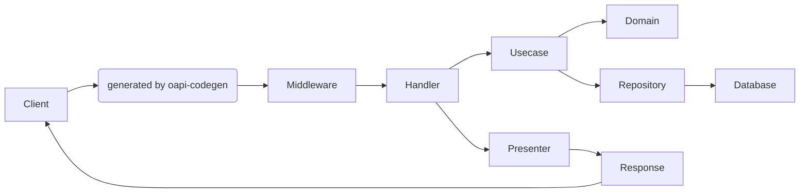
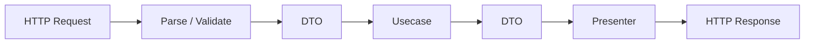
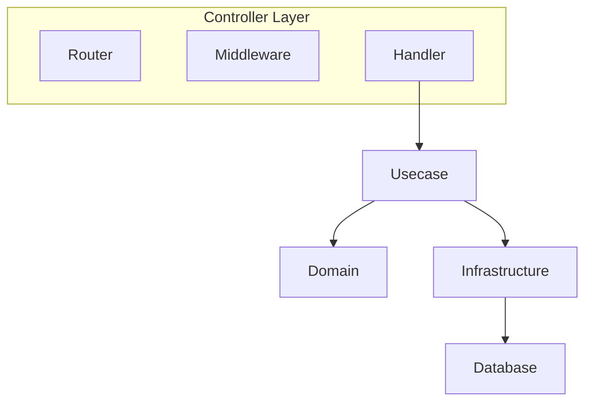
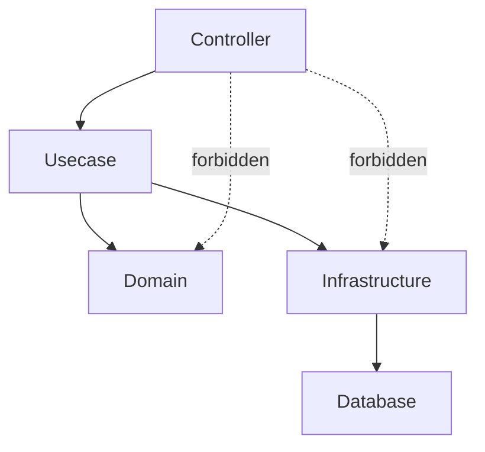
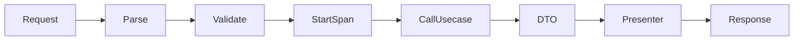
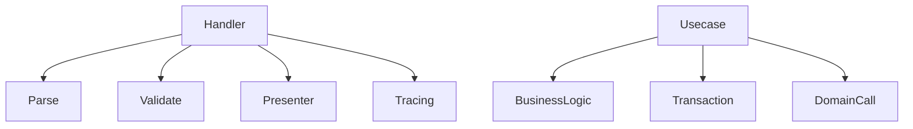
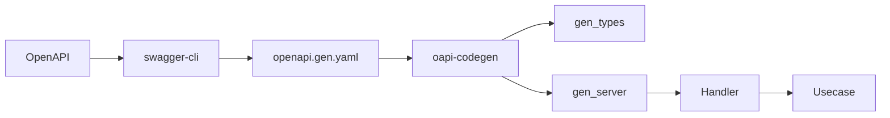
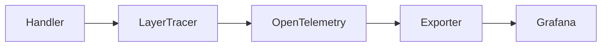
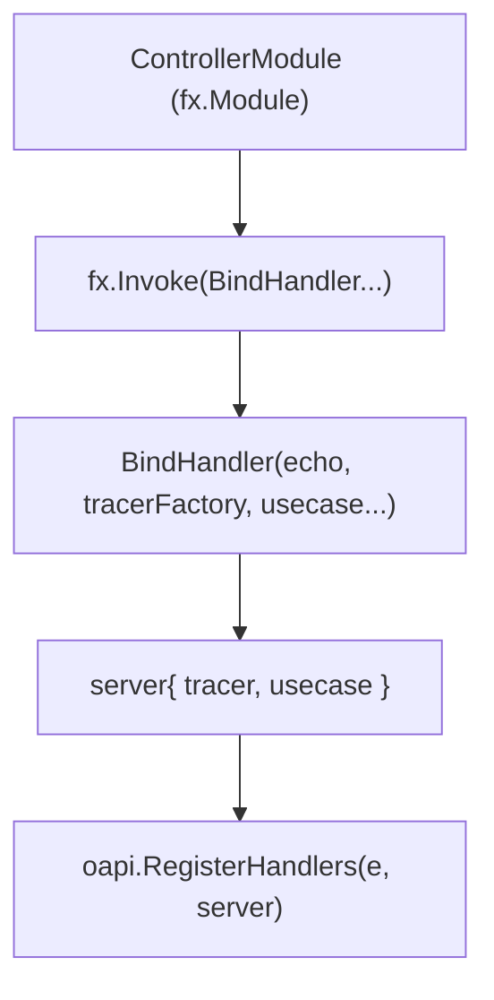
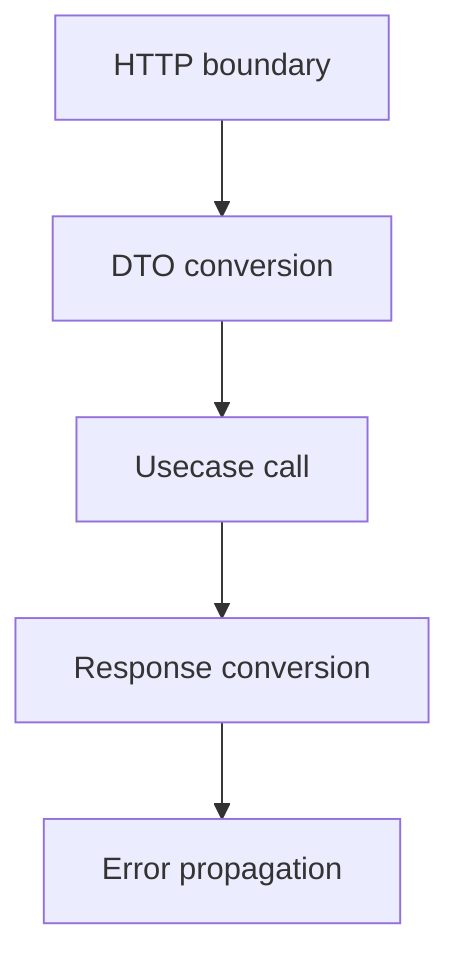

# Controller Layer Handler (`internal/controller/handler`) Guide

English | [日本語](README.ja.md)

## What is the Controller Layer

In this project, the following are defined as the **Controller Layer**:

- handler - Responsible for receiving HTTP requests and delegating processing to the Usecase layer.
- router - Responsible for route registration and HTTP server startup.
- middleware - Performs common processing before/after HTTP requests such as logging, request ID, and tracing.

Responsible for receiving HTTP requests and delegating processing to the Usecase layer.

The Controller is the **input/output boundary of the application**.

## Role in This Project

`internal/controller/handler` is the **server entry point (Controller layer)** started from CLI (Cobra).

- Parsing input / lightweight validation (type / required checks)
- Start/end span using Observability (LayerTracer)
- Call Usecase (Usecase layer)
  - Convert to **DTO/VO for input**
  - Convert DTO returned from Usecase → OpenAPI type
- Errors are returned using unified mapping defined in [apperror](../../apperror/README.md)
- Paging is normalized using `paging.NewPageFrom1Based()`
- Request ID / logging is handled by middleware (Echo + Zap)

"Business logic", "DB access", and "domain model operations" are delegated to Usecase / Domain / Infra, keeping Controller thin.

## What is Presenter

Presenter is the conversion process from `Usecase DTO → OpenAPI response type`.

## Architecture

### HTTP Request Flow



The request is processed in the following order:

1. Router (Echo) resolves routing
2. Middleware executes common processing (logging / tracing / RequestID, etc.)
3. Handler (Controller) parses input
4. Delegates processing to Usecase as DTO
5. Retrieves data via Domain / Repository
6. Convert DTO → OpenAPI response type (Presenter)
7. Return as HTTP response

Handler performs the following transformations:



### Controller Layer Design



Controller is responsible for the **HTTP input/output boundary**.

Roles

- Router  
  Register HTTP routing

- Middleware  
  Common processing (Logging / RequestID / Trace)

- Handler  
  HTTP request → Usecase invocation

### Dependency Rules



Allowed dependencies

- Controller → Usecase
- Controller → Presenter
- Controller → apperror

Forbidden dependencies

- Controller → Domain
- Controller → Infrastructure
- Controller → Database

Controller accesses lower layers **only through Usecase**.

## Handler Design

### Handler Responsibilities

Each process inserts necessary steps while processing HTTP requests, invokes the Usecase, and finally returns a response.



Handler responsibilities

1. Parse request
2. Lightweight validation
3. Start trace span
4. Call Usecase
5. Convert DTO → Response
6. Return response

Handler **must not contain business logic**.

### Thin Controller Principle



What Controller does

- Request parsing
- Validation
- Presenter
- Tracing

What Controller does NOT do

- Business logic
- DB access
- Transaction management
- Domain model operations

## Integration with OpenAPI

### OpenAPI Code Generation Flow



Development flow

1. Write OpenAPI definition
2. Bundle with swagger-cli
3. Generate code with oapi-codegen
4. Implement Handler

Generated code is output under `gen/`.

### Handler Generation via oapi-codegen

- When generating, based on routes defined in [openapi/openapi.yaml](../../../openapi/openapi.yaml),
  reproduce directory structure under `internal/controller/handler/` as URI.

1. Create API definition in OpenAPI
   - Refer to [OpenAPI guideline for generation](../../../openapi/README.md)
2. Reproduce URI structure under `internal/controller/handler/`
   - Example1: `/v1/users` → `internal/controller/handler/v1/users/`
   - Example2: `/v1/users/{id}` → `internal/controller/handler/v1/users/detail/`
3. Add generation comments at the top of the file

```go
//go:generate oapi-codegen --include-tags=v1/users --package=gen --generate=types -o ./gen/type.gen.go /app/openapi/openapi.gen.yaml
//go:generate oapi-codegen --include-tags=v1/users --package=gen --generate=echo-server,strict-server -o ./gen/server.gen.go /app/openapi/openapi.gen.yaml
```

1. Bundle/validate OpenAPI with swagger-cli and generate with oapi-codegen
   - Can be executed collectively with `make gen`
2. Generated files are output under `internal/controller/handler/<version>/<resource>/gen`
3. Implement controller based on generated code
4. Register implemented controller `BindHandler` in [Controller DI module](../../di/module/controller.go)

- Input/output types (parameters / body / response) must use generated types and be **clearly separated from Usecase DTO**  
- Schema changes must follow **OpenAPI → regenerate → adjust implementation**. Generated code must **not be edited**

### Generated Code Policy

Code under `gen/` is **auto-generated by oapi-codegen**.

The following actions are prohibited:

- Editing code under gen directly
- Modifying type definitions
- Manually modifying interfaces

If changes are required, always follow:

OpenAPI → `make gen` → regenerate

## Observability

### Observability Flow



Controller does **not directly handle OpenTelemetry SDK**.

What Controller does

```go
ctx, endSpan := tracer.Start(ctx)
defer endSpan()
```

Tracer creation and configuration are **encapsulated in the observability layer**.

### Observability (Tracing) Usage

In this project, Controller does not directly use OpenTelemetry SDK,  
but uses `observability.LayerTracer` to start/end spans.

#### 1. Start and end span in Controller

At the beginning of each handler, always write:

```go
ctx, endSpan := s.tracer.Start(ctx)
defer endSpan()
```

- `Start(ctx)` starts a span and associates trace_id/span_id with context
- `endSpan()` ends the span
- `defer endSpan()` ensures termination even on early return

Point: Controller only knows start/end of span,  
and does not touch OpenTelemetry SDK details.

#### 2. Tracer DI (observability.LayerTracer)

Controller receives `observability.LayerTracer` as dependency:

```go
type server struct {
    tracer observability.LayerTracer
    uc      user.Usecase
}
```

In BindHandler, a controller-specific tracer is generated:

```go
func BindHandler(
  e *echo.Echo, tf observability.TracerFactory, uc user.Usecase
) {
    gen.RegisterHandlers(e, gen.NewStrictHandler(&server{
        tracer: tf.Controller(),
        uc:     uc,
    }, nil))
}
```

Here, SDK instances are not directly used,  
and observability layer hides tracer generation rules internally.

## DI (Dependency Injection) Mechanism (Controller Layer)

In this project, Controller (Handler) is assembled using **Uber Fx DI**.  
Handler **must not create dependencies by itself**, but receive them via constructor arguments.

### Overall Structure



### Role of internal/di/module/controller.go

```go
func ControllerModule() fx.Option {
    return fx.Module("controller",
        fx.Invoke(
            health.BindHandler,
            users.BindHandler,
        ),
    )
}
```

- `fx.Invoke`
  - Executes handler registration functions at startup
- Each BindHandler receives DI dependencies

### BindHandler Design

```go
func BindHandler(
    e *echo.Echo,
    tf observability.TracerFactory,
    uc user.Service,
) {
    gen.RegisterHandlers(e, gen.NewStrictHandler(&server{
        tracer: tf.Controller(),
        uc:     uc,
    }, nil))
}
```

Points:

- `echo.Echo` is injected automatically
- `TracerFactory` provides layer-specific tracer
- `Usecase` is injected via interface

### Handler Struct Rules

```go
type server struct {
    tracer observability.LayerTracer
    uc     user.Service
}
```

- Only DI dependencies as fields
- Do not instantiate dependencies inside
- Depend on interface

### Why use fx.Invoke

- Automates route registration at startup
- No need to modify main.go when adding handlers
- Enables dependency resolution and lifecycle management

### AI / Developer Rules

- Add new handlers to `fx.Invoke(...)`
- Do not instantiate dependencies in handler
- Always use constructor (BindHandler)
- Usecase must be interface-based

## Implementation Rules

### Do not leak HTTP into Usecase

#### Naming / Structure

- Register routing with `BindHandler` in `di/module/controller.go`
- Reproduce resource structure from URI, use `detail` for path params
  - Example1: package v1users
  - Example2: package v1usersdetail

#### Do not introduce HTTP vocabulary into Usecase

- **Never** pass `http.Request`, `http.Header`, `http.Status*`
- Use DTO / VO (e.g., Page) / Context only

#### Paging

- Controller converts `page & per_page` to Paging via `usecase.NewPagingFrom1Based()`
- Usecase manages policy (limits/defaults)

#### Error Mapping

- Controller defines mapping with apperror
  - `ErrInvalidArgument` → 400
  - `ErrUnauthenticated` → 401
  - `ErrUnimplemented` → 501
  - `ErrUnavailable` → 503
- Empty list is **success (200 + empty array)**  
- **NotFound only for single resource retrieval**

#### Transaction

- Controller does not handle Tx  
- Tx boundary is handled by Usecase (`TxManager`)

### Dependency Policy

Allowed:

- Controller → Usecase
- Controller → Presenter
- Controller → apperror

Forbidden:

- Controller → Domain
- Controller → Infrastructure
- Controller → Database

## Do / Don’t

### Do

- Convert `Get...Params` → **VO/DTO**
- Convert DTO → `gen` response via Presenter
- Test with `httptest` + `testify`

### Don’t

- Pass HTTP elements into Usecase
- Pass raw paging values
- Use sqlc types directly
- Return 404 for empty list
- Override status manually
- Logging handled by Zap middleware

## Test Strategy

Controller tests validate **HTTP boundary behavior**.

### Test Dependencies

|Dependency|Method|
|---|---|
|Usecase|mock|
|Domain|not used|
|Infrastructure|not used|
|Echo Router|real|
|Presenter|real|
|LayerTracer|mock / noop|

### Test Targets

- Routing registration
- Request → DTO conversion
- Usecase invocation
- DTO → Response conversion
- Error propagation
- Boundary correctness

### Test Structure

```go
func TestBindHandler(t *testing.T) {
}

func Test_server_<Operation>(t *testing.T) {
}
```

### Router Test

```go
testassert.AssertEchoRouterPath(t, targetPath, e.Routes())
testassert.AssertEchoRouterMethods(t, expectedMethods, e.Routes())
```

### Handler Test

```go
mockApp := mock_user.NewMockUsecase(ctrl)
mockApp.EXPECT().
    ListUsersByKeyword(gomock.Any(), expectedParams, mockPaging).
    Return(mockDTO, nil)
```

### Response Verification

```go
actual, ok := resp.(gen.GetUsers200JSONResponse)
require.True(t, ok)

require.Equal(t, expectedResponse, gen.UsersResponse(actual))
```

### Error Test

```go
require.Nil(t, resp)
require.ErrorIs(t, err, apperror.ErrInvalidArgument)
```

### Thin Controller Test Scope



### Observability Test

```go
lt := observability.NewMockControllerLayerTracer(t)
```

```go
tf := observability.NewNoopTracerFactory(t)
```

### Test Policy

- Usecase must be mocked
- Infrastructure must not be used
- Validate OpenAPI types
- Fail Fast using require

### Not Covered in Controller Tests

- Domain logic validation
- Repository implementation
- SQL execution
- DB connection
- Transaction control
- Usecase internal logic

## Test Kit (testkit)

`testkit/` contains shared helper packages used in Controller tests.

|Package|Description|
|---|---|
|`testassert`|JSON response validation, Echo router path / method verification|
|`testauth`|Set authentication information in test context|
|`testecho`|Builder client for Echo tests (request construction and execution)|
|`testspan`|Embed test span into Echo context|

### testassert

|Function|Description|
|---|---|
|`AssertJSONEqual[T]`|Verify HTTP response status code and JSON body|
|`AssertEchoRouterMethods`|Verify registered route HTTP methods|
|`AssertEchoRouterPath`|Verify registered route paths|

### testauth

|Function|Description|
|---|---|
|`MakeAvailableAuthn`|Set authentication information (subject) in test context|

### testecho

Build test HTTP requests using a builder pattern.

```go
rec := testecho.NewEchoTestClient(t, e).
    Method(http.MethodGet).
    RequestURL("/v1/users?page=1&per_page=10").
    AuthBearer("test-token").
    Serve()
```

|Method|Description|
|---|---|
|`NewEchoTestClient`|Create test client (auto-configures error handler)|
|`Method`|Set HTTP method|
|`RoutePattern`|Set route pattern (e.g., `/users/:id`)|
|`RequestURL`|Set actual request URL|
|`JSONBody`|Set JSON request body|
|`RawBody`|Set raw request body|
|`Header`|Set request header|
|`AuthBearer`|Set Bearer token|
|`PathParams`|Set path parameters|
|`QueryParams`|Set query parameters|
|`Build`|Return Request / ResponseRecorder / echo.Context|
|`Serve`|Send request to Echo and return ResponseRecorder|

### testspan

|Function|Description|
|---|---|
|`StartTestSpanForEcho`|Embed test span into echo.Context and return end function|

## Example

## Reference Snippet

```go
//go:generate oapi-codegen --include-tags=v1/users --package=gen --generate=types -o ./gen/type.gen.go /app/openapi/openapi.gen.yaml
//go:generate oapi-codegen --include-tags=v1/users --package=gen --generate=echo-server,strict-server -o ./gen/server.gen.go /app/openapi/openapi.gen.yaml

package users

import (
    "context"

    "go-boilerplate/internal/observability"
    // import required packages

    "github.com/labstack/echo/v4"
)

type server struct {
    tracer observability.LayerTracer
    uc      user.Service
}

// Register this in di/handler.go
func BindHandler(
  e *echo.Echo, tf observability.TracerFactory, uc user.Service,
) {
    gen.RegisterHandlers(e, gen.NewStrictHandler(&server{
        tracer: tf.Controller(),
        uc: uc,
    }, nil))
}

// handler
func (s *server) GetUsers(ctx context.Context, request gen.GetUsersRequestObject) (gen.GetUsersResponseObject, error) {
    // Start and end span
    ctx, endSpan := s.tracer.Start(ctx)
    defer endSpan()

    page, err := paging.NewPagingFrom1Based(request.Params.Page, request.Params.PerPage)
    if err != nil {
        return nil, err
    }

    params := &user.GetParamsDTO{
        Keyword: request.Params.Keyword,
        Active:  request.Params.Active,
    }

    dtos, err := s.uc.ListUsersByKeyword(ctx, params, page)
    if err != nil {
        return nil, err
    }

    users := make([]gen.UserResponse, len(dtos))
    for i, dto := range dtos {
      users[i] = gen.UserResponse{
        Name:  dto.Name,
        Email: types.Email(dto.Email),
        Phone: ptr.To(dto.Phone),
      }
    }

    res := gen.UsersResponse{
      Users:  users,
      Limit:  page.Limit(),
      Offset: page.Offset(),
    }

    return gen.GetUsers200JSONResponse(res), nil
}
```
