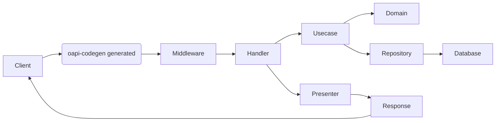
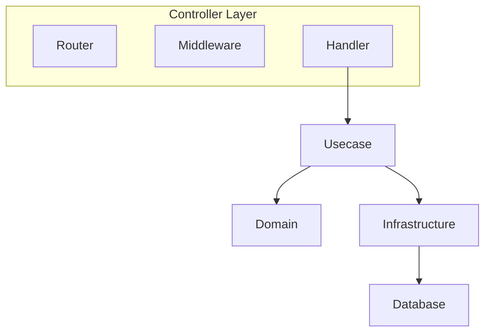
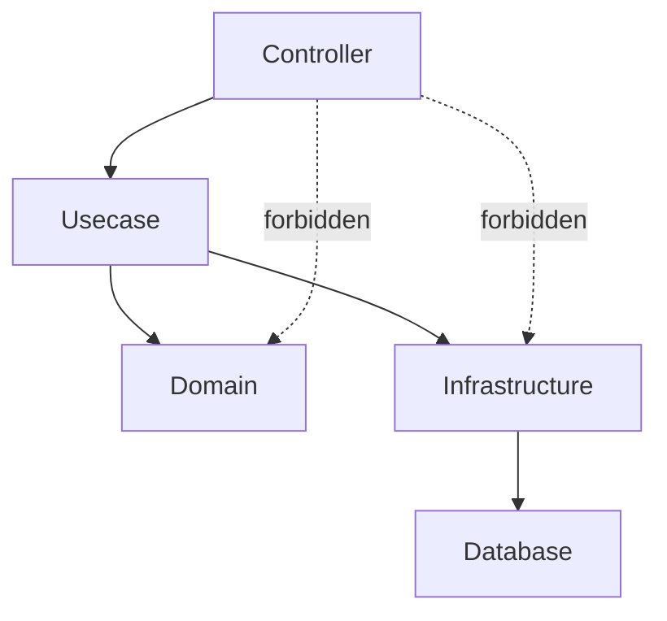
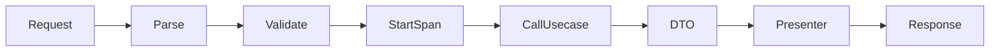
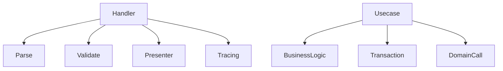
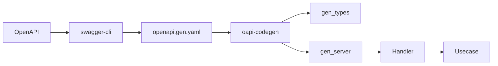
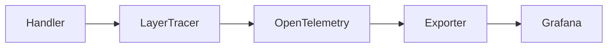

# Controller Handler Guide (`internal/controller/handler`)

English | [日本語](README.ja.md)

## What is the Controller Layer

The **Controller Layer** is defined as the following components.

- handler – Receives HTTP requests and delegates processing to the Usecase layer.
- router – Registers routes and starts the HTTP server.
- middleware – Executes common processing before/after requests such as logging, request IDs, and tracing.

The Controller receives HTTP requests and delegates processing to the Usecase layer.

The Controller is the **input/output boundary of the application**.

## Role in This Repository

`internal/controller/handler` is the **server entry point (Controller layer)** launched from the CLI (Cobra).

Responsibilities:

- Parse input / perform lightweight validation (type checks, required fields)
- Start and end spans via Observability (`LayerTracer`)
- Call the Usecase layer
  - Convert request data into **DTO / VO** before passing it
  - Convert DTO returned from Usecase into OpenAPI response types
- Errors are returned using unified mappings defined in  
  [apperror mapping](../../apperror/README.md)
- Paging parameters are normalized using `paging.NewPageFrom1Based()`
- Request ID and logging are handled by middleware (Echo + Zap)

Business logic, database access, and domain model operations are delegated to  
Usecase / Domain / Infrastructure layers, keeping Controllers thin.

## What is a Presenter

A **Presenter** converts: `Usecase DTO → OpenAPI Response Type`

## Architecture

### Architecture Flow

This diagram shows the HTTP request processing flow.



Request processing order:

1. Router (Echo) resolves the route
2. Middleware executes common processing (logging / tracing / request IDs)
3. Handler (Controller) parses inputs
4. Handler delegates processing to Usecase via DTO
5. Usecase accesses Domain / Repository
6. DTO is converted to an OpenAPI response (Presenter)
7. HTTP response is returned

Handler performs the following transformation:

```txt
HTTP Request
→ Parse / Validate
→ DTO
→ Usecase
→ DTO
→ Presenter
→ HTTP Response
```

### Controller Layer Structure

The **Controller Layer** is defined as follows.



The Controller is responsible for **HTTP input/output boundaries**.

Responsibilities:

Router  
Registers HTTP routes

Middleware  
Executes shared processing (Logging / RequestID / Trace)

Handler  
Receives HTTP requests and invokes Usecase

### Dependency Rules

Dependency rules for the Controller layer.



Allowed dependencies

- Controller → Usecase
- Controller → Presenter
- Controller → apperror

Forbidden dependencies

- Controller → Domain
- Controller → Infrastructure
- Controller → Database

Controllers must access lower layers **only through Usecase**.

## Handler Design

### Handler Responsibilities

Handlers orchestrate HTTP requests and return responses while inserting necessary processing steps.



Handler responsibilities:

1. Parse request
2. Lightweight validation
3. Start trace span
4. Call Usecase
5. Convert DTO → Response
6. Return response

Handlers **must not contain business logic**.

### Thin Controller Principle



Controller responsibilities:

- Request parsing
- Validation
- Presenter transformation
- Tracing

Controllers must NOT perform:

- Business logic
- Database access
- Transaction management
- Domain model manipulation

## OpenAPI Integration

### OpenAPI Code Generation Flow



Development flow:

1. Write OpenAPI definition
2. Merge/validate with swagger-cli
3. Generate code with oapi-codegen
4. Implement Handler logic

Generated code is output to the `gen/` directory.

### Generating Handlers from oapi-codegen

When generating handlers, follow the routing structure defined in  
[openapi/openapi.yaml](../../../openapi/openapi.yaml) and reproduce the URI structure under:

`internal/controller/handler/`

Steps:

1. Define APIs in `openapi/openapi.yaml`
   - See [OpenAPI generation guidelines](../../../openapi/README.md)

2. Recreate the URI structure under the handler directory

Examples:

`/v1/users` → `internal/controller/handler/v1/users/`

`/v1/users/{id}` → `internal/controller/handler/v1/users/detail/`

1. Add generation comments at the top of the file

```go
//go:generate oapi-codegen --include-tags=v1/users --package=gen --generate=types -o ./gen/type.gen.go /app/openapi/openapi.gen.yaml
//go:generate oapi-codegen --include-tags=v1/users --package=gen --generate=echo-server,strict-server -o ./gen/server.gen.go /app/openapi/openapi.gen.yaml
```

1. Merge and validate OpenAPI using `swagger-cli`
2. Run `make gen`
3. Generated files will appear under:

`internal/controller/handler/<version>/<resource>/gen`

1. Implement the Controller based on the generated code
2. Register `BindHandler` in the Controller DI module:

`internal/di/module/controller.go`

Input/output types (params, body, response) must use generated types and remain **separate from Usecase DTOs**.

Schema changes must follow:

OpenAPI → Regenerate → Adjust implementation

Generated files **must never be edited manually**.

### Generated Code Policy

`gen/` directories contain **auto-generated code from oapi-codegen**.

The following actions are prohibited:

- Editing code inside `gen/`
- Modifying generated type definitions
- Modifying generated interfaces manually

If changes are required, follow this order:

OpenAPI → `make gen` → Regenerate code

## Observability

### Observability Flow

Tracing flow within the Controller.



Controllers **do not interact with OpenTelemetry SDK directly**.

Controller usage:

```go
ctx, endSpan := tracer.Start(ctx)
defer endSpan()
```

Tracer creation and configuration are encapsulated inside the **observability layer**.

### Using Observability (Tracing)

Uses `observability.LayerTracer` instead of directly interacting with the OpenTelemetry SDK.

#### 1. Starting and Ending Spans

Each handler must start and end a span as follows:

```go
ctx, endSpan := s.tracer.Start(ctx)
defer endSpan()
```

- `Start(ctx)` creates a span and attaches trace_id/span_id to the context
- `endSpan()` finishes the span (`span.End`)
- Using `defer` ensures spans always close

Controllers only know **how to start and end spans**, not how tracing is implemented.

#### 2. Tracer Dependency Injection

Controllers receive `observability.LayerTracer` as a dependency.

```go
type server struct {
    tracer observability.LayerTracer
    uc      user.Usecase
}
```

In `BindHandler`, a Controller-specific tracer is created.

```go
func BindHandler(
  e *echo.Echo, tf observability.TracerFactory, uc user.Usecase
) {
    gen.RegisterHandlers(e, gen.NewStrictHandler(&server{
        tracer: tf.Controller(),
        uc:     uc,
    }, nil))
}
```

The observability layer hides SDK implementation details such as tracer creation and naming.

## Implementation Rules

### Prevent HTTP Leakage into Usecase

#### Naming / Structure

- Route registration functions must be named `BindHandler`
- Register them in  
  `internal/di/module/controller.go`

Resource naming must reflect the URI structure.

Examples:

- `package v1users`
- `package v1usersdetail`

#### Do Not Introduce HTTP Concepts into Usecase

Never pass the following to Usecase:

- `http.Request`
- `http.Header`
- `http.Status*`

Usecase arguments must consist of:

- DTO
- VO (example: `Page`)
- `context.Context`

#### Paging

Controller

Receives `page` & `per_page` and converts them using:

`usecase.NewPagingFrom1Based()`

Usecase

Receives `Paging` and controls limits / defaults centrally.

#### Error Mapping

Controller errors are mapped using `apperror`.

Supported base errors:

- `ErrInvalidArgument` → 400
- `ErrUnauthenticated` → 401
- `ErrUnimplemented` → 501
- `ErrUnavailable` → 503

List endpoints returning **0 items are normal**  
(200 + empty array)

`NotFound` should only be used for **single-resource retrieval**.

#### Transactions

Controllers must not manage transactions.

Transaction boundaries are handled by the Usecase layer (`TxManager`).

### Dependency Policy

Controller dependencies are restricted.

The allowed direction is:

Controller → Usecase → Domain / Infrastructure

`make lint` checks for dependency violations.

Allowed

- Controller → Usecase
- Controller → Presenter
- Controller → apperror

DI (`fx`) injects `usecase.Service` into handlers.

Forbidden

- Controller → Domain
- Controller → Infrastructure
- Controller → Database

Controllers must never call Infra or Domain directly.

### Do / Don't Summary

#### Do

- Convert `Get...Params` → VO / DTO (Page, Filters)
- Convert DTO → `gen` response via Presenter
- Test handlers using `httptest` + `testify`

#### Don’t

- Pass HTTP objects into Usecase
- Pass raw HTTP parameters for limit/offset into Usecase
- Use sqlc generated types in Controller
- Return 404 for empty lists
- Override auto-mapped status codes manually
- Implement logging inside handlers (handled by Zap middleware)

## Test Strategy

Tests in the Controller layer verify the **behavior of the HTTP boundary**.

Controller tests **do not use the real Usecase implementation** and instead rely on mocks.  
Because the Controller follows the **Thin Controller principle**, its responsibility is limited to **HTTP Request / Response transformation and invoking the Usecase**.

### Test Dependencies

|Dependency|Test Method|
|---|---|
|Usecase|mock|
|Domain|not used|
|Infrastructure|not used|
|Echo Router|real instance|
|Presenter|real implementation|
|Observability LayerTracer|mock / noop|

### Test Targets

Controller tests verify the following:

- Router is correctly registered
- HTTP Request is correctly converted into DTO
- Usecase is called correctly
- Usecase return values are correctly converted into OpenAPI Response
- Errors are propagated correctly
- The handler fulfills only the responsibility of the HTTP boundary

### Test Structure

Controller tests follow the structure below.

```text
TestBindHandler
Test_server_<Operation>
```

Example:

```text
TestBindHandler
Test_server_GetUsers
Test_server_PostUsers
TestGetHealth
TestGetReady
TestGetVersion
```

### Router Tests

Router tests verify the **result of route registration**.

Verification targets:

- path
- method

Example:

```go
testassert.AssertEchoRouterPath(t, targetPath, e.Routes())
testassert.AssertEchoRouterMethods(t, expectedMethods, e.Routes())
```

This test confirms that the handler is exposed with the **correct URI and HTTP Method**.

### Handler Tests

Handler tests **mock the Usecase** and verify only the responsibilities of the Controller.

Example:

```go
mockApp := mock_user.NewMockUsecase(ctrl)
mockApp.EXPECT().
    ListUsersByKeyword(gomock.Any(), expectedParams, mockPaging).
    Return(mockDTO, nil)
```

Verification targets:

- Parameter normalization
- DTO construction
- Usecase invocation
- Conversion to OpenAPI response

### Response Verification

Responses are verified through **OpenAPI generated types**.

Example:

```go
actual, ok := resp.(gen.GetUsers200JSONResponse)
require.True(t, ok)

require.Equal(t, expectedResponse, gen.ResponseV1Users(actual))
```

Controller tests confirm that **type conversion at the HTTP response boundary** is correct.

### Error Tests

The Controller generally **returns errors from the Usecase or prior processing as-is**.

Example:

```go
require.Nil(t, resp)
require.ErrorIs(t, err, apperror.ErrInvalidArgument)
```

Verification targets:

- Paging conversion errors
- Missing authentication information
- Usecase errors
- BuildInfo / Config / Usecase return errors

The Controller layer **must not reinterpret errors as business logic**.

### Testing the Thin Controller Principle

Controller tests **do not verify business logic**.

The following are the only targets for verification:

```text
HTTP boundary
DTO conversion
Usecase invocation
Response conversion
Error propagation
```

Business rule validation is verified in **Usecase / Domain tests**.

### Observability Tests

Controller tests do not verify the internal implementation of Observability.  
Instead, they confirm that the handler can execute safely by **replacing LayerTracer**.

Example:

```go
lt := observability.NewMockControllerLayerTracer(t)
s := &server{
    tracer: lt,
    uc:     mockApp,
}
```

Alternatively, a noop tracer can be used when only verifying route registration.

```go
tf := observability.NewNoopTracerFactory(t)
```

### Test Design Policy

#### 1. Usecase Must Be Mocked

Since the Controller’s responsibility ends at invoking the Usecase,  
**the Usecase implementation itself is outside the scope of Controller tests**.

#### 2. Infrastructure Must Not Be Used

Controller tests must not use DB / SQL / external APIs.

#### 3. Verify Using OpenAPI Types

Responses should be validated after being converted into **OpenAPI generated types**.

#### 4. Fail Fast

Assertions should primarily use `require`.

Example:

```go
require.NoError(t, err)
require.True(t, ok)
require.Equal(t, expected, actual)
```

If a prerequisite fails, the test should fail immediately to maintain clarity of test intent.

### What Controller Tests Do Not Cover

Controller tests do **not** cover the following:

- Domain logic correctness
- Repository implementation
- SQL execution
- Database connections
- Transaction control
- Application logic inside the Usecase

These are the responsibility of **Usecase / Domain / Infrastructure tests**.

## Example

### Example Handler

```go
//go:generate oapi-codegen --include-tags=v1/users --package=gen --generate=types -o ./gen/type.gen.go /app/openapi/openapi.gen.yaml
//go:generate oapi-codegen --include-tags=v1/users --package=gen --generate=echo-server,strict-server -o ./gen/server.gen.go /app/openapi/openapi.gen.yaml

package users

import (
    "context"

    "boilerplate-go/internal/observability"
    // import packages required by your implementation

    "github.com/labstack/echo/v4"
)

type server struct {
    tracer observability.LayerTracer
    uc      user.Service
}

// Register this function in di/handler.go as [<package>.BindHandler]
func BindHandler(
  e *echo.Echo, tf observability.TracerFactory, uc user.Service,
) {
    gen.RegisterHandlers(e, gen.NewStrictHandler(&server{
        tracer: tf.Controller(),
        uc: uc,
    }, nil))
}

// handler
func (s *server) GetUsers(ctx context.Context, request gen.GetUsersRequestObject) (gen.GetUsersResponseObject, error) {
    // Start and end span for tracing
    ctx, endSpan := s.tracer.Start(ctx)
    defer endSpan()

    page, err := paging.NewPagingFrom1Based(request.Params.Page, request.Params.PerPage)
    if err != nil {
        return nil, err
    }

    params := &user.GetParamsDTO{
        Keyword: request.Params.Keyword,
        Active:  request.Params.Active,
    }

    // Call the Usecase (returns DTOs)
    dtos, err := s.uc.ListUsersByKeyword(ctx, params, page)
    if err != nil {
        // HTTP status is automatically mapped based on the base error type
        return nil, err
    }

    // Presenter conversion (DTO → OpenAPI response)
    users := make([]gen.UserResponse, len(dtos))
    for i, dto := range dtos {
      users[i] = gen.UserResponse{
        Name:  dto.Name,
        Email: types.Email(dto.Email),
        Phone: ptr.To(dto.Phone),
      }
    }

    res := gen.ResponseV1Users{
      Users:  users,
      Limit:  page.Limit(),
      Offset: page.Offset(),
    }

    // Return OpenAPI response type (method name depends on generated code)
    return gen.GetUsers200JSONResponse(res), nil
}
```
