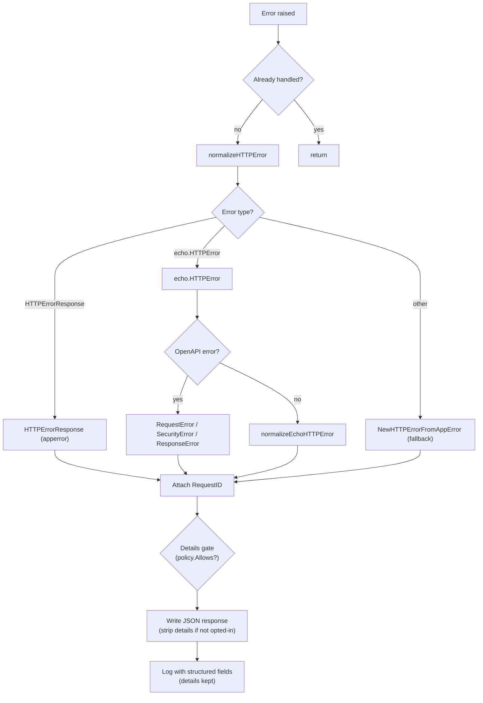

# errorhandler

English | [日本語](README.ja.md)

Unified HTTP error handler that normalizes errors from Echo, OpenAPI validation, and application-level errors into consistent JSON responses with structured logging.

## Architecture



## Error Normalization

The handler processes errors in the following priority:

### 1. `response.HTTPErrorResponse` (Application Error)

Errors already wrapped by `response.NewHTTPErrorFromAppError()` in handlers.

- If HTTP status is valid (400-599): use as-is, attach RequestID
- If HTTP status is invalid: re-normalize via `NewHTTPErrorFromAppError(internal)`

### 2. `echo.HTTPError` (Echo / OpenAPI Error)

First checks for OpenAPI-specific errors inside the Echo error:

|OpenAPI Error Type|HTTP Status|
|---|---|
|`openapi3filter.RequestError`|400 Bad Request|
|`openapi3filter.SecurityRequirementsError`|401 Unauthorized|
|`openapi3filter.ResponseError`|500 Internal Server Error|

If not an OpenAPI error, normalizes as a standard Echo HTTP error using the status code.

### 3. Fallback

Any unrecognized error is passed to `response.NewHTTPErrorFromAppError()` which maps `apperror` types to HTTP status codes.

## Response Format

All errors are returned as JSON using `response.HTTPErrorResponse`:

```json
{
  "code": "BAD_REQUEST",
  "message": "...",
  "details": ["..."],
  "requestId": "..."
}
```

- `requestId` is always attached (extracted via `requestid.GetRequestIDFromResponse`)
- `Details` and `Internal` error are included when available
- When the error carries an `apperror.Meta`, its `code` / `message` / `details` override the status defaults inside `NewHTTPErrorFromAppError` (the HTTP status never changes) — see the `apperror.Meta` Overrides section of [`controller/error/response/README.md`](../../error/response/README.md)
- `Internal` error and stack trace are logged but **not returned to the client**

### Details opt-in gate (fail-closed)

`details` are **opt-in per endpoint**. A `DetailPolicy` (built once at startup from the OpenAPI
spec, `detail_exposure.go`) precomputes which operations declare the `ErrorResponseWithDetails`
schema. On the error path, if the response carries `details`, `handleHTTPError` resolves the
request's operation and — unless it opted in — strips `details` from the **client wire** only
(`writeErrorResponse` copies the body; the `resp` object and the logs keep the full `details`).
An unmatched route or a non-opted-in operation both fail **closed** (no `details`). The policy
router is host-agnostic (built from a servers-stripped spec copy), so proxied / test hosts still
resolve by path + method. Rationale: [ADR-0042](../../../../docs/adr/0041-error-details-opt-in-gate.md).

## Logging

Error logging is controlled by `ObservabilityConfig.TargetStatusCodeSet()`:

- Only status codes in the configured set are logged
- **5xx**: Logged at `Error` level (`errorhandler.server_error`)
- **4xx**: Logged at `Warn` level (`errorhandler.client_error`)

Log fields include:

- HTTP status, error code, error message, RequestID
- Request details (method, path, URI, remote IP, host, user agent, etc.)
- Query and path parameters
- Trace ID / Span ID (if observability is enabled)
- Internal error message and stack trace (for debugging)

## Re-entrance Guard

On first invocation the handler calls `ctxhelper.SetErrorHandledToEcho(c, true)`; subsequent invocations short-circuit via `ctxhelper.GetErrorHandledFromEcho(c)` so a second error raised during error-response writing cannot trigger infinite recursion. The flag is a typed sentinel generated by `scripts/genctxkey` and stored on the request context, not on the Echo store.

## Recovery Coordination

When the upstream `recovery` middleware has already logged the panic, the same context carries the `Recovered` sentinel set via `ctxhelper.SetRecoveredToEcho(c, true)`. The handler checks `ctxhelper.GetRecoveredFromEcho(c)` before calling `logHTTPError` to skip the duplicate log line (the 500 response itself is still written).

## File Structure

|File|Responsibility|
|---|---|
|`http_error_handler.go`|Main handler, normalization dispatcher, logging|
|`echo_http_error_handler.go`|Normalize `echo.HTTPError` to `HTTPErrorResponse`|
|`open_api_error_handler.go`|Normalize OpenAPI validation errors to `HTTPErrorResponse`|
|`detail_exposure.go`|`DetailPolicy` — per-endpoint `details` opt-in resolved from the OpenAPI spec|

## Coverage exceptions

Per `docs/testing-conventions.md` §9, the following infallible defensive branch is left uncovered (no contrived tests):

- `http_error_handler.go` `handleHTTPError` — the nested `WriteHeader(500)` taken only when `writeErrorResponse` fails while the response is not yet committed. The body is the fixed, always-JSON-encodable `gen.ErrorResponseWithDetails` struct, so `c.JSON` can only fail during the write (after `WriteHeader` has already committed the response); the not-yet-committed failure is unreachable. The reachable write-failure path (log + no double commit) is covered.

## Notes

- If writing the error response fails, a fallback `500` status is returned with the write error logged
- Error responses use `response.HTTPErrorResponse` from `controller/error/response/` — see that package for the error code and message mapping
- This handler replaces Echo's default error handler entirely
