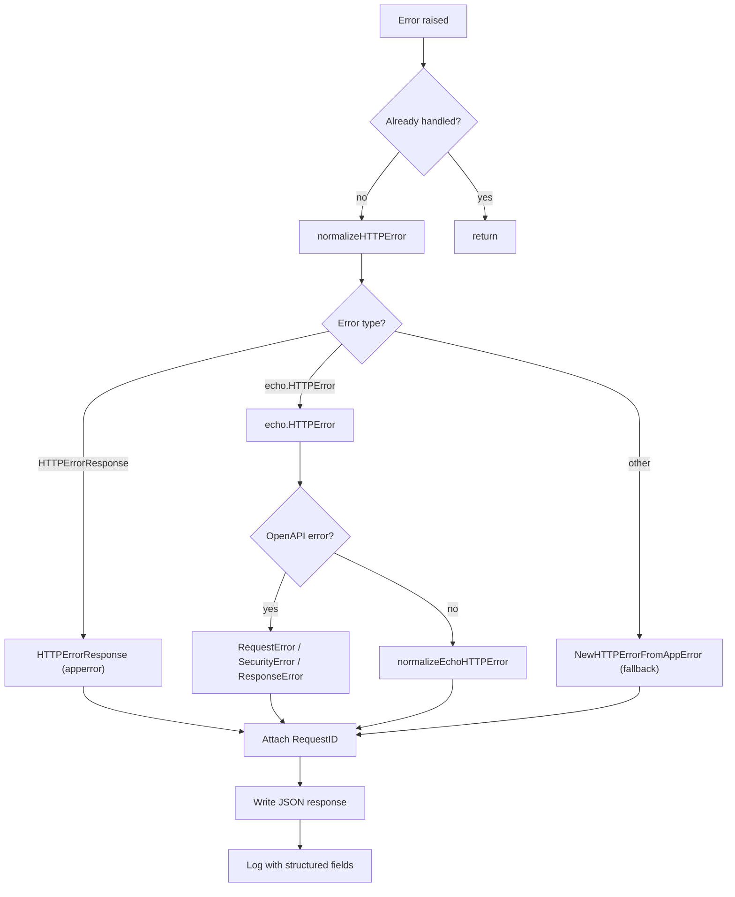

# errorhandler

English | [日本語](README.ja.md)

Unified HTTP error handler that normalizes errors from Echo, OpenAPI validation, and application-level errors into consistent JSON responses with structured logging.

## Architecture



## Public API

|Function|Description|
|---|---|
|`New(e, log, lf, obsCfg)`|Set unified error handler on Echo instance (`e.HTTPErrorHandler`)|
|`NewHTTPErrorHandler(logger, lf, obsCfg)`|Return `echo.HTTPErrorHandler` that normalizes all error types|

## Error Normalization

The handler processes errors in the following priority:

### 1. `response.HTTPErrorResponse` (Application Error)

Errors already wrapped by `response.NewHTTPErrorFromAppError()` in handlers.

- If HTTP status is valid (400-599): use as-is, attach RequestID
- If HTTP status is invalid: re-normalize via `NewHTTPErrorFromAppError(internal)`

### 2. `echo.HTTPError` (Echo / OpenAPI Error)

First checks for OpenAPI-specific errors inside the Echo error:

|OpenAPI Error Type|HTTP Status|
|---|---|
|`openapi3filter.RequestError`|400 Bad Request|
|`openapi3filter.SecurityRequirementsError`|401 Unauthorized|
|`openapi3filter.ResponseError`|500 Internal Server Error|

If not an OpenAPI error, normalizes as a standard Echo HTTP error using the status code.

### 3. Fallback

Any unrecognized error is passed to `response.NewHTTPErrorFromAppError()` which maps `apperror` types to HTTP status codes.

## Response Format

All errors are returned as JSON using `response.HTTPErrorResponse`:

```json
{
  "Code": "BAD_REQUEST",
  "Message": "...",
  "Details": ["..."],
  "RequestID": "..."
}
```

- `RequestID` is always attached (extracted via `requestid.GetRequestIDFromResponse`)
- `Details` and `Internal` error are included when available
- `Internal` error and stack trace are logged but **not returned to the client**

## Logging

Error logging is controlled by `ObservabilityConfig.TargetStatusCodeSet()`:

- Only status codes in the configured set are logged
- **5xx**: Logged at `Error` level (`errorhandler.server_error`)
- **4xx**: Logged at `Warn` level (`errorhandler.client_error`)

Log fields include:

- HTTP status, error code, error message, RequestID
- Request details (method, path, URI, remote IP, host, user agent, etc.)
- Query and path parameters
- Trace ID / Span ID (if observability is enabled)
- Internal error message and stack trace (for debugging)

## Re-entrance Guard

On first invocation the handler calls `ctxhelper.SetErrorHandledToEcho(c, true)`; subsequent invocations short-circuit via `ctxhelper.GetErrorHandledFromEcho(c)` so a second error raised during error-response writing cannot trigger infinite recursion. The flag is a typed sentinel generated by `scripts/genctxkey` and stored on the request context, not on the Echo store.

## Recovery Coordination

When the upstream `recovery` middleware has already logged the panic, the same context carries the `Recovered` sentinel set via `ctxhelper.SetRecoveredToEcho(c, true)`. The handler checks `ctxhelper.GetRecoveredFromEcho(c)` before calling `logHTTPError` to skip the duplicate log line (the 500 response itself is still written).

## File Structure

|File|Responsibility|
|---|---|
|`http_error_handler.go`|Main handler, normalization dispatcher, logging|
|`echo_http_error_handler.go`|Normalize `echo.HTTPError` to `HTTPErrorResponse`|
|`open_api_error_handler.go`|Normalize OpenAPI validation errors to `HTTPErrorResponse`|

## Notes

- If writing the error response fails, a fallback `500` status is returned with the write error logged
- Error responses use `response.HTTPErrorResponse` from `controller/error/response/` — see that package for the error code and message mapping
- This handler replaces Echo's default error handler entirely
