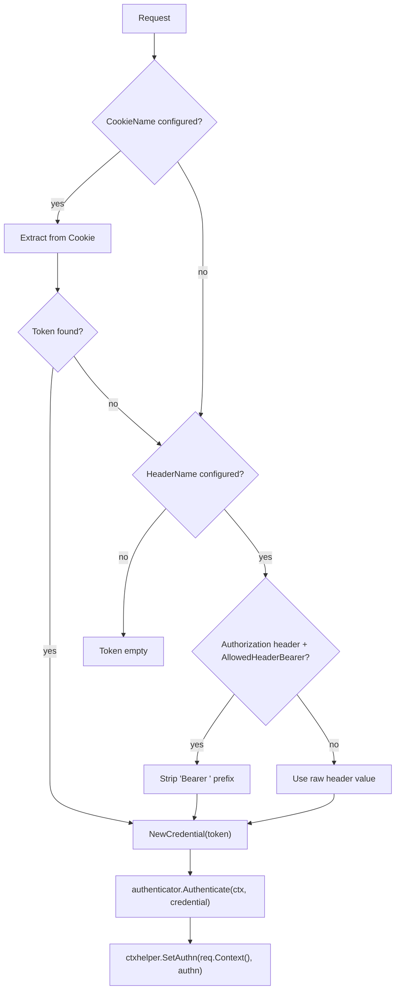
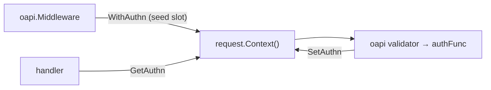

# oapi/auth

English | [日本語](README.ja.md)

OpenAPI authentication function that extracts tokens from cookies or headers, validates them via boundary `Authenticator`, and stores the result in the request context (an authn slot).

## Token Extraction Flow

### Extraction Priority

1. **Cookie** — If `AuthConfig.CookieName()` is set, try extracting from the named cookie first
2. **Header** — If cookie is empty/missing and `AuthConfig.HeaderName()` is set, extract from header
3. **Bearer prefix** — If `AllowedHeaderBearer` is true and header is `Authorization`, strip the `Bearer` prefix (including the trailing space)
4. If neither source provides a token, return `ErrUnauthorizedTokenNotProvided`

### Authentication Steps

1. Extract token from Cookie or Header (priority above)
2. Create `boundary/auth.Credential` from the token
3. Call `authenticator.Authenticate(ctx, credential)` to obtain `Authn`
4. Store `Authn` into the request context via `ctxhelper.SetAuthn()` (the slot is seeded upstream by `ctxhelper.WithAuthn` in `oapi.Middleware`); returns `ErrAuthnSlotNotFound` if the slot is missing

Handler code can then retrieve `Authn` using `ctxhelper.GetAuthn()`.

## Errors

|Error|Base Error|Description|
|---|---|---|
|`ErrUnauthorizedInvalidToken`|`ErrUnauthenticated`|Token validation failed by `Authenticator`|
|`ErrUnauthorizedTokenNotProvided`|`ErrUnauthenticated`|No token found in cookie or header|
|`ErrUnauthorizedTokenMissing`|`ErrUnauthenticated`|Authorization token is missing|
|`ErrAuthnSlotNotFound`|`ErrUnauthenticated`|Authn slot not found in the request context (slot not seeded by `oapi.Middleware`)|
|`ErrInvalidAuthDefaultMode`|`ErrInternal`|Default auth policy not found|

## Authn Slot Integration

This function runs inside the OpenAPI validation pipeline, where only `context.Context` is available (not `echo.Context`). The parent `oapi.Middleware` seeds an **authn slot** into `request.Context()` (via `ctxhelper.WithAuthn`) before validation runs, so the authFunc — invoked by the validator — can write the authenticated `Authn` back into that slot with `ctxhelper.SetAuthn`. The handler later reads it with `ctxhelper.GetAuthn`.

## Notes

- Cookie extraction takes priority over Header — if both are configured and cookie has a value, header is not checked
- Bearer prefix stripping only applies when `AllowedHeaderBearer` is true AND the header name is `Authorization`
- The `Authenticator` implementation is environment-specific (local mock, JWT, OAuth, etc.) and injected via DI
