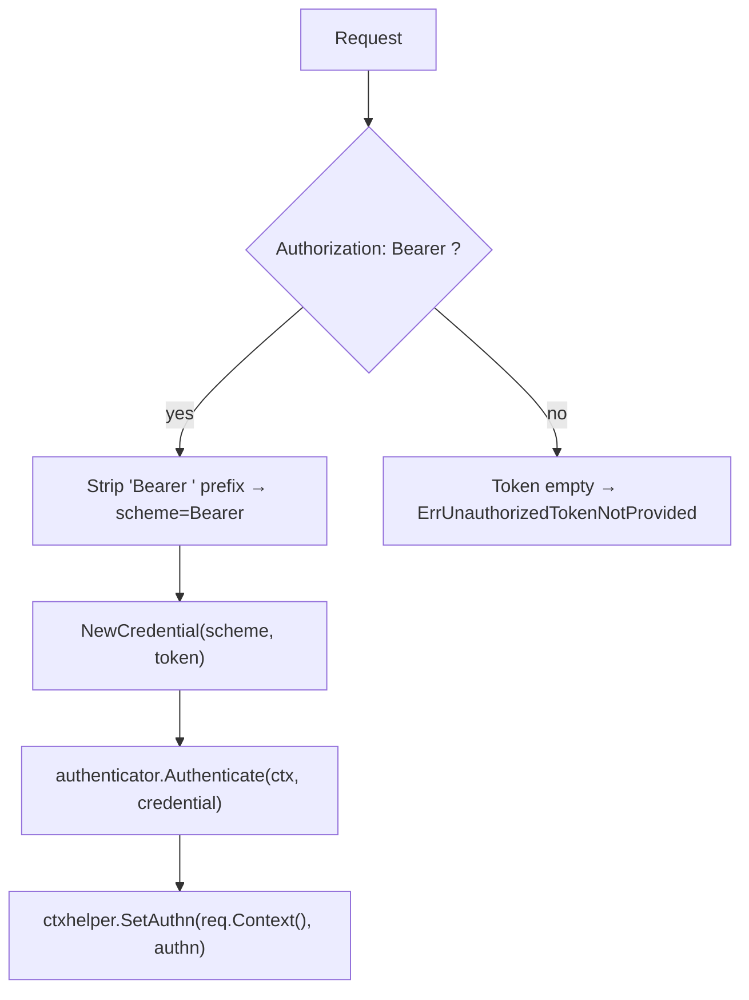
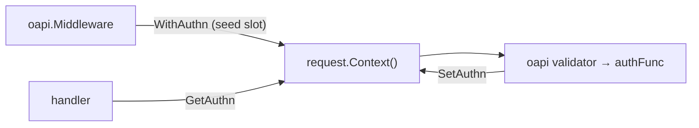

# oapi/auth

English | [日本語](README.ja.md)

OpenAPI authentication function that extracts a Bearer token from the `Authorization` header, validates it via boundary `Authenticator`, and stores the result in the request context (an authn slot). Cookie-based extraction is not supported (Bearer / Resource Server model).

## Token Extraction Flow

### Extraction Rules

1. **Header** — Extract from the fixed `Authorization` header. Bearer tokens are pinned to `Authorization` by RFC 6750, so the header name is not configurable
2. **Bearer prefix** — Only `Authorization: Bearer <token>` is accepted; the `Bearer` prefix is stripped and the credential scheme becomes `Bearer`. Any other form yields no token
3. If no token is found, return `ErrUnauthorizedTokenNotProvided`

### Authentication Steps

1. Extract the Bearer token from the `Authorization` header (rules above)
2. Create `boundary/auth.Credential` from the scheme and token
3. Call `authenticator.Authenticate(ctx, credential)` to obtain `Authn`, passing the **request's**
   context rather than the one the validator supplies — the validator builds its context from
   `context.Background()`, so the span, deadline and cancellation would all be lost, and
   authentication would run outside the request's budget and outside its trace
4. Store `Authn` into the request context via `ctxhelper.SetAuthn()` (the slot is seeded upstream by `ctxhelper.WithAuthn` in `oapi.Middleware`); returns `ErrAuthnSlotNotFound` if the slot is missing

Handler code can then retrieve `Authn` using `ctxhelper.GetAuthn()`.

When a credential was presented and rejected, the resulting error is also recorded into the
slot via `ctxhelper.SetAuthnFailure()` before it is returned. A rejected credential must deny
the request even where the spec declares authentication optional, and the return value alone
cannot carry that — see the fail-closed section in [`../README.md`](../README.md). Absence of a
credential is not a failure and is never recorded, so an operation that admits anonymous
callers still admits them.

## Errors

|Error|Base Error|Description|
|---|---|---|
|`ErrUnauthorizedInvalidToken`|`ErrUnauthenticated`|Token validation failed by `Authenticator`|
|`ErrUnauthorizedTokenNotProvided`|`ErrUnauthenticated`|No token found in the `Authorization` header|
|`ErrUnauthorizedTokenMissing`|`ErrUnauthenticated`|Authorization token is missing (**reserved** — not currently returned; see Notes)|
|`ErrAuthnSlotNotFound`|`ErrInternal`|Authn slot not found in the request context (slot not seeded by `oapi.Middleware`) — a wiring defect, unrelated to the credential|
|`ErrInvalidAuthDefaultMode`|`ErrInternal`|Default auth policy not found (**reserved** — not currently returned; see Notes)|

Every error leaving the authFunc is wrapped so that it carries an HTTP status, and that status
comes from the central `apperror` mapping in `controller/error/response` — the authentication
phase keeps no table of its own. Authentication verdicts land on 401; cancellation on 499; an
unreachable dependency on 503; anything unclassified on 500.

This is not cosmetic. The validation middleware only propagates a status it can read off the
error and otherwise collapses the failure to **403** — an authorization verdict for a request
whose authorization was never evaluated. Assigning the status here is what keeps that from
happening.

The distinction is what the caller acts on. 401 says the credential was rejected, so re-authenticate;
499 / 503 say no verdict was reached, so retry; 403 would say the identity is known and the
operation is refused. Reporting a dependency failure as 401 sends a client to fix a token nobody
examined, and buries a server-side defect inside the one status that is expected background noise.

## Authn Slot Integration

This function runs inside the OpenAPI validation pipeline, where only `context.Context` is available (not `*echo.Context`). The parent `oapi.Middleware` seeds an **authn slot** into `request.Context()` (via `ctxhelper.WithAuthn`) before validation runs, so the authFunc — invoked by the validator — can write the authenticated `Authn` back into that slot with `ctxhelper.SetAuthn`. The handler later reads it with `ctxhelper.GetAuthn`.

## Notes

- Token extraction is header-only; cookies are not consulted (Bearer / Resource Server model)
- Only the `Authorization: Bearer <token>` form is accepted (RFC 6750); non-Bearer schemes and custom header names are not supported
- The `Authenticator` implementation is environment-specific (local mock, JWT, OAuth, etc.) and injected via DI
- **Reserved error seams (not currently returned).** `ErrUnauthorizedTokenMissing` and `ErrInvalidAuthDefaultMode` are deliberately provided as extension points for scenarios this package does not yet implement — respectively, distinguishing a *missing `Authorization` header* from an *empty Bearer token*, and a future *default auth policy* resolution path. Today token absence is reported solely via `ErrUnauthorizedTokenNotProvided`, and there is no default-policy resolution. They are kept (not deleted) as intentional API seams; when either scenario is actually implemented, add the returning code path together with its test rather than relying on the bare sentinel
