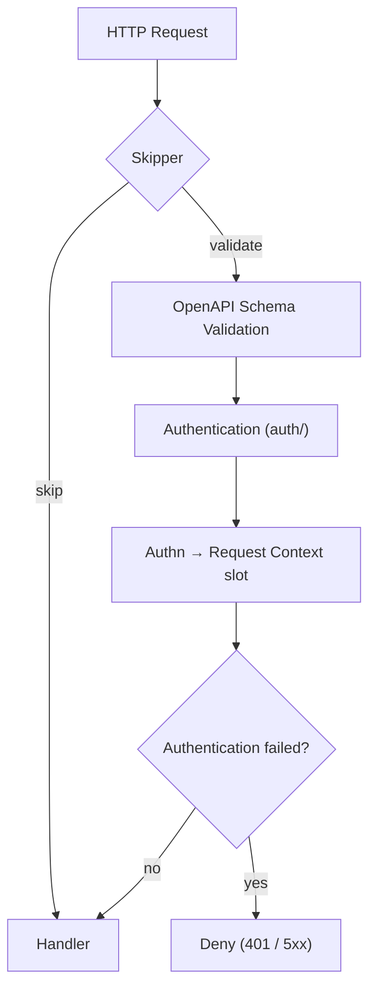

# oapi

English | [日本語](README.ja.md)

`oapi` is the **OpenAPI integration layer** that provides request validation and authentication for the Echo HTTP stack.

This package is the entry point that wires together schema validation, authentication, and route skipping into a single Echo middleware.

## Architecture

1. **Skipper** checks if the request is an ops endpoint — if so, validation is bypassed
2. **Validator** validates the request against the OpenAPI spec (path, params, body, content-type)
3. **Auth** extracts the token, authenticates via boundary `Authenticator`, and writes `Authn` into the request-context slot
4. **Fail-closed** denies the request if authentication failed, whatever the spec permits
5. Handler receives a validated, authenticated request

## Fail-closed authentication

An operation may declare authentication optional by listing several security requirements,
one of them empty. Validation of such an operation succeeds as soon as any one requirement
holds, and an empty requirement always holds — so a presented-but-rejected credential, and an
infrastructure failure while resolving an identity, both leave validation reporting success.
Without a further step an unauthenticated caller would reach the handler, and a database
outage would surface as an anonymous success rather than as an outage.

The authentication function therefore records its failure into the same request-context slot
it uses for the authenticated `Authn`, and this package re-reads that slot after validation
and before the handler. A failure denies the request with the status it carried (401 for a
rejected credential, 503 / 500 for an infrastructure failure). Absence of a credential is not
a failure, so anonymous access remains available where the spec allows it.

This is what keeps "authentication is optional" from meaning "a failed authentication is
accepted", per the fail-closed rule in `docs/design/auth.md` and deny-by-default in
`docs/design/security.md`.

## Subpackages

|Package|Description|Details|
|---|---|---|
|`auth/`|Token authentication from the `Authorization` header|[README](auth/README.md)|
|`skipper/`|Skip validation for ops endpoints|[README](skipper/README.md)|
|`validator/`|Load and provide OpenAPI schema|[README](validator/README.md)|

## Dependencies

|Package|Role|
|---|---|
|`kin-openapi/openapi3`|OpenAPI 3.x schema model|
|`kin-openapi/openapi3filter`|Request validation and auth filter|
|`oapi-codegen/echo-v5-middleware`|Echo adapter for OpenAPI validation|
|`ctxhelper`|Authn slot injection & get/set on the request context|
|`boundary/auth`|Authentication interface and `Authn` value object|

## Notes

- OpenAPI validation covers path parameters, query parameters, request body, and content-type
- Authentication is only triggered for endpoints with `security` defined in the OpenAPI spec
- The `Skipper` ensures ops endpoints are never validated or authenticated
- Before delegating to the oapi-codegen validator, the middleware injects an empty `Authn` slot into `request.Context()` via `ctxhelper.WithAuthn`, so the authentication function (which receives only a plain `context.Context`) can write the authenticated `Authn` into that slot via `ctxhelper.SetAuthn`; downstream handlers read it via `ctxhelper.GetAuthn`
- All errors from this layer are caught by `errorhandler` and converted to appropriate HTTP responses
