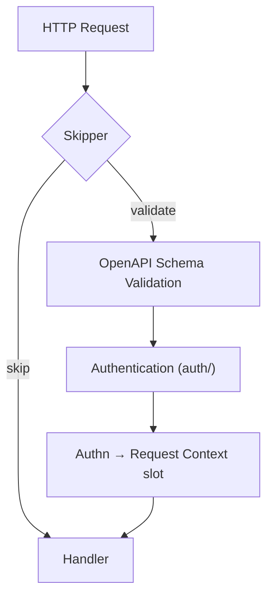

# oapi

English | [日本語](README.ja.md)

`oapi` is the **OpenAPI integration layer** that provides request validation and authentication for the Echo HTTP stack.

This package is the entry point that wires together schema validation, authentication, and route skipping into a single Echo middleware.

## Architecture

1. **Skipper** checks if the request is an ops endpoint — if so, validation is bypassed
2. **Validator** validates the request against the OpenAPI spec (path, params, body, content-type)
3. **Auth** extracts the token, authenticates via boundary `Authenticator`, and writes `Authn` into the request-context slot
4. Handler receives a validated, authenticated request

## Subpackages

|Package|Description|Details|
|---|---|---|
|`auth/`|Token authentication from Cookie / Header|[README](auth/README.md)|
|`skipper/`|Skip validation for ops endpoints|[README](skipper/README.md)|
|`validator/`|Load and provide OpenAPI schema|[README](validator/README.md)|

## Dependencies

|Package|Role|
|---|---|
|`kin-openapi/openapi3`|OpenAPI 3.x schema model|
|`kin-openapi/openapi3filter`|Request validation and auth filter|
|`oapi-codegen/echo-middleware`|Echo adapter for OpenAPI validation|
|`ctxhelper`|Authn slot injection & get/set on the request context|
|`boundary/auth`|Authentication interface and `Authn` value object|

## Notes

- OpenAPI validation covers path parameters, query parameters, request body, and content-type
- Authentication is only triggered for endpoints with `security` defined in the OpenAPI spec
- The `Skipper` ensures ops endpoints are never validated or authenticated
- Before delegating to the oapi-codegen validator, the middleware injects an empty `Authn` slot into `request.Context()` via `ctxhelper.WithAuthn`, so the authentication function (which receives only a plain `context.Context`) can write the authenticated `Authn` into that slot via `ctxhelper.SetAuthn`; downstream handlers read it via `ctxhelper.GetAuthn`
- All errors from this layer are caught by `errorhandler` and converted to appropriate HTTP responses
