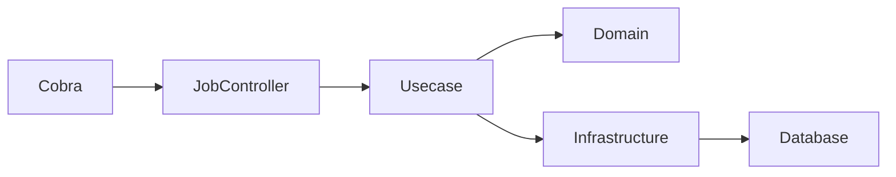

# Controller Layer Job (`internal/controller/job`) Guide

English | [日本語](README.ja.md)

## Role in This Repository

`internal/controller/job` is the **entry point for batch/jobs (Controller layer)** invoked from the CLI using Cobra.

Responsibilities:

- Normalize job inputs and outputs (interpret `args`, format results)
  - Extract and convert parameters required by business logic from CLI args
- Start and finish spans using Observability (`LayerTracer`)
- Call the Usecase layer
- Normalize errors to `apperror` / `errorresponse` (or Job-specific error forms)
- Format and output results via logs

**Business logic**, **DB access**, and **domain model manipulation** must live in **Usecase / Domain / Infrastructure**.  
The Controller must remain thin.

## Architecture

### Job Execution Flow

This is the execution flow when a job runs.



Jobs do not pass through HTTP.  
They enter the Controller directly from the CLI.

Execution flow:

1. Cobra receives the CLI command
2. Job Controller interprets `args`
3. The Usecase layer is called
4. Domain / Infrastructure perform data processing
5. Results are emitted as logs

HTTP Controller and Job Controller have **the same role**,  
but **their input protocols differ**.

## Controller Types

This boilerplate defines two types of controllers.

- HTTP Controller: converts HTTP requests into Usecase calls
- Job Controller: converts CLI executions into Usecase calls

A Job Controller can be understood as a **Controller without HTTP**.

### Difference Between Job Controller and HTTP Controller

HTTP Controller

- Handles HTTP requests
- Returns OpenAPI responses
- Passes through middleware

Job Controller

- Handles CLI args
- Expresses results via logs
- No HTTP middleware

## Responsibility for args Parsing

Parsing CLI args is the **Controller’s responsibility**.

The Controller's role is to **convert CLI syntax into typed values**.

Example

```txt
--since 2024-01-01
↓
Controller: convert to time.Time
↓
Usecase: use in business logic
```

Controller responsibilities:

- CLI argument syntax interpretation
- Type conversion
- Range validation

Usecase responsibilities:

- Applying business rules

## Exit Code Handling

Job Controllers **must not call `os.Exit()`**.

Reason:

- Exit codes are managed by the CLI / Runner layer
- If Controllers terminate the process directly, responsibilities become mixed

Recommended flow:

```txt
Controller
↓
return error
↓
JobRunner
↓
Exit code decision
```

## Recommended Logging Structure

Job execution results should be emitted using **structured logging**.

Recommended fields:

```txt
job
duration
result_count
error
```

Example

```go
// Log job execution result
u.logging.Named(jobName).Info(
    "Job completed",
    logging.Int64(logging.JobResultKey, count),
)
```

## How to Parse args

Simple jobs may parse `args` directly.

For more complex jobs, using `flag` or `pflag` is recommended.

```txt
Simple job:
    parse args manually

Complex job:
    use flag / pflag
```

## Job Design Guidelines

Jobs should be designed to be **idempotent whenever possible**.

Reason:

- Batch jobs may be retried
- Operational recovery becomes easier

Example

```txt
Good
reindex-users
cleanup-sessions

Bad
delete-all-data
```

## Job Granularity

Recommended:

```txt
1 job = 1 operational task
```

Examples:

```txt
user-count
fix-collation
reindex-users
cleanup-sessions
```

A job should represent **a single operational task**.

## Implementation Notes

### Naming / Structure

Recommended structure: **1 job type = 1 package (1 directory)**.

Naming conventions:

- Package name: lowercase (Go style)  
  - examples: `usercount`, `fixcollation`
- Job name (Runner key): **kebab-case**
  - examples: `user-count`, `fix-collation`, `dump-schema`
- Align the name with `cobra job <name>` for consistency and documentation clarity

## Allowed Layer Calls

- **Controller → Usecase only**  
  (plus generated code `gen`, DTO/Presenter, `apperror` / `errorresponse`)

- **Do not call Infra / Domain directly**

- DI (`fx`) should inject `usecase.Service` into the handler

## Do / Don't Summary

### Do

- Interpret args as the **minimum required parameters** for the job  
  - examples: `--dry-run`, `--limit`, `--since`
- Perform **input validation** in the Controller
  - type conversion
  - range checks
- Call Usecase and format the result to logs or stdout
- Return `apperror` or converted errors for unified handling in the JobRunner
- Start a LayerTracer span and always close it using `defer`
- Record job start/end, inputs, and results (such as record counts) in structured logs

### Don't

- Access DB drivers or `sqlc` Querier from the Controller
- Call repositories directly from the Controller
- Implement domain entity creation or persistence logic in the Controller
- Directly interact with the OpenTelemetry SDK (`sdktrace.NewTracerProvider`, etc.)
- Call `os.Exit()` in the middle of a job
- Ignore the unified output/log format rules

## Test Strategy

Tests in the Job Controller layer verify the **behavior of the CLI boundary**.

In this layer, **the Usecase implementation is not used and mocks are used instead**.

### Test Dependencies

|Dependency|Test Method|
|---|---|
|Usecase|mock|
|Domain|not used|
|Infrastructure|not used|
|Logger|test logger|
|Tracer|noop tracer|

### Test Targets

Job Controller tests verify the following:

- CLI args parsing
- Usecase invocation
- Error propagation
- Log output

### Test Structure

Job Controller tests are implemented with the following structure.

```text
TestNew
TestJob_Name
TestJob_Execute
```

### Success Case Tests

The success cases verify the following:

- args are correctly interpreted
- Usecase is called with the correct arguments
- no error occurs

Example:

```go
mockApp.EXPECT().
    CountUsers(gomock.Any(), gomock.Any()).
    Return(int64(42), nil)
```

### Error Case Tests

Error cases verify that errors returned by the Usecase are propagated as-is.

```go
mockApp.EXPECT().
    CountUsers(gomock.Any(), gomock.Any()).
    Return(int64(0), assertError)

require.Equal(t, assertError, err)
```

### Runner Tests

Runner tests verify **only the job registry and dispatch logic**.

```text
Test_NewRunner
Test_runner_Run
Test_runner_Names
```

Verification targets:

- detection of duplicate job names
- error when an unregistered job is requested
- execution of a job

### State Tests

The state tests verify **only the state management logic that includes a mutex**.

```text
TestState
```

Verification targets:

- consistency between Set → Snapshot
- usability of the channel

### Test Policy

The following are **not performed in Job Controller tests**:

- DB connections
- SQL execution
- Domain logic validation
- validation of internal Usecase logic

These are the responsibility of **Usecase / Domain / Infrastructure tests**.

## Observability (Tracing)

In this boilerplate, the Controller layer does **not directly interact with the OpenTelemetry SDK**.

Instead, spans are started and finished through `observability.LayerTracer`.

### 1. Starting and Ending a Span in the Controller

Every handler must begin with the following lines.

```go
ctx, endSpan := s.tracer.Start(ctx)
defer endSpan()
```

Explanation:

- `Start(ctx)` begins a span and attaches `trace_id/span_id` to the context
- `endSpan()` ends the span (`span.End`)
- `defer endSpan()` ensures the span closes even if early returns or errors occur

Key points:

- The Controller only knows about starting and ending spans
- It never touches OpenTelemetry SDK internals
- Job Controllers start spans the same way as HTTP Controllers, enabling CLI traces to integrate with the same tracing system

### 2. Tracer Dependency Injection (`observability.LayerTracer`)

Controllers receive `observability.LayerTracer` as a dependency.

```go
type jobImpl struct {
    tracer  observability.LayerTracer // tracer used for observability
    logging logging.Logger            // logger for job result output
    usecase hoge.Usecase              // usecase executed by this job
}
```

The tracer is created through `observability.TracerFactory`.

```go
func New(
    tf observability.TracerFactory,
    usecase user.Usecase,
    logging logging.Logger,
) job.Job {
    return &jobImpl{
        tracer:  tf.Controller(),
        usecase: usecase,
        logging: logging,
    }
}
```

Here:

- The Controller never directly uses SDK instances
- The observability layer hides tracer generation rules
  - layer name
  - package name
  - function name extraction

## Reference Snippet

```go
package usercount

import (
    "context"

    "boilerplate-go/internal/observability"
    // Import packages required by the implementation
)

// Define the job name
const jobName = "user-count"

type jobImpl struct {
    tracer  observability.LayerTracer // tracer for observability
    usecase user.Usecase              // controller calls the usecase
    logging logging.Logger            // logger for result output
}

// Register this function in internal/di/module/job.go as [<package>.New,]
func New(
    tf observability.TracerFactory,
    usecase user.Usecase,
    logging logging.Logger,
) job.Job {
    return &jobImpl{
        tracer:  tf.Controller(),
        usecase: usecase,
        logging: logging,
    }
}

// Name implements the Name method of the job.Job interface.
// In most cases, this implementation can be used as-is.
func (u *jobImpl) Name() string {
    return jobName
}

// Execute implements the Execute method of the job.Job interface.
func (u *jobImpl) Execute(ctx context.Context, args []string) error {
    // Start a tracing span
    ctx, endSpan := u.tracer.Start(ctx)
    defer endSpan()

    // Implement the main job logic here (argument parsing)
    // For complex jobs, using flag or pflag is recommended.
    var active *bool
    for _, a := range args {
        switch a {
        case "--active-only":
            active = ptr.To(true)
        case "--inactive-only":
            active = ptr.To(false)
        }
    }

    // Call the usecase
    count, err := u.usecase.CountUsers(ctx, active)
    if err != nil {
        return err
    }

    // Output the result to logs
    u.logging.Named(jobName).Info(
        "Result: total user count",
        logging.Int64(logging.JobResultKey, count),
    )

    return nil
}
```
