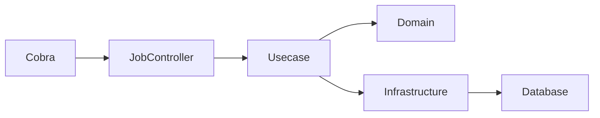
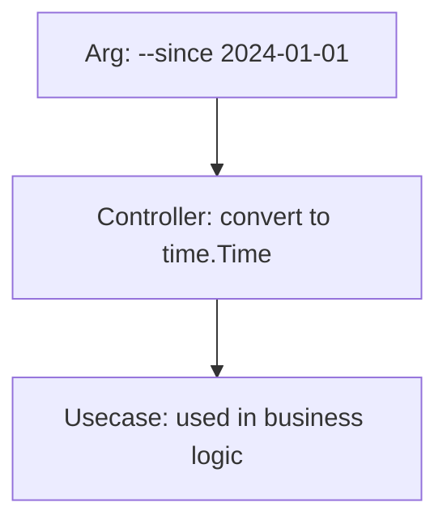
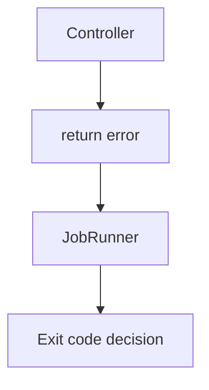
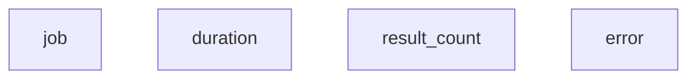
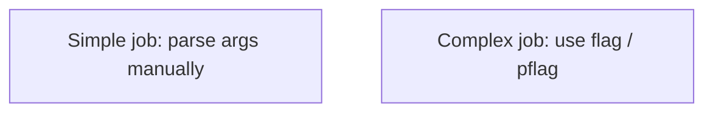
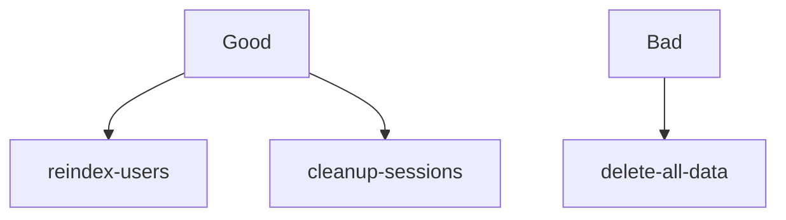
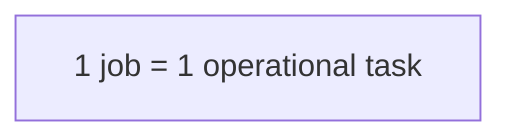
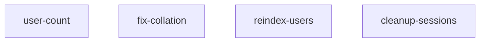
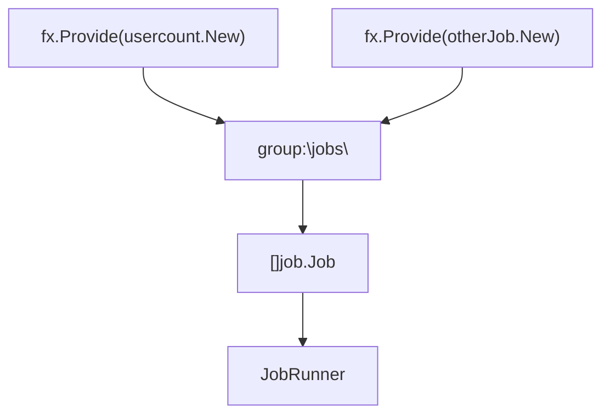

# Job Controller Layer (`internal/controller/job`) Guide

English | [日本語](README.ja.md)

## Role in This Project

`internal/controller/job` is the **batch/job entry point (Controller layer)** that is invoked from the CLI (Cobra).

- Normalize job input/output (interpretation of args, output format of results)
  - Extract and convert parameters required for job business logic from args
- Start and end spans with Observability (LayerTracer)
- Call the Usecase layer
- Normalize errors to apperror / errorresponse (or an error representation for Job)
- Format and output results to logs

Delegate "business logic", "DB access", and "domain model operations" to Usecase / Domain / Infra, and keep the Controller thin.

## Architecture

### Processing Flow When Running a Job



Jobs enter the Controller directly from the CLI without going through HTTP.

The processing flow is as follows:

1. Cobra receives the CLI command
2. Job Controller interprets args
3. Calls Usecase
4. Domain / Infrastructure perform data processing
5. Outputs results to logs

HTTP Controller and Job Controller **have the same role, differing only in input protocol**.

## Types of Controller

This project has two types of Controllers.

- HTTP Controller: Converts HTTP requests into Usecase calls
- Job Controller: Converts CLI execution into Usecase calls

You can think of Job Controller as a **Controller without HTTP**.

### Differences Between Job Controller and HTTP Controller

HTTP Controller

- Processes HTTP requests
- Returns OpenAPI responses
- Passes through middleware

Job Controller

- Processes CLI args
- Represents results via log output
- No HTTP middleware exists

## Responsibility for args Parsing

Parsing of args is the responsibility of the Controller.

The Controller's role is to **convert CLI syntax into typed values**.

Example



Controller

- Syntax interpretation of CLI arguments
- Type conversion
- Range checking

Usecase

- Application of business rules

## Handling Exit Code

Job Controller **must not call `os.Exit()`**.

Reason

- Exit codes are managed by the CLI / Runner layer
- If Controller controls process termination, responsibilities are broken

Recommended



## Recommended Log Output Structure

It is recommended to output job execution results as **structured logs**.

Recommended fields



Example

```go
// Log job execution result
u.logging.Named(jobName).Info(
    "Job completed",
    logging.Int64(logging.JobResultKey, count),
)
```

## How to Parse args

For simple jobs, you may parse `args` directly.

For complex jobs, it is recommended to use `flag` or `pflag`.



## Guidelines for Job Design

Design jobs to be **idempotent whenever possible**.

Reason

- Batch jobs are likely to be re-executed
- Makes retries during operation easier

Example



## Granularity of Job

Recommended



Example



Design jobs at the granularity of **a single operational task**.

## Implementation Notes

### Naming/Structure

The recommended structure is "1 job type = 1 package (1 directory)".

The following naming policy is stable.

- Package name: Go style lower (not lower_snake) (e.g., usercount, fixcollation)
- Job name (key used by Runner): kebab-case is recommended
  - e.g., user-count / fix-collation / dump-schema
- Makes it easy to match with Cobra's job <name> and to document in README

## Layers That Can Be Called

- **Controller → Usecase only** (plus generated code `gen`, DTO/Presenter, `apperror`/`errorresponse`)
- **Do not call Infra / Domain directly**
- In DI (`fx`), `handler` receives `usecase.Service`

## Do's and Don'ts (Summary)

### Do

- Interpret args as "the minimum arguments required by the job"
  - e.g.: --dry-run, --limit, --since, etc.
- Perform input value validation (type conversion, range checking) in the Controller
  - Do not go as far as business rules (e.g., whether state transitions are allowed)
- Call Usecase, receive results, and format them for logs or standard output
- Return apperror / convert and return errors (to make unified handling in JobRunner easier)
- Start a span with LayerTracer and always close it with defer
- Leave job start/end, input, and result (record count, etc.) as structured logs

### Don’t

- Directly touch DB drivers or sqlc Querier in the Controller (Infra's responsibility)
- Call Repository directly in the Controller (do not skip Usecase)
- Write logic for creating/persisting domain entities in the Controller
- Directly touch OTel SDK (do not write sdktrace.NewTracerProvider() etc. in the Controller)
- Call os.Exit() in the middle of a job (may conflict with Runner/CLI control)
- Ignore unified rules for output format (log/standard output) (will be a nightmare in operation)

## Test Strategy

Tests for the Job Controller layer verify **the behavior at the CLI boundary**.

In this layer, **do not use the Usecase implementation, use mocks**.

### Test Dependencies

|Dependency|Test Method|
|---|---|
|Usecase|mock|
|Domain|not used|
|Infrastructure|not used|
|Logger|test logger|
|Tracer|noop tracer|

### Test Targets

Job Controller tests verify the following:

- Parsing of CLI args
- Usecase invocation
- Error propagation
- Log output

### Test Structure

Job Controller tests are implemented in the following structure.

```go
func TestNew(t *testing.T) {
    // Test implementation
}
func TestJob_Name(t *testing.T) {
    // Test implementation
}
func TestJob_Execute(t *testing.T) {
    // Test implementation
}
```

### Success Case Tests

In success cases, verify the following:

- args are correctly interpreted
- Usecase is called with correct arguments
- No error occurs

Example:

```go
mockApp.EXPECT().
    CountUsers(gomock.Any(), gomock.Any()).
    Return(int64(42), nil)
```

### Error Case Tests

In error cases, verify that errors returned by Usecase are returned as-is.

```go
mockApp.EXPECT().
    CountUsers(gomock.Any(), gomock.Any()).
    Return(int64(0), assertError)

require.Equal(t, assertError, err)
```

### Runner Tests

Runner tests **only the registry/dispatch of jobs**.

```go
func Test_NewRunner(t *testing.T) {
    // Test implementation
}
func TestRunner_Run(t *testing.T) {
    // Test implementation
}
func TestRunner_Names(t *testing.T) {
    // Test implementation
}
```

Verification targets

- Detection of duplicate job names
- Error for unregistered jobs
- Execution of jobs

### State Tests

state tests **only the state holding logic including mutex**.

```go
func TestState(t *testing.T) {
    // Test implementation
}
```

Verification targets

- Consistency between Set → Snapshot
- Usability of the channel

### Test Policy

Job Controller tests do not perform the following.

- DB connection
- SQL execution
- Domain logic verification
- Verification of internal Usecase logic

These are the responsibility of **Usecase / Domain / Infrastructure tests**.

## DI (Dependency Injection) Mechanism

In this project, Job Controller is dependency-injected (DI) by Uber Fx.

### Overall Structure

Jobs are grouped into `group:"jobs"` and aggregated in Runner.



### Role of module/job.go

```go
func JobModule() fx.Option {
    return fx.Module("job",
        provideJobs(
            usercount.New,
        ),
        fx.Provide(
            dijob.ProvideRunner,
            job.NewState,
        ),
        fx.Invoke(hook.RegisterJobHooks),
    )
}
```

- `provideJobs(...)`
  - Registers constructors for each Job to `group:"jobs"`
- `ProvideRunner`
  - Receives the list of Jobs and creates a Runner to manage execution
- `RegisterJobHooks`
  - Binds Jobs to the CLI at app startup

### Job Constructor Design

Jobs should **receive Usecase / Logger / Tracer via DI**.

```go
func New(
    tf observability.TracerFactory,
    usecase user.Usecase,
    logging logging.Logger,
) job.Job {
    return &jobImpl{
        tracer:  tf.Controller(),
        usecase: usecase,
        logging: logging,
    }
}
```

Points:

- Controller does not create dependencies itself
- Always receive dependencies from DI (fx)
- This allows replacement with mocks during testing

### Why Use group:"jobs"

- Adding Jobs does not require modification of Runner
- Jobs can be added in a plug-in manner
- Satisfies the Open/Closed Principle

### Rules for AI/Developers

- When adding a Job, add it to `provideJobs(...)` in `module/job.go`
- Do not bypass DI to instantiate with new
- Always receive dependencies via constructor

## Observability (Tracing) Usage

In this project, the Controller layer does not directly handle the OpenTelemetry SDK,
but starts/ends spans via observability.LayerTracer.

### 1. Starting and Ending a Span in the Controller Layer

At the beginning of each handler, always write the following two lines.

```go
ctx, endSpan := s.tracer.Start(ctx)
defer endSpan()
```

- Start(ctx) starts a span and associates trace_id/span_id with the context.
- endSpan() ends the span (span.End).
- defer endSpan() ensures the span is always ended even on exceptions or early returns.

Points:

- Controller only knows how to start/end spans, and does not touch OpenTelemetry SDK details.
- Job Controller also starts a span in the same way. This allows CLI executions to be integrated into the same trace infrastructure as HTTP traces.

### 2. DI of Tracer (observability.LayerTracer)

Controllers receive observability.LayerTracer as a dependency as follows.

```go
type jobImpl struct {
    tracer  observability.LayerTracer // Tracer for observability
    logging logging.Logger // For result log output
    usecase hoge.Usecase // Usecase used by each job
}
```

On the BindHandler side, a Controller-specific tracer is generated with `observability.NewControllerTracer`.

```go
func New(
    tf observability.TracerFactory,
    usecase user.Usecase,
    logging logging.Logger,
) job.Job {
    return &jobImpl{
        tracer:  tf.Controller(),
        usecase: usecase,
        logging: logging,
    }
}
```

Here, raw SDK instances are not used directly,
and the observability layer hides the tracer generation rules (layer name, package name, function name extraction) internally.

## Reference Snippet

```go
package usercount

import (
    "context"

    "boilerplate-go/internal/observability"
    // Import packages used in the implementation
)

// Definition of job name
const jobName = "user-count"

type jobImpl struct {
    tracer  observability.LayerTracer // Tracer for observability
    usecase user.Usecase // Usecase called from controller
    logging logging.Logger // For result log output
}

// Register this function in internal/di/module/job.go as [<package>.New,]
func New(
    tf observability.TracerFactory,
    usecase user.Usecase,
    logging logging.Logger,
) job.Job {
    return &jobImpl{
        tracer:  tf.Controller(),
        usecase: usecase,
        logging: logging,
    }
}

// Name implements the Name method of the job.Job interface.
// Unless you have a specific intention, use this implementation as is.
func (u *jobImpl) Name() string {
    return jobName
}

// Execute implements the Execute method of the job.Job interface.
func (u *jobImpl) Execute(ctx context.Context, args []string) error {
    // Start a span for tracing
    ctx, endSpan := u.tracer.Start(ctx)
    defer endSpan()

    // Implement the main logic of the job here (argument parsing)
    // For complex jobs, it is recommended to use flag or pflag.
    var active *bool
    for _, a := range args {
        switch a {
        case "--active-only":
            active = ptr.To(true)
        case "--inactive-only":
            active = ptr.To(false)
        }
    }

    // Call the usecase
    count, err := u.usecase.CountUsers(ctx, active)
    if err != nil {
        return err
    }

    // Output the result to logs
    u.logging.Named(jobName).Info( // Output is recommended at Info level, add job name with Name
        "Result: total user count",
        logging.Int64(logging.JobResultKey, count), // Use constant key for result
    )

    return nil
}
```
