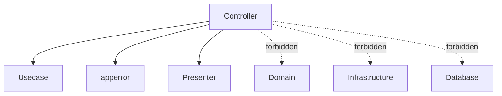

# Controller Layer Guide (`internal/controller`)

English | [日本語](README.ja.md)

## Role in Onion Architecture

- Acts as the **boundary between the external world (HTTP/CLI) and the application**
- Responsible for **protocol adaptation (Adapter)**, converting inputs into **application vocabulary (DTO / Value Objects)** and invoking the **Usecase layer**
- Performs **output formatting (Presenter)** by converting Usecase results into **OpenAPI response types**
- Maps exceptions (`error`) into **HTTP status codes** and **error codes** (`apperror` → Status)

> Key point: **Controllers must not contain business logic**.
> Their responsibility is limited to interpreting and formatting HTTP / CLI interactions.

## Directory Structure

The layer is split by **how the outside reaches the application** — four entry-point kinds, and
nothing else may be one:

- `handler/` — HTTP requests
- `job/` — a CLI invocation
- `worker/` — a message on a queue
- `outbox/` — the relay that polls the outbox and publishes

The remaining directories exist to serve those four: `server/` builds the Echo instance,
`httpstack/` the middleware stack, `error/response/` the error body, `conv/` the
generated-type ↔ domain-type boundary, and `ctxhelper/` the Echo context accessors.

## Subdirectory Roles

|Directory|Description|Details|
|---|---|---|
|`handler/`|Handlers that receive HTTP requests and delegate to Usecase|[README](handler/README.md)|
|`job/`|Job controllers invoked from CLI|[README](job/README.md)|
|`worker/`|Worker engine consuming a pull-ack message queue and dispatching to Usecase|[README](worker/README.md)|
|`outbox/`|Relay engine that periodically polls the outbox and publishes pending messages|[README](outbox/README.md)|
|`server/`|Echo instance initialization and DI lifecycle integration|[README](server/README.md)|
|`httpstack/`|Middleware stack (CORS, security, logging, auth, etc.)|[README](httpstack/README.md)|
|`error/response/`|Unified HTTP error response generation and apperror mapping|[README](error/response/README.md)|
|`conv/`|Boundary helpers converting OpenAPI-generated types into domain types|[README](conv/README.md)|
|`ctxhelper/`|Helpers for setting/getting values in Echo context|[README](ctxhelper/README.md)|

## Dependency Rules

Controllers access lower layers **only through Usecase**.

### Doc comments stay in HTTP vocabulary

The forbidden edges above govern doc comments as well. A handler doc comment states the HTTP-level
contract — what the endpoint returns, which status codes the failures map to, whether authentication
is required — and must not name tables, columns, SQL fragments, or where the transaction boundary
sits; those belong to the layer that owns them (see
[`internal/usecase/README.md`](../usecase/README.md) § Doc comments: interface vs implementation and
[`internal/infrastructure/README.md`](../infrastructure/README.md) § Doc comments may name technical
detail). A handler method is a method on the unexported `server`, so `revive` does not require a doc
comment on it: when the generated `ServerInterface` already carries the OpenAPI summary and there is
no HTTP-level detail worth adding, omit it rather than restating.

## Test Strategy

This is the layer baseline. A controller is any inbound adapter, and they do not all speak HTTP, so read the sub-section that matches the driver before applying anything below. Sub-trees with their own section own their viewpoints outright: [`handler/`](handler/README.md), [`job/`](job/README.md), [`httpstack/`](httpstack/README.md), [`server/`](server/README.md).

### HTTP handlers

Handler tests mock the usecase and drive the handler through Echo (`testkit/testecho` + `testkit/testassert`); business logic lives in the usecase and is not re-tested here. Each handler test verifies:

- HTTP I/O conversion — request binding (path / query / body) → usecase input, and usecase output → response DTO / status
- request validation paths (OpenAPI / bind failures → 400 etc.)
- `apperror` → HTTP status mapping (the usecase error surfaced as the right status / code)
- middleware-supplied context — values the handler reads from context (auth principal / request id / idempotency)

Boundary-level HTTP wiring (Router → Middleware → Handler → Presenter) is covered separately by the `internal/integration` HTTP-boundary tests.

### Loop-driven controllers (`outbox/`, `worker/`)

These adapters are driven by a poll / consume loop rather than a request, so nothing above about Echo, binding, or HTTP status applies to them. The usecase and the boundary ports (`usecase/boundary/clock`, `usecase/boundary/worker`) are mocked, the logger is `logging.NewTestLogger`, the tracer is `observability.NewNoopTracerFactory`, and the in-memory fakes under `usecase/boundary/worker/testkit` stand in for a real broker. The loop is what is under test, so exercise it as a loop:

- **One iteration's effect** — a poll that finds work dispatches it; a poll that finds none backs off by the configured interval. Assert through the mocked sleeper, never by sleeping in the test.
- **Stop semantics** — cancelling the context ends the loop and returns, and an in-flight item finishes or is abandoned according to the drain contract the package documents. This is the branch a `SupervisedRunner`-driven shutdown depends on.
- **Error handling per iteration** — a usecase error backs off and continues rather than killing the loop; the failure path documented by the package (retry / circuit / failure handler) is asserted by its distinctive outcome, not just by "no panic".
- **Settings clamping** — a value outside the accepted range is clamped to the documented bound, and the clamp is visible (logged / reflected in the effective setting), not silent.
