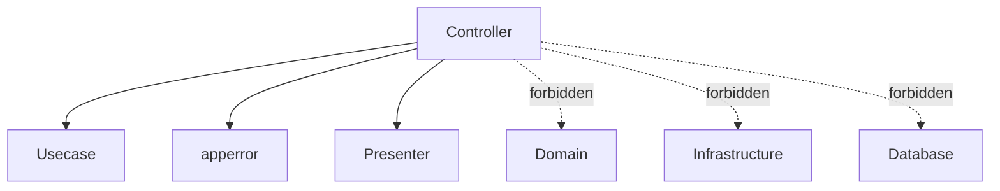

# Controller Layer Guide (`internal/controller`)

English | [日本語](README.ja.md)

## Role in Onion Architecture

- Acts as the **boundary between the external world (HTTP/CLI) and the application**
- Responsible for **protocol adaptation (Adapter)**, converting inputs into **application vocabulary (DTO / Value Objects)** and invoking the **Usecase layer**
- Performs **output formatting (Presenter)** by converting Usecase results into **OpenAPI response types**
- Maps exceptions (`error`) into **HTTP status codes** and **error codes** (`apperror` → Status)

> Key point: **Controllers must not contain business logic**.
> Their responsibility is limited to interpreting and formatting HTTP / CLI interactions.

## Directory Structure

```text
internal/controller/
├── handler/        # HTTP handlers (server entry points)
├── job/            # Job controllers (CLI entry points)
├── server/         # Echo instance creation and server startup
├── httpstack/      # HTTP middleware stack
├── error/response/ # Error response generation
└── ctxhelper/      # Echo context helpers
```

## Subdirectory Roles

|Directory|Description|Details|
|---|---|---|
|`handler/`|Handlers that receive HTTP requests and delegate to Usecase|[README](handler/README.md)|
|`job/`|Job controllers invoked from CLI|[README](job/README.md)|
|`server/`|Echo instance initialization and DI lifecycle integration|[README](server/README.md)|
|`httpstack/`|Middleware stack (CORS, security, logging, auth, rate limiting, etc.)|[README](httpstack/README.md)|
|`error/response/`|Unified HTTP error response generation and apperror mapping|[README](error/response/README.md)|
|`ctxhelper/`|Helpers for setting/getting values in Echo context|[README](ctxhelper/README.md)|

## Dependency Rules



Controllers access lower layers **only through Usecase**.
