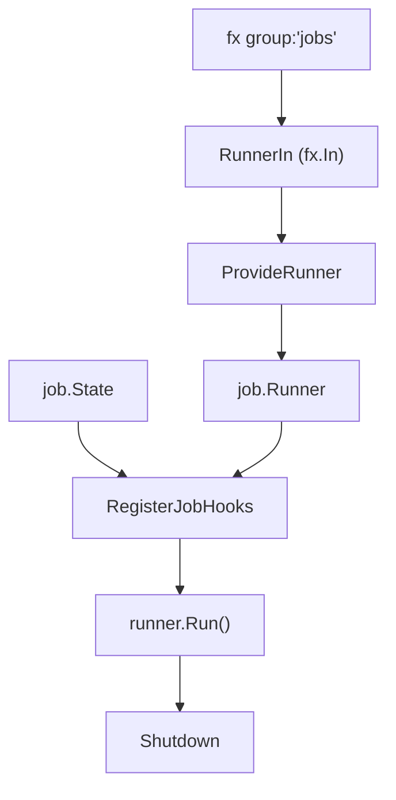

# job DI Module

English | [日本語](README.ja.md)

## Role

This directory is the DI seam between the application's job framework and `fx`. It collects all `job.Job` providers registered with the `group:"jobs"` tag, assembles them into a `Runner`, maintains the `State` that the CLI uses to specify "which job, with which args, and where to signal completion", and wires the startup lifecycle hook that actually invokes the requested job. Upper-layer code (`internal/controller/job`, `cmd/`, individual job implementations) depends on the abstractions here; this package contains all of the fx-specific glue so that the rest of the code stays framework-agnostic.

## Structure

`runner.go` provides the Runner; `hook/` runs it at startup. The hook is separate because running
is a lifecycle event, not part of describing the graph.

## Architecture



## DI Registration Example

```go
fx.Provide(
    job.ProvideRunner,
    jobcontroller.NewState,
)
fx.Invoke(hook.RegisterJobHooks)
```

## Job Execution Flow

1. CLI sets job info via `state.Set(name, args, done)`
2. Application starts
3. Start hook references `state.Snapshot()`
4. If `done` exists, `runner.Run()` executes the job asynchronously
5. Result is sent to `done` channel, then application shuts down

## Notes

- `state.Set` must be called before application startup
- Hook lifecycle details (immediate shutdown on `done == nil`, goroutine execution, cancellation on stop) are in [`hook/README.md`](hook/README.md)
- To add jobs, add them to `provideJobs(...)` in `internal/di/module/job.go`
