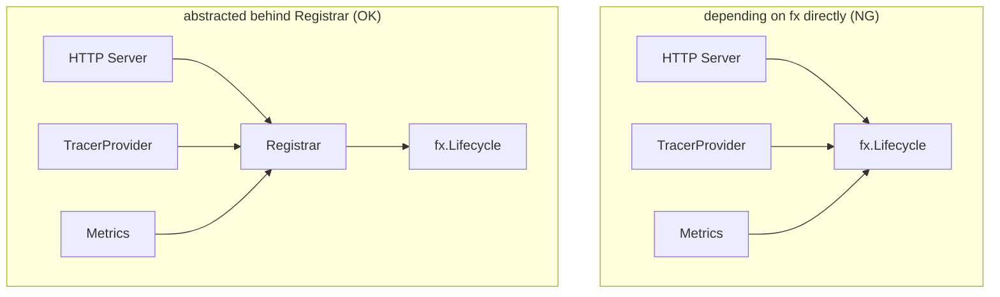

# lifecycle

English | [日本語](README.ja.md)

A DI layer for registering hooks (Start/Stop) to be executed at application startup and shutdown. Provides a `Registrar` that wraps `fx.Lifecycle`, making it easy to register lifecycle events across the application.

## Why a Dedicated Package?

The `lifecycle/` package exists as an independent directory to provide a **neutral layer for centrally managing application-wide Start/Stop**.

Using `fx.Lifecycle` directly causes the following problems:



### 1. fx Dependency Leaks Across the Application

If `fx.Lifecycle` is used directly, all layers (HTTP server, Observability, Metrics, Workers, etc.) become dependent on fx, violating the Onion Architecture principle of not bringing external technical details into inner layers.

`lifecycle.Registrar` **confines the fx dependency to the DI layer**, allowing lower layers to reference only the Start/Stop abstraction.

### 2. Start/Stop Processing Becomes Scattered

If each package calls `fx.Lifecycle.Append()` independently, it becomes difficult to track what starts where, what stops where, and in what order.

By centralizing the "Start/Stop registration point" in `lifecycle/`, **the entire application lifecycle can be managed in one place**.

### 3. Testing Becomes Difficult with Direct fx Usage

`fx.Lifecycle` hook registration is DI-dependent code that is unnecessary and cumbersome in `domain` or `usecase` tests.

By abstracting to `Registrar`:

- Tests can pass a Noop stub
- `fx.App.Start/Stop` is only used when hooks need to be fired

### 4. Start/Stop Is an Application-Wide Concept

Lifecycle-dependent processing extends far beyond the HTTP server:

- Tracer initialization / shutdown
- Metrics exporter
- DB connection close
- Queue consumers
- Cron / Workers
- Cache client initialization

Placing these in `server/` or `controller/` would be a responsibility violation. **It is natural to isolate application-wide lifecycle management as a cross-cutting concern**.

### 5. Required as a DI Control Point

By looking at `lifecycle.Module()`, you can immediately see where Start/Stop mechanisms are provided and where the boundary between fx and the application lies.

## File Structure

|File|Role|
|---|---|
|`lifecycle.go`|`Registrar` interface and `NewLifecycleRegistrar` implementation|
|`supervisor.go`|`SupervisedRunner` — shared primitive for detached background runners|
|`lifecycle_di.go`|DI registration via `Module()`|
|`mock/`|Test mock (auto-generated by mockgen)|

## SupervisedRunner

`SupervisedRunner` is the shared primitive for wiring a **detached background runner** (a goroutine that outlives `OnStart`) into the fx lifecycle. The job / worker / outbox-relay hooks all build on it instead of duplicating the same Start/Stop plumbing.

```go
lifecycle.SupervisedRunner{
    OnStartAux: startHealth,                 // optional: sync work before the goroutine (e.g. health listener)
    Body:       func(ctx context.Context) { _ = engine.Run(ctx) }, // the background loop
    OnStopAux:  stopHealth,                  // optional: work after drain
}.Register(reg)
```

- **OnStart**: runs `OnStartAux` (if any), then starts `Body` in a goroutine (does not block).
- **OnStop**: cancels the run context, waits for `Body` to finish bounded by the stop `ctx` (grace), then runs `OnStopAux`.

The run context is derived from `context.Background()` with `WithCancel`, so the goroutine is **not** affected when fx cancels the start context after `OnStart`, yet **is** cancelled on `OnStop`. Standardizing this "Background-derived + cancel-on-stop" shape across the three hooks guarantees the stop signal propagates into in-flight work.

## Usage Examples

- HTTP server start / Graceful Shutdown
- TracerProvider initialization / Shutdown
- Metrics server start / stop
- DB connection close

## Notes

- Implementation assumes Start/Stop are called within the `fx.App` lifecycle
- To verify hook execution in tests, you need to Start/Stop `fx.App` to fire the hooks
