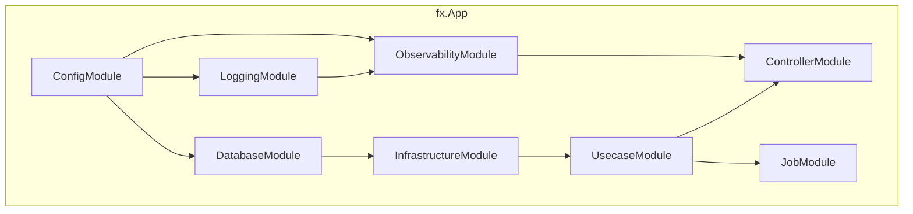

# DI Module (`internal/di/module`)

English | [日本語](README.ja.md)

A directory containing **DI module groups** that wire up each application layer using `fx`.

Each file exposes a function returning `fx.Option` to register the necessary components in the DI container at application startup.

## Module List

|Function|File|Provided Components|
|---|---|---|
|`ConfigModule()`|`config.go`|Config (`*Config` + all SubConfig providers + `*time.Location`)|
|`ControllerModule()`|`controller.go`|HTTP handler registration (`fx.Invoke` to run `BindHandler`)|
|`DatabaseModule()`|`db.go`|DB connection (`*pgxpool.Pool`) + driver / transaction manager / metrics|
|`InfrastructureModule()`|`infrastructure.go`|Repositories / query services / system query + Clock / password hasher|
|`JobModule()`|`job.go`|Job registration (`group:"jobs"`) + Runner + State + Hook|
|`LoggingModule()`|`logging.go`|Logger + LogFieldBuilder|
|`ObservabilityModule()`|`observability.go`|TracerProvider + TracerFactory|
|`SystemModule()`|`system.go`|BuildInfo (version / revision / build date)|
|`UsecaseModule()`|`usecase.go`|Usecase implementation registration|

### Subdirectories

|Directory|Description|Details|
|---|---|---|
|`core/`|DI modules for HTTP stack common components (auth, etc.)|[README](core/README.md)|

## Architecture

## Design Policy

- Each module corresponds to a layer boundary (config / logging / db / infra / usecase / controller / job)
- Inter-module dependencies are automatically resolved by fx
- Adding a module is as simple as creating a new file and adding it to the app's root module

## Notes

- Each module depends on the `fx.App` Start / Stop lifecycle
- Disabling a module will prevent its components from being injected, causing the app to fail to start
- Tests verify that each module can be correctly assembled using `fx.ValidateApp`
