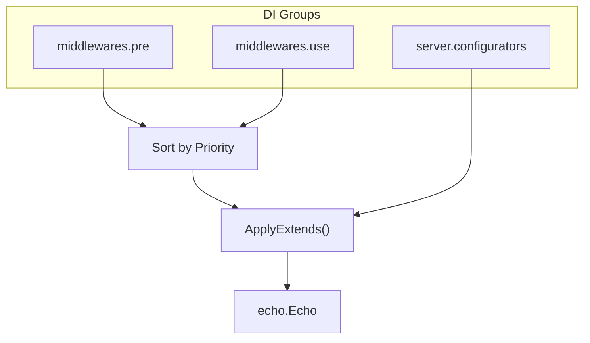

# extension

English | [日本語](README.ja.md)

An **extension layer that centrally manages the application of middleware and configurators** to the Echo server.

Uses Uber FX DI groups to extend the server through three channels: `middlewares.pre`, `middlewares.use`, and `server.configurators`.

## How It Works

- **Pre middleware**: Executed before routing (`e.Pre()`)
- **Use middleware**: Executed after routing (`e.Use()`)
- **Configurator**: Configuration applied to Echo instance (debug mode, etc.)
- Duplicate priorities are automatically detected and cause an error

## Public API

|Type / Function|Description|
|---|---|
|`ServerExtends`|`fx.In` struct receiving all three groups|
|`ApplyExtends()`|Apply Pre / Use / Configurators in bulk|
|`PreMiddleware`|Pre middleware (Name + Priority + Middleware)|
|`PreMiddlewareOut`|fx output wrapper for Pre middleware|
|`UseMiddleware`|Use middleware (Name + Priority + Middleware)|
|`UseMiddlewareOut`|fx output wrapper for Use middleware|
|`SrvCfg`|`func(*echo.Echo)` configurator function type|
|`ServeCfgOut`|fx output wrapper for Configurator|

## Subdirectory List

### inbound (Request Receiving)

|Module|Type|Description|
|---|---|---|
|`IPExtractorModule()`|Configurator|Client IP extraction|
|`OpenAPIModule()`|Use|OpenAPI validation|
|`URIModule()`|Pre|Remove trailing slashes|

### instrumentation (Instrumentation)

|Module|Type|Description|
|---|---|---|
|`RequestIDModule()`|Use|X-Request-ID generation|
|`LoggingModule()`|Use|HTTP request / response logging|
|`ObservabilityModule()`|Use|OpenTelemetry tracing|

### outbound (Response Output)

|Module|Type|Description|
|---|---|---|
|`ErrorHandlerModule()`|Configurator|Unified error handler|
|`ForceJSONModule()`|Use|Force Content-Type to JSON|
|`RecoveryModule()`|Use|Catch panics and log|

### security (Security)

|Module|Type|Description|
|---|---|---|
|`Module()`|Use|Security headers (HSTS, etc.)|
|`CORSModule()`|Use|CORS configuration|
|`CookieModule()`|Use|Cookie security attributes|

### nonprod (Non-production)

|Module|Type|Description|
|---|---|---|
|`DebugModeModule()`|Configurator|Enable debug mode in development|

## Notes

- Pre / Use middleware must always be defined with a Priority
- Duplicate priorities are automatically detected, but maintaining a priority management table per category is recommended
- Configurators should only contain processing that intentionally changes Echo instance state
- Middleware implementation belongs to `internal/controller/httpstack`; this layer only handles DI registration
