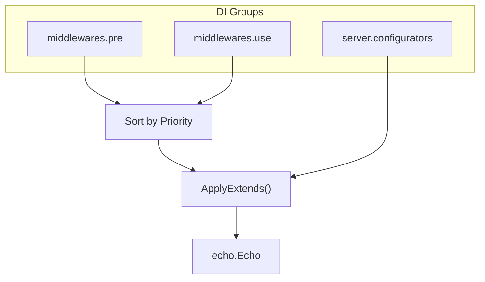

# extension

English | [日本語](README.ja.md)

An **extension layer that centrally manages the application of middleware and configurators** to the Echo server.

Uses Uber FX DI groups to extend the server through three channels: `middlewares.pre`, `middlewares.use`, and `server.configurators`.

## How It Works

- **Pre middleware**: Executed before routing (`e.Pre()`)
- **Use middleware**: Executed after routing (`e.Use()`)
- **Configurator**: Configuration applied to Echo instance (client IP extraction, error handler, etc.)
- Duplicate priorities are automatically detected and cause an error

## Subdirectory List

### inbound (Request Receiving)

|Module|Type|Description|
|---|---|---|
|`URIModule()`|Pre|Remove trailing slashes|
|`TimeoutModule()`|Pre|Request deadline budget (`SERVER_REQUEST_TIMEOUT`)|
|`BodyLimitModule()`|Pre|Request body size limit (`SERVER_BODY_LIMIT_MB`)|
|`IPExtractorModule()`|Configurator|Client IP extraction|
|`OpenAPIModule()`|Use|OpenAPI validation|

### instrumentation (Instrumentation)

|Module|Type|Description|
|---|---|---|
|`RequestIDModule()`|Use|X-Request-ID generation|
|`ObservabilityModule()`|Use|OpenTelemetry tracing|
|`HTTPRedMetricsModule()`|Use|HTTP RED (Rate / Errors / Duration) metrics|
|`LoggingModule()`|Use|HTTP request / response logging|

### outbound (Response Output)

|Module|Type|Description|
|---|---|---|
|`ErrorHandlerModule()`|Configurator|Unified error handler|
|`ForceJSONModule()`|Use|Force Content-Type to JSON|
|`RecoveryModule()`|Use|Catch panics and log|

### security (Security)

|Module|Type|Description|
|---|---|---|
|`Module()`|Use|Security headers (HSTS, etc.)|
|`CORSModule()`|Use|CORS configuration|
|`CookieModule()`|Use|Cookie security attributes|

## Notes

- Pre / Use middleware must always be defined with a Priority
- Duplicate priorities are automatically detected, but maintaining a priority management table per category is recommended
- Configurators should only contain processing that intentionally changes Echo instance state
- Middleware implementation belongs to `internal/controller/httpstack`; this layer only handles DI registration
