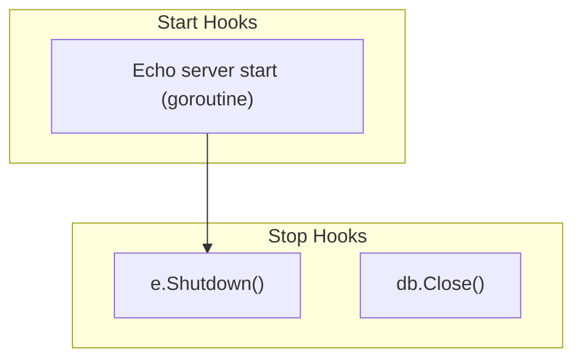

# server hook

English | [日本語](README.ja.md)

`internal/di/server/hook` is a package that **registers lifecycle hooks** tied to the application server.

## Hook List

|Function|Start|Stop|Description|
|---|---|---|---|
|`RegisterHTTPServerHooks`|Start Echo server|Graceful Shutdown|HTTP server lifecycle management|
|`RegisterDBCloseHooks`|—|Close DB connection|Safely close DB connection on shutdown|

## Flow



## RegisterHTTPServerHooks

Registers HTTP server start/stop hooks with `lifecycle.Registrar`.

- **Start**: Executes `e.Start()` in a goroutine, logs port / allowed_origins / CIDR / mode
- **Stop**: Graceful Shutdown via `e.Shutdown(ctx)`
- Receives `extension.AppliedServerExtends` to ensure registration occurs after server extensions are applied

## RegisterDBCloseHooks

Registers a hook to close the database connection on shutdown.

- **Stop**: Calls `db.Close()` and logs any errors

## DI Registration Example

```go
fx.Invoke(
    hook.RegisterHTTPServerHooks,
    hook.RegisterDBCloseHooks,
)
```

## Notes

- `RegisterHTTPServerHooks` depends on the `AppliedServerExtends` token, so it executes after extension application
- The HTTP server starts in a goroutine; startup failures are logged but the Start hook itself does not return an error
