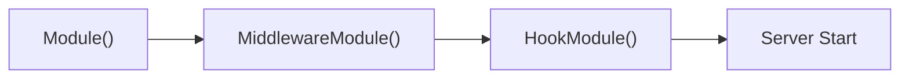

# server DI Module

English | [日本語](README.ja.md)

This directory is the **server module layer responsible for Echo server initialization, startup, and DI management**.

Built around three `fx.Module` functions, it provides HTTP server creation, middleware aggregation, and lifecycle hook registration.

## Structure

```text
internal/di/server/
├── server.go       # Module / HookModule / MiddlewareModule
├── extension/      # Middleware and configurator DI registration
└── hook/           # Server lifecycle hooks (HTTP start/stop, DB close)
```

## Application Startup Order



1. `Module()` — Create the Echo instance and the `http.Server` that serves it
2. `MiddlewareModule()` — Apply all middleware and configurators
3. `HookModule()` — Register start/stop hooks (server starts here)

## Subdirectories

|Directory|Description|Details|
|---|---|---|
|`extension/`|Middleware and configurator DI registration with Priority management|[README](extension/README.md)|
|`hook/`|Server lifecycle hooks (HTTP, DB close)|[README](hook/README.md)|

## Notes

- `Module()` must be loaded before `MiddlewareModule()` — Echo instance is required for middleware application
- `HookModule()` must be loaded last — server starts after middleware and configurators are applied
- `NewAppServer` / `NewHTTPServer` have side effects and must not be referenced from domain/usecase
- Extensions are applied in the order **MiddlewareModule → HookModule**
