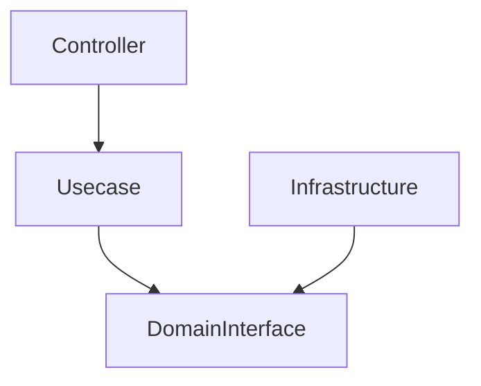
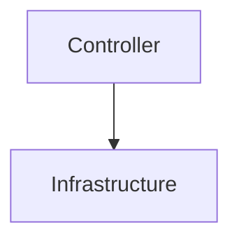
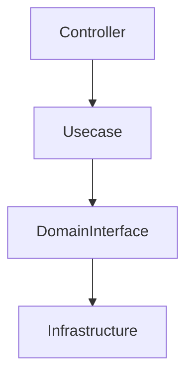
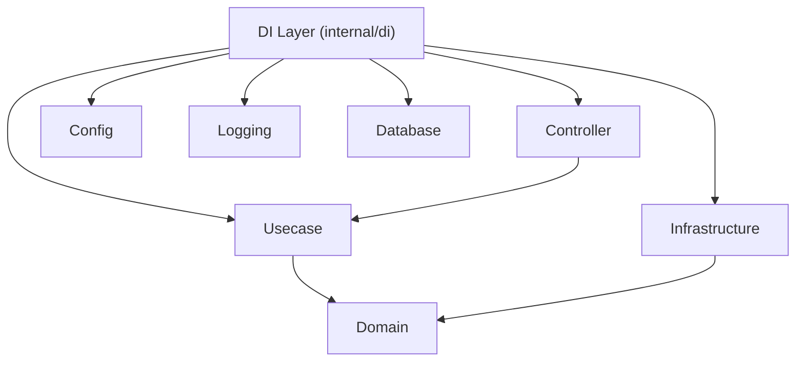
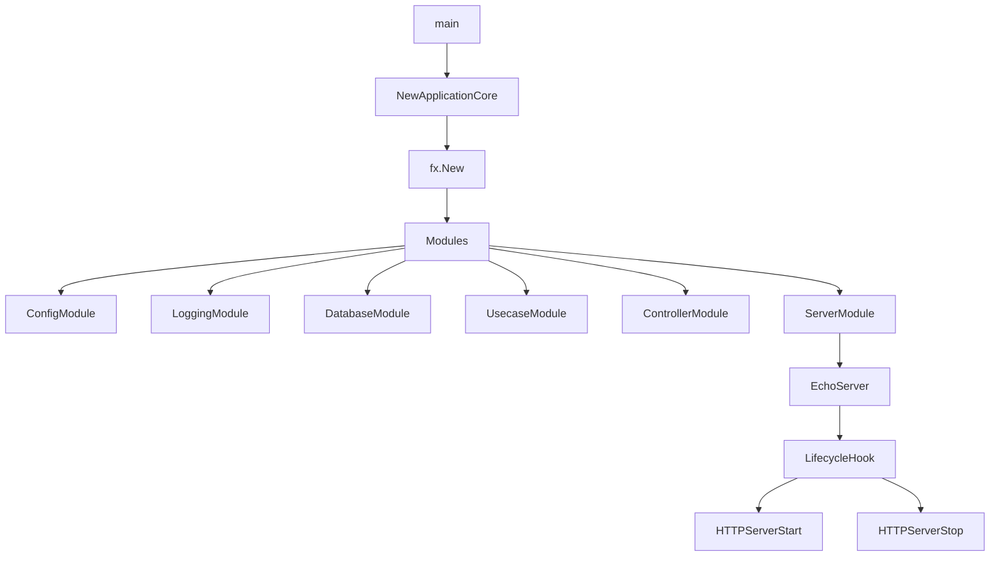
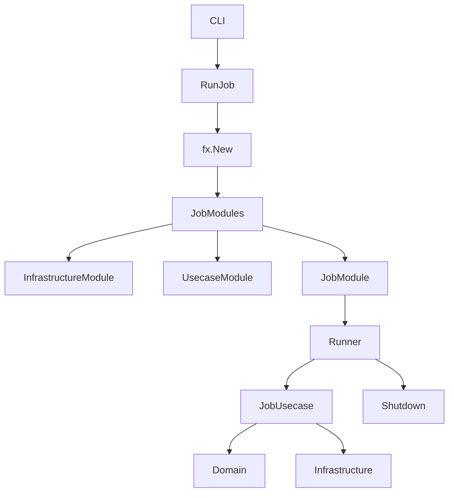
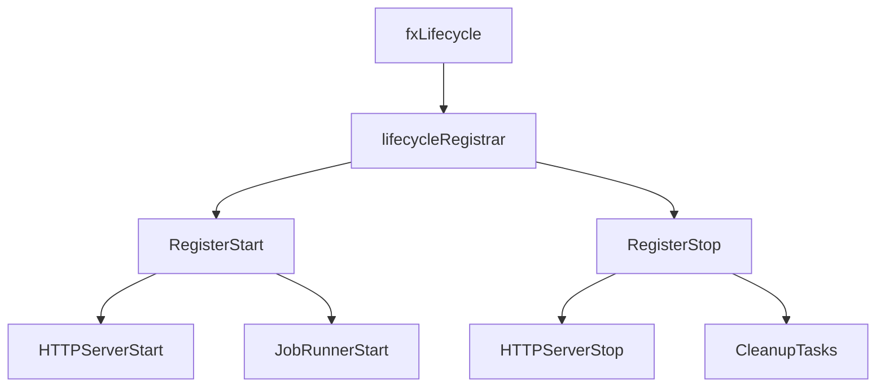
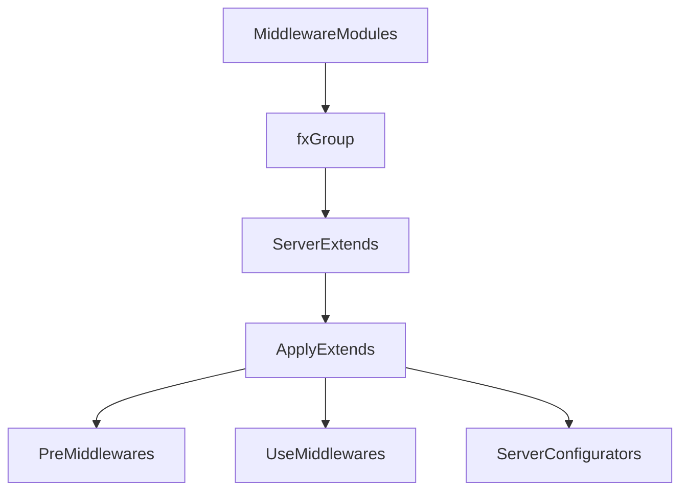

# DI Layer (`internal/di`)

English | [日本語](README.ja.md)

`internal/di` is the **central layer for Dependency Injection (DI)** in this application.

This layer builds a DI container based on **Uber Fx** and manages:

- Application **initialization**
- **Execution**
- **Shutdown**
- **Lifecycle management**

This layer **does not contain business logic**.  
Instead, it is responsible for:

- Constructing **dependencies between layers**
- Switching **application execution modes**
- Lifecycle management
- Middleware / extension configuration
- Connecting Infrastructure / Usecase / Controller

## What is Dependency Injection?

Dependency Injection (DI) is a design pattern that:

> **Separates dependency creation from application code**

In normal code, dependencies may look like this:

```go
service := NewService(NewRepository(NewDB()))
```

This approach causes several problems:

- Dependencies become fixed
- Testing becomes difficult
- Environment-based switching becomes hard

With DI, dependency creation is handled by a **container**.

```go
fx.Provide(
    NewDB,
    NewRepository,
    NewService,
)
```

The container analyzes dependencies and automatically constructs the **object graph**.

## Role of DI in This Architecture

This project is structured based on **Onion Architecture / DDD**.

The layer dependencies look like this:



The DI layer provides the **Composition Root** for these dependencies.

In other words, it is the **single place where the following layers are assembled**:

- Domain
- Usecase
- Infrastructure
- Controller

## Role of DI in This Repository

In this project, DI is used for the following purposes.

## 1. Application Execution

DI manages **application startup**.

```go
fx.New(
    module.ConfigModule(),
    module.LoggingModule(),
    module.DatabaseModule(),
)
```

Here the following components are connected:

- Configuration
- Logging
- Database
- Middleware
- Controller
- Usecase

## 2. Execution Mode Switching

This project supports **two execution modes**.

### HTTP Server

```txt
internal/di/server.go
```

### Job Runner

```txt
internal/di/job.go
```

This allows both of the following to run on the **same architecture**:

|Execution Mode|Purpose|
|---|---|
|Server|Web API|
|Job|CLI / Batch|

## 3. Environment-Based Dependency Switching

DI enables **implementation switching per environment**.

Example:

```go
switch appCfg.Env() {
case config.EnvLocal:
    return local.New()
}
```

This allows differences between:

- Local
- CI
- Test
- Production

to be handled cleanly.

## Structure of the DI Layer

```txt
internal/di

server.go
job.go

lifecycle/
module/
server/
shutdowner/
job/
```

## Do / Don't

## Do

## Assemble dependencies

The DI layer **connects components**.

```go
fx.Provide(
    NewRepository,
    NewUsecase,
    NewController,
)
```

## Switch implementations by environment

DI acts as the **environment-based implementation switch point**.

```go
switch cfg.Env() {
case config.EnvLocal:
    return local.New()
case config.EnvProd:
    return production.New()
}
```

## Lifecycle management

The DI layer can register **startup and shutdown hooks**.

```go
reg.RegisterStart(startFunc)
reg.RegisterStop(stopFunc)
```

Examples:

- HTTP Server startup
- RateLimit cleanup
- Job runner

## Isolate external frameworks

The following dependencies are **contained within the DI layer**:

- Echo
- Uber Fx
- Database drivers
- OpenTelemetry SDK

This ensures that:

- Domain
- Usecase

remain **framework-independent**.

## Don't

## Do not implement business logic

The DI layer must not contain:

- Domain logic
- Database queries
- Business rules

## Do not create cross-layer dependencies

NG



Correct dependency



## Do not instantiate dependencies manually

NG

```go
svc := NewService()
```

Correct approach

```go
fx.Provide(NewService)
```

## Do not introduce frameworks into Domain / Usecase

NG

```go
type Usecase struct {
    echo *echo.Echo
}
```

## DI Dependency Structure



## Server Startup Flow



## Job Execution Flow



## Lifecycle Management



## Server Extension Architecture



## Design Principles

This DI layer follows these principles.

### Composition Root

Dependency wiring happens **only in the DI layer**

### Framework Isolation

Framework dependencies are **contained in DI**

### Environment Switch

Environment differences are **handled in DI**

### Plugin Architecture

Extensions are added as **Modules / Extensions**

## Summary

`internal/di` is the layer responsible for **dependency wiring, startup, extension, and execution modes** of this application.

This design integrates:

- Onion Architecture
- Domain Driven Design
- Job Runner
- Plugin Middleware
- Observability

into a **single coherent system**.
