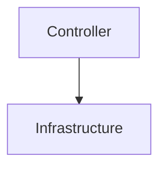
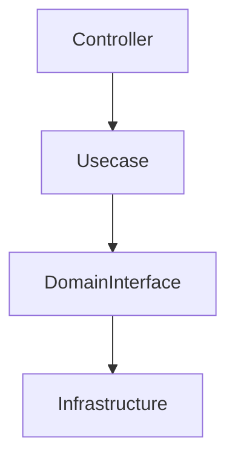
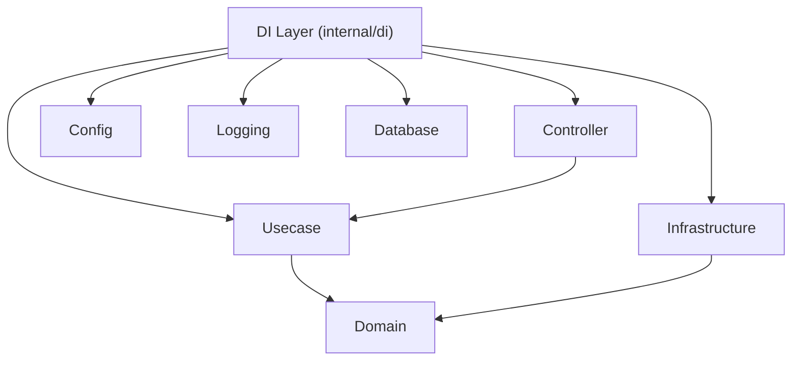
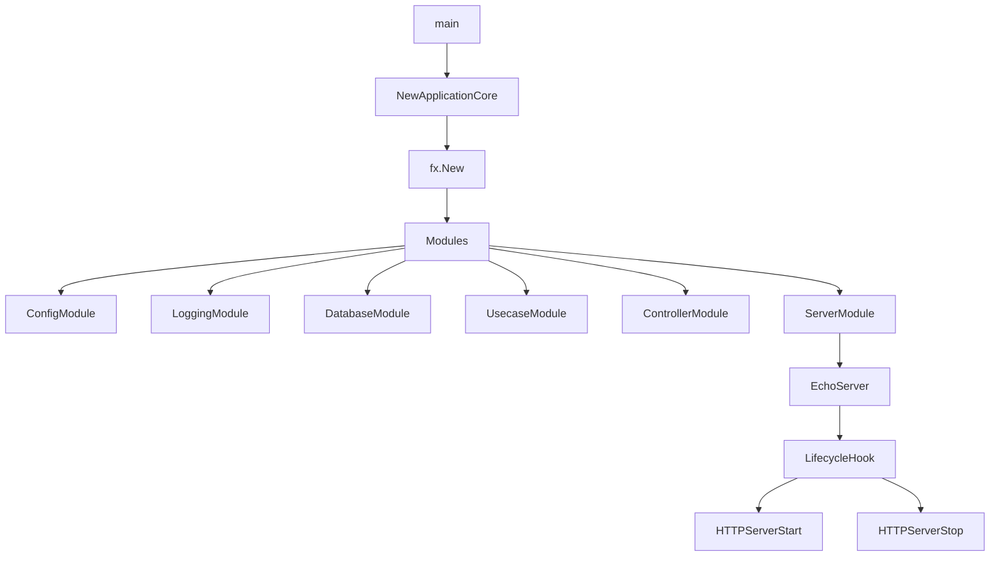
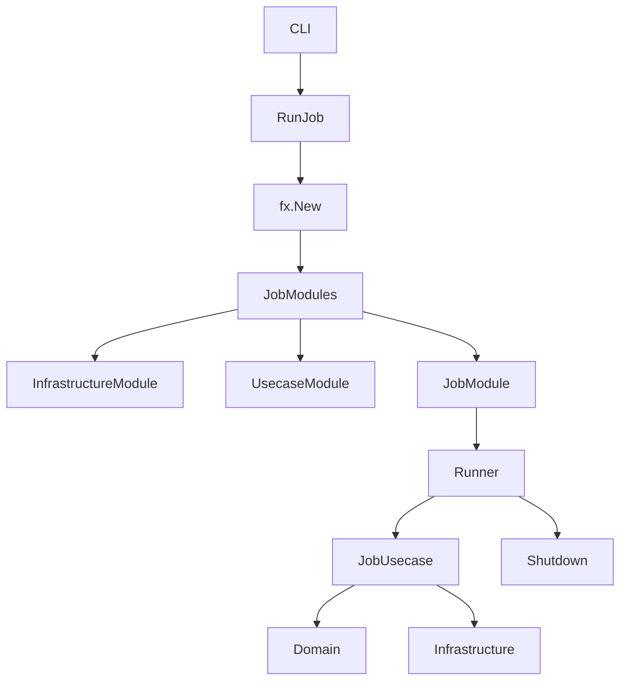
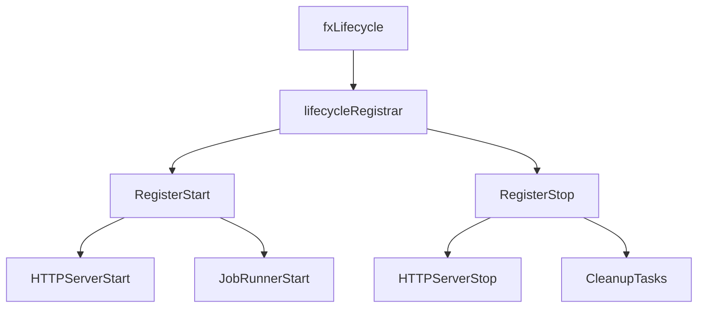
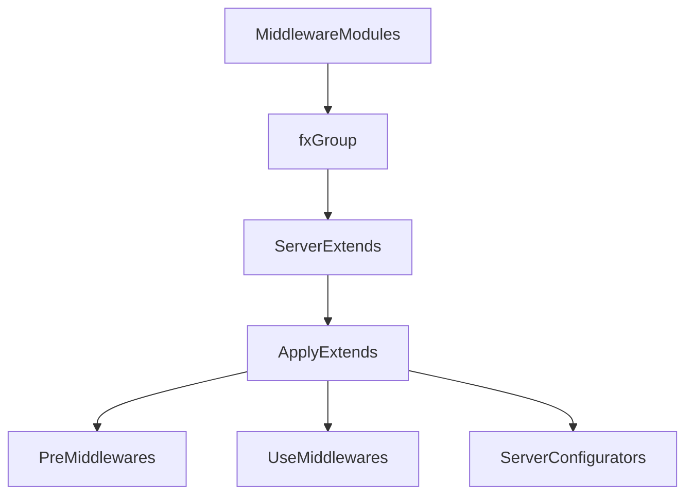

# DI Layer (`internal/di`)

English | [日本語](README.ja.md)

`internal/di` is the **central layer for Dependency Injection (DI)** in this application.

This layer builds a DI container based on **Uber Fx**,  
and orchestrates **initialization / execution / shutdown / lifecycle management** of the application.

This layer **does not contain business logic**.  
Instead, it has the following responsibilities:

- Constructing **dependencies between layers**
- Switching **application execution modes**
- Lifecycle management
- Middleware / extension configuration
- Connecting Infrastructure / Usecase / Controller

## What is Dependency Injection

Dependency Injection (DI) is:

> **A design pattern that separates dependency creation from application code**

In normal code, dependencies are created as follows:

```go
service := NewService(NewRepository(NewDB()))
```

Such code causes the following problems:

- Dependencies become fixed
- Testing becomes difficult
- Switching per execution environment becomes difficult

When using DI, dependency creation is handled by the **container**.

```go
fx.Provide(
    NewDB,
    NewRepository,
    NewService,
)
```

The container analyzes dependencies and automatically constructs the object graph.

## Role of DI in This Architecture

This project is structured based on **Onion Architecture / DDD**.

The dependencies between layers are as follows:

```mermaid
flowchart TD

Controller --> Usecase
Usecase --> Domain Interface
Infrastructure --> DomainInterface
```

The DI layer provides the **composition root (junction point of dependencies)**.

In other words, it is:

- Domain
- Usecase
- Infrastructure
- Controller

the **only place where they are ultimately assembled**.

## Role of DI in This Project

In this project, DI is used for the following purposes.

## 1. Application Execution

DI **manages the application startup process**

```go
fx.New(
    module.ConfigModule(),
    module.LoggingModule(),
    module.DatabaseModule(),
)
```

Here:

- configuration
- logging
- DB
- middleware
- Controller
- Usecase

are all connected.

## 2. Execution Mode Switching

This project has **two execution modes**.

### HTTP Server

```txt
internal/di/server.go
```

### Job Runner

```txt
internal/di/job.go
```

This allows:

|Execution Mode|Purpose|
|---|---|
|Server|Web API|
|Job|CLI / Batch|

to run on the **same architecture**.

## 3. Environment-Based Dependency Switching

DI enables **implementation switching per environment**.

Example:

```go
switch appCfg.Env() {
case config.EnvLocal:
    return local.New()
}
```

This allows handling differences between:

- Local
- CI
- Test
- Production

## Structure of the DI Layer

```txt
internal/di

server.go
job.go

lifecycle/
module/
server/
shutdowner/
job/
```

## Do / Don't

## Do（Allowed）

### Assemble dependencies

In the DI layer, **components are connected**.

```go
fx.Provide(
    NewRepository,
    NewUsecase,
    NewController,
)
```

### Switch implementations per environment

DI is the **switch point for implementation differences per execution environment**.

```go
switch cfg.Env() {
case config.EnvLocal:
    return local.New()
case config.EnvProd:
    return production.New()
}
```

### Lifecycle management

In the DI layer, **startup / shutdown hooks** can be registered.

```go
reg.RegisterStart(startFunc)
reg.RegisterStop(stopFunc)
```

Examples:

- HTTP Server startup
- Job Runner

### Isolate external frameworks

The following dependencies are **contained within the DI layer**:

- Echo
- Uber Fx
- DB driver
- OpenTelemetry SDK

This ensures:

- Domain
- Usecase

are **framework-independent**.

## Don't（Prohibited）

### Writing business logic

The following must not be written in the DI layer:

In particular, do not write **business logic**.

- Domain logic
- DB queries
- Business rules

### Create dependencies that bypass layers

NG



Correct dependency



### Instantiate with `new` without DI

NG

```go
svc := NewService()
```

Correct approach

```go
fx.Provide(NewService)
```

### Bring frameworks into Domain / Usecase

NG

```go
type Usecase struct {
    echo *echo.Echo
}
```

## DI Dependency Structure



## Server Startup Flow



## Job Execution Flow



## Lifecycle Management



## Server Extension Architecture



## Design Principles

This DI layer is based on the following principles.

### Composition Root

Dependency wiring is done **only in the DI layer**

### Framework Isolation

Framework dependencies are **contained within DI**

### Environment Switch

Environment differences are **handled in DI**

### Plugin Architecture

Extensions are added as **Modules / Extensions**
