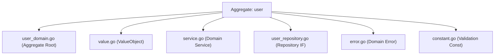
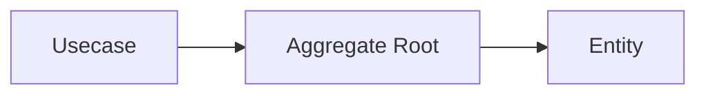
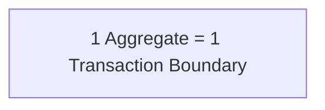
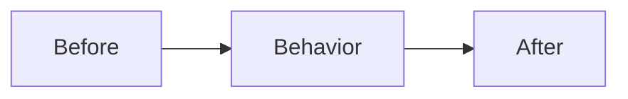

# Domain Layer (`internal/domain`) Guide

## Role in Onion Architecture

- The **core of the business**. It represents **essential rules** such as entities, value objects, domain services, and domain events.
- It has no concern for external systems (HTTP / DB / UI) and defines behavior using **pure models and language**.
- The most resilient layer to change. It is protected under the assumption that **as long as this layer does not break, the product remains maintainable**.

## Role in this project

- Place **Entity / ValueObject / DomainService / Repository (IF)** under `internal/domain/<bounded-context>/<aggregate>/`.

Example: `internal/domain/user/`



- As a principle, describe rules using **functions without side effects (pure functions)**.  
  I/O, time retrieval, and random generation should depend on **values injected via arguments**.

- State changes must be performed through **entity methods**, and must not access external resources.

- Types should follow an **effectively immutable** approach.

  - private field + getter
  - defensive copy (`ptr.Copy`)
  - setters are prohibited
  - state changes occur through **behavior methods**

- Dependencies should be **injected via constructors**.

- External libraries must not be imported directly; they should be used **through pkg wrappers**.

Examples:

- UUID → `pkg/uuid`
- Decimal → `pkg/decimal`
- Error → `pkg/xerrors`

## Domain boundaries

The Domain layer is a layer that **expresses business rules and state transitions**.

Domain responsibilities:

- Invariants
- State transitions
- Value consistency
- Business rules

What Domain is not responsible for:

- Search specifications
- DB optimization
- SQL structure
- External API calls
- Aggregation processing

These are handled in the following layers:

- Usecase
- QueryService
- ReadModel

Repository provides **only persistence abstraction**.

Simple queries are acceptable in practice.

Allowed examples:

- `FindByXXX`
- `FindAll`
- `CountByXXX`

## Implementation notes

### Naming / structure

- Struct names should be **domain names**
- Slice types may be defined when necessary

```go
type Users []*User
```

- Repository interface name should be `Repository`
- Package name should be the domain name
- Constructor name should be `New`

### Do not set outside constructor

- Invariants are guaranteed in `New(...)`
- setters are prohibited
- state changes occur through **behavior methods**

### Access via getter

- Fields must not be exported

```go
ID()
FirstName()
Email()
```

- pointer types must use **defensive copy**

```go
ptr.Copy(...)
```

### Do not add tags to struct

Domain must not know the outside world.

Forbidden:

```text
json
db
validate
```

These belong to DTO / Infrastructure.

### Handling time and ID

- Do not use `time.Now()` in Domain
- Do not generate UUID in Domain

Generation must be done in:

- Controller
- Usecase

Domain receives only **typed values**

```go
uuid.UUID
time.Time
```

### Validation

#### Format check

Principle: **Value Objects**

Example:

```go
NewEmail(...)
```

Primitive types may be allowed in lightweight domains.

#### Boundary value check

Boundary values are defined in `constant.go`

```go
minLength
maxEmailLength
```

#### Errors

Errors must be **specific errors**

```go
ErrInvalidEmail
ErrInvalidPostalCode
```

Do not return abstract errors directly.

```go
if !stringkit.InRange(email, minLength, maxEmailLength) {
    return nil, xerrors.Wrap(ErrInvalidEmail, ...)
}
```

### Invariants (Domain Invariant)

Entities must **always satisfy invariants**.

Examples:

- `updatedAt >= createdAt`
- `deletedAt >= createdAt`
- `deletedAt >= updatedAt`

Invariant enforcement points:

- `New(...)`
- state transition methods

Usecase / Repository  
**do not have responsibility to enforce invariants**.

## Aggregate Design

In this project, **Aggregate is the design unit**.

```text
internal/domain/<bounded-context>/<aggregate>/
```

### Aggregate Root

Each Aggregate has **one Root**.

Responsibilities:

- consistency guarantee
- external operation entry point
- persistence target

```go
type User struct {
    id uuid.UUID
}
```

Repository is defined **for the Root**

```go
type Repository interface {
    CreateUser(ctx context.Context, user *User) error
}
```

### Aggregate consistency

Changes must go **through the Root only**



### Aggregate Boundary

Keep Aggregate **small**

Principle:



Avoid:

- large aggregates
- direct DB structure mapping
- tightly coupled models

### Cross-aggregate reference

References must be **ID only**

```go
type Order struct {
    userID uuid.UUID
}
```

Forbidden:

```text
Order {
    user *User
}
```

### Multi-aggregate rules

Rules across multiple aggregates belong to:

- Domain Service
- Usecase

Example:

```text
User cancellation → Subscription stop
```

### Query and Aggregate

Aggregate is a **Write Model**

Do not handle:

- aggregation
- reporting
- complex search
- GROUP BY

These belong to:

- QueryService
- ReadModel

## Dependency inversion for Infrastructure layer

Repository is a **persistence abstraction**

```go
type Repository interface {
    FindAll(ctx context.Context, limit, offset int32) (Users, error)
    CreateUser(ctx context.Context, user *User) error
    CountByActive(ctx context.Context, active*bool) (int64, error)
}
```

Implementation:

```text
internal/infrastructure/persistence/postgres/
```

Mapping to Domain is done by `sqlc`.

### Methods allowed in Repository

- `FindAll`
- `FindByXXX`
- `CountByXXX`

Assumed operations:

```text
SELECT / WHERE / JOIN
```

### What must not be in Repository

- GROUP BY
- SUM / AVG
- WITH clause
- cross-boundary JOIN

Place them in:

- Usecase
- QueryService
- ReadModel

## Callable layers

Called from:

- Usecase

Domain **must not call other layers**

Cross-aggregate rules:

- Domain Service

Exception:

```text
read-only aggregate reference
```

## Testing strategy

Domain tests are **pure unit tests**

Forbidden dependencies:

- DB
- HTTP
- environment variables
- time.Now()

### Constructor validation

`New(...)` guarantees **invariants**

Examples:

- zero ID
- boundary values
- time consistency

```go
require.ErrorIs(t, err, ErrInvalidEmail)
```

### Getter contract test

Target:

```go
func (u *User) ID() uuid.UUID
func (u *User) FirstName() string
func (u *User) Email() string
func (u *User) CreatedAt() time.Time
func (u *User) UpdatedAt() time.Time
```

### Immutable guarantee test

Target:

pointer types:

```go
func (u *User) Building() *string
func (u *User) DeletedAt() *time.Time
```

Verification:

1. modify constructor pointer
2. modify getter return value

Internal state must not change.

### Domain behavior test

Example:

```go
func (u *User) FullName() string {
    return u.firstName + " " + u.lastName
}
```

### Error classification test

```go
require.ErrorIs(t, err, ErrInvalidEmail)
```

### Test design policy

#### Deterministic

```go
baseTime := time.Date(2025,1,1,0,0,0,0,time.UTC)
```

#### Parallel execution

```go
t.Parallel()
```

#### Fail Fast

```go
require.NoError(t, err)
```

### Test Fixture

Fixture is recommended.

Reasons:

- reduce duplication
- guarantee invariants
- simplify tests

```go
func newTestUser(t *testing.T)*User {
    baseTime := time.Date(2025,1,1,0,0,0,0,time.UTC)

    id := uuid.NewTestFromSalt(t,"user")
    prefectureID := uuid.NewTestFromSalt(t,"prefecture")

    user, err := New(
        id,
        "John",
        "Doe",
        "hashed_password",
        "john@example.com",
        "1234567890",
        prefectureID,
        "Shibuya",
        "1-2-3",
        nil,
        "1500001",
        baseTime,
        baseTime.Add(time.Hour),
        nil,
    )

    require.NoError(t, err)
    return user
}
```

### Invariant preservation test

State transition test:



Example:

```go
func TestUser_UpdateEmail(t *testing.T) {
    user := newTestUser(t)

    updatedAt := user.UpdatedAt().Add(time.Hour)

    err := user.UpdateEmail("new@example.com", updatedAt)

    require.NoError(t, err)
    require.Equal(t, "new@example.com", user.Email())
}
```

Invalid case:

```go
require.ErrorIs(t, err, ErrInvalidUpdatedAt)
```

## Do / Don’t

### Do

- guarantee integrity in constructor
- state transition via behavior methods
- ensure consistency via Value Objects
- Repository abstraction
- table-driven tests

### Don’t

Forbidden:

- http.*
- echo.*
- sqlc types
- json tags
- setter
- DB-driven design
- time.Now() in Domain

```go
// constant.go
package user

const (
    minLength           = 1
    maxFirstNameLength  = 100
    maxLastNameLength   = 100
    maxPasswordLength   = 255
    maxEmailLength      = 100
    maxPhoneLength      = 20
    maxCityLength       = 100
    maxStreetLength     = 255
    maxBuildingLength   = 255
    maxPostalCodeLength = 8
)
```

```go
// error.go
package user

import (
    "go-boilerplate/internal/apperror"
    "go-boilerplate/pkg/xerrors"
)

var (
    errInvalid             = xerrors.Wrap(apperror.ErrValidation, "invalid user")
    ErrInvalidID           = xerrors.Wrap(errInvalid, "id failed")
    ErrInvalidFirstName    = xerrors.Wrap(errInvalid, "first name failed")
    ErrInvalidLastName     = xerrors.Wrap(errInvalid, "last name failed")
    ErrInvalidPassword     = xerrors.Wrap(errInvalid, "password failed")
    ErrInvalidEmail        = xerrors.Wrap(errInvalid, "email failed")
    ErrInvalidPhone        = xerrors.Wrap(errInvalid, "phone failed")
    ErrInvalidPrefectureID = xerrors.Wrap(errInvalid, "prefecture id failed")
    ErrInvalidCity         = xerrors.Wrap(errInvalid, "city failed")
    ErrInvalidStreet       = xerrors.Wrap(errInvalid, "street failed")
    ErrInvalidBuilding     = xerrors.Wrap(errInvalid, "building failed")
    ErrInvalidPostalCode   = xerrors.Wrap(errInvalid, "postal code failed")
    ErrInvalidUpdatedAt    = xerrors.Wrap(errInvalid, "updated at failed")
    ErrInvalidDeletedAt    = xerrors.Wrap(errInvalid, "deleted at failed")
)
```

```go
// user_domain.go
package user

import (
    "time"

    "go-boilerplate/pkg/ptr"
    "go-boilerplate/pkg/stringkit"
    "go-boilerplate/pkg/uuid"
    "go-boilerplate/pkg/xerrors"
)

type Users []*User

type User struct {
    id           uuid.UUID
    firstName    string
    lastName     string
    passwordHash string
    email        string
    phone        string
    prefectureID uuid.UUID
    city         string
    street       string
    building     *string
    postalCode   string
    createdAt    time.Time
    updatedAt    time.Time
    deletedAt    *time.Time
}

func New(
    id uuid.UUID,
    firstName string,
    lastName string,
    passwordHash string,
    email string,
    phone string,
    prefectureID uuid.UUID,
    city string,
    street string,
    building *string,
    postalCode string,
    createdAt time.Time,
    updatedAt time.Time,
    deletedAt *time.Time,
) (*User, error) {
    if id.IsNil() {
        return nil, xerrors.Wrap(ErrInvalidID, "id is required")
    }

    if !stringkit.InRange(firstName, minLength, maxFirstNameLength) {
        return nil, xerrors.Wrap(ErrInvalidFirstName, stringkit.ErrorMsgInRange(minLength, maxFirstNameLength, firstName))
    }

    if !stringkit.InRange(lastName, minLength, maxLastNameLength) {
        return nil, xerrors.Wrap(ErrInvalidLastName, stringkit.ErrorMsgInRange(minLength, maxLastNameLength, lastName))
    }

    if !stringkit.InRange(passwordHash, minLength, maxPasswordLength) {
        return nil, xerrors.Wrap(ErrInvalidPassword, stringkit.ErrorMsgInRange(minLength, maxPasswordLength, passwordHash))
    }

    if !stringkit.InRange(email, minLength, maxEmailLength) {
        return nil, xerrors.Wrap(ErrInvalidEmail, stringkit.ErrorMsgInRange(minLength, maxEmailLength, email))
    }

    if !stringkit.InRange(phone, minLength, maxPhoneLength) {
        return nil, xerrors.Wrap(ErrInvalidPhone, stringkit.ErrorMsgInRange(minLength, maxPhoneLength, phone))
    }

    if prefectureID.IsNil() {
        return nil, xerrors.Wrap(ErrInvalidPrefectureID, "prefectureID is required")
    }

    if !stringkit.InRange(city, minLength, maxCityLength) {
        return nil, xerrors.Wrap(ErrInvalidCity, stringkit.ErrorMsgInRange(minLength, maxCityLength, city))
    }

    if !stringkit.InRange(street, minLength, maxStreetLength) {
        return nil, xerrors.Wrap(ErrInvalidStreet, stringkit.ErrorMsgInRange(minLength, maxStreetLength, street))
    }

    if building != nil && !stringkit.InRange(*building, minLength, maxBuildingLength) {
        return nil, xerrors.Wrap(ErrInvalidBuilding, stringkit.ErrorMsgInRange(minLength, maxBuildingLength, *building))
    }

    if !stringkit.InRange(postalCode, minLength, maxPostalCodeLength) {
        return nil, xerrors.Wrap(ErrInvalidPostalCode, stringkit.ErrorMsgInRange(minLength, maxPostalCodeLength, postalCode))
    }

    if updatedAt.Before(createdAt) {
        return nil, xerrors.Wrap(ErrInvalidUpdatedAt, "updatedAt must be after or equal to createdAt")
    }

    if deletedAt != nil && deletedAt.Before(createdAt) {
        return nil, xerrors.Wrap(ErrInvalidDeletedAt, "deletedAt must be after or equal to createdAt")
    }

    if deletedAt != nil && deletedAt.Before(updatedAt) {
        return nil, xerrors.Wrap(ErrInvalidDeletedAt, "deletedAt must be after or equal to updatedAt")
    }

    return &User{
        id:           id,
        firstName:    firstName,
        lastName:     lastName,
        passwordHash: passwordHash,
        email:        email,
        phone:        phone,
        prefectureID: prefectureID,
        city:         city,
        street:       street,
        building:     ptr.Copy(building),
        postalCode:   postalCode,
        createdAt:    createdAt,
        updatedAt:    updatedAt,
        deletedAt:    ptr.Copy(deletedAt),
    }, nil
}

func (u *User) ID() uuid.UUID        { return u.id }
func (u *User) FirstName() string    { return u.firstName }
func (u *User) LastName() string     { return u.lastName }
func (u *User) PasswordHash() string { return u.passwordHash }
func (u *User) Email() string        { return u.email }
func (u *User) Phone() string        { return u.phone }
func (u *User) PrefectureID() uuid.UUID { return u.prefectureID }
func (u *User) City() string         { return u.city }
func (u *User) Street() string       { return u.street }
func (u *User) Building() *string    { return ptr.Copy(u.building) }
func (u *User) PostalCode() string   { return u.postalCode }
func (u *User) CreatedAt() time.Time { return u.createdAt }
func (u *User) UpdatedAt() time.Time { return u.updatedAt }
func (u *User) DeletedAt() *time.Time { return ptr.Copy(u.deletedAt) }

func (u *User) FullName() string {
    return u.firstName + " " + u.lastName
}
```

```go
// user_repository.go
//go:generate mockgen -source=$GOFILE -destination=mock/mock_$GOFILE -package=mock_$GOPACKAGE
package user

import "context"

type Repository interface {
    FindAll(ctx context.Context, limit, offset int32) (Users, error)
    FindByKeyword(ctx context.Context, keywords []string, active *bool, limit, offset int32) (Users, error)
    CreateUser(ctx context.Context, user *User) error
    CountByActive(ctx context.Context, active *bool) (int64, error)
}
```
