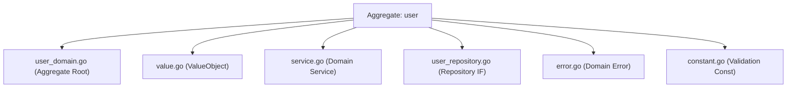
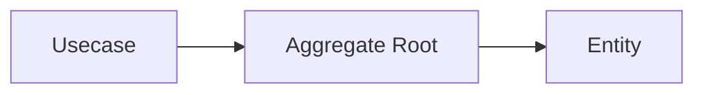
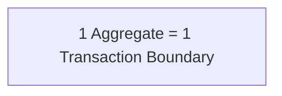
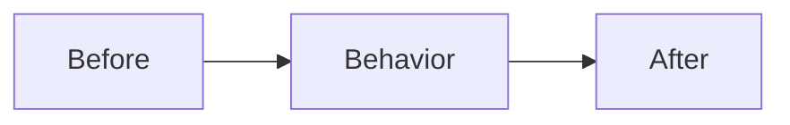

# Domain Layer (`internal/domain`) Guide

## Role in Onion Architecture

- The **core of the business**. It represents **essential rules** such as entities, value objects, domain services, and domain events.
- It has no concern for external systems (HTTP / DB / UI) and defines behavior using **pure models and language**.
- The most resilient layer to change. It is protected under the assumption that **as long as this layer does not break, the product remains maintainable**.

## Role in this project

- Place **Entity / ValueObject / DomainService / Repository (IF)** under `internal/domain/<aggregate>/`.

Example: `internal/domain/user/`



- As a principle, describe rules using **functions without side effects (pure functions)**.  
  I/O, time retrieval, and random generation should depend on **values injected via arguments**.

- State changes must be performed through **entity methods**, and must not access external resources.

- Types should follow an **effectively immutable** approach.

  - private field + getter
  - defensive copy (`ptr.Copy`)
  - setters are prohibited
  - state changes occur through **behavior methods**

- Dependencies should be **injected via constructors**.

- External libraries must not be imported directly; they should be used **through pkg wrappers**.

Examples:

- UUID → `pkg/uuid`
- Decimal → `pkg/decimal`
- Error → `pkg/xerrors`

## Domain boundaries

The Domain layer is a layer that **expresses business rules and state transitions**.

Domain responsibilities:

- Invariants
- State transitions
- Value consistency
- Business rules

What Domain is not responsible for:

- Search specifications
- DB optimization
- SQL structure
- External API calls
- Aggregation processing

These are handled in the following layers:

- Usecase
- QueryService
- ReadModel

Repository provides **only persistence abstraction**.

Simple queries are acceptable in practice.

Allowed examples:

- `FindByXXX`
- `FindByActive`
- `CountByXXX`

## Implementation notes

### Naming / structure

- Struct names should be **domain names**
- Slice types may be defined when necessary

```go
type Users []*User
```

- Repository interface name should be `Repository`
- Package name should be the domain name
- Constructor name should be `New`

### Do not set outside constructor

- Invariants are guaranteed in `New(...)`
- setters are prohibited
- state changes occur through **behavior methods**

### Access via getter

- Fields must not be exported

```go
ID()
FirstName()
Email()
```

- pointer types must use **defensive copy**

```go
ptr.Copy(...)
```

### Do not add tags to struct

Domain must not know the outside world.

Forbidden:

```text
json
db
validate
```

These belong to DTO / Infrastructure.

### Not every DB column is an entity field

An entity models only state that carries **domain meaning**. Columns that exist purely for persistence or search infrastructure are intentionally left off the entity, even when present in the table:

- Audit columns (`created_at` / `updated_at`) — read them directly from the DB when needed; they need not become entity fields or invariants.
- DB-generated / computed columns (e.g. `GENERATED ALWAYS AS ... STORED` search-text columns) — infrastructure search optimization, not domain state.

So a 1:1 entity ↔ column correspondence is **not** required; absence of such columns from an entity is a deliberate design choice, not drift.

### Handling time and ID

- Do not use `time.Now()` in Domain
- Do not generate UUID in Domain

Generation must be done in:

- Controller
- Usecase

Domain receives only **typed values**

```go
uuid.UUID
time.Time
```

### Validation

#### Format check

Principle: **Value Objects**

Example:

```go
NewEmail(...)
```

Primitive types may be allowed in lightweight domains.

#### Boundary value check

Boundary values are defined in `constant.go`

```go
minLength
maxEmailLength
```

#### Why validate here when OpenAPI already validates the request?

The OpenAPI request-validation middleware and this layer are **not redundant** — they have different owners and different scopes:

- **Different owner.** OpenAPI constraints are the *wire contract* (what the HTTP API accepts); the domain constants are the *business rule* (what the business considers valid). They may legitimately differ — see [Input Boundary Value Ownership](../../openapi/boundary-ownership.md).
- **The only universal chokepoint — both inbound and from persistence.** Every entity is built through `New(...)`. Not only do non-HTTP write paths (seed, CLI, batch jobs, tests, any future entrypoint) bypass the request middleware entirely — reconstruction from the database also goes through the same validating constructor (`rowToUser` rebuilds every row via `user.New(...)`). So `New(...)` also guards against invalid data coming *from* infra: a corrupt, manually-inserted, or legacy row that violates a domain invariant fails at reconstruction instead of surfacing as a valid-looking entity. The middleware cannot protect this read path at all; only the domain can.
- **Framework-agnostic self-protection.** The domain must be correct independent of its caller. Delegating validation to the transport layer would couple the domain's correctness to Echo / the middleware, violating the layer's framework-agnostic rule.

In short: the middleware protects the HTTP boundary; the domain protects the *business rule itself*, for all callers.

#### Errors

Errors must be **specific errors**

```go
ErrInvalidEmail
ErrInvalidPostalCode
```

Do not return abstract errors directly.

```go
if ok, msg := stringkit.ValidateInRange(email, minLength, maxEmailLength); !ok {
    return nil, xerrors.Wrap(ErrInvalidEmail, msg)
}
```

### Invariants (Domain Invariant)

Entities must **always satisfy invariants**.

Examples:

- `updatedAt >= createdAt`
- `deletedAt >= createdAt`
- `deletedAt >= updatedAt`

Invariant enforcement points:

- `New(...)`
- state transition methods

Usecase / Repository  
**do not have responsibility to enforce invariants**.

## Aggregate Design

In this project, **Aggregate is the design unit**.

```text
internal/domain/<aggregate>/
```

### Aggregate Root

Each Aggregate has **one Root**.

Responsibilities:

- consistency guarantee
- external operation entry point
- persistence target

```go
type User struct {
    id uuid.UUID
}
```

Repository is defined **for the Root**

```go
type Repository interface {
    Create(ctx context.Context, user *User) error
}
```

### Aggregate consistency

Changes must go **through the Root only**



### Aggregate Boundary

Keep Aggregate **small**

Principle:



Avoid:

- large aggregates
- direct DB structure mapping
- tightly coupled models

### Cross-aggregate reference

References must be **ID only**

```go
type Order struct {
    userID uuid.UUID
}
```

Forbidden:

```text
Order {
    user *User
}
```

### Multi-aggregate rules

Rules across multiple aggregates belong to:

- Domain Service
- Usecase

Example:

```text
User cancellation → Subscription stop
```

### Query and Aggregate

Aggregate is a **Write Model**

Do not handle:

- aggregation
- reporting
- complex search
- GROUP BY

These belong to:

- QueryService
- ReadModel

## Dependency inversion for Infrastructure layer

Repository is a **persistence abstraction**

```go
type Repository interface {
    FindByActive(ctx context.Context, active *bool, limit, offset int32) (Users, error)
    FindByID(ctx context.Context, id uuid.UUID) (*User, error)
    Create(ctx context.Context, user *User) error
    Update(ctx context.Context, user *User) error
    CountByActive(ctx context.Context, active *bool) (int64, error)
}
```

Implementation:

```text
internal/infrastructure/rdb/repository/<aggregate>/
```

Mapping to Domain is done by `sqlc`.

### Methods allowed in Repository

- `FindByActive`
- `FindByXXX`
- `CountByXXX`
- `Create` / `Update` (aggregate persistence — writes; logical delete is an `Update` of `deletedAt`)

Assumed operations:

```text
SELECT / WHERE / JOIN
```

### What must not be in Repository

- GROUP BY
- SUM / AVG
- WITH clause
- cross-boundary JOIN

Place them in:

- Usecase
- QueryService
- ReadModel

## Callable layers

Called from:

- Usecase

Domain **must not call other layers**

Cross-aggregate rules:

- Domain Service

Exception:

```text
read-only aggregate reference
```

## Testing strategy

Domain tests are **pure unit tests**

Forbidden dependencies:

- DB
- HTTP
- environment variables
- time.Now()

### Constructor validation

`New(...)` guarantees **invariants**

Examples:

- zero ID
- boundary values
- time consistency

```go
require.ErrorIs(t, err, ErrInvalidEmail)
```

### Getter contract test

Target:

```go
func (u *User) ID() uuid.UUID
func (u *User) FirstName() string
func (u *User) Email() string
func (u *User) CreatedAt() time.Time
func (u *User) UpdatedAt() time.Time
```

### Immutable guarantee test

Target:

pointer types:

```go
func (u *User) Building() *string
func (u *User) DeletedAt() *time.Time
```

Verification:

1. modify constructor pointer
2. modify getter return value

Internal state must not change.

### Domain behavior test

Example:

```go
func (u *User) FullName() string {
    return u.firstName + " " + u.lastName
}
```

### Error classification test

```go
require.ErrorIs(t, err, ErrInvalidEmail)
```

### Test design policy

#### Deterministic

```go
baseTime := time.Date(2025,1,1,0,0,0,0,time.UTC)
```

#### Parallel execution

```go
t.Parallel()
```

Exception: the immutable guarantee test mutates a shared constructor-input
pointer (e.g. `building` / `deletedAt`) to prove the entity copied it. Running
those blocks in parallel races on the shared pointer under `go test -race`, so
keep the mutating blocks serial (omit `t.Parallel()` on them).

#### Fail Fast

```go
require.NoError(t, err)
```

### Test Fixture

Fixture is recommended.

Reasons:

- reduce duplication
- guarantee invariants
- simplify tests

```go
func newTestUser(t *testing.T)*User {
    baseTime := time.Date(2025,1,1,0,0,0,0,time.UTC)

    id := uuid.NewTestFromSalt(t,"user")
    prefectureID := uuid.NewTestFromSalt(t,"prefecture")

    user, err := New(
        id,
        "John",
        "Doe",
        "hashed_password",
        "john@example.com",
        "1234567890",
        prefectureID,
        "Shibuya",
        "1-2-3",
        nil,
        "1500001",
        baseTime,
        baseTime.Add(time.Hour),
        nil,
    )

    require.NoError(t, err)
    return user
}
```

### Invariant preservation test

State transition test:



Example:

```go
func TestUser_UpdateEmail(t *testing.T) {
    user := newTestUser(t)

    updatedAt := user.UpdatedAt().Add(time.Hour)

    err := user.UpdateEmail("new@example.com", updatedAt)

    require.NoError(t, err)
    require.Equal(t, "new@example.com", user.Email())
}
```

Invalid case:

```go
require.ErrorIs(t, err, ErrInvalidUpdatedAt)
```

## Do / Don’t

### Do

- guarantee integrity in constructor
- state transition via behavior methods
- ensure consistency via Value Objects
- Repository abstraction
- table-driven tests

### Don’t

Forbidden:

- http.*
- echo.*
- sqlc types
- json tags
- setter
- DB-driven design
- time.Now() in Domain

```go
// constant.go
package user

const (
    minLength             = 1
    maxFirstNameLength    = 100
    maxLastNameLength     = 100
    maxPasswordHashLength = 255
    maxEmailLength        = 100
    maxPhoneLength        = 20
    maxCityLength         = 100
    maxStreetLength       = 255
    maxBuildingLength     = 255
    maxPostalCodeLength   = 8

    // 値オブジェクト RawPassword の文字数境界
    MaxRawPasswordLength = 64
    MinRawPasswordLength = 8
)
```

```go
// error.go
package user

import (
    "go-boilerplate/internal/apperror"
    "go-boilerplate/pkg/xerrors"
)

var (
    // フィールド検証エラー（errInvalid を基底に分類）
    errInvalid             = xerrors.Wrap(apperror.ErrValidation, "invalid user")
    ErrInvalidID           = xerrors.Wrap(errInvalid, "id failed")
    ErrInvalidFirstName    = xerrors.Wrap(errInvalid, "first name failed")
    ErrInvalidLastName     = xerrors.Wrap(errInvalid, "last name failed")
    ErrInvalidPasswordHash = xerrors.Wrap(errInvalid, "password hash failed")
    ErrInvalidEmail        = xerrors.Wrap(errInvalid, "email failed")
    ErrInvalidPhone        = xerrors.Wrap(errInvalid, "phone failed")
    ErrInvalidPrefectureID = xerrors.Wrap(errInvalid, "prefecture id failed")
    ErrInvalidCity         = xerrors.Wrap(errInvalid, "city failed")
    ErrInvalidStreet       = xerrors.Wrap(errInvalid, "street failed")
    ErrInvalidBuilding     = xerrors.Wrap(errInvalid, "building failed")
    ErrInvalidPostalCode   = xerrors.Wrap(errInvalid, "postal code failed")
    ErrInvalidUpdatedAt    = xerrors.Wrap(errInvalid, "updated at failed")
    ErrInvalidDeletedAt    = xerrors.Wrap(errInvalid, "deleted at failed")

    // 値オブジェクト RawPassword 固有の検証エラー（errInvalid を経由しない）
    ErrInvalidRawPassword = xerrors.Wrap(apperror.ErrValidation, "invalid raw password")

    // ビジネスルール違反
    ErrAlreadyDeleted          = xerrors.Wrap(apperror.ErrConflict, "user is already deleted")
    ErrCurrentPasswordMismatch = xerrors.Wrap(apperror.ErrValidation, "current password does not match")
)
```

```go
// user_domain.go
package user

import (
    "time"

    "go-boilerplate/pkg/ptr"
    "go-boilerplate/pkg/stringkit"
    "go-boilerplate/pkg/uuid"
    "go-boilerplate/pkg/xerrors"
)

type Users []*User

// エンティティ（集約ルート）
type User struct {
    id           uuid.UUID
    firstName    string
    lastName     string
    passwordHash string
    email        string
    phone        string
    prefectureID uuid.UUID
    city         string
    street       string
    building     *string
    postalCode   string
    createdAt    time.Time
    updatedAt    time.Time
    deletedAt    *time.Time
}

// ファクトリ: 不変条件を満たすときだけ実体を生成
func New(
    id uuid.UUID,
    firstName string,
    lastName string,
    passwordHash string,
    email string,
    phone string,
    prefectureID uuid.UUID,
    city string,
    street string,
    building *string,
    postalCode string,
    createdAt time.Time,
    updatedAt time.Time,
    deletedAt *time.Time,
) (*User, error) {
    if id.IsNil() {
        return nil, xerrors.Wrap(ErrInvalidID, "id is required")
    }
    // フィールド検証（New / UpdateProfile で共有）
    if err := validateProfileFields(firstName, lastName, email, phone, prefectureID, city, street, building, postalCode); err != nil {
        return nil, err
    }
    if err := validatePasswordHash(passwordHash); err != nil {
        return nil, err
    }
    if updatedAt.Before(createdAt) {
        return nil, xerrors.Wrap(ErrInvalidUpdatedAt, "updatedAt must be after or equal to createdAt")
    }
    if deletedAt != nil {
        if err := validateDeletedAt(*deletedAt, createdAt, updatedAt); err != nil {
            return nil, err
        }
    }

    // building / deletedAt は防御コピー（不変性）。他フィールドはそのまま設定。
    return &User{
        id:        id,
        building:  ptr.Copy(building),
        deletedAt: ptr.Copy(deletedAt),
        // ↑以外の全フィールド（firstName / lastName / 連絡先 / 住所 / 監査時刻）も引数から設定（例示のため省略）
    }, nil
}

// アクセサ（building / deletedAt は防御コピーを返す）
func (u *User) ID() uuid.UUID     { return u.id }
func (u *User) Email() string     { return u.email }
func (u *User) Building() *string { return ptr.Copy(u.building) }
func (u *User) FullName() string  { return u.firstName + " " + u.lastName }
// 氏名 / 連絡先 / 住所 / 監査時刻（createdAt, updatedAt, deletedAt）のアクセサも同様

// ビジネスロジック（振る舞い）: プロフィール一括更新（パスワードは対象外）
func (u *User) UpdateProfile(
    firstName, lastName, email, phone string,
    prefectureID uuid.UUID,
    city, street string,
    building *string,
    postalCode string,
    updatedAt time.Time,
) error {
    if err := u.ensureNotDeleted(); err != nil {
        return err
    }
    if err := validateProfileFields(firstName, lastName, email, phone, prefectureID, city, street, building, postalCode); err != nil {
        return err
    }
    if err := u.ensureUpdatedAt(updatedAt); err != nil {
        return err
    }

    // 検証通過後に各フィールドと updatedAt を置換（building は防御コピー）
    u.updatedAt = updatedAt
    return nil
}

// 振る舞いの兄弟（UpdateProfile と同じ ensure → 検証 → 置換 の idiom）。シグネチャのみ示す。
func (u *User) ChangePassword(passwordHash string, updatedAt time.Time) error // パスワードハッシュ更新
func (u *User) MarkAsDeleted(deletedAt time.Time) error                       // 論理削除（既に削除済みなら ErrAlreadyDeleted）

// 不変条件ガード（例示）: updatedAt は createdAt 以降かつ単調非減少
func (u *User) ensureUpdatedAt(updatedAt time.Time) error {
    if updatedAt.Before(u.createdAt) {
        return xerrors.Wrap(ErrInvalidUpdatedAt, "updatedAt must be after or equal to createdAt")
    }
    if updatedAt.Before(u.updatedAt) {
        return xerrors.Wrap(ErrInvalidUpdatedAt, "updatedAt must be after or equal to current updatedAt")
    }
    return nil
}
func (u *User) ensureNotDeleted() error // 削除済みなら ErrAlreadyDeleted（変更を拒否）

// バリデーション（例示・New / UpdateProfile で共有）: 各フィールドを stringkit.ValidateInRange で検証
func validateProfileFields(
    firstName, lastName, email, phone string,
    prefectureID uuid.UUID,
    city, street string,
    building *string,
    postalCode string,
) error {
    if ok, msg := stringkit.ValidateInRange(firstName, minLength, maxFirstNameLength); !ok {
        return xerrors.Wrap(ErrInvalidFirstName, msg)
    }
    // lastName / email / phone / city / street / postalCode も同様に検証し、対応する ErrInvalidXxx を返す
    if prefectureID.IsNil() {
        return xerrors.Wrap(ErrInvalidPrefectureID, "prefectureID is required")
    }
    if building != nil { // building は任意
        if ok, msg := stringkit.ValidateInRange(*building, minLength, maxBuildingLength); !ok {
            return xerrors.Wrap(ErrInvalidBuilding, msg)
        }
    }
    return nil
}
func validatePasswordHash(passwordHash string) error                   // maxPasswordHashLength で検証
func validateDeletedAt(deletedAt, createdAt, updatedAt time.Time) error // createdAt / updatedAt 以降
```

```go
// user_repository.go
//go:generate mockgen -source=$GOFILE -destination=mock/mock_$GOFILE.gen.go -package=mock_$GOPACKAGE
package user

import (
    "context"

    "go-boilerplate/pkg/uuid"
)

// Repository: 単一集約の永続化と単純な読み取り（fetch by ID / 自集約属性での filter・list・count）。
// keyword 検索など集約跨ぎ・複雑クエリは QueryService（CQRS read side）が担う。
type Repository interface {
    FindByActive(ctx context.Context, active *bool, limit, offset int32) (Users, error)
    FindByID(ctx context.Context, id uuid.UUID) (*User, error)
    Create(ctx context.Context, user *User) error
    Update(ctx context.Context, user *User) error
    CountByActive(ctx context.Context, active *bool) (int64, error)
}
```
