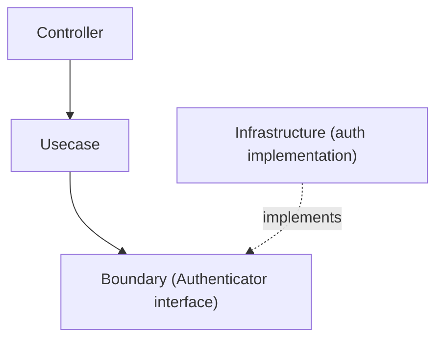

# auth Directory

`internal/infrastructure/auth` provides the **authentication infrastructure** for the application.

This directory contains the **Authenticator implementations** used by the application.  
Implementations are **separated by environment** (e.g., `local`, `stg`, `prd`).

The authentication abstraction interface is defined as a **Boundary in the Usecase layer**.

```txt
internal/usecase/boundary/auth
```

The Infrastructure layer provides **concrete implementations** of this Boundary.

## Responsibility

The responsibilities of this directory are:

- Provide **environment-specific implementations** of `Authenticator`
- Implement integrations with external authentication systems (JWT / OAuth / Cognito, etc.)
- Generate **Authn information from authentication tokens**

This layer **does not contain business logic**.

## Architectural Position

Authentication processing follows the layered architecture below.



Infrastructure **only implements the Boundary**,  
and acts as the concrete implementation invoked by the Usecase layer.

## Directory Structure

The expected structure is as follows.

```txt
internal/infrastructure/auth
├── README.md
├── local
│   └── auth_local.go
├── stg
│   └── auth_stg.go
└── prd
    └── auth_prd.go
```

|Directory|Purpose|
|---|---|
|`local`|Simple authentication for local development|
|`stg`|Authentication implementation for staging environments|
|`prd`|Authentication implementation for production environments|

## Local Implementation

`local` provides **authentication implementation for local development only**.

Characteristics:

- Does not perform token signature verification
- Extracts the subject from the token string
- Used as a lightweight authentication mechanism for development

Example:

```txt
Authorization: Bearer debug:user123
```

In this case:

```txt
subject = user123
provider = <env>
```

An Authn object is generated with this information.

## Staging / Production Implementation

In `stg` and `prd`, authentication typically involves implementations such as:

Examples:

- JWT verification
- OAuth2
- OpenID Connect
- AWS Cognito
- Auth0

These implementations typically perform:

- signature verification
- token validation
- claims extraction

## DI Registration

The Authenticator is registered in a DI module.

```txt
internal/di/module/core/auth.go
```

Example:

```txt
func provideAuthenticator(...) auth.Authenticator
```

The implementation is switched based on environment variables or configuration:

```txt
local
dev
stg
prd
```

## Design Policy

This directory follows the policies below.

### 1 Implement the Boundary

Infrastructure implements the `Authenticator` defined in:

```txt
usecase/boundary/auth
```

### 2 No Business Logic

This package handles **authentication processing only**.

The following are **not handled here**:

- authorization checks
- role evaluation
- business rules

These belong to the **Usecase layer**.

### 3 Environment-Based Separation

Authentication mechanisms may differ depending on the environment, so implementations are separated into:

```txt
local
stg
prd
```
