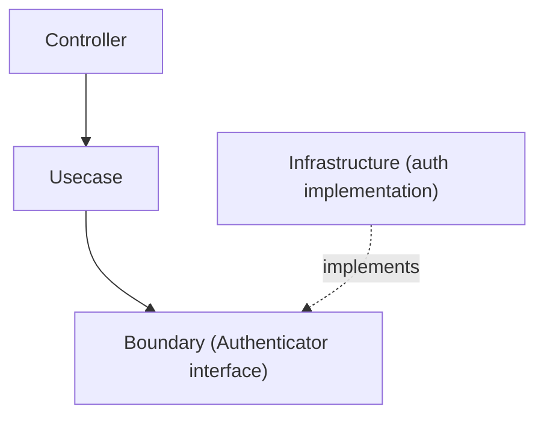

# auth Directory

`internal/infrastructure/auth` is a directory that provides **Authentication Infrastructure**.

This directory contains the **implementations of Authenticator** used by the application.  
Implementations are **separated by environment (local / stg / prd, etc.)**.

The abstraction interface for authentication is defined as a **Boundary in the Usecase layer**.

```txt
internal/usecase/boundary/auth
```

In the Infrastructure layer, this Boundary is **implemented concretely**.

## Role

The responsibilities of this directory are as follows.

- Provide **environment-specific implementations** of `Authenticator`
- Implement integration with external authentication systems (JWT / OAuth / Cognito, etc.)
- Generate **Authn information from authentication tokens**

This layer **does not handle business logic**.

## Position in Architecture

Authentication processing is implemented in the following layered structure.



Infrastructure **only implements the Boundary**,  
and is the concrete implementation directly invoked from the Usecase.

## Directory Structure

The future structure will be as follows.

```txt
internal/infrastructure/auth
├── README.md
├── local
│   └── auth_local.go
├── stg
│   └── auth_stg.go
└── prd
    └── auth_prd.go
```

|Directory|Purpose|
|---|---|
|`local`|Simple authentication for local development|
|`stg`|Authentication for staging environments|
|`prd`|Authentication for production environments|

## Local Implementation

`local` is an **authentication implementation dedicated to local development**.

Characteristics

- Does not perform token signature verification
- Extracts Subject from the token string
- Used as simple authentication for development

Example

```txt
Authorization: Bearer debug:user123
```

In this case

```txt
subject = user123
provider = <env>
```

Authn is generated.

## Staging / Production Implementation

In stg / prd, authentication such as the following is typically implemented.

Example

- JWT verification
- OAuth2
- OpenID Connect
- AWS Cognito
- Auth0

Here, the following are performed.

- signature verification
- token validation
- claims extraction

## Registration to DI

Authenticator is registered in the DI module.

```txt
internal/di/module/core/auth.go
```

Example

```txt
func provideAuthenticator(...) auth.Authenticator
```

Based on environment variables or configuration,

```txt
local
dev
stg
prd
```

the implementation is switched.

## Design Policy

This directory is designed based on the following policies.

### 1 Implement the Boundary

Infrastructure implements the `Authenticator` in:

```txt
usecase/boundary/auth
```

### 2 Do not include business logic

This package is responsible for **authentication processing only**.

The following are not handled.

- authorization checks
- role determination
- business rules

These are handled in the **Usecase layer**.

### 3 Separate by environment

Since authentication methods may differ by environment,

```txt
local
stg
prd
```

they are separated into directories.
