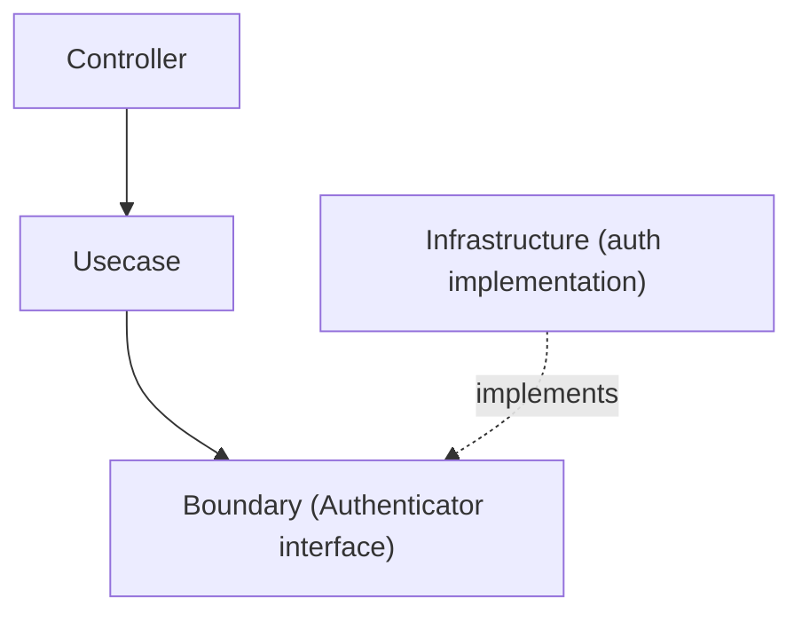

# auth Directory

`internal/infrastructure/auth` is a directory that provides **Authentication Infrastructure**.

This directory contains the **implementations of the auth Boundary interfaces** (`Authenticator` and `IdentityResolver`) used by the application.  
Authenticator implementations are **separated by verification method (local / jwt, etc.)**, and the DI layer selects which method to wire **per environment**.

The abstraction interface for authentication is defined as a **Boundary in the Usecase layer**.

```txt
internal/usecase/boundary/auth
```

In the Infrastructure layer, this Boundary is **implemented concretely**.

## Role

The responsibilities of this directory are as follows.

- Provide **method-specific implementations** of `Authenticator`
- Implement integration with external authentication systems (JWT / OAuth / OIDC, etc.)
- Generate **Authn information from authentication tokens**

This layer **does not handle business logic**.

## Position in Architecture

Authentication processing is implemented in the following layered structure.



Infrastructure **only implements the Boundary**,  
and is the concrete implementation directly invoked from the Usecase.

## Separation Axis: Method, not Environment

Implementations are separated by **verification method**, and the DI layer chooses which method a given environment uses. This keeps each package focused on one verification strategy while the environment-to-method mapping lives in a single place (`provideAuthenticator`).

- `local` — no signature verification; extracts the subject from the token string. A CI / test stub only.
- `jwt` — JWT verification (de-facto standard core) with the signing key from either a fixed public key or a JWKS endpoint. The production-oriented method.

```txt
internal/infrastructure/auth
├── README.md
├── local
│   └── auth_local.go
└── jwt
    └── auth_jwt.go
```

|Directory|Verification method|
|---|---|
|`local`|Development stub — no signature verification|
|`jwt`|JWT verification (standard core); key from fixed public key or JWKS|

The environment → method mapping is applied in DI (see "Registration to DI"): CI / test use the `local` stub, while `jwt` handles local development (verifying real JWTs from the mock auth server) and the environments that wire real token verification.

## local Implementation

`local` is an **authentication stub for CI / test** (no signature verification).

Characteristics

- Does not perform token signature verification
- Extracts Subject from the token string
- Used as a simple stub for CI / test

Example

```txt
Authorization: Bearer debug:user123
```

In this case

```txt
subject = user123
provider = mock
```

Authn is generated.

See `local/README.md` for details.

## jwt Implementation

`jwt` verifies an access token (JWT), covering the de-facto standard verification core. The signing key is resolved from either a **fixed RSA public key** (`New`) or a **JWKS endpoint by `kid`** (`NewJWKS`); the claim-verification logic is shared.

Here, the following are performed.

- signature verification (asymmetric, algorithm allowlist; `alg=none` / `HS256` rejected)
- key resolution (fixed public key, or JWKS with `kid` lookup / TTL cache, parsed via `go-jose` and fetched lazily through the `httpclient` substrate)
- claim validation (`iss` / `aud` / `exp` / `nbf` / `sub`)
- scope extraction (standard `scope` claim)

IdP-specific dialects (Cognito `token_use`, Azure AD `scp`, opaque tokens, EC keys) are out of scope and documented as extension points. See `jwt/README.md` for details.

## IdentityResolver Implementations

Besides `Authenticator`, this directory also holds implementations of the `IdentityResolver` boundary (resolving an authenticated external identity — issuer + subject — to an internal user):

- `identity` — the substrate default (`passthrough`) that leaves the internal UserID unresolved; wired when no user store is present.
- `useridentity` — resolves the internal user from the `user_identities` table (sample; removed together with the user sample, after which DI falls back to `identity`).

## Registration to DI

Authenticator is registered in the DI module.

```txt
internal/di/module/core/auth.go
```

Example

```txt
func provideAuthenticator(...) auth.Authenticator
```

Based on the environment,

```txt
local
dev
stg
prd
```

the **verification method** is selected (e.g. `local` stub for CI / test; `jwt` for local / development).

## Test Strategy

This directory has no single substrate. What a test must stand up is decided by the verification method,
not by the directory, so the infrastructure layer's real-DB strategy does not govern it as a whole. Each
implementation below states what it closes over; the one that genuinely needs a database says so.

- **`local`** — string parsing with nothing to double. Plain unit tests over the token forms it accepts
  and rejects. Because it is the stub that skips signature verification, the rejections matter more than
  the acceptances: a malformed token must produce the sentinel, never a partially built `Authn`.
- **`jwt`** — the only implementation with an external dependency, and it is reached solely through the
  `httpclient.Client` boundary, so a generated mock scripts the JWKS / discovery responses and no network
  is touched. Signing material is built in-process (`go-jose`, a fresh key pair per test) rather than
  committed as a fixture, which is what makes an unknown `kid`, a rotated key and an algorithm outside
  the allowlist all reachable. Time-dependent claims (`exp` / `nbf` / leeway) go through the injected
  `clock` testkit — a test that waits on wall time for a token to expire is flaky by construction.
- **`identity`** — a passthrough with no branch. Its test exists to pin that it *stays* one: the resolver
  must leave the internal UserID unresolved rather than inventing a value for it.
- **`useridentity`** — the exception here. It reads `user_identities` through the RDB driver, so the
  real-DB strategy in [`../README.md`](../README.md) governs it: a real database, `rdb/testkit`, and
  transaction rollback for state isolation. The identities it reads come from the seed, whose issuer is
  environment-dependent, so it runs through `make test` rather than a bare `go test`.

Which method a given environment receives is DI-layer scope and is verified there, not here.

## Design Policy

This directory is designed based on the following policies.

### 1 Implement the Boundary

Infrastructure implements the `Authenticator` in:

```txt
usecase/boundary/auth
```

### 2 Do not include business logic

This package is responsible for **authentication processing only**.

The following are not handled.

- authorization checks
- role determination
- business rules

These are handled in the **Usecase layer**.

### 3 Separate by verification method

Since authentication may use different verification strategies,

```txt
local
jwt
```

they are separated into directories by method, and DI selects the method per environment.

### 4 Constructor convention

Authenticator constructors follow a consistent shape based on their inputs:

- A lightweight constructor that takes no verification parameters returns the interface only — `func New() Authenticator` (e.g. `local`).
- A constructor that takes verification parameters requiring validation (key parsing, required fields) returns `(Authenticator, error)` and fails at construction time — `func New(Params) (Authenticator, error)` (e.g. `jwt`).
