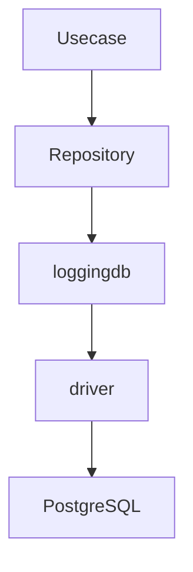
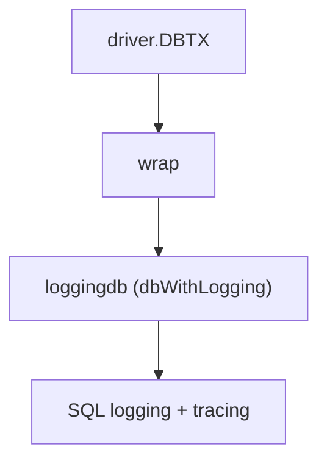
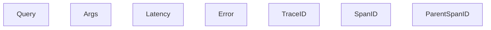
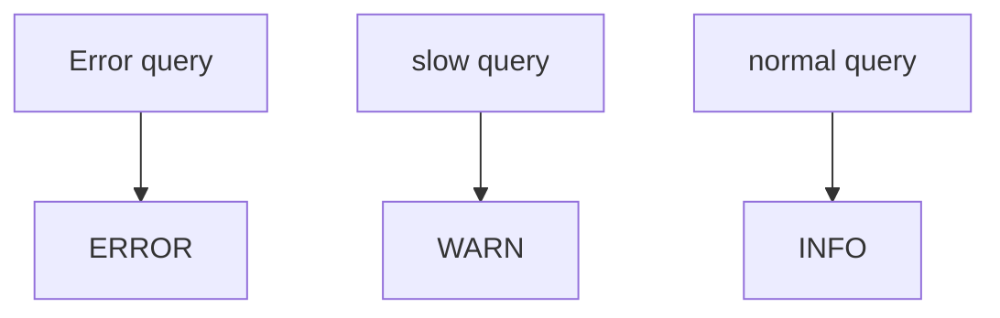
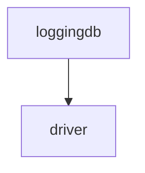

# loggingdb

English | [日本語](README.ja.md)

Overview: **An Observability wrapper layer that adds SQL execution logs and trace information to DB access. Actual query execution is delegated to the driver layer, and only log formatting and trace integration are added.**

loggingdb is an **observability adapter positioned above the driver**.

## Architectural Position



loggingdb **does not perform DB execution processing itself.**

It wraps `driver.DBTX` and adds the following processing during SQL execution:

- SQL log output
- OpenTelemetry trace integration
- Query execution time measurement
- slow query detection

## Responsibility

This directory provides **observability for SQL execution**.

Main responsibilities:

- Provide a logging wrapper that wraps `driver.DBTX`
- Output SQL execution logs
- Generate OpenTelemetry spans
- Measure query execution time
- Detect slow queries
- Structure log fields

As a result, upper layers (repository / usecase / handler):

- logging implementation
- tracing implementation

do not need to be aware of these at all.

## DBTX Wrapper

The core implementation of loggingdb is a **DBTX wrapper**.



`dbWithLogging` wraps `driver.DBTX` and performs the following processing before and after SQL execution:

1. Start an OpenTelemetry span
2. Execute SQL
3. Measure execution time
4. Output SQL logs
5. Determine errors

## SQL Log Contents

The output logs include the following information.



This enables:

- API requests
- DB queries

to be **traced within a single trace context**.

## Slow Query

loggingdb automatically determines slow queries.

The determination of slow queries depends on the following configuration.

```go
DBConfig().SlowQueryWarnThreshold()
```

The log level is determined by the following rules.



## Provider

`DBProvider` is a **DI Adapter** that aggregates the dependencies required for loggingdb.

Provided dependencies:

- `DatabaseDriver`
- `Logger`
- `LogFieldBuilder`
- `DatabaseConfig`
- `LayerTracer`

This allows loggingdb to:

- logging implementation
- tracing implementation

not depend directly on them, and use them via DI.

## Necessity

### Production

Recommended

Reason:

- detection of slow queries
- investigation of DB errors
- trace integration between API and DB

These are **highly useful for operational monitoring**.

However, in extremely high-traffic environments, considering increased log volume:

- sampling
- logging only slow queries

can also be considered.

### Development / Testing

Strongly recommended

Reason:

- confirmation of issued SQL
- verification of sqlc query behavior
- debugging during DB testing

Therefore, it is very effective during development.

## Notes

### loggingdb does not perform DB I/O

loggingdb is a **pure wrapper**.

All actual SQL execution is delegated to the driver layer.



### Always propagate Context

Trace information is stored in `context.Context`.

Therefore, always propagate `ctx` to lower layers.

### Log volume with large number of queries

`ExecContext`

`QueryContext`

`QueryRowContext`

For each **DB operation, a log is output**.

In processes that execute a large number of queries, log volume may increase.
