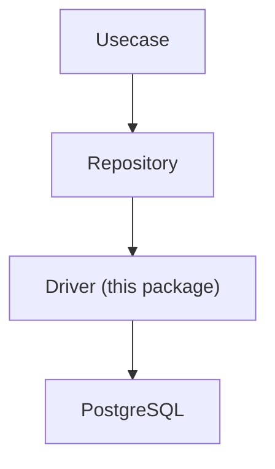
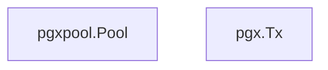
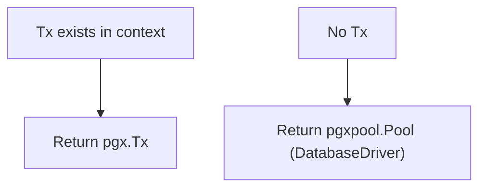

# driver

English | [日本語](README.ja.md)

Overview: **Base driver layer for RDB (PostgreSQL / pgx) connections. Provides connection management, transaction boundaries, and sqlc execution adapters.**

This package is the **lowest-level DB access foundation in the Infrastructure layer**.

The Repository layer accesses the DB through this driver.

## Architectural Position



Driver is the **lowest-level adapter for RDB connections**.

## Responsibilities

This directory provides the following functionalities:

- **DatabaseDriver abstraction** wrapping `pgxpool.Pool`
- **Transaction management (`tx.Manager`)**
- **Provision of pgx-based DBTX interface (sqlc compatible)**
- **Connection pool configuration**
- **Connectivity check at DB startup (fail fast)**

With this, the Repository layer can execute the same query code with either:



## DB Initialization

Two constructors initialize the DB connection:

```go
func NewDB(...) (DatabaseDriver, error)                         // no query tracer
func NewTracedDB(..., tracer pgx.QueryTracer) (DatabaseDriver, error) // with query tracer
```

`NewTracedDB` is used by the application (DI) and wires the pgx query tracer at
`poolCfg.ConnConfig.Tracer`. `NewDB` (no tracer) is kept for tooling paths that do not need
query instrumentation (e.g. migration / seed).

Processing details:

1. Initialize connection via `pgxpool.NewWithConfig()`
2. Configure connection pool
    - MaxConns
    - MinConns
    - ConnMaxLifetime
    - ConnMaxIdleTime
3. Attach the query tracer to `ConnConfig.Tracer` (only when provided)
4. Verify DB connectivity using `Ping`

If Ping fails, it returns an error at startup (**fail fast** design).

## DatabaseDriver

`DatabaseDriver` is an interface that abstracts `pgxpool.Pool`.

```go
 type DatabaseDriver interface {
     DBTX

     Begin(ctx context.Context) (pgx.Tx, error)
     Ping(ctx context.Context) error
     Close() error
     Stats() *pgxpool.Stat
 }
```

Purpose:

- Avoid direct dependency on `pgxpool.Pool`
- Enable mocking during tests
- Abstract transaction start

Implementation is provided by `dbDriver`.

## DBTX

`DBTX` is the **minimal interface required by sqlc**.

```go
 type DBTX interface {
     Exec(ctx context.Context, query string, args ...any) (pgconn.CommandTag, error)
     Query(ctx context.Context, query string, args ...any) (pgx.Rows, error)
     QueryRow(ctx context.Context, query string, args ...any) pgx.Row
 }
```

With this interface, sqlc can execute the same query code with either:


## Transaction Transparent Layer

`New()` in `connection.go` is a **transaction-transparent adapter**.

```go
func New(ctx context.Context, db DatabaseDriver) DBTX
```

Behavior:



With this, the Repository layer can execute queries without being aware of the difference between `DB` and `Tx`.

## Transaction Management

`tx.Manager` provides transaction boundaries in the Usecase layer.

```go
err := tx.Do(ctx, func(ctx context.Context) error {
    ...
})
```

Internally, it performs the following:

1. Check if Tx exists in context
2. If exists → **reuse existing Tx**
3. If not → **start new Tx**
4. Execute fn
5. Success → commit
6. error → rollback

- Uses pgx.Tx for transaction management.

This enables **safe handling of nested transactions**.

## Notes

### Transaction cleanup timeout

When executing rollback / commit, cleanup must run even if the request context is canceled.  
To achieve this, the following pattern is used:

```go
context.WithTimeout(
    context.WithoutCancel(ctx),
    cleanupTimeout,
)
```

#### Why `context.WithoutCancel(ctx)`?

Cleanup must **not depend on the request lifecycle**.

- If the request is canceled (timeout / client disconnect), using the original `ctx` would cause:
  - rollback/commit to be canceled
  - transaction left open
  - connection not returned to the pool

Using `context.WithoutCancel(ctx)` ensures:

- cleanup always runs
- trace / logger / correlation ID are preserved

> Cleanup is about **attempting safely**, not guaranteeing success.

#### About `cleanupTimeout`

- Maximum time allowed for cleanup (rollback / commit)
- Currently fixed to `5 seconds`

This value is **not a business configuration but a safety mechanism for infrastructure protection**.

- If too large:
  - Goroutine blocking
  - Connection pool exhaustion
- If too small:
  - Cleanup may not complete

Therefore, it is intentionally kept as a constant inside the driver and not exposed via environment variables.

### Always propagate Context

Transactions are stored in `context.Context`. Therefore, always propagate `ctx` to lower layers.

### Repository must use driver.New()

In the Repository layer:

```go
driver.New(ctx, db)
```

Use this to obtain `DBTX`.

This allows transparent switching between `Tx` and `DB`.

## DSN Helpers (config.go)

Utilities for building DB connection DSNs.

|Function|Description|
|---|---|
|`DSN(dbCfg)`|Build base connection URL|
|`DSNWithTimeZone(dbCfg, osCfg)`|Build connection URL with timezone|
|`DSNString(dbCfg)`|String version of `DSN`|
|`DSNStringWithoutPassword(dbCfg)`|String version of `DSN` without the password (pass it via `PGPASSWORD` etc. instead)|
|`DSNWithTimeZoneString(dbCfg, osCfg)`|String version of `DSNWithTimeZone`|

## NewTransactionManager

```go
func NewTransactionManager(db DatabaseDriver, dbCfg *config.DatabaseConfig, logger logging.Logger, sleeper clock.Sleeper) tx.Manager
```

Constructor that implements `tx.Manager` (`internal/usecase/boundary/tx`) for the Usecase layer.
`Do` retries the whole transaction a bounded number of times on `serialization_failure` (40001) /
`deadlock_detected` (40P01), using `sleeper` for exponential backoff + full jitter (`pkg/retry`). The
retry bound and backoff come from config (`DB_TX_MAX_RETRIES` / `DB_TX_RETRY_BASE_BACKOFF` /
`DB_TX_RETRY_MAX_BACKOFF`); non-positive values fall back to built-in defaults. See the `tx` boundary
README for the `fn`-idempotency contract.

## Query Tracer (query_tracer.go)

`NewQueryTracer` builds the `pgx.QueryTracer` that is wired at `ConnConfig.Tracer`. It embeds
`otelpgx` for OpenTelemetry spans and adds query logs: success at Info (with latency), slow
queries at Warn, and failures at Error.

|Type / Function|Description|
|---|---|
|`NewQueryTracer`|Build a `pgx.QueryTracer` (receives DB / Observability config, otelpgx tracer, `QueryRecorder`, Logger, LogFieldBuilder)|
|`queryTracer`|Embeds `*otelpgx.Tracer`; overrides `TraceQueryStart` / `TraceQueryEnd` to add logging and query metrics|

Features:

- OpenTelemetry span per query via `otelpgx` (with semconv DB attributes; batch / copy covered too)
- **Info log** on successful completion (with latency)
- **Error log** on query failure (in addition to `span.RecordError`)
- **Slow query Warn log** when `DB_SLOW_QUERY_WARN_THRESHOLD` is exceeded
- Query argument masking via `OBS_MASKED_DB_QUERY_ARGS`
- **Query metrics** recorded on every `TraceQueryEnd` via an injected `QueryRecorder` (implemented in the `metrics` package)

## Query Metrics (query_metric.go)

`TraceQueryEnd` records DB query duration / errors through a `QueryRecorder`. The interface and
its `QueryAttrs` value live in this package (the consumer) so the `metrics` package can implement
it without an import cycle (`metrics` already imports `driver`).

|Type / Function|Description|
|---|---|
|`QueryRecorder`|Interface called once per query end with the assembled `QueryAttrs`|
|`QueryAttrs`|Low-cardinality observation attrs (query name / operation / status / error class / duration) — never SQL text, bind values, or PII|
|`WithQueryName(ctx, name)`|Attach a stable `query_name` (e.g. `"user.find_by_id"`) for the metric label|

How the attrs are derived:

- `query_name`: from `WithQueryName`; unset / empty → `unknown`
- `operation`: from the SQL leading token only → `select` / `insert` / `update` / `delete` / `begin` / `commit` / `rollback` / `copy` / `other` (leading comments and `WITH` clauses fold to `select` / `other`)
- `status`: `success` / `error`; `pgx.ErrNoRows` is treated as `success` and is not counted as an error
- `error_class`: derived via `pgerror` → `constraint` / `timeout` / `retryable` / `connection` / `unknown` (`retryable` = `serialization_failure` (40001) / `deadlock_detected` (40P01), i.e. retryable transaction conflicts). `pgx.ErrNoRows` is `success`, so it never appears here.

The Prometheus metric definitions (`rdb_query_duration_seconds`, `rdb_query_errors_total`) live in
`internal/infrastructure/rdb/metrics`. Repository / QueryService set the query name with
`driver.WithQueryName(ctx, "...")`; everything else is transparent.
