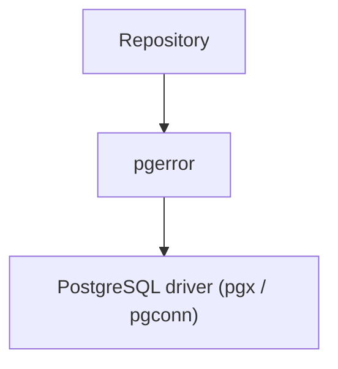
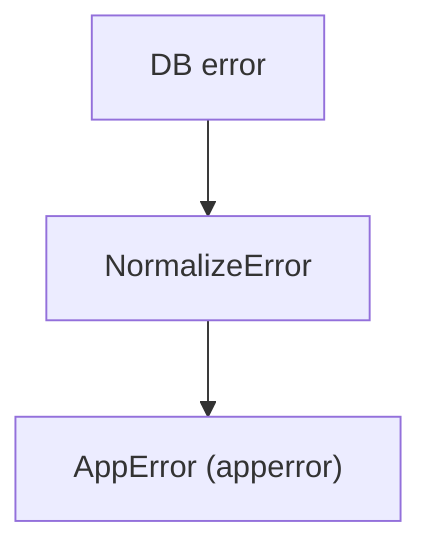
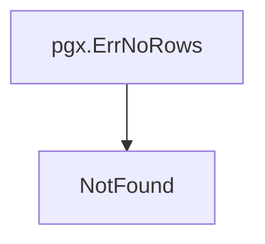

# pgerror Package

English | [日本語](README.ja.md)

Overview: **An Infrastructure-layer component that normalizes PostgreSQL-specific errors into application-wide errors and determines database connectivity failures. It acts as a translation layer that hides database-specific error semantics from upper layers.**

## Architectural Position



`pgerror` is **a layer that converts errors returned by the DB driver into application-wide errors**.

By introducing this layer:

- Usecase
- Domain
- Handler

in upper layers **no longer need to be aware of PostgreSQL-specific error semantics**.

## Responsibility

This package normalizes PostgreSQL-specific error handling into a common application format.

Primary responsibilities:

- Convert PostgreSQL SQLSTATE into `apperror`
- Determine database connectivity errors
- Convert `pgx.ErrNoRows` into `NotFound`
- Standardize error contracts between Infrastructure and Usecase layers

This enables **separating DB implementation-dependent error handling from application code**.

## Error Normalization

`NormalizeError` converts PostgreSQL errors into application-wide errors.

```go
func NormalizeError(err error) error
```

Processing flow:



This function is recommended to be used as the **single normalization point for errors returned from the Infrastructure layer to the Usecase layer**.

For write queries that return an affected-row count (sqlc `:execrows`), use `NormalizeExecResult` instead — it applies `NormalizeError` to the error and additionally treats **0 affected rows as `apperror.ErrNotFound`**, so `UPDATE` / `DELETE` against a non-existent row fails loudly rather than succeeding silently. Keep this 0-rows judgment here (next to `NormalizeError`), not inlined in each repository, so every write path shares it.

```go
func NormalizeExecResult(affected int64, err error) error
```

For errors returned by a **domain constructor while reconstructing an entity from a stored row** (`rowToXxx` → `New(...)`), use `NormalizeReconstructError` — stored data violating a domain invariant is a data-integrity failure (server-side), so the error is deliberately **flattened to `apperror.ErrInternal`** (a load-bearing flatten: the validation sentinel and any `apperror.Meta` are removed from the chain) to prevent it surfacing to clients as `422` with field `details`. The reason text stays in the message, so it still reaches the logs.

```go
func NormalizeReconstructError(err error) error
```

## SQLSTATE Mapping

The following PostgreSQL SQLSTATE values are converted into application errors.

|SQLSTATE|Meaning|AppError|
|--------|------|----------|
|23505|unique violation|Conflict|
|23503|foreign key violation|InvalidArgument|
|23502|not null violation|InvalidArgument|
|23514|check violation|InvalidArgument|
|22001|string too long|InvalidArgument|
|22P02|invalid text representation|InvalidArgument|
|42501|insufficient privilege|PermissionDenied|
|40001|serialization failure|Unavailable|
|40P01|deadlock detected|Unavailable|
|55P03|lock not available (`lock_timeout` expiry)|Unavailable|
|57014|query canceled|Unavailable|

PostgreSQL errors that do not match these cases are converted into `Internal` errors.

## Special Handling

### pgx.ErrNoRows

`pgx.ErrNoRows` is not a PostgreSQL SQLSTATE, so it is handled specially.



This allows the Repository layer to handle `NotFound` errors simply by:

```go
return NormalizeError(err)
```

## Connection Failure Detection

`IsUnavailable` determines database connectivity failures.

```go
func IsUnavailable(err error) bool
```

The following errors are treated as connectivity failures.

- context.DeadlineExceeded
- net.Error (timeout, connection refused, DNS failure, etc.)
- PostgreSQL SQLSTATE 08XXX (connection exception)

Note: context.Canceled (client cancellation / disconnect) is NOT a connectivity failure. It is classified as a client error (`apperror.ErrCanceled`, HTTP 499 Client Closed Request).

This determination can be used for recovery processing such as:

- retry
- circuit breaker
- failover

## Retryable / Lock Predicates

In addition to normalization, `pgerror` exposes predicates used by the driver's retry / metrics paths. They match on the **raw** `pgconn.PgError` SQLSTATE (not the normalized sentinel), so unrelated `Unavailable` errors (e.g. connection loss) are not swept into retry.

```go
func IsRetryableTxError(err error) bool // 40001 serialization_failure / 40P01 deadlock_detected
func IsLockNotAvailable(err error) bool // 55P03 lock_not_available (lock_timeout expiry)
```

`IsRetryableTxError` is what `driver.NewTransactionManager` uses to decide whether to retry the whole transaction. `55P03` is normalized to `Unavailable` (see the mapping table) but is deliberately **excluded** from it: an immediate retry does not resolve a lock still held by another transaction.

`IsLockNotAvailable` remains a separate predicate because a caller may need `55P03` to mean something narrower than "temporarily unavailable". `system_cqrs/idempotency` checks it **before** `NormalizeError` so a contended claim surfaces as its own `ErrLockTimeout`; every other caller gets `Unavailable` from the mapping table without writing a lock check of its own. Prefer the mapping — a per-call-site check is unreliable here, since a lock wait is not confined to queries that spell out `FOR UPDATE` (an `UPDATE` / `DELETE` against a row another transaction holds waits too).

## Error Wrapping

`NormalizeError` combines the `apperror` sentinel with the original DB error via `xerrors.Join`, preserving the original error in the chain.

This allows `xerrors.Is` to match both:

- application error classification (e.g. `apperror.ErrConflict`)
- the original DB error (e.g. the underlying `pgconn.PgError` / `pgx.ErrNoRows`)

(`NormalizeExecResult`'s 0-rows case is the exception: it uses `xerrors.Wrap(apperror.ErrNotFound, ...)` since there is no underlying DB error to join.)

## Necessity

### Production

Required

Reason:

- Convert DB constraint violations into correct HTTP status codes
- Detect DB connection failures
- Hide raw errors for security purposes

This makes it an essential layer for applications.

### Development / Testing

Required

Reason:

- Hide DB error semantics from tests
- Stabilize error handling in CI
- Improve readability of sqlc / repository tests

## Notes

### Use NormalizeError at a single point

`NormalizeError` is recommended to be applied **only once at the Infrastructure → Usecase boundary**.

Applying it multiple times may break the error structure.

### PostgreSQL-specific behavior

SQLSTATE `08XXX` represents PostgreSQL-specific connection errors.

If migrating to another DB (MySQL / TiDB, etc.), the implementation of `pgerror` must be replaced.

### Do not perform DB-specific checks in upper layers

Do not write DB-dependent logic such as `SQLSTATE`, `pgconn`, or `pgx` in Usecase / Domain layers.
