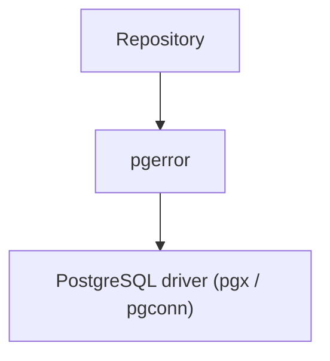
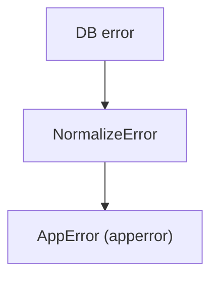
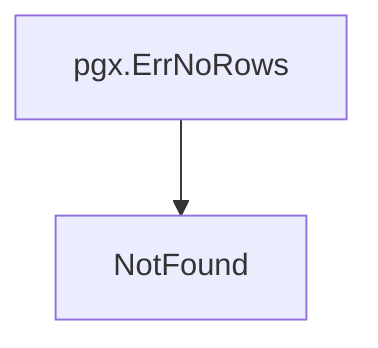

# pgerror Package

English | [日本語](README.ja.md)

Overview: **An Infrastructure-layer component that normalizes PostgreSQL-specific errors into application-wide errors and determines database connectivity failures. It acts as a translation layer that hides database-specific error semantics from upper layers.**

## Architectural Position



`pgerror` is **a layer that converts errors returned by the DB driver into application-wide errors**.

By introducing this layer:

- Usecase
- Domain
- Handler

in upper layers **no longer need to be aware of PostgreSQL-specific error semantics**.

## Responsibility

This package normalizes PostgreSQL-specific error handling into a common application format.

Primary responsibilities:

- Convert PostgreSQL SQLSTATE into `apperror`
- Determine database connectivity errors
- Convert `pgx.ErrNoRows` into `NotFound`
- Standardize error contracts between Infrastructure and Usecase layers

This enables **separating DB implementation-dependent error handling from application code**.

## Error Normalization

`NormalizeError` converts PostgreSQL errors into application-wide errors.

```go
func NormalizeError(err error) error
```

Processing flow:



This function is recommended to be used as the **single normalization point for errors returned from the Infrastructure layer to the Usecase layer**.

## SQLSTATE Mapping

The following PostgreSQL SQLSTATE values are converted into application errors.

|SQLSTATE|Meaning|AppError|
|--------|------|----------|
|23505|unique violation|Conflict|
|23503|foreign key violation|InvalidArgument|
|23502|not null violation|InvalidArgument|
|23514|check violation|InvalidArgument|
|22001|string too long|InvalidArgument|
|22P02|invalid text representation|InvalidArgument|
|42501|insufficient privilege|PermissionDenied|
|40001|serialization failure|Unavailable|
|40P01|deadlock detected|Unavailable|
|57014|query canceled|Unavailable|

PostgreSQL errors that do not match these cases are converted into `Internal` errors.

## Special Handling

### pgx.ErrNoRows

`pgx.ErrNoRows` is not a PostgreSQL SQLSTATE, so it is handled specially.



This allows the Repository layer to handle `NotFound` errors simply by:

```go
return NormalizeError(err)
```

## Connection Failure Detection

`IsUnavailable` determines database connectivity failures.

```go
func IsUnavailable(err error) bool
```

The following errors are treated as connectivity failures.

- context.DeadlineExceeded
- net.Error (timeout)
- PostgreSQL SQLSTATE 08XXX (connection exception)

This determination can be used for recovery processing such as:

- retry
- circuit breaker
- failover

## Error Wrapping

pgerror wraps errors using `xerrors.Wrap` in the form of `apperror + original error message` while preserving the original DB error.

This allows retaining both:

- application error classification
- original DB error

## Necessity

### Production

Required

Reason:

- Convert DB constraint violations into correct HTTP status codes
- Detect DB connection failures
- Hide raw errors for security purposes

This makes it an essential layer for applications.

### Development / Testing

Required

Reason:

- Hide DB error semantics from tests
- Stabilize error handling in CI
- Improve readability of sqlc / repository tests

## Notes

### Use NormalizeError at a single point

`NormalizeError` is recommended to be applied **only once at the Infrastructure → Usecase boundary**.

Applying it multiple times may break the error structure.

### PostgreSQL-specific behavior

SQLSTATE `08XXX` represents PostgreSQL-specific connection errors.

If migrating to another DB (MySQL / TiDB, etc.), the implementation of `pgerror` must be replaced.

### Do not perform DB-specific checks in upper layers

Do not write DB-dependent logic such as `SQLSTATE`, `pgconn`, or `pgx` in Usecase / Domain layers.
