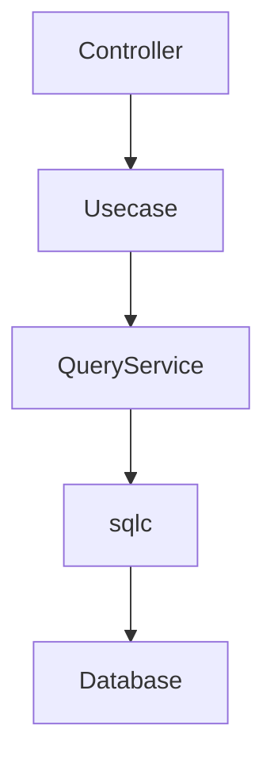
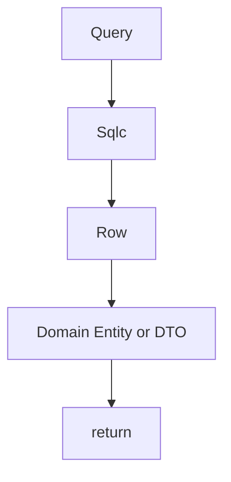
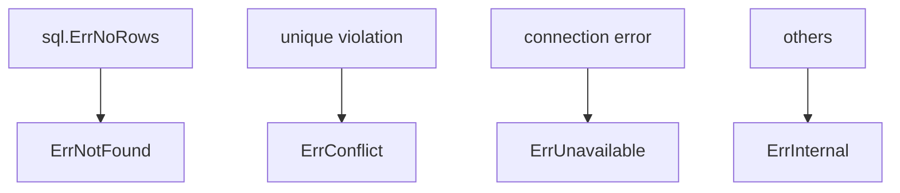
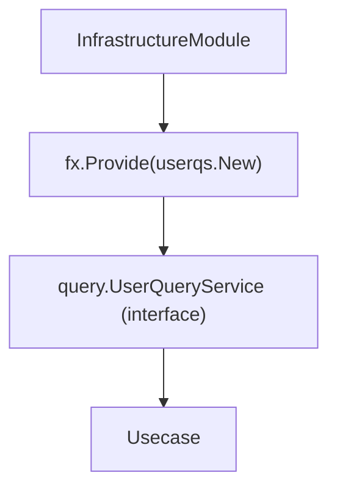
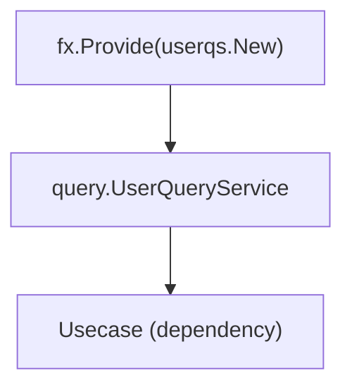

# Query Service Implementation Guide

## Role

Query Service is a layer that provides **read-only queries such as search and listing**.

While Repository represents **aggregate persistence abstraction**,  
Query Service provides **query-specific search operations**.



Query Service has the following responsibilities:

1. Execute SQL search
2. Convert Row → Domain
3. Normalize DB errors

Query Service **must not contain business logic.**

## Architecture Position

QueryService implementations are placed in the following location.

`internal/infrastructure/rdb/query_service/<aggregate>/`

Example

```txt
query_service/
 └ user/
     └ user_query_service.go
```

QueryService interfaces are placed in the **Usecase layer**.

`internal/usecase/<aggregate>/query`

Example

```txt
internal/usecase/user/query/user_query_service.go
```

Infrastructure only **implements this interface**.

## QueryService Responsibility

QueryService is responsible for **search-oriented data retrieval**.



QueryService does not perform the following:

- Business rules
- Usecase logic
- Controller processing
- Transaction management

## sqlc Usage

QueryService uses **sqlc generated queries**.

```go
rows, err := db.ListUsersByKeywords(ctx, ...)
```

With sqlc:

- Type-safe SQL execution
- Compile-time SQL validation

becomes possible.

Generated code is placed in `internal/infrastructure/rdb/sqlc/gen`.

## LIKE Search Helper

For keyword search, use helpers from `internal/infrastructure/rdb/sqlc`.

Example

```go
escaped := sqlc.EscapeForLike(keyword, sqlc.DefaultLikeEscapeChar)
pattern := sqlc.WrapContainsLikePattern(escaped)
```

Purpose:

- Prevent LIKE injection
- Standardize search patterns

## Deleted State Handling

Deleted state filtering uses:

```go
DeletedState: sqlc.BoolPtrToDeletedState(active)
```

This enables control of:

- `active`
- `inactive`
- `all`

states.

## Row → Return Type Conversion

sqlc Rows are **Infrastructure types**.

QueryService must always convert them into **return types (Domain Entity or DTO)**.

```go
user, err := user.New(
    uuid.FromPrimitive(row.Users.ID),
    ...,
)
```

Important rule:  
**Do not return sqlc Row to upper layers**

## UUID Conversion

DB uses `pkg/uuid.UUID`.

Domain uses `pkg/uuid.UUID`.

Conversion:

```go
row.ID // pkg/uuid.UUID
```

## Nullable Conversion

In this project, we use `sqlc override` to ensure that the UUIDs in the database and the `pkg/uuid` used in the domain are treated identically.

Therefore, explicit UUID conversion in the QueryService is generally unnecessary.

```go
row.Users.Building   // *string
row.Users.DeletedAt  // *time.Time
```

## LoggingDBProvider

QueryService does not directly use DB driver.

```go
db := gen.New(s.db.NewLoggingDB(ctx))
```

`loggingdb.DBProvider` provides:

- SQL logs
- DB / Tx switching
- Context binding

## Error Normalization

PostgreSQL errors are normalized via `internal/infrastructure/rdb/postgres/pgerror`.

```go
return pgerror.NormalizeError(err)
```

Main mappings:



## Observability (Tracing)

QueryService uses `observability.LayerTracer` for tracing.

```go
ctx, endSpan := s.tracer.Start(ctx)
defer endSpan()
```

QueryService handles only:

`Span start / end`

## DI (Dependency Injection) Mechanism (Query Service)

Query Service is created using **DI with Uber Fx**.  
Like Repository, it is implemented in the Infrastructure layer and injected into the Usecase layer interface.

### Overall Structure

Query Service is registered via `fx.Provide` and injected into Usecase.



### Role of internal/di/module/infrastructure.go

```go
func InfrastructureModule() fx.Option {
    return fx.Module("infrastructure",
        fx.Module("query_service",
            fx.Provide(
                userqs.New,
            ),
        ),
    )
}
```

- `fx.Provide`
  - Registers the Query Service constructor
- Return value is the **interface defined in the Usecase layer**
  - Example: `query.UserQueryService`

### Query Service Constructor Design

```go
func New(
    db loggingdb.DBProvider,
    tf observability.TracerFactory,
) query.UserQueryService {
    return &service{
        db:     db,
        tracer: tf.Infra(),
    }
}
```

Key points:

- Return value must be an **interface (Usecase definition)**
- All dependencies must be received as arguments (new is prohibited)
- External dependencies such as DB / Tracer are confined to Infrastructure

### DI Flow



On the Usecase side:

```go
type service struct {
    qs query.UserQueryService
}
```

is used to receive via interface.

### Difference from Repository (DI perspective)

||Repository|Query Service|
|---|---|---|
|interface definition location|domain|usecase|
|return type|domain.Repository|query.QueryService|
|purpose|persistence|search|

### Why return Usecase interface

- Query is a Usecase concern (per usecase)
- Not placed in Domain because it is not aggregate-based
- Allows flexible handling of search specification changes

### Rules for AI / Developers

- Query Service constructor must always be defined as `New`
- Return value must be the Usecase interface
- Do not new dependencies inside Query Service
- Register DI in `internal/di/module/infrastructure.go`

## QueryService Structure

QueryService has the following dependencies.

```go
type service struct {
    db     loggingdb.DBProvider
    tracer observability.LayerTracer
}
```

Constructor:

```go
func New(
    db loggingdb.DBProvider,
    tf observability.TracerFactory,
) query.UserQueryService {
    return &service{
        db:     db,
        tracer: tf.Infra(),
    }
}
```

## Difference from Repository

Repository and QueryService have different roles.

||Repository|QueryService|
|---|---|---|
|Purpose|Aggregate persistence|Search|
|Operation|CRUD|Search|
|Responsibility|Aggregate unit|Search-specific|
|Placement|domain interface|usecase interface|

## Anti-Patterns

### 1. Writing search in Repository

Search must not be written in Repository.

NG

```go
func (r *repository) FindByKeyword(...)
```

Search should be implemented in `QueryService`.

### 2. Writing business logic

QueryService is **data retrieval only**.

NG

```go
if user.IsPremium() {
}
```

### 3. Returning sqlc Row

NG

```go
return rows
```

Always convert to Domain.

## Implementation Example

```go
// service name is fixed
type service struct {
  db     loggingdb.DBProvider
  tracer observability.LayerTracer
}

// New function name is fixed
func New(
  db loggingdb.DBProvider,
  tf observability.TracerFactory,
) query.UserQueryService {
  return &service{
    db:     db,
    tracer: tf.Infra(),
  }
}

func (s *service) FindByKeyword(ctx context.Context, keywords []string, active*bool, limit, offset int32) (user.Users, error) {
    // Start / end span
    ctx, endSpan := s.tracer.Start(ctx)
    defer endSpan()

    // Pre-processing for QueryService usage
    tokens := make([]string, len(keywords))
    for i, kw := range keywords {
        escaped := sqlc.EscapeForLike(kw, sqlc.DefaultLikeEscapeChar)
        tokens[i] = sqlc.WrapContainsLikePattern(escaped)
    }

    // Use logging-enabled DB driver
    // If not needed, use driver.ResolveDriver(ctx, r.db)
    db := gen.New(s.db.NewLoggingDB(ctx))

    rows, err := db.ListUsersByKeywords(ctx, &gen.ListUsersByKeywordsParams{
        PatternsParam: tokens,
        DeletedState:  sqlc.BoolPtrToDeletedState(active),
        LimitParam:    limit,
        OffsetParam:   offset,
    })
    if err != nil {
        // Normalize error before returning
        // Error classification is handled in pgerror package
        return nil, pgerror.NormalizeError(err)
    }

    // Map to Domain entity or DTO
    users := make(user.Users, len(rows))
    for i, row := range rows {
        u, err := user.New(
            row.Users.ID,
            row.Users.FirstName,
            row.Users.LastName,
            row.Users.PasswordHash,
            row.Users.Email,
            row.Users.Phone,
            row.Users.PrefectureID,
            row.Users.City,
            row.Users.Street,
            row.Users.Building,
            row.Users.PostalCode,
            row.Users.CreatedAt,
            row.Users.UpdatedAt,
            row.Users.DeletedAt,
        )
        if err != nil {
            return nil, err
        }
        users[i] = u
    }

    return users, nil
}
```
