# Repository Implementation Guide

English | [日本語](README.ja.md)

## Position of Repository in Onion Architecture

In Onion Architecture, Repository is the **central pattern that embodies the Dependency Inversion Principle (DIP)**.

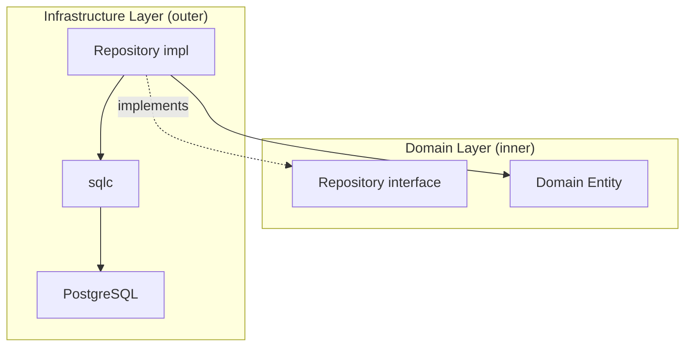

### Core Role of Repository

|Principle|How Repository Achieves It|
|---|---|
|Dependency Inversion|Domain defines the interface, Infrastructure implements it|
|Aggregate Boundary Protection|Persistence is performed per Aggregate unit|
|Domain Purity|Domain has no knowledge of DB / SQL / frameworks|
|Invariant Validation|Entities are reconstructed only through Domain constructors|

### Responsibility Split with QueryService

Repository handles **Aggregate persistence (CRUD)**. Read-only queries for search and list retrieval are separated into [QueryService](../query_service/README.md).

|Aspect|Repository|QueryService|
|---|---|---|
|Purpose|Aggregate persistence|Usecase-specific search|
|Interface placement|Domain layer|Usecase layer|
|Return type|Domain Entity|DTO (display projection)|
|Invariants|Guaranteed by Domain constructor|Not involved|
|Transactions|Controlled by Usecase (`tx.Manager`)|Principally read-only|

This separation allows Repository to focus on Aggregate integrity while delegating search performance optimization to QS.

## Role

Repository is the layer that **implements the Domain persistence abstraction (Repository Interface) in Infrastructure**.

The responsibilities of this layer are limited to the following three:

1. Executing queries using sqlc
2. Converting DB Row → Domain entities
3. Normalizing DB errors

Repository **does not contain business logic**.

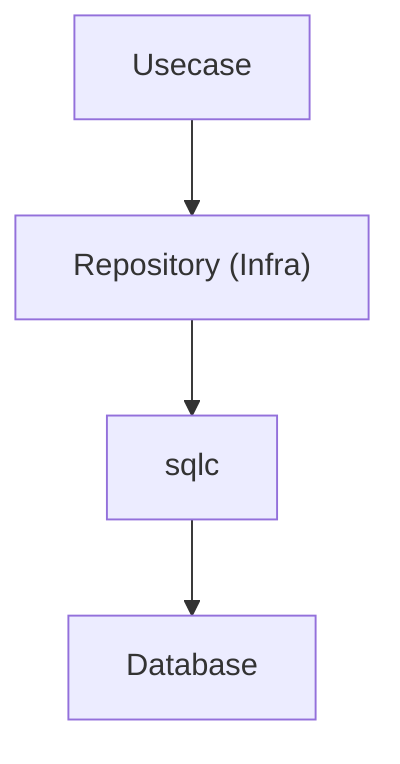

Repository is a layer that **only implements** the Repository Interface defined by the Domain.

## Architectural Position

Repository implementations are placed in the following location.

`internal/infrastructure/rdb/repository/<aggregate>/`

Example

```txt
repository/
 ├ user/
 │   └ user_repository.go
 └ prefecture/
     └ prefecture_repository.go
```

The Repository Interface is **placed in the Domain layer**.

Location: `internal/domain/<aggregate>/repository.go`

Infra **only implements** this interface.

## Repository Method Responsibilities

Repository methods perform only the following processing.

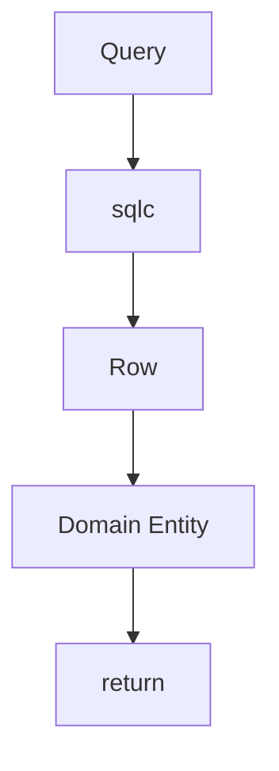

Repository does not perform the following:

- Business rules
- Aggregation processing
- DTO generation
- Usecase logic

These are the **responsibility of Usecase / Domain**.

## Using sqlc

Repository uses **query code generated by sqlc**.

```go
rows, err := db.ListUsers(ctx, &gen.ListUsersParams{...})
```

With sqlc:

- Type-safe SQL execution
- Compile-time validation

becomes possible.

The generated code is located at:

`internal/infrastructure/rdb/sqlc/gen`

## Row → Domain Conversion

The Row struct returned by sqlc is an **Infrastructure-only type**.

However, in this project, sqlc override is used to apply the following type conversions at generation time:

- nullable → pointer type
- UUID → `pkg/uuid` type

Therefore, in Repository, additional conversion processing is mostly unnecessary, and the generated types can be passed directly to the Domain constructor.

```go
userEntity, err := user.New(
    row.Users.ID,
    row.Users.FirstName,
    row.Users.LastName,
    ...
)
```

Important rules

- Do not return `sqlc` types directly to upper layers
- Use Domain constructors
- Repository converts Row / Model into Domain entities and returns them

## Domain constructor error

If Domain entity creation fails,  
the error is **returned as-is**.

```go
userEntity, err := user.New(...)
if err != nil {
    return nil, err
}
```

Reason

- Domain invariant violation
- DB data inconsistency
- migration mistake

These are treated as **responsibility of the Domain layer**.

## About UUID

In this project, sqlc override aligns DB UUID and `pkg/uuid` used in Domain to the same handling.

Therefore, explicit UUID conversion in Repository is generally unnecessary.

```go
row.Users.ID // can be passed directly to Domain constructor
```

UUID generation, comparison, and auxiliary processing use the `pkg/uuid` wrapper.

## sqlc helper

Auxiliary processing such as LIKE search uses:

`internal/infrastructure/rdb/sqlc`

Example

```go
escaped := sqlc.EscapeForLike(keyword, sqlc.DefaultLikeEscapeChar)
pattern := sqlc.WrapContainsLikePattern(escaped)
```

Deleted state control is not performed within SQL, but is handled by branching in Go and calling dedicated queries.

```go
switch {
case active == nil:
    // all
case *active:
    // active
case !*active:
    // deleted
}
```

## About LIKE search

LIKE search can be implemented in Repository.

However, it must satisfy the following conditions.

- It is a simple search on a single field
- It does not include domain logic
- It uses sqlc helper
- It remains within the responsibility of aggregate persistence

The following cases are separated into QueryService.

- Multi-field search
- Searches combining AND / OR
- Searches with relevance or scoring
- Complex filter + sort + paging
- Read-optimized searches for list screens

## LoggingDBProvider

Repository normally uses `loggingdb.DBProvider` to access DB.

```go
db := gen.New(r.db.NewLoggingDB(ctx))
```

`loggingdb.DBProvider` provides:

- SQL log output
- Transparent DB / Tx switching
- Context-based connection acquisition

Repository is designed to **not be aware of DB connection state**.

## Direct use of driver

If logging is unnecessary, DB access without logging can be used.

```go
db := gen.New(r.db.NewDB(ctx))
```

Use cases

- When reducing log noise in high-frequency processing
- Simple processing that does not require logging
- Benchmarking or checking minimal path

Principle

- Normally use `NewLoggingDB(ctx)`
- Use `NewDB(ctx)` only when there is a clear reason

## Error normalization

PostgreSQL errors are converted into `apperror` in:

`internal/infrastructure/rdb/postgres/pgerror`

```go
return pgerror.NormalizeError(err)
```

Main conversions

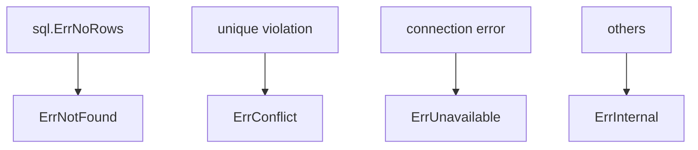

## Transactions

Transaction boundaries are the responsibility of **Usecase**.

Transaction management is the responsibility of **Usecase**.

Query execution is performed using:

```go
gen.New(r.db.NewLoggingDB(ctx))
```

With this,

Repository uses

```go
gen.New(r.db.NewLoggingDB(ctx))
```

to transparently use `Tx / DB`.

## Observability (Tracing)

In the Infrastructure layer,

`observability.LayerTracer` is used.

```go
ctx, endSpan := r.tracer.Start(ctx)
defer endSpan()
```

Repository is responsible only for:

- span start
- span end

### About span name

Span names are uniformly assigned by LayerTracer, so it is not necessary to explicitly specify them in Repository.

### Design intention

- Ensure consistency of tracing
- Separation of responsibilities across layers
- Eliminate direct dependency on OpenTelemetry

## DI (Dependency Injection) mechanism (Repository)

Repository is created by **DI using Uber Fx**.  
In the Infrastructure layer, it implements the **Domain Repository Interface and provides it to the DI container**.

### Overall structure

Repository is registered with `fx.Provide` and injected into Usecase.

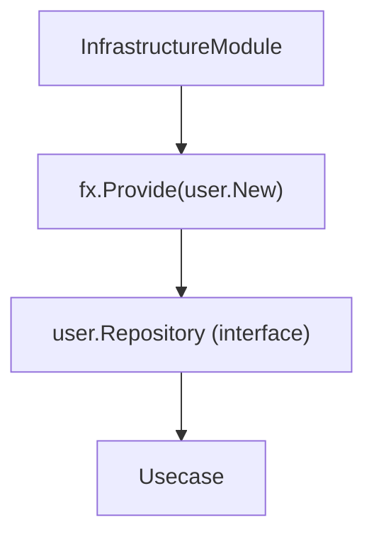

### Role of internal/di/module/infrastructure.go

```go
func InfrastructureModule() fx.Option {
    return fx.Module("infrastructure",
        fx.Module("repository",
            fx.Provide(
                user.New,
                prefecture.New,
            ),
        ),
    )
}
```

- `fx.Provide`
  - Registers Repository constructors
- Return value is **Domain interface type**
  - Example: `user.Repository`

### Repository constructor design

```go
func New(
    db loggingdb.DBProvider,
    tf observability.TracerFactory,
) user.Repository {
    return &repository{
        db:       db,
        tracer:   tf.Infra(),
    }
}
```

Points:

- Return value is **interface (Domain definition)**
- All dependencies are received via arguments (no new)
- External dependencies such as DB / Tracer are confined to Infrastructure

### DI flow

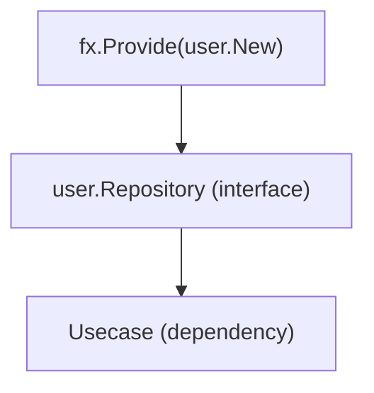

On the Usecase side:

```go
type service struct {
    repo user.Repository
}
```

is used to receive via interface.

### Why return interface

- Domain depends only on interface
- Infrastructure can be replaced (mock / alternative DB)
- Maintains dependency inversion of Onion Architecture

### Rules for AI / developers

- Repository constructor must be defined as `New`
- Return value must be interface (Domain definition)
- Do not new dependencies inside Repository
- Add DI registration to `internal/di/module/infrastructure.go`

## Repository structure

Repository implementation has the following dependencies.

- loggingdb.DBProvider is the DB access entry point normally used by Repository.
  - SQL log output
  - trace integration
  - transparent DB / Tx switching
  are provided.

- If logging is unnecessary, use `r.db.NewDB(ctx)` to access DB without logging.
  - high-frequency processing
  - benchmarking
  - cases where log noise should be avoided
  use only when there is a clear reason.

- observability.TracerFactory is a factory to generate LayerTracer.
  - Repository uses tracer for Infra layer

```go
type repository struct {
    db     loggingdb.DBProvider
    tracer observability.LayerTracer
}
```

constructor

```go
func New(
    db loggingdb.DBProvider,
    tf observability.TracerFactory,
) user.Repository {
    return &repository{
        db:       db,
        tracer:   tf.Infra(),
    }
}
```

## Test strategy

Repository tests are implemented as **Infrastructure Integration Tests**.

Because Repository includes correctness of SQL execution as responsibility,  
it is verified using an actual DB **without using mocks**.

The structure under test is as follows.

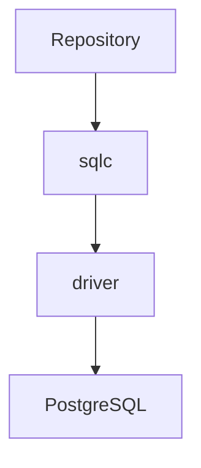

This entire layer is tested using a **real DB**.

### Purpose of tests

Repository tests verify the following.

- SQL queries are executed correctly
- Row → Domain conversion is correct
- Domain constructor errors propagate correctly
- PostgreSQL errors are normalized by `pgerror.NormalizeError`
- Pagination (limit / offset) works correctly

Repository tests **do not aim to verify Domain logic**.

### Test execution environment

Repository tests initialize DB using `testkit`.

```go
db, provider := testkit.NewTestDBWithLoggingProvider(t)
```

This function provides:

- test DB connection
- loggingdb.DBProvider

### Transaction tests

Each test is executed **within a transaction**.

```go
txm := testkit.NewTestTransactionManager(t)

txm.WithinTx(func(ctx context.Context) {
    // test logic
})
```

Internal behavior

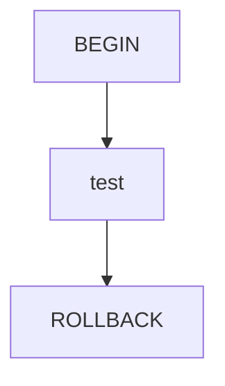

This ensures:

- DB state is not polluted
- Test independence is maintained

### Parallel execution

Repository tests can use `t.Parallel()` to execute tests in parallel.

However, the transaction manager provided by `testkit.NewTestTransactionManager(t)`  
**serializes transaction execution** internally.

Therefore, the execution model is as follows.

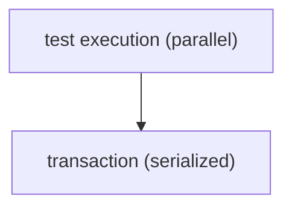

Each test runs inside `WithinTx`


By serializing transactions, even if multiple tests run simultaneously,  
DB state conflicts and interference between tests are prevented.

### Domain error verification

Repository uses Domain constructor for Row → Domain conversion.

Therefore, if **invalid data exists in DB**,  
Domain errors occur.

Tests verify this as well.

```go
require.ErrorIs(t, err, user.ErrInvalidLastName)
```

This verifies the following cases.

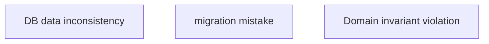

### Test error normalization

DB errors are converted to `apperror` by `pgerror.NormalizeError`.

Example


Repository tests verify **normalized results** such as:

- `ErrConflict`
- `ErrNotFound`

## Repository Anti-Patterns

There are **common incorrect implementation patterns** in the Repository layer.  
These break architectural boundaries, so they **must not be implemented**.

### 1. Writing business logic

Repository is a **persistence layer**.  
Business rules must not be written.

NG example

```go
func (r *repository) Create(ctx context.Context, user*user.User) error {
    if user.IsPremium() {
        // ❌ business rule
    }
}
```

Correct responsibility

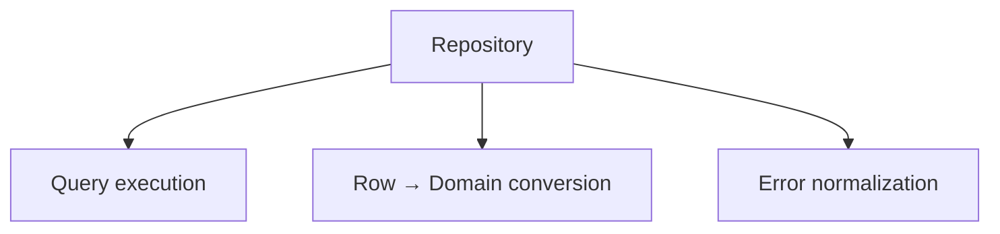

Business rules are the responsibility of **Domain / Usecase layer**.

### 2. Creating DTO

Repository **does not create DTO**.

NG example

```go
return UserDTO{
    Name: row.Users.Name,
}
```

Repository returns **only Domain entities**.

```go
return user.New(...)
```

DTO conversion is the responsibility of **Usecase / Presenter layer**.

### 3. Returning sqlc Row as-is

sqlc Row type is an **Infrastructure-only type**.

NG example

```go
return rows
```

Always convert to Domain.

```go
u, err := user.New(...)
```

Reason: **Do not leak sqlc types to upper layers**

### 4. Writing QueryService

Repository is a **persistence abstraction at aggregate level**.

Therefore, the following processing can be included in Repository.

- Simple conditional filtering
- Count retrieval (COUNT)
- Retrieval by ID / foreign key
- Simple filtering within aggregate responsibility

Example

```go
CountByActive(ctx context.Context, active *bool)
```

On the other hand, the following **search-specific APIs** must not be implemented in Repository.

- Full-text search
- Complex searches across multiple conditions
- Aggregation / ranking
- UI-dependent searches
- Read-optimized searches for list screens

These are separated as `QueryService` in another layer.

### 5. Starting transaction

Repository **does not manage transaction boundaries**.

NG example

```go
tx, _ := db.Begin()
```

Transaction management is the responsibility of **Usecase**.

Repository uses

```go
gen.New(r.db.NewLoggingDB(ctx))
```

to transparently use `Tx / DB`.

### 6. Referencing Controller type

Repository **does not depend on HTTP layer**.

NG example

```go
func (r *repository) Create(ctx echo.Context)
```

Repository is implemented as a **pure Go interface**.

```go
func (r *repository) Create(ctx context.Context, user*user.User)
```

### 7. Defining Domain interface in Infra

Repository Interface is **defined in Domain layer**.

NG example

`internal/infrastructure/repository/user_repository_interface.go`

Correct placement

`internal/domain/user/repository.go`

Infra **only implements Domain Interface**.

## Do / Don't

### Do

- Use sqlc generated code
- Convert Row → Domain
- Use conv for nullable conversion
- Use pgerror.NormalizeError
- Use LIKE helper

### Don't

- Define Domain interface in Infra
- Return sqlc types to upper layers
- Write business logic
- Reference Controller type
- Write QueryService

## Implementation example

```go
package user

type repository struct {
    db     loggingdb.DBProvider
    tracer observability.LayerTracer
}

// New is the constructor of Repository.
// All dependencies are injected from outside.
func New(
    db loggingdb.DBProvider,
    tf observability.TracerFactory,
) user.Repository {
    return &repository{
        db:       db,
        tracer:   tf.Infra(),
    }
}

// FindByActive retrieves users based on active state.
// Deleted state is branched in Go, and SQL calls dedicated queries.
func (r *repository) FindByActive(ctx context.Context, active*bool, limit, offset int32) (user.Users, error) {
    ctx, endSpan := r.tracer.Start(ctx)
    defer endSpan()

    db := gen.New(r.db.NewLoggingDB(ctx))

    switch {
    case active == nil:
        return fetchListUsersRows(ctx, db, &gen.ListUsersParams{
            OffsetParam: offset,
            LimitParam:  limit,
        })
    case *active:
        return fetchListUsersRowsByActive(ctx, db, &gen.ListActiveUsersParams{
            OffsetParam: offset,
            LimitParam:  limit,
        })
    case !*active:
        return fetchListUsersRowsByDeleted(ctx, db, &gen.ListDeletedUsersParams{
            OffsetParam: offset,
            LimitParam:  limit,
        })
    default:
        panic("unreachable: invalid active")
    }
}

// fetchListUsersRows performs retrieval of all users.
// Logic is separated from Repository to clarify responsibilities.
func fetchListUsersRows(
    ctx context.Context,
    db *gen.Queries,
    params*gen.ListUsersParams,
) (user.Users, error) {
    rows, err := db.ListUsers(ctx, params)
    if err != nil {
        return nil, pgerror.NormalizeError(err)
    }

    users := make(user.Users, len(rows))
    for i, row := range rows {
        u, err := user.New(
            row.Users.ID,
            row.Users.FirstName,
            row.Users.LastName,
            row.Users.PasswordHash,
            row.Users.Email,
            row.Users.Phone,
            row.Users.PrefectureID,
            row.Users.City,
            row.Users.Street,
            row.Users.Building,
            row.Users.PostalCode,
            row.Users.CreatedAt,
            row.Users.UpdatedAt,
            row.Users.DeletedAt,
        )
        if err != nil {
            return nil, err
        }
        users[i] = u
    }
    return users, nil
}
```
