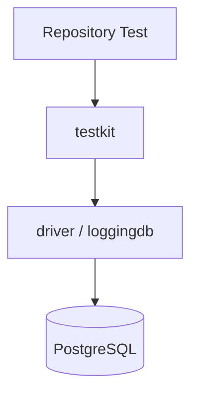
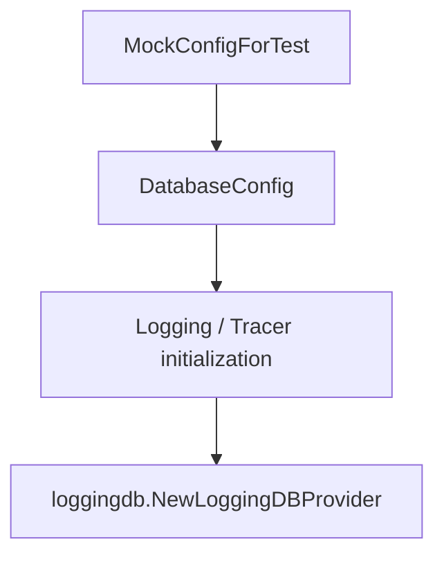
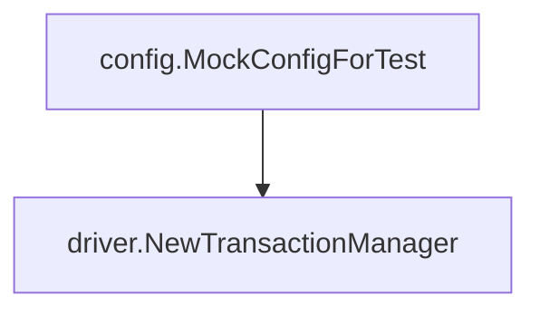
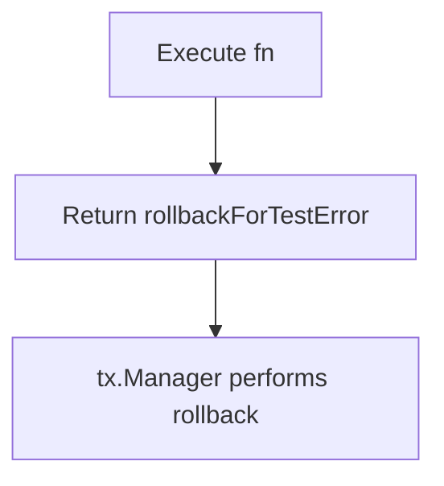
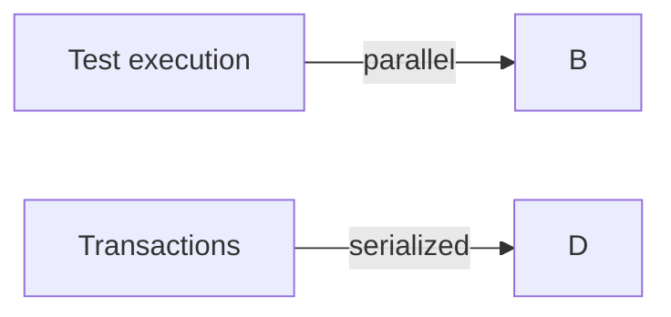
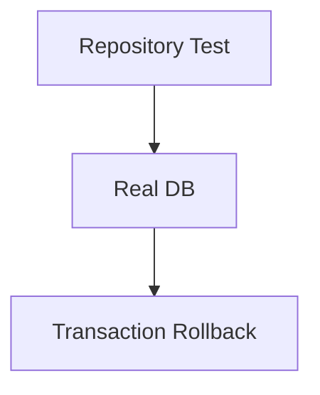
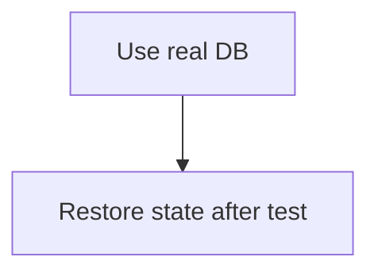

## `testkit` Package

English | [日本語](README.ja.md)

Overview: **A package that provides utilities for tests using RDB.**

It is mainly used for the following purposes.

- Easily create a test `DatabaseDriver`
- Initialize Infrastructure including LoggingDBProvider
- Execute tests within a transaction and always roll back

This package is a **support tool to make writing Repository and Infrastructure tests easier**.

## Purpose

The following problems occur in tests that use RDB.

- DB initialization code becomes lengthy each time
- Transaction management becomes complicated
- Data cleanup after tests is required

`testkit` provides the following features to solve these.

- Test DB initialization
- Creation of LoggingDBProvider
- Automatic rollback transactions

## Architectural Position



`testkit` is a **test-only Infrastructure helper layer**.

## Provided API

### NewTestDB

```go
func NewTestDB(t *testing.T) driver.DatabaseDriver
```

Creates a test `DatabaseDriver`.

### NewTestLoggingProvider

```go
func NewTestLoggingProvider(t *testing.T) loggingdb.DBProvider
```

Creates a LoggingDBProvider.

Main use cases:

- Repository tests
- QueryService tests

Internally, it performs the following processing.



### NewTestTransactionManager

```go
func NewTestTransactionManager(t *testing.T) TransactionRunner
```

Creates a transaction manager for testing.

Internally, it uses:



## Transaction Execution

### TransactionRunner

```go
type TransactionRunner interface {
    WithinTx(fn func(ctx context.Context))
}
```

### WithinTx

```go
func (t *testTxManager) WithinTx(fn func(ctx context.Context))
```

Executes the specified function **inside a transaction**.

Processing flow:

```mermaid
flowchart TD
    A[Transaction Begin]
    B[Execute fn(ctx)]
    C[Return rollbackForTestError]
    D[Rollback]

    A --> B --> C --> D
```

Internally, it uses `tx.Manager.Do`.

```mermaid
flowchart TD
    A[Do(fn)]
    B[Return error to trigger rollback]

    A --> B
```

## Rollback Mechanism

`WithinTx` achieves rollback with the following mechanism.



This special error is defined as:

```go
var rollbackForTestError = xerrors.New("rollback for test")
```

This error is treated as **success in tests**.

## Parallel Execution

Repository tests can be executed in parallel using `t.Parallel()`.

However, transactions are serialized internally.



This is guaranteed by the following implementation.

```go
txLock sync.Mutex
```

```go
txLock.Lock()
defer txLock.Unlock()
```

This ensures:

- Preventing DB state conflicts
- Preventing interference between tests

## DB Instance

The test DB is managed as a singleton.

```go
var (
    testDB driver.DatabaseDriver
    dbOnce sync.Once
)
```

By **sharing a single DB instance within the process**:

- Reduced connection cost
- Faster test execution

are achieved.

## Usage Examples

### Transaction-Based Test

```go
txm := testkit.NewTestTransactionManager(t)

txm.WithinTx(func(ctx context.Context) {
    repo.Create(ctx, ...)
})
```

### Repository Test

```go
provider := testkit.NewTestLoggingProvider(t)

repo := repository.NewRepository(provider)
```

## Test Design Policy

By using `testkit`, the following design becomes possible.



In other words:



This enables **safe Integration Test**.

## Notes

### Connects to a Real DB

This package connects to an **actual PostgreSQL**.

Therefore, you must configure:

- Test DB
- CI DB

### Design of WithinTx

`WithinTx` does not accept a return value from fn.

```go
fn(ctx)
return rollbackForTestError
```

Therefore, assertions in tests should use:

```go
require / assert
```

### Transactions Are Always Rolled Back

When using `WithinTx`, transactions are **always rolled back**.

Therefore, it cannot be used for tests that:

```txt
persist data
```
